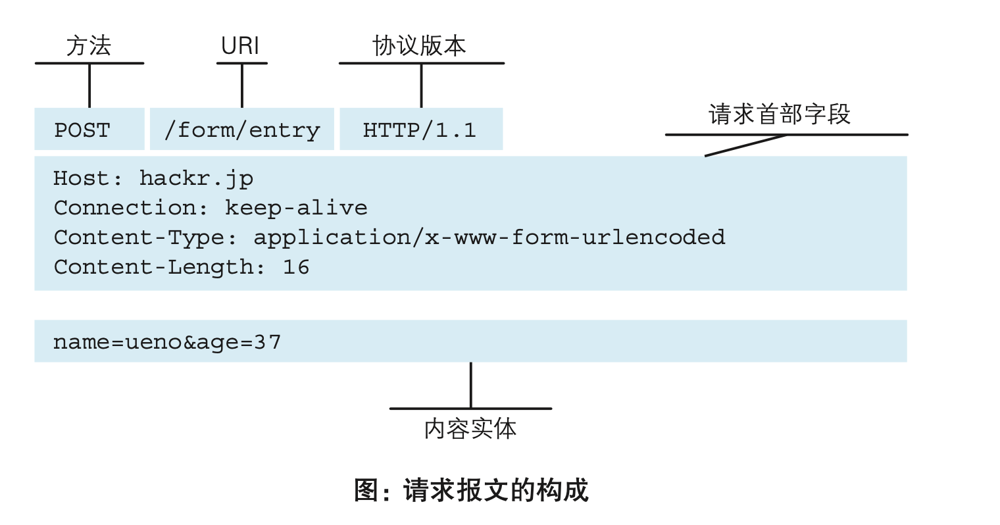
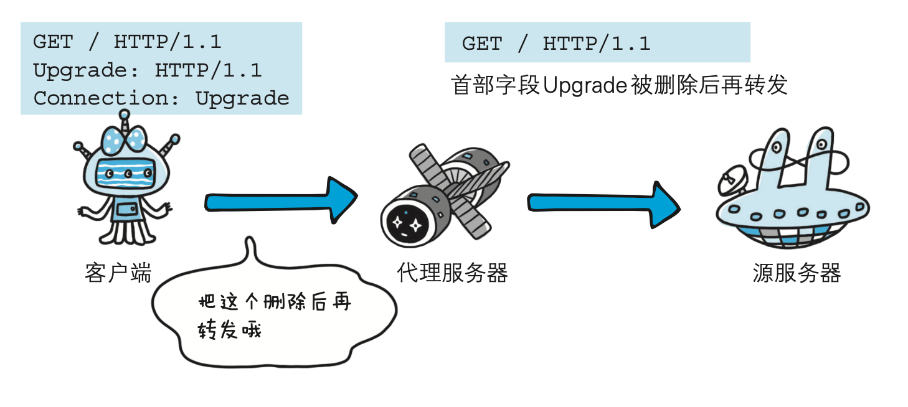

# 图解HTTP 笔记

## Web & 网络基础
### 使用HTTP协议访问web
* 根据web浏览器地址栏指定的url，web浏览器从web服务器获取文件资源resource等信息，再显示在web页面
* 客户端client：请求资源 服务端：响应资源
* Http
  * HyperText Transfer Protocol 超文本传输协议
  * web是建立在以http协议作为规范，进行一系列客户端到服务端等的通信的
* 
### http诞生
* HTTP/1.0
  * 正式作为标准 - 1996.5 RFC1945
  * 至今仍广泛使用在服务器端
* HTTP/1.1
  * 1997.1 RFC2068
  * 目前主流的HTTP协议版本
  * 修订版RFC2616是当前的最新版本
### 网络基础TCP/IP
* 通常使用的网络（包括互联网）是在TCP/IP协议族的基础上运作的，HTTP属于它内部的一个子集
#### TCP/IP协议族
* 协议：不同硬件、操作系统之间的通信都需要一种规则 - protocol
* 把互联网相关联的协议集合起来总称为TCP/IP - 可以单指这两个协议，也可以说是IP协议通信过程中使用到的协议族统称
#### TCP/IP分层管理
* TCP/IP协议族按层次分别分为4层：应用层、传输层、网络层、数据链路层 （实体层）
* 分层的好处：分层后只需要把变动的层替换掉即可，把各层之间的接口部分规划好之后，每个层次内部的设计就能够自由改动了
* 应用层
  * 决定了向用户提供应用服务时通信的活动
  * TCP/IP协议族内预存的各类通用的应用服务，比如FTP(File Transfer Protocol，文件传输协议)和DNS(Domain Name System， 域名系统)服务
  * HTTP协议处于该层
* 传输层
  * 提供网络连接中的两台计算机之间的数据传输
  * 有两个性质不同的协议：TCP(Transmission Control Protocol，传输控制协议)和UDP(User Data Protocol，用户数据 报协议)
* 网络层（网络互联层）
  * 处理网络上流动的数据包
  * 数据包：网络传输的最小数据单位
  * 规定了通过怎样的路径（传输路线）到达对方计算机，并把数据包传送给对方
  * 若与对方计算机之间通过多台计算机或网络设备进行传输时，网络层所起的作用就是在众多的选项内选择一条传输路线
* 链路层（数据链路层、网络接口层）
  * 处理连接网络的硬件部分 - 控制操作系统、硬件的设备驱动、NIC(Network Interface Card，网络适配器，即网卡)，光纤灯物理部分（包括连接器等一切传输媒介
#### TCP/IP通信传输流
* 
* 网络通信时，会通过分层顺序与对方进行通信
* 发送端从应用层往下走，接收端则往应用层往上走
* 发送过程
  * 客户端在**应用层**发出想看某web页面的http请求
  * **传输层**(TCP 协议)把从应用层处收到的 数据(HTTP 请求报文)进行分割各个报文上打上标记序号及端口号
  * **网络层(IP 协议)**增加作为通信目的地的MAC地址
  * 转发到**链路层**
  * 服务器在**链路层**接收到数据，按顺序从下往上层走，一直到应用层，才算接收到http请求
* 
* 封装encapsulate - 数据信息包装
  * 发送端在层与层之间传输数据时，每经过一层时必定会被打上一个该层所属的首部信息
  * 接收端在层与层传输数据时，每经过一层时会把对应的首部消去
### 与HTTP关系密切的协议 - IP、TCP、DNS
#### 负责传输的IP协议（internet protocol）
* 位于网络层
* 为保证数据包传送到对方，要满足各类条件，其中最重要的两个：IP地址，MAC地址（Media Access Control Address）
  * IP地址：指明了节点被分配到的地址，可变化
  * MAC地址：网卡所属的固定地址，基本不会改变
  * 两个地址可以进行配对
* ARP协议（Address Resolution Protocol） - 解析IP地址到MAC地址
  * 同一子网络的通信很少，一般需要经过多台计算机和网络设备中转才能连接到对方，会利用下一站中转设备的MAC地址来搜索下一个中转目标
  * 需要用到ARP协议解析IP地址，反查出对应的MAC地址
* 无法完全掌握互联网传输状况
  * 路由选择(routing)：到达通信目标前的中转过程中，那些计算机和路由器等网络设备只能获悉很粗略的传输路线
  * 
#### 确保可靠性的TCP协议
* 在传输层
* 提供可靠的字节流服务(Byte Stream Service) 
  * 字节流服务：为了方便传输，将大块数据分割成以报文段(segment)为单位的数据包进行管理
  * 可靠的传输服务：能够把数据准确可靠地传给对方
* TCP三次握手政策（three-way handshaking） - 保证数据能到达目标
  * 用TCP协议把数据包送出去后，TCP不会对传送后的情况置之不理，它一定会向对方确认是否成功送达
  * TCP 的标志(flag)：SYN(synchronize)和ACK( acknowledgement)
  * 过程：
    * 发送端首先发送一个带 SYN 标志的数据包给对方
    * 接收端收到后，回传一个带有 SYN/ACK 标志的数据包以示传达确认信息
    * 发送端再回传一个带 ACK 标志的数据包，代表“握手”结束
  * 握手过程中某个阶段莫名中断，TCP 协议会再次以相同的顺序发送相同的数据包

### 负责域名解析的DNS服务(Domain Name System)
* 在应用层
* 提供域名到IP地址之间的解析服务 - 通过域名查找IP 地址，或逆向从IP 地址反查域名
* 计算机既可以被赋予IP地址，也可以被赋予主机名和域名
* 用户通常使用主机名或域名来访问对方的计算机，而不是直接通过IP地址访问
### 各种协议与HTTP协议的关系
* 

### URI和URL

#### 统一资源标识符URI
* URI - Uniform Resource Identifier
  * Uniform
    * 规定统一的格式可方便处理多种不同类型的资源，而不用根据上下文环境来识别资源指定的访问方式
    * 加入新增的协议方案 (如 http: 或 ftp:)也更容易
    * 协议方案 - 访问资源所使用的协议类型名称（http、ftp、mailto、telnet、file···标准的uri协议方案就有30种左右）
  * Resource
    * 可标识的任何东西
    * 不仅可以是单一的，也可以是多数的集合体
  * Identifier
    * 可标识的对象 - 标识符
  * URI - 某个协议方案表示的资源的定位标识符
* URI用字符串标识某一互联网资源，URL表示资源的地点(互联网上所处的位置)
* URL是URI的子集
* URI举例
  * ```
    ftp://ftp.is.co.za/rfc/rfc1808.txt
    http://www.ietf.org/rfc/rfc2396.txt
    ldap://[2001:db8::7]/c=GB?objectClass?one
    mailto:John.Doe@example.com
    news:comp.infosystems.www.servers.unix
    tel:+1-816-555-1212
    telnet://192.0.2.16:80/
    urn:oasis:names:specification:docbook:dtd:xml:4.1.2
  ```
* URL举例 `www.ietf.org` 相当于是一个URI中的地址部分

#### URI格式
* URI表示 - 绝对URI（含全部必要信息）、绝对URL、相对URL
  * 相对URL - 从浏览器中基本 URI 处指定的URL - `/image/logo.gif`
* 绝对URI格式
  * 
  * 协议方案名
    * 使用 http: 或 https: 等协议方案名获取访问资源时要指定协议类型,不区分字母大小写，最后附一个冒号(:)
    * 也可使用 data: 或 javascript: 这类指定数据或脚本程序的方案名
  * 登录信息（认证）
    * 指定用户名和密码作为从服务器端获取资源时必要的登录信息(身份认证)
    * 可选
  * 服务器地址
    * 必须指定
    * 可以是DNS可解析的域名，也可以是32位的IPv4地址，也可以是[0:0:0:0:0:0:0:1]这样用方括号括起来的 IPv6 地址名
  * 服务器端口号
    * 服务器连接的网络端口号
    * 可选，用户忽略就是用默认端口号
  * 带层次的文件路径
    * 指定服务器上的文件路径来定位特指的资源
  * 查询字符串
    * 查询字符串传入任意参 数
    * 可选
  * 片段标识符
    * 通常可标记出已获取资源中的子资源(文档内的某个位置)
    * 可选
#### 不是所有的应用程序都符合RFC
* RFC（request for comments） - 指定http协议技术标准的文档
* 遵循RFC才能进行http协议通信，所以客户端和服务器端基本都按照RFC标准来实现http协议
* 但有的应用程序因客户端或服务器端的不同，而未遵照 RFC 标准，反而将自成一套的“标准”扩展
* 设想一下，如果这款应用程序的使用者非常多，那会发生什么情况?不难想象，其他的客户端或服务器端必然都不得不去配合它

## 简单的HTTP协议

### HTTP协议用于客户端和服务端之间的通信
* 一条通信路线必有一端客户端，另一端服务器端
* 仅从一条通信路线来说，服务端和客户端角色是确定的，http协议能够区分
* 按实际情况，两个可能互换角色

### 通过请求和响应的交换达成通信
* 
* 请求
  * Get - 请求访问服务器的类型 - method
  * /index.htm - 请求访问的资源对象 - 请求URI(request-URI)
  * HTTP/1.1 - HTTP的版本号 - 客户端使用的 HTTP 协议功能
  * 请求报文 = 请求方法、请求URI、协议版本、可选的请求首部字段、内容实体
  * 
* 响应
  * HTTP/1.1 - 服务器对应的 HTTP 版本
  * 200 OK - 请求的处理结果的状态码(status code) + 原因短语(reason-phrase)
  * Date - 创建响应的日期时间 - 首部字段(header field)内的一个属性
  * 一空行分隔
  * 之后的内容 - 资源实体的主体(entity body)
  * 响应报文 = 协议版本、状态码(表示请求成功或失败的数字代码)、用以解释状态码的原因短语、可选的响应首部字段、实体主体
  * 

### HTTP不保存状态
* http为无状态协议（stateless） - 不对请求和响应之间的通信状态进行保存 - 不做持久化处理
* 好处：快速处理大量事务，确保协议的可伸缩性，简单
* 坏处：需要保存一些信息才能访问指定资源，比如购物网站需要保存用户状态免得每进一个页面都得重新登录，这样会很麻烦
* 解决方法：cookie技术

### 请求URI定位资源
* HTTP 协议使用 URI 定位互联网上的资源
* 当客户端请求访问资源而发送请求时，URI 需要将作为请求报文中的请求URI 包含在内
* 
* 如果不是访问特定资源而是对服务器本身发起请求，可以用一个 * 来代替请求 URI
  * 举例：查询 HTTP 服务器端支持的 HTTP 方法种类 `OPTIONS * HTTP/1.1`

### 告知服务器意图的HTTP方法
#### GET: 获取资源
* 请求访问已被 URI 识别的资源, 指定的资源经服务 器端解析后返回响应内容
* 如果请求的资源是文本，那就保持原样返回;如果是像CGI(Common Gateway Interface，通用网关接口)那样的程序，则返回经过执行后的输出结果
* 

#### POST: 传输实体主体
* 虽说 POST 的功能与 GET 很相似，但POST的主要目的并不是获取响应的主体内容, 而是传输实体的主体
* 

#### PUT: 传输文件
* 用来传输文件，要求在请求报文的主体中包含文件内容，然后保存到请求 URI 指定的位置
* HTTP/1.1 的 PUT 方法自身不带验证机制，任何人都可以上传文件 , 存在安全性问题，因此一般的 Web 网站不使用该方法
* 配合 Web 应用程序的验证机制，或架构设计采用 REST(REpresentational State Transfer，表征状态转移)标准的同类 Web 网站，就可能会开放使用 PUT 方法
* 

#### HEAD: 获得报文首部
* 和 GET 方法一样，只是不返回报文主体部分，用于确认URI的有效性及资源更新的日期时间等
* 

#### DELETE: 删除文件
* 删除文件，按请求URI 删除指定的资源，与 PUT 相反
* HTTP/1.1 的 DELETE 方法本身和 PUT 方法一样不带验证机制，所以一般的 Web 网站也不使用 DELETE 方法
* 当配合 Web 应用程序的验证机制，或遵守 REST 标准时还是有可能会开放使用的
* 

#### OPTIONS: 询问支持的方法
* 查询针对请求 URI 指定的资源支持的方法
* 

#### TRACE: 追踪路径
* 让 Web 服务器端将之前的请求通信环回给客户端的方法
* 发送请求时，在 Max-Forwards 首部字段中填入数值，每经过一个服务器端就将该数字减 1，当数值刚好减到 0 时，就停止继续传输，最后接收到请求的服务器端则返回状态码 200 OK 的响应
* 查询发送出去的请求是怎样被加工修改 / 篡改的
* 请求想要连接到源目标服务器可能会通过代理中转，TRACE 方法就是用来确认连接过程中发生的一系列操作
* 容易引发XST (Cross-Site Tracing，跨站追踪)攻击，用的很少
* 
* 

#### CONNECT: 要求用隧道协议连接代理
* 要求在与代理服务器通信时建立隧道，实现用隧道协议进行 TCP 通信
* 主要使用 SSL(Secure Sockets Layer，安全套接层)和 TLS(Transport Layer Security，传输层安全)协议把通信内容加密后经网络隧道传输 - 安全通信方式
* 举例：`CONNECT 代理服务器名:端口号 HTTP版本`
* 
* 

### 使用方法下达命令
* 方法命令 - 可以指定请求的资源按期望产生某种行为 - GET、POST等
* 方法名区分大小写，注意要用大写字母
* 

### 持久连接节省通信量
* HTTP协议的初始版本中，每进行一次 HTTP 通信就要断开一次 TCP 连接
* 
* 小容量传输没什么问题，但请求该 HTML 页面里包含的大量其他资源时，无谓的 TCP 连接建立和断开，增加通信量的开销

#### 持久连接
* 持久连接(HTTP Persistent Connections，也称为 HTTP keep-alive或 HTTP connection reuse) - HTTP/1.1和部分HTTP/1.0
* 特点：只要任意一端没有明确提出断开连接，则保持 TCP 连接状态，一次建立TCP连接后进行多次请求和响应
* 
* 好处
  * 减少重复建立和断开所造成的额外开销，减轻了服务器端的负载
  * 减少开销的那部分时间，使 HTTP 请求和响应能够更早地结束，显示速度更快
* HTTP/1.1 中，所有的连接默认都是持久连接，但在 HTTP/1.0 内并未标准化
* 除了服务器端，客户端也需要支持持久连接

#### 管道化
* 持久连接使得多数请求以管线化(pipelining)方式发送成为可能
* 管线化技术出现后，不用等待响应亦可直接发送下一个请求，能够做到同时并行发送多个请求
* 管线化技术比持久连接还要快。请求数越多，时间差就越明显

### 使用cookie状态管理
* 无状态协议无法保存过去的请求与响应
  * 优点：减少服务器的 CPU 及内存资源的消耗，简单便利
  * 缺点：无法根据之前的状态进行本次的请求处理
* cookie技术
  * 保留无状态协议同时解决以上矛盾
  * 在请求和响应报文中写入 Cookie 信息来控制客户端的状态
  * 根据从服务器端发送的响应报文内的一个叫做 Set-Cookie的首部字段信息，通知客户端保存 Cookie，下次客户端再往该服务器发送请求时，客户端会自动在请求报文中加入 Cookie 值后发送。服务器端发现客户端发送过来的 Cookie 后，会去检查究竟是从哪一个客户端发来的连接请求，然后对比服务器上的记录，最后得到之前的状态信息
  * 
  * 
  * 

## HTTP报文内的HTTP信息
### HTTP报文
* HTTP 报文 - HTTP 协议交互的信息
  * 请求报文 - 客户端
  * 响应报文 - 服务器端
* 多行(用 CR+LF 作换行符)数据构成的字符串文本
* 报文首部 + 空行(CR+LF) + 报文主体（不一定有）
* 

### 请求报文及响应报文结构
* 
* 
* 首部包含
  * 请求行（状态行）
  * 首部字段 - 包含表示请求和响应的各种条件和属性的各类首部
    * 请求（响应）首部
    * 通用首部
    * 实体首部
  * 其他 - 可能包含 HTTP 的 RFC 里未定义的首部(Cookie 等)

### 编码提升传输速度
* HTTP 在传输数据时可以按照数据原貌直接传输，但也可以在传输过程中通过编码提升传输速率
* 好处：在传输时编码能有效地处理大量访问请求
* 坏处：消耗更多cpu等资源

#### 报文主体和实体主体的差异
* 报文（message）
  *  HTTP 通信中的基本单位，字节流
* 实体（entity）
  * 作为请求或响应的有效载荷数据(补充项)被传输，其内容由实体首部和实体主体组成
* HTTP 报文的主体用于传输请求或响应的实体主体
* 通常，报文主体等于实体主体。只有当传输中进行编码操作时，实体主体的内容发生变化，才导致它和报文主体产生差异

#### 压缩传输的内容编码
* 内容编码：指明应用在实体内容上的编码格式，并保持实体信息原样压缩
* 内容编码后的实体由客户端接收并负责解码
* 常用的内容编码
  * gzip(GNU zip)
  * deflate(zlib)
  * compress(UNIX 系统的标准压缩)
  * identity(不进行编码)

#### 分割发送的分快传输编码
* 传输大容量数据时，通过把数据分割成多块，能够让浏览器逐步显示页面
* 把实体主体分块的功能称为**分块传输编码(Chunked Transfer Coding)**
* 将实体主体分成多个部分(块) - 每一块都会用十六进制来标记块的大小，最后一块会使用“0(CR+LF)”来标记 - 由接收的客户端负责解码，恢复到编码前的实体主体
* HTTP/1.1中存在一种称为传输编码(Transfer Coding)的机制，它可以在通信时按某种编码方式传输，但只定义作用于分块传输编码中

### 发送多种数据的多部分对象集合
* MIME(Multipurpose Internet Mail Extensions，多用途因特网邮件扩展)机制：允许邮件处理文本、图片、视频等多个不同类型的数据
* 在 MIME 扩展中会使用一种称为**多部分对象集合(Multipart)的方法**，来容纳多份不同类型的数据
* 多部分对象集合包含的对象
  * multipart/form-data - 在 Web 表单文件上传时使用
  * multipart/byteranges - 状态码 206(Partial Content，部分内容)响应报文包含了多个范围的内容时使用
* 在 HTTP 报文中使用多部分对象集合时，需要在首部字段里加Content-type
* 使用 boundary 字符串来划分多部分对象集合指明的各类实体
  * boundary 字符串指定的各个实体的起始行之前插入“--”标记 `--AaB03x`
  * 在多部分对象集合对应的字符串的最后插入“--”标记作为结束 `--AaB03x--`

### 获取部分内容的范围请求
* 如果下载过程中遇到网络中断的情况，那就必须重头开始
* 为了解决上述问题，需要一种可恢复的机制 - 能从之前下载中断处恢复下载
* 范围请求(Range Request)
  * 指定范围发送的请求
  * 
  * 用到首部字段 Range 来指定资源的 byte 范围
  * range举例
  * 响应会返回状态码为 206 Partial Content 的响应报文
  * 对于多重范围的范围请求，响应会在首部字段 Content-Type 标明 multipart/byteranges 后返回响应报文
  * 若无法响应范围请求 - 返回状态码 200 OK 和完整的实体内容

### 内容协商返回最合适的内容
* 同一个 Web 网站有可能存在着多份相同内容的页面。比如英语版和中文版的 Web 页面，使用语言不同的同种内容的页面，会根据浏览器默认语言来响应 - **内容协商(Content Negotiation)**
* 内容协商机制 - 客户端和服务器端就响应的资源内容进行交涉， 然后提供给客户端最为适合的资源
* 以响应资源的语言、字符集、编码方式等作为判断的基准
* 包含在请求报文中的某些首部字段(如下)就是判断的基准
  * Accept
  * Accept-Charset
  * Accept-Encoding
  * Accept-Language
  * Content-Language
* 内容协商技术 - 三种类型
  * 服务器驱动协商(Server-driven●Negotiation)
    * 以请求的首部字段为参考，在服务器端自动处理
    * 对用户来说不一定能筛出最优内容
  * 客户端驱动协商(Agent-driven●Negotiation)
    * 用户从浏览器显示的可选项列表中手动选择
    * 还可以利用 JavaScript 脚本在 Web 页面上自动进行上述选择
      * 举例：按 OS 的类型或浏览器类型，自行切换成 PC 版页面或手机版页面
  * 透明协商(Transparent●Negotiation)
    * 服务器驱动和客户端驱动的结合体，由服务器端和客户端各自进行内容协商的一种方法

## 返回结果的HTTP状态码
### 状态码告知从服务器端返回的请求结果
* 当客户端向服务器端发送请求时，描述返回的请求结果
* 3位数字 + 原因短语 `200 OK`
  * 数字第一位指定响应类别
* 分类
* 只要遵守状态码类别的定义，即使改变 RFC2616 中定义的状态码，或服务器端自行创建状态码都没问题
* 定义的种类很多，但常用的就大概14种
* 不少返回的状态码响应都是错误的，但是用户可能察觉不到这点，比如 Web 应用程序内部发生错误，状态码依然返回 200 OK

### 2XX成功
* 从客户端发来的请求在服务器端被正常处理
* 在响应报文内，随状态码一起返回的信息会因方法的不同而发生改变

#### 204 No Content
* 服务器接收的请求已成功处理，但在返回的响应报文中不含实体的主体部分，也不允许返回任何实体的主体
* 举例：当从浏览器发出请求处理后，返回 204 响应，那么浏览器显示的页面不发生更新

#### 206 Partial Content
* 客户端进行了范围请求，服务端执行了这部分的 GET 请求，响应报文中包含由 Content-Range 指定范围的实体内容

### 3XX重定向
* 浏览器需要执行某些特殊的处理以正确处理请求

#### 301 Moved Permanently
* 永久性重定向
* 请求的资源已被分配了新的 URI，以后应使用资源现在所指的 URI
* 有时候，服务器配置要求对某些资源的请求必须以斜杠 / 结尾。如果不加斜杠，服务器可能会将请求视为对某个目录的访问，而不是目录下的默认页面（例如，index.html）。在这种情况下，服务器可能会返回一个 301 状态码，并将响应的 Location 头部设置为带有斜杠的URI

#### 302 Found
* 临时性重定向
* 请求的资源已被分配了新的 URI，希望用户(本次)能使用新的 URI 访问，URI将来可能还会变
* 用户把 URI 保存成书签，但不会像 301 状态码出现时那样去更新书签，而是仍旧保留返回 302 状态码的页面对应的 URI

#### 303 See Other
* 由于请求对应的资源存在着另一个 URI，应使用 GET 方法定向获取请求的资源
* 明确表示客户端应当采用 GET 方法获取资源，这点与 302 状态码有区别
* 当 301、302、303 响应状态码返回时，几乎所有的浏览器都会把 POST 改成 GET，并删除请求报文内的主体，之后请求会自动再次发送。301、302 标准是禁止将 POST 方法改变成 GET 方法的，但实际使用时大家都会这么做

#### 304 Not Modified
* 客户端发送附带条件的请求 时，服务器端允许请求访问资源，但未满足条件的情况
* 附带条件的请求是指采用 GET 方法的请求报文中包含 If-Match，If-Modified-Since，If-None-Match，If-Range，If-Unmodified-Since 中任一首部
* 返回时，不包含任何响应的主体部分

#### 307 Temporary Redirect
* 与 302 Found 有着相同的含义
* 尽管 302 标准禁止 POST 变换成 GET，但实际使用时大家并不遵守
* 307 会遵照浏览器标准，不会从 POST 变成 GET，但实际情况浏览器可能不同处理方式

### 4XX客户端错误
#### 400 Bad Request
* 请求报文中存在语法错误,需要修改请求内容再次发送
#### 401 Unauthorized
* 
* 发送的请求需要有通过 HTTP 认证(BASIC 认证、DIGEST 认证)的认证信息
* 若之前已进行过 1 次请求，则表示用户认证失败
* 返回含有 401 的响应必须包含一个适用于被请求资源的 WWW-Authenticate 首部用以质询(challenge)用户信息，初次401会弹出对话窗口
#### 403 Forbidden
* 对请求资源的访问被服务器拒绝，没必要给出拒绝理由，想说明的话可以在实体的主体部分对原因进行描述

#### 404 Not Found
* 服务器上无法找到请求的资源
* 也可以在服务器端拒绝请求且不想说明理由时使用

### 5XX服务器错误

#### 500 Internal Server Error
* 服务器端在执行请求时发生了错误
* 可能是 Web 应用存在的 bug 或某些临时的故障

#### 503 Service Unavailable
* 服务器暂时处于超负载或正在进行停机维护，现在无法处理请求
* 写入 Retry- After 首部字段再返回给客户端，可以告知解除时间

## HTTP首部

### HTTP报文首部
* 首部内容 - 客户端和服务器分别处理请求和响应提供所需要的信息
* Http请求报文
  * 
  * ```
        GET / HTTP/1.1
        Host: hackr.jp
        User-Agent: Mozilla/5.0 (Windows NT 6.1; WOW64; rv:13.0) Gecko/⇒ 20100101 Firefox/13.0
        Accept: text/html,application/xhtml+xml,application/xml;q=0.9,⇒ */*; q=0.8
        Accept-Language: ja,en-us;q=0.7,en;q=0.3
        Accept-Encoding: gzip, deflate
        DNT: 1
        Connection: keep-alive
        If-Modified-Since: Fri, 31 Aug 2007 02:02:20 GMT
        If-None-Match: "45bae1-16a-46d776ac"
        Cache-Control: max-age=0
    ```
* HTTP响应报文
  * 
  * ```
        HTTP/1.1 304 Not Modified
        Date: Thu, 07 Jun 2012 07:21:36 GMT
        Server: Apache
        Connection: close
        Etag: "45bae1-16a-46d776ac"
    ```
* 因 HTTP 版本或扩展规范的变化，首部字段可支持的字段内容略有不同

### HTTP首部字段
#### HTTP首部字段传递重要信息
#### HTTP首部字段结构 
* `首部字段名: 字段值`
* `Content-Type: text/html`表示报文主体对象类型
* `Keep-Alive: timeout=15, max=100`可以有多个值
* 重复字段怎么处理 - 在规范内尚未明确，根据浏览器内部处理逻辑的不同，结果可能并不一致，有的先处理第一次的，有的先处理最后一次的
#### 4种HTTP首部字段类型
* 通用首部字段(General Header Fields)
* 请求首部字段(Request Header Fields) - 补充了请求的附加内容、客户端信息、响应内容相关优先级等信息
* 响应首部字段(Response Header Fields) - 补充了响应的附加内容，也会要求客户端附加额外的内容信息
* 实体首部字段(Entity Header Fields) - 补充了资源内容更新时间等与实体有关的信息
#### HTTP/1.1 首部字段一览
* 47种首部字段
* 
* 
* 
* 

#### 非HTTP/1.1首部字段
* 不限于 RFC2616 中定义的 47 种首部字段。还有 Cookie、Set-Cookie 和 Content-Disposition 等在其他 RFC 中定义的首部字段，它们的使用频率也很高
* 统一归纳在 RFC4229 HTTP Header Field Registrations

#### End-to-end 首部和 Hop-by-hop 首部
* 端到端首部(End-to-end Header) 
  * 分在此类别中的首部会转发给请求 / 响应对应的最终接收目标，且必须保存在由缓存生成的响应中，另外规定它必须被转发
  * 些首部是为最终的接收者（即端点）设计的。它们在每个中间节点（如代理服务器）都会进行检查，但不会被修改或终止。这些首部会一直传输到最终的目的地。
* 逐跳首部(Hop-by-hop Header) 
  * 分在此类别中的首部只对单次转发有效，会因通过缓存或代理而不再转发。HTTP/1.1 和之后版本中，如果要使用 hop-by-hop 首部，需提供 Connection 首部字段
  * 这些首部是为了在通信过程中的中间节点（如代理、网关）之间使用的。它们可能会在每个跳转点被修改或终止，不会传输到最终的目的地。
  * 除了以下八个逐跳首部，其他都不是逐跳首部
    * Connection、Keep-Alive、Proxy-Authenticate、Proxy-Authorization、Trailer、TE、Transfer-Encoding、Upgrade

### HTTP/1.1 通用首部字段
#### Cache-Control
* 操作缓存的工作机制
* 指令的参数是可选的，多个指令之间通过“,”分隔
* `Cache-Control: private, max-age=0, no-cache`
* 缓存请求指令
* 缓存响应指令
* public指令 - 明确表明其他用户也可利用缓存
* private指令 - 响应只以特定的用户作为对象，其他用户发送过来的请求，代理服务器则不会返回缓存
* no-cache指令 - 为了防止从缓存中返回**过期**的资源
  * 客户端发送no-cache 指令 - 客户端将不会接收缓存过的响应
  * 服务器响应中包含 no-cache 指令 - 缓存服务器不能对资源进行缓存
  * 
  * 由服务器返回的响应中，若报文首部字段 Cache-Control 中对 no-
cache 字段名具体指定参数值，那么指定客户端在接收后就不能使用缓存。无参数值的首部字段可以使用缓存。只能在响应指令中指定该参数 `Cache-Control: no-cache=Location`
* no-store 指令
  * 指令规定缓存不能在本地存储请求或响应的任一部分 - 无论过没过期
* s-maxage指令
  * `Cache-Control: s-maxage=604800(单位:秒)`
  * 与max-age类似，但s-maxage 指令只适用于供多位用户使用的公共缓存服务器
  * 当使用 s-maxage 指令后，则直接忽略对 Expires 首部字段及 max-age 指令的处理
* max-age 指令
  * `Cache-Control: max-age=604800(单位:秒)`
  * 请求包含 - 如果判定缓存资源的缓存时间数值比指定时间的数值更小，客户端就接收缓存资源
  * max-age=0，那么缓存服务器通常需要将请求转发给源服务器
  * 响应包含 - 缓存服务器将不对资源的有效性再作确认，而 max-age 数值代表资源保存为缓存的最长时间
  *  HTTP/1.1 - 缓存服务器遇到同时存在 Expires 首部字段的情况时，会优先处理 max-age 指令，而忽略掉 Expires 首部字段
  *  HTTP/1.0 - 与HTTP/1.1相反
* min-fresh 指令
  * `Cache-Control: min-fresh=60(单位:秒)` 过了 60 秒的资源都无法作为响应返回
  * 要求缓存服务器返回至少还未过指定时间的缓存资源
* max-stale指令
  * `Cache-Control: max-stale=3600(单位:秒)`
  * 即使过期缓存资源也照常接收
  * 未指定参数值 - 无论经过多久，客户端都会接收响应
  * 指定了具体数据 - 即使过期，只要仍处于 max-stale 指定的时间内，仍旧会被客户端接收
* only-if-cached 指令
  * 表示客户端仅在缓存服务器本地缓存目标资源的情况下才会要求其返回
  * 要求缓存服务器不重新加载响应，也不会再次确认资源有效性
  * 若发生请求缓存服务器的本地缓存无响应，则返回状态码 504 Gateway Timeout
* must-revalidate 指令
  * 代理会向源服务器再次验证即将返回的响应缓存目前是否仍然有效
  * 若代理无法连通源服务器再次获取有效资源的话，缓存必须给客户端一条 504(Gateway Timeout)状态码
  * 忽略请求的 max-stale 指令(即使已经在首部使用了 max-stale)
* proxy-revalidate 指令
  * 要求所有的缓存服务器在接收到客户端带有该指令的请求返回响应之前，必须再次验证缓存的有效性
* no-transform 指令
  * 规定无论是在请求还是响应中，缓存都不能改变实体主体的媒体类型
  * 防止缓存或代理压缩图片等类似操作
* cache-extension token
  * `Cache-Control: private, community="UCI"`
  * 可以扩展 Cache-Control 首部字段内的指令
  * 举例：Cache-Control 首部字段本身没有 community 这个指令，借助 extension tokens 实现了该指令的添加，如果缓存服务器不能理解就直接无视
#### Connection
* 两个作用
  * 控制不再转发给代理的首部字段
    * 
    * `Connection: 不再转发的首部字段名` - 即Hop-by-hop首部
  * 管理持久连接
    * `Connection: close`
    * HTTP/1.1 版本的默认连接都是持久连接
    * 当服务器端想明确断开连接时，则指定 Connection 首部字段的值为 Close
    * 
    * `Connection: Keep-Alive`
    * HTTP/1.1 之前的 HTTP 版本的默认连接都是非持久连接
    * 旧版本的 HTTP 协议上维持持续连接，则指定 Connection 首部字段的值为 Keep-Alive
#### Date
* 创建 HTTP 报文的日期和时间
* HTTP/1.1 协议 - RFC1123 - `Date: Tue, 03 Jul 2012 04:40:59 GMT`
#### Pragma
* HTTP/1.1 之前版本的历史遗留字段, 仅作为与 HTTP/1.0 的向后兼容而定义
* `Pragma: no-cache`
  * 只用在客户端发送的请求中
  * 客户端会要求所有的中间服务器不返回缓存的资源
  * 整体掌握全部中间服务器使用的 HTTP 协议版本却是不现实的，所以一般请求同时包含
    * `Cache-Control: no-cache`
    * `Pragma: no-cache`
#### Trailer
* 事先说明在报文主体后记录了哪些首部字段
* 可应用在 HTTP/1.1 版本分块传输编码
* 
* 举例：指定首部字段 Trailer 的值为 Expires，在报文主体之后(分块长度 0 之后)出现了首部字段 Expires
#### Transfer-Encoding
* 规定了传输报文主体时采用的编码方式
* HTTP/1.1 的传输编码方式仅对分块传输编码有效
* 
#### Upgrade
* 检测 HTTP 协议及其他协议是否可使用更高的版本进行通信，其参数值可以用来指定一个完全不同的通信协议
* ```
    GET /index.htm HTTP/1.1
    Upgrade: TLS/1.0
    Connection: Upgrade
  ```
* Upgrade 首部字段产生作用的 Upgrade 对象仅限于客户端和邻接服务之间。因此，使用首部字段 Upgrade 时，还需要额外指定 Connection: Upgrade
* 服务器可用 101 Switching Protocols 状态码作为响应返回
#### Via
* 为了追踪客户端与服务器之间的请求和响应报文的传输路径
* 报文经过代理或网关时，会先在首部字段 Via 中附加该服务器的信息，然后再进行转发
* 还可避免请求回环的发生, 所以必须在经过代理时附加该首部字段内容
* 
* 经常会和 TRACE 方法一起使用 - 代理服务器接收到由 TRACE 方法发送过来的请求(其中 Max-Forwards: 0)时，代理服务器就不能再转发该请求了。这种情况下，代理服务器会将自身的信息附加到 Via 首部后，返回该请求的响应
#### Warning
* HTTP/1.1 的 Warning 首部是从 HTTP/1.0 的响应首部(Retry-After) 演变过来的
* 告知用户一些与缓存相关的问题的警告
* 格式：`Warning: [警告码][警告的主机:端口号]“[警告内容]”([日期时间])`
* 举例：`Warning: 113 gw.hackr.jp:8080 "Heuristic expiration" Tue, 03 Jul ⇒ 2012 05:09:44 GMT`
* HTTP/1.1 中定义了 7 种警告, 警告码具备扩展性，今后有可能追加新的警告码
## 确保web安全的HTTPS

### HTTP缺点
* 其他未加密的协议中也会存在这类问题
* 某些特定web服务器和特定的web浏览器在实际应用中存在不足（脆弱性or安全漏洞）
* 用 Java 和 PHP 等编程语言开发的 Web 应用也可能存在安全漏洞

#### 通信使用明文可能被窃听
* HTTP 本身不具备加密的功能，所以也无法做到对通信整体(使用 HTTP 协议通信的请求和响应的内容)进行加密
* TCP/IP 是可能被窃听的网络
  * 按 TCP/IP 协议族的工作机制，通信内容在所有的通信线路上都有可能遭到窥视
  * 不排除某个环节中会遭到恶意窥视行为 - 只需要收集在互联网上流动的数据包(帧)就行了
  * 数据包解析工具
    * 抓包（Packet Capture）工具 - 比如Wireshark
    * 嗅探器(Sniffer)工具
* 解决方法：加密技术
  * 通信加密
    * 可以通过和 SSL(Secure Socket Layer，安全套接层)或 TLS(Transport Layer Security，安全层传输协议)的组合使用，加密 HTTP 的通信内容
    * SSL + HTTP = HTTPS（HTTP Secure，超文本传输安全协议 或 HTTP over SSL）
  * 内容加密
    * 报文内容加密 - 客户端需要对 HTTP 报文进行加密处理后再发送请求
    * 
    * 前提是要求客户端和服务器同时具备加密和解密机制
    * 该方式不同于 SSL 或 TLS 将整个通信线路加密处理，所以内容仍有被篡改的风险

#### 不验证通信方的身份可能遭遇伪装
* HTTP由于不存在确认通信方的处理步骤，任何人都可以发起请求，服务器只要接收到请求，不管对方是谁都会返回一个响应，除非对方被限制访问服务器
* 隐患
  * 伪装的 Web 服务器
  * 已伪装的客户端
  * 通信方伪装有访问权限但实际没有
  * 无法判定请求是来自何方、出自谁手
  * 即使是无意义的请求也会照单全收。无法阻止海量请求下的 DoS攻击(Denial of Service，拒绝服务攻击)
* 解决方法：查明对手证书
  * SSL不仅提供加密处理，而且还使用了一种被称为证书的手段，可用于确定方
  * 证书由值得信任的第三方机构颁发，用以证明服务器和客户端是实际存在的 - 伪造很困难
  * 
  * 减少了个人信息泄露的危险性
  * 客户端持有证书即可完成个人身份的确认，也可用于对 Web 网站的认证环节

#### 无法证明报文完整性，可能已遭篡改
* 完整性是指信息的准确度
* http报文无法证明完整性，发送过程中篡改无法获悉
* 请求或响应在传输途中，遭攻击者拦截并篡改内容的攻击称为**中间人攻击(Man-in-the-Middle attack，MITM)**
* 解决方法 - 这些方法并不便捷、可靠
  *  MD5 和 SHA-1 等散列值校验的方法
  *  用来确认文件的数字签名方法
  *  提供文件下载服务的 Web 网站也会提供相应的以 PGP(Pretty Good Privacy，完美隐私)创建的数字签名及 MD5 算法生成的散列值
  *  PGP - 证明创建文件的数字签名
  *  MD5  - 单向函数生成的散列值
  *  这些方法都需要客户端自己检验文件，浏览器不负责检查
  *  以上方法无法100%保证，PGP 和 MD5 本身被改写的话，用户是没有办法意识到的
*  SSL提供认证和加密处理及摘要功能 - 来保证完整性

### HTTP + 加密 + 认证 + 完整性保护 = HTTPS

#### HTTP 加上加密处理和认证以及完整性保护后即是 HTTPS
* 添加了加密及认证机制的 HTTP 称为**HTTPS(HTTP Secure)**
* 使用`https://`

#### HTTPS 是身披 SSL 外壳的 HTTP
* 并非是应用层的一种新协议， HTTP 通信接口部分用 SSL(Secure Socket Layer)和 TLS(Transport Layer Security)协议代替而已
* 一般TTP 直接和 TCP 通信，当使用 SSL 时，则演变成先和 SSL 通信，再由 SSL 和 TCP 通信了
* 
* SSL独立于HTTP协议，其他运行在应用层的 SMTP 和 Telnet 等协议均可配合 SSL 协议使用
* 当今世界上应用最为广泛的网络安全技术

#### 相互交换密钥的公开密钥加密技术
* 近代的加密方法中加密算法是公开的，而密钥却是保密的。加密和解密都会用到密钥，只要持有密钥就能解密了。如果密钥被攻击者获得，那加密也就失去了意义
* 共享密钥加密的困境
  * 共享密钥加密(Common key crypto system)（对称密钥加密）：加密和解密同用一个密钥的方式
  * 发送密钥就有被窃听的风险，但不发送，对方就不能解密。密钥若能够安全发送，那数据也应该能安全送达
* 使用两把密钥的公开密钥加密
  * 公开密钥加密使用一对非对称的密钥
    * 一把叫做私有密钥(private key) - 不能让其他任何人知道
    * 另一把叫做公开密钥(public key) - 可以随意发布，任何人都可以获得
  * 发送密文的一方使用对方的公开密钥进行加密处理，对方收到被加密的信息后，再使用自己的私有密钥进行解密
  * 不需要发送用来解密的私有密钥，也不必担心密钥被攻击者窃听而盗走
  * 想根据密文和公开密钥，恢复到信息原文是异常困难的 - 解密过程就是在对离散对数进行求值，这并非轻而易举就能办到
* HTTPS 采用混合加密机制
  * HTTPS 采用共享密钥加密和公开密钥加密两者并用的混合加密机制
  * 若密钥能够实现安全交换，那么有可能会考虑仅使用公开密钥加密来通信
  * 但是公开密钥加密与共享密钥加密相比，因为更复杂，其处理速度要慢
  * 两者结合发挥各自优势 - 交换密钥环节使用公开密钥加密方式，之后的建立通信交换报文阶段则使用共享密钥加密方式
  * 

#### 证明公开密钥正确性的证书
* 公开密钥加密方式缺陷 - 无法证明公开密钥本身就是货真价实的公开密钥
* 解决方法 - 可以使用由数字证书认证机构(CA，Certificate Authority)和其相关机关颁发的公开密钥证书
* 数字证书认证机构处于客户端与服务器双方都可信赖的第三方机构的立场上
  * 举例机构：威瑞信(VeriSign)
  * 首先，服务器的运营人员向数字证书认证机构提出公开密钥的申请。数字证书认证机构在判明提出申请者的身份之后，会对已申请的公开密钥做数字签名，然后分配这个已签名的公开密钥，并将该公开密钥放入公钥证书后绑定在一起
  * 服务器会将这份由数字证书认证机构颁发的公钥证书（数字证书or证书）发送给客户端，以进行公开密钥加密方式通信
  * 客户端可使用数字证书认证机构的公开密钥，对那张证书上的数字签名进行验证
  * 此处认证机关的公开密钥必须安全地转交给客户端。使用通信方式时，如何安全转交是一件很困难的事，因此，多数浏览器开发商发布版本时，会事先在内部植入常用认证机关的公开密钥
  * 
* 可证明组织真实性的 EV SSL 证书
  * 除了证明作为通信一方的服务器是否规范，还可证明对方服务器背后运营的企业是否真实存在
  * 更高的认可度
  * 持有 EV SSL 证书的 Web 网站的浏览器地址栏处的背景色是绿色
  * 地址栏的左侧显示了 SSL 证书 中记录的组织名称以及颁发证书的认证机构的名称
* 以确认客户端的客户端证书
  * 以客户端证书进行客户端认证，证明服务器正在通信的对方始终是预料之内的客户端
  * 缺点
    * 用户得自行安装客户端证书，客户端证书是要付费购买的，且每张证书对应到每位用户也就意味着需支付和用户数对等的费用
    * 知识层次不同的用户安装客户端证书充满挑战
    * 无法证明在客户端的用户本人真实性
  * 应用：安全性极高的认证机构可颁发客户端证书但仅用于特殊用途的业务，比如那些可支撑客户端证书支出费用的业务，比如网银
    * 登录网银时不仅要求用户确认输入 ID 和密码，还会要求用户的客户端证书，以确认用户是否从特定的终端访问网银
* 认证机构信誉第一
  * SSL可靠前提 - 对认证机构信任
  * 然而出现过认证机构伪造证书事件，这种伪造证书无法察觉
  * 对策：
    * 可将证书无效化的证书吊销列表(Certificate Revocation List，CRL)机制
    * 从客户端删除根证书颁发机构(Root Certificate Authority，RCA)
* 由自认证机构颁发的证书称为自签名证书
  * 用OpenSSL制作一套自己的认证机构（资认证机构） - 自己给自己颁布服务器证书（自签名证书） - 互联网不认可
  * 值得信赖的第三方机构介入认证，才能让已植入在浏览器内的认证机构颁布的公开密钥发挥作用，并借此证明服务器的真实性
* 中级认证机构的证书可能会被某些浏览器认定为自认证证书

#### HTTPS的安全通信机制
* 
* 过程
  1. 客户端通过发送 Client Hello 报文开始 SSL 通信。报文中包含客户端支持的 SSL 的指定版本、加密组件(Cipher Suite)列表(所使用的加密算法及密钥长度等)
  2. 服务器可进行 SSL 通信时，会以 Server Hello 报文作为应答，在报文中包含 SSL 版本以及加密组件（从接收到的客户端加密组件内筛选出来的）
  3. 服务器发送 Certificate 报文。报文中包含公开密钥证书
  4. 服务器发送 Server Hello Done 报文通知客户端，最初阶段的 SSL 握手协商部分结束
  5. 客户端以 Client Key Exchange 报文作为回应。报文中包含通信加密中使用的一种被称为 Pre-master secret 的随机密码串。该报文已用步骤 3 中的公开密钥进行加密
  6. 客户端继续发送 Change Cipher Spec 报文。该报文会提示服务器，在此报文之后的通信会采用 Pre-master secret 密钥加密
  7. 客户端发送 Finished 报文。该报文包含连接至今全部报文的整体校验值，这次握手协商是否能够成功，要以服务器是否能够正确解密该报文作为判定标准
  8. 服务器同样发送 Change Cipher Spec 报文
  9. 服务器同样发送 Finished 报文
  10. SSL 连接建立完成，从此处开始进行应用层协议的通信，即发送 HTTP 请求
  11. 应用层协议通信，即发送 HTTP 响应
  12. 由客户端断开连接，断开连接时，发送 close_notify报文，这步之后再发送 TCP FIN 报文来关闭与 TCP 的通信
* 以上流程中，应用层发送数据时会附加一种叫做 MAC(Message Authentication Code)的报文摘要。MAC 能够查知报文是否遭到篡改，从而保护报文的完整性
* 
* SSL和TLS
  * HTTPS 使用 SSL(Secure Socket Layer) 和 TLS(Transport Layer Security)这两个协议
  * TSL 是以 SSL 为原型开发的协议，有时会统一称该协议为 SSL
  * 主流的版本 - SSL3.0 和 TLS1.0
* SSL速度慢
  * HTTPS 需要做服务器、客户端双方加密及解密处理
  * 和 HTTP 通信相比，SSL 通信部分消耗网络资源
  * 因为要对通信进行处理，所以通信慢
  * 除去和 TCP 连接、发送 HTTP 请求、响应以外，还必须进行 SSL 通信，因此整体上处理通信量不可避免会增加
  * 加密处理 - 从结果上讲，比起 HTTP 会更多地消耗服 务器和客户端的硬件资源，导致负载增强
  * 没有根本性解决方法
  * 目前解决方法 - SSL 加速器这种(专用服务器)硬件，能够提高数倍 SSL 的计算速度，仅在 SSL 处理时发挥 SSL 加速器的功效，以分担负载
  * 如果是非敏感信息则使用 HTTP 通信，只有在包含个人信息等敏感数据时，才利用 HTTPS 加密通信
  * 访问量大的web网站，在进行加密处理时，并非对所有内容都进行加密处理，而是仅在那些需要信息隐藏时才会加密，节约资源
  * 不用HTTPS也可以节约购买证书的开销