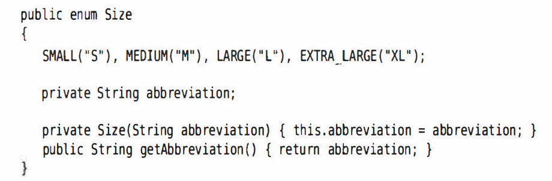

# 枚举类 Enumeration

* **本质：是一个类，而它里面的元素是这个类的实例，不会再构造出新的对象**
* e.g. `public enum Size{SMALL, MEDIUM, LARGE}`
* 不需要equals, 用==
* 可以有构造器、方法和字段
* 构造器必须是private
  
  e.g.

  

* 所有枚举类型都是Enum类的子类，继承了这个类的很多方法
* `Size.SMALL.toString()` 直接获得字符串SMALL
* static方法 - valueOf  `Size s = Enum.valueOf(Size.class, "SMALL")`
* `Size[] values = Size.values();`该静态方法能返回所有枚举值的数组
* `int ordinal()`

  返回枚举常量在enum中的位置，从0开始
* `int compareTo(E other)`

  根据元素出现在enum里面的次序比大小，越靠前的越小，返回-负整数；相等返回0，大于返回正整数

# 泛型

## 常用泛型类

### ArrayList

* 有参数类型的泛型类
* 可添加或删减元素，不需要管数组容量，因为会自动调节
* ArrayList<T> - Type指定具体class类型
* 原理
  * 一开始的capacity没到之前，正常加入元素
  * 等到了capacity之后，新建一个更大的数组，把已有数组重新加进去
* 举例说明
```java
// 声明构造
ArrayList<String> e = new ArrayList<String>();
ArrayList<String> e1 = new ArrayList<>();
var e3 = new ArrayList<String>();
// add，最后返回true
e.add("aaa");
e.add("bbb");
// remove
e.remove("aaa");
//确认capacity时，可调用的方法，这样达到这个capacity之前，都不用新建数组并转移
e2.ensureCapacity(100);
Var e4 = new ArrayList<String>(100);
//查看实际含有的元素数量，永远不会大于capacity
e.size();
//当确认数组列表大小后，不再发生变化，可以使用trimToSize()
//把多余储存空间剪掉，只保留当前数量元素的储存空间
//set设置index,必须是arraylist里面已有的元素
e.set(3,"bbb");
//get by index
e.get(3);
```