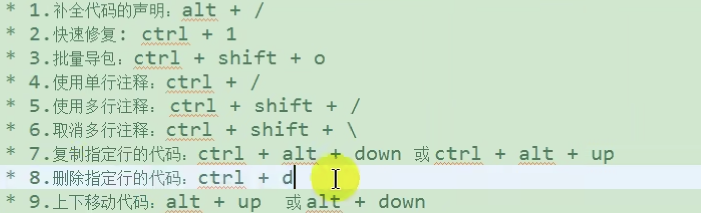
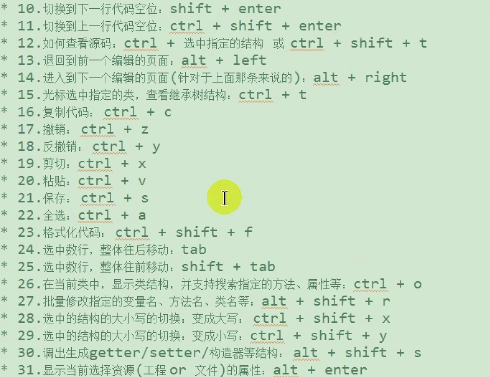
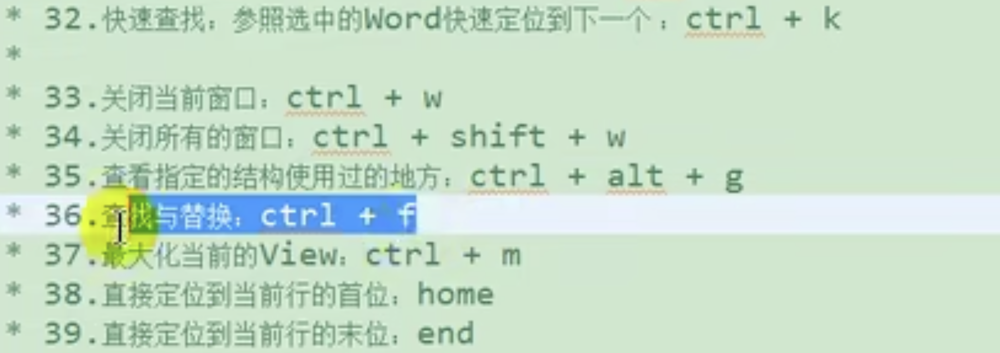

## Eclipse

* file - import - general - existing projects into workspace可以导入项目
* 右键 - filter - 能隐藏或者显示projects
* 右键 - close - 可关闭projects
* 任何快捷键都可以在preference里修改（搜索keys)
* preference - general - appearance - colors and fonts - basic - text font修改控制台字体大小和文字
* preference - general - appearance - colors and fonts - java - java editor text font 修改主窗口字体大小
* preference - general - workspace修改encoding方式
* 利用window - perspective - costomize perspective里面调整“new新建”的东西
* 利用右上角搜索，打开的功能可以移动到左边和下面，也可以删除
* window - perspective - save perspective可以保存已经调整好的工作界面（存到相应的版本的java上，比如java EE）。之后可以通过 perspective - reset恢复存好的界面
* 可以搜索content assist来修改代码补全快捷键
* 快捷键
  
  
  
  
## VS Code 快捷键
1、注释：

单行注释：[ctrl+k,ctrl+c] 或 ctrl+/

取消单行注释：[ctrl+k,ctrl+u] (按下ctrl不放，再按k + u)

多行注释：[alt+shift+A]

多行注释：/**

2、移动行：alt+up/down

3、显示/隐藏左侧目录栏 ctrl + b

4、复制当前行：shift + alt +up/down

5、删除当前行：shift + ctrl + k

6、控制台终端显示与隐藏：ctrl + ~

7、查找文件/安装vs code 插件地址：ctrl + p

8、代码格式化：shift + alt +f

9、新建一个窗口 : ctrl + shift + n

10、行增加缩进: ctrl + [

11、行减少缩进: ctrl + ]

12、裁剪尾随空格(去掉一行的末尾那些没用的空格) : ctrl + shift + x

13、字体放大/缩小: ctrl + ( + 或 - )

14、拆分编辑器 : ctrl + 1/2/3

15、切换窗口 : ctrl + shift + left/right

16、关闭编辑器窗口 : ctrl + w

17、关闭所有窗口 : ctrl + k + w

18、切换全屏 : F11

19、自动换行 : alt + z

20、显示git : ctrl + shift + g

21、全局查找文件：ctrl + shift + f

22、显示相关插件的命令(如：git log)：ctrl + shift + p

23、选中文字：shift + left / right / up / down

24、折叠代码：

ctrl + k + 0-9 (0是完全折叠)
ctrl + shift + [ 折叠鼠标所在代码段
ctrl + shift + ] 展开鼠标所在代码段
25、展开代码： ctrl + k + j (完全展开代码)

26、删除行 ： ctrl + shift + k

27、快速切换主题：ctrl + k / ctrl + t

28、快速回到顶部 ： ctrl + home

29、快速回到底部 : ctrl + end

30、格式化选定代码 ：ctrl + k / ctrl +f

31、选中代码 ： shift + 鼠标左键

32、多行同时添加内容（光标） ：ctrl + alt + up/down

33、全局替换：ctrl + shift + h

34、当前文件替换：ctrl + h

35、打开最近打开的文件：ctrl + r

36、打开新的命令窗：ctrl + shift + c