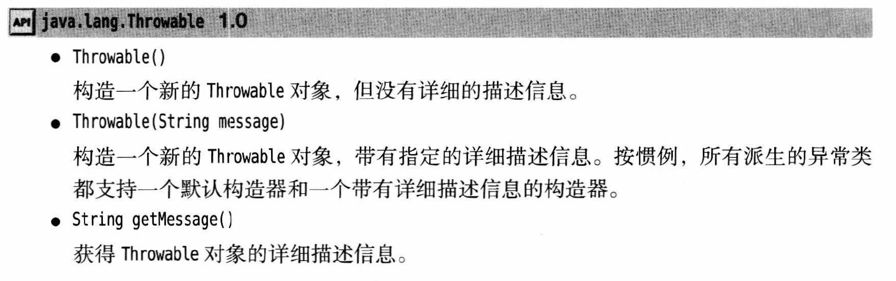
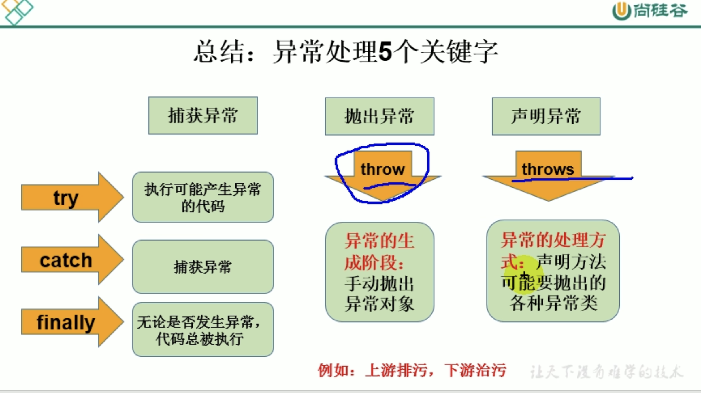

# 第七章 异常处理

## 概述

* **理解**
  * 异常对象都是派生于Throwable类的一个实例
  * 遇到各种出现的问题，可以自己写报错内容
  * 执行程序中的不正常现象称为异常
  * 异常事件分类
    * Error
      * 虚拟机无法解决的严重问题，一般无法自行解决
      * 一般不进行代码处理
      * 举例
        * java.lang.StackOverFlowError - stack
        * java.lang.OutOfMemoryError - heap
        * 资源耗尽
        * JVM系统内部错误
    * Exception
      * 因为编程错误或者偶然外在因素导致的一般性问题，可以使用针对性代码处理
      * 举例
        * 空指针访问
        * 数组角标越界
        * 读取不存在的文件
        * 网络连接中断
  * 解决方案
    * 方法一
      * 终止运行
    * 方法二
      * 编写程序，考虑到错误的检测或者错误消息的提示，或者错误的处理
  * 捕获错误
    * 最好在编译期间，但有的只能在运行时出现
    * 分类
      * 编译时异常 - 执行javac.exe命名，出现的异常
      * 运行时异常 - 执行java.exe出现的异常
  * 
  * RunTimeException 和 Error，没必要声明
  * check的exception必须声明，即编译时异常

## 异常结构体系

* Throwable
  * Error
  * Exception
    * checked 编译异常 unchecked
      * IOException
        * FileNotFoundException
      * ClassNotFound
    * unchecked 运行异常
      * NullPointerException
      * ArrayIndexOutOfBoundsException
      * ClassCastException
      * NumberFormatException
      * InputMismatchException
      * ArithmeticException

## 常见异常举例

```java
// NullPointerException
int[] arr = null;
sout(arr);

// InputMismatchException
Scanner s = new Scanner(System.in);
int score = s.nextInt();//input abc
sout(score);

// NumberFormatException
String str = "abc";
int num = Integer.parseInt(str);

//ArithmeticException
int i = 10 / 0;

// FileNotFoundException
File f = new File("hello.txt");
FileInputStream fis = new FileInputStream(file);

int data = fis.read();
while(data != -1) {
    sout((char)data);
    data = fis.read();
}

fis.close();
```

## 异常处理机制

* 过程一：“抛”：异常 - 异常代码生成一个对应异常类 - 抛出 - 之后代码不执行
  
  异常对象产生：
  1. 系统自动生成异常对象
  2. 手动生成一个异常对象，抛出（throw） e.g. ```throw new Exception("Wrong!")```
* 过程二：“抓”：异常处理
  1. try-catch-finally
  2. throws

### 一：try-catch-finally

```java
try{
    //possible code creating exception
} catch(Exception1 var1) {
    //handle 1
    sout("Exception1: ...");
} catch(Exception2 var2) {
    //handle 2
}
...
finally{
    // code that would be implemented
    // Optional
    sout("End of the Program");
}
```
* 异常能够被try-catch结构处理掉
* 一旦出现异常并被catch抓住，就跳出结构（除非有finally),继续执行其他代码
* 如果异常有父子类关系，子类一定要在上面，否则报错（没有父子关系，则谁在上运行谁）
* 打印异常
  * 自己写
  * `sout(e.getMessage())`
  * `e.printStackTrace()`
* finally - 最后一定执行的代码
  * 数据库连接、输入输出流、网络编程socket等资源，jvm不能自动回收的，需要手动回收资源释放 - finally
* 该结构可以嵌套写，比如finally里可以继续写try-catch
* 编译时异常常用try-catch，运行时异常少用
* try-catch-finally通常处理编译时异常，但运行时异常仍可能报错，相当于把编译时存在的问题延迟到运行时出现

### 二：throws + 异常类型
* e.g. ```class Person throws Exception {}```
* 把异常抛给方法的调用者，并没有真正处理掉异常
* 在方法声明处出现，此方法执行时，可能抛出异常对象
* 一旦方法体执行出现异常，仍然会在异常代码处生成一个异常类，此对象满足throws后异常类型时，就会被抛出，异常代码后续的代码不再执行
* 子类重写的方法抛出的异常类型不大于父类被重写方法抛出的异常类型

### throws vs try-catch-finally
* 父类被重写方法没有throws，子类重写方法就不能throws，这个时候子类就只能用try-catch
* 如果几个方法有关联，每个方法都有异常可能，用throws来分别处理

### 自定义异常类型
* extend现有异常：Exception or RunTimeException
* 提供全局常量
* 提供默认构造器和重载构造器
* 用`throw new`来抛出
* e.g.
  ```java
  public class MyException extends RuntimeException {
    static final long serialVersionUID = -1829867L; //全局变量，序列号，可以理解为唯一标志
    public MyException() {

    }

    public MyException(String msg) {
      super(msg)
    }
  }
  ```

## relate methods


## 再次抛出异常


## 结论

