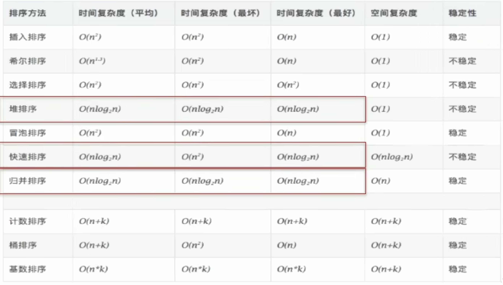

# 第三章 数组array

## 概念
* 数组名
* 索引index
* 元素element
* 长度length

## 特点
* 有序排列，连续存储
* 属于引用数据类型变量
* 相同类型
  * 可以是基本数据类型，也可以是引用数据类型
* search方便
* 长度确定后不能改

## 分类
* 一位数组、二维数组。。。
* 基本数据类型数组，引用数据类型数组

## 举例
```java
int num;
num = 10;
int id = 1001;

int[] ids;//声明
//static initialization: 初始化和元素赋值同时进行
ids = new int[] {1001, 1002, 1003, 1004};

//dynamic initialization： 初始化和赋值分开进行
String[] names = new String[5];
int[] i = {1, 2, 3};

//错误
//int[] a = new int[];
//int[5] a = new int[5];
//int[] a = new int[3]{1, 2, 3};

names[0] = "wang";
names[1] = "chen";
names[2] = "zhang";
names[3] = "sun";
names[4] = "li";

//length
System.out.println(names.length); //5

//遍历
for (int i = 0; i < 5; i++) {
    System.out.println(names[i]);
}
```
## 各种类型默认初始化
`int[] a = new int[5]` 这个里面已经都初始化为0了 
* **整型**：0
* **浮点型**：0.0
* **char**：0 or ‘\u0000'（ANSLL）
* **boolean**：false
* **引用类型**（比如String）：null

## 简单内存解析
* **stack 栈**
  * 线性，先进先出FIFO，存放局部变量
* **heap 堆**
  * new 出来的结构 - 对象或者数组
* **方法区**
  * 常量值 + 静态域

## 数组内存解析
* **数组声明**
  * 数组名指针存在stack里，存入分配的数组内存（在heap里）的地址
  * 当stack的变量被删除，指针没有了，heap的那个内存也将被清理掉

## 多维数组
* 其实就是用数组作为另一个数组的元素
* 外层数组的每个元素存的是内层数组的地址
* **举例**
    ```java
    //static initialization
    int[][] a = new int[][]{{1, 2, 3}, {4, 5}};
    //dynamic initialization
    String[][] s = new String[3][2];
    String[][] s2 = new String[3][];
    //error
    //String[][] s3 = new String[][4];
    //String[4][3] s4 = new String[][];
    //int[][] arr = new int[4][3]{{0}};
    int[] arr[] = new int[][]{{1}, {2}};
    int[] a2[] = {{1, 2}, {3}};

    //调用
    //arr[0][0]

    //没有分配的数组，会报错
    
    //length
    System.out.println(a.length); //2
    System.out.println(a[0].length); //3

    //遍历
    for (int i = 0; i < a.length; i++) {
        for (int j = 0; j < a[i].length; j++) {
            System.out.println(a[i][j].length);
        }
        System.out.println("\n");
    }
    System.out.println(s2[0]) // null
    System.out.println(s2[0][0]) // error
    ```
* **二维数组默认初始化值**
  * 地址
  * `System.out.println(arr)` -- 出来的是arr存的那个在heap里分配的数组的地址
* **二维数组内存解析**
  
    stack放入arr变量，存入外层数组地址，若一开始内层数组没有分配多大内存，则外层数组每个元素初始化为null；

    内层数组分配内存后，外层数组每个元素都存入相应内存数组的地址，内层数组的状态和一维数组一样。

## for each loop
  ```java
  int[] array = new int[] {1, 2, 3};
  for (int a: array) {
    //statement;
  }
  ```
  格式：`for (variable: collection)`

## 注意
* **可变长度参数变量**
  * `method(String ... args)`
  * 意思是你可以使用多个String作为method的形参，他们都存在String[] args里
  * 使用：`method("abs", "dhuig", "sgiuig)`
* **声明格式**：
  * 一位数组：int[] x or int x[]
  * 二维数组：int[][]y or int[] y[] or int y[][]
* **随机数范围[x, y]**
    ```java
    (int)(Math.random()*(y-x+1) + x)
    ```
* **复制操作**
  * `array1 = array2;`这种属于是把array2首地址给了array1，其实heap里面只有一个数组占得内存
  * 某指针如果地址类型不一样没法赋值给其他
  * 真正复制出来一个新array：利用for loop重新赋值给新的array
* **复制&反转**
  ```java
	public static void main(String[] args) {
		String[] arr = new String[] {"JJ", "MM", "DD", "BB"};
        //复制
        String[] arr1 = new String[arr.length];
        for (int i = 0; i < arr1.length; i++) {
            arr1[i] = arr[i];
        }

        //数组的反转
        for (int i = 0; i < arr.length / 2; i++) {
            String t = arr[i];
            arr[i] = arr[arr.length - i - 1];
            arr[arr.length - i - 1] = t;
        }
	}
    ```
* **查找**
  * 线性查找
    ```java
    String dest = "BB";
    boolean f = true;
    for (int i = 0; i < arr.length; i++) {
        if (dest.equals(arr[i])) {
            System.out.println("index is " + i);
            f = false;
            break;
        }
        if(f) {
            System.out.println("no found");
        }
    }
    ```
  * 二分法查找
    ```java
    // 前提：有序
    int [] a = new int[] {28, 45, 50, 70, 90, 333};
    int dest = 45;
    int head = 0;
    int end = a.length-1;
    boolean f = true;

    while(head <= end) {
        int mid = (head+end)/2;
        if(dest == a[mid]) {
            System.out.println("index is " + i);
            f = false;
            break;
        } else if(a[mid] > dest) {
            end = mid - 1;
        } else {
            head = mid + 1;
        }
    }

    if (f) {
        System.out.println("no found");
    }
    ```
  * 排序算法
    * 时间复杂度、空间复杂度
    * 稳定性

        数字相同的两个元素，在排序后，两个元素排列顺序不变
    * 内部排序

        内部的内存可以够排序使用，所有排序操作在内存中完成

    * 外部排序

        数据量过大，内存不够进行排序操作，需要外部存储器比如磁盘来辅助。多路归并排序属于此类。可以认为外部排序是多次内部排序并列。

    * 十大排序算法：
        * **选择排序**
          * 直接选择排序 selection sort
          * 堆排序 heap sort
        * **交换排序**
          * 冒泡排序 bubble sort
          * 快速排序 quick sort
        * **插入排序 insertion sort**
          * 直接插入排序
          * 折半插入排序
          * shell排序 shell sort
        * 归并排序 merge sort
        * 桶式排序 bucket sort
        * 基数排序 radix sort
    * 冒泡排序
        ```java
        int[] a = new int[] {43, 32, 76, -98, 0, 64, 33, -21};
        for (int i = 0;i < a.length - 1; i++) {
            for (int j = 0; l < a.length - 1 - i; j++) {
                if (a[j] > a[j+1]) {
                    int temp = ar[j];
                    a[j] = a[j+1];
                    a[j+1] = temp;
                }
            }
        }
        ```
    * 快速排序
      * nlog2n
* **算法特点**
  * 有限性 finiteness
  * 确定性 definiteness - 满足这个的是确定性算法。如今非确定性算法也收到关注，比如并行算法、概率算法
  * 可行性 effectiveness
* 
* **ArrayList** 可以实现数据不断扩展
* `var`
  * 可以给引用类型变量使用，这样就不用指定类型了，直接看后面new的是什么类型就可以了
  ```java
  var a = new int[] {1, 2, 3};
  ```
* **允许长度为0的数组存在**
```java
new int[0];
new int[]{};
```
与`null`不一样
* **复制数组**
  * 直接赋值给另一个数组只会传递数组地址，并没有新创造一个新的数组
  * `Arrays.copyOf`
  ```java
  int[] array = new int[] {1, 2, 3};
  int[] copiedArray = Arrays.copyOf(array, array.length)
  //第二个参数是新复制的数组的长度，可以更长，后面就补0/false/null
  //如果更短，只复制前面的元素
  ```
  * `Arrays.copyOfRange(collection a, int start, int end)`
* **命令行参数**
  * `String[] args`
  * main方法接收的字符串数组，用来接收命令行输入的参数
  * args可以当做正常数组访问，比如用index访问，也可以用String[]的方法
* **Math.random()** 生成的是[0, 1)的随机数

## Arrays package
  * `boolean equals(int[] a, int[] b)` 注意数组有顺序要求
  * `String toString(int[] a)`
  * `void fill(int[] a, int val)` 填充用
  * `void sort(int [] a)` 这个是快速排序
  * `int binarySearch(int[] a, int key)`返回索引位置，没找到返回负数

## 数组常见异常
* 角标越界：`ArrayIndexOutOfBoundsException`
* 空指针异常：`NullPointerException` 指针地址变成了null