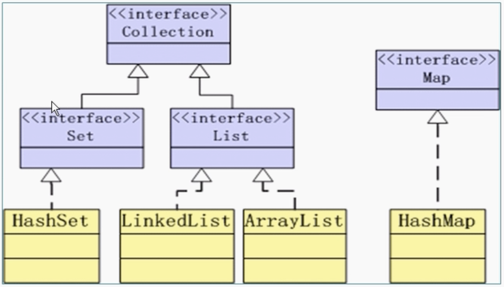
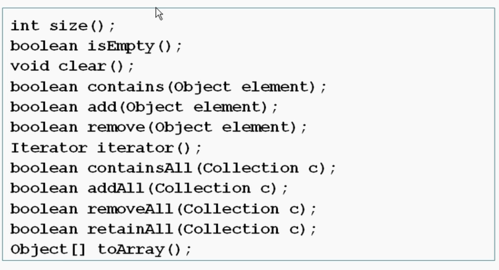
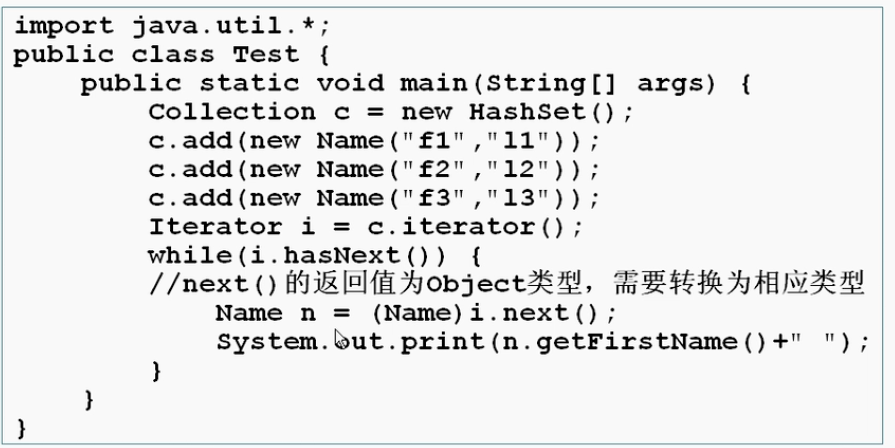

# 第九章 容器

## Concepts
* java api所提供的一系列类的实例，用于在程序中存放对象
* 容器api位于java.util
* 
  * Collection接口定义了存取一组对象的方法，子接口有set（无序不重复）和list（有序可重复）
  * Map接口定义了存储key-value映射对的方法

## Collection接口
* collection接口方法
  * 
* 使用举例
  * `Collection c = new ArrayList()`
* remove、contains方法一般需要比较是否相等，一般用hashcode比较，所以自定义类必须同时改写hashcode和equals方法，内容一样hashcode一定一样（当对象需要当索引的时候需要改写这两个）
* 所有实现了collection的容器类都有一个iterator的方法用来return一个实现了Iterator接口的对象

### Iterator < E > 接口
* 迭代器，用于遍历
* 方法
  * boolean hasNext() - 判断游标右边是否有元素
  * E next() - 返回游标右边的元素并移动到下一个位置
  * void remove() - 删除游标左边的元素，在执行完next之后该操作只能执行一次
* example

* iterator对象的remove方法在迭代过程中删除元素的唯一安全方法

## Set接口
* 没有添加新方法，不会重复，无顺序
* 有HashSet、TreeSet等
* s.retainall(s2) - 找交集
* Set和list容器类都具有Constructor(Collection c)
  * 举例:`Set s2 = new HashSet(); Set sn = new HashSet(s1)`

## List接口
* 有顺序，可以重复
* 元素都有整数型序号记载位置
* 方法
  * Object get(int index)
  * set(int index, Object element)
  * remove(int index)
  * indexOf(Object o)
  * lastIndexOf(Object o)
  * add(int index, Object element)

### ArrayList

* 有参数类型的泛型类
* 可添加或删减元素，不需要管数组容量，因为会自动调节
* ArrayList< T > - Type指定具体class类型
* 原理
  * 一开始的capacity没到之前，正常加入元素
  * 等到了capacity之后，新建一个更大的数组，把已有数组重新加进去
* 举例说明
```java
// 声明构造
ArrayList<String> e = new ArrayList<String>();
ArrayList<String> e1 = new ArrayList<>();
var e3 = new ArrayList<String>();
// add，最后返回true
e.add("aaa");
e.add("bbb");
// remove
e.remove("aaa");
//确认capacity时，可调用的方法，这样达到这个capacity之前，都不用新建数组并转移
e2.ensureCapacity(100);
Var e4 = new ArrayList<String>(100);
//查看实际含有的元素数量，永远不会大于capacity
e.size();
//当确认数组列表大小后，不再发生变化，可以使用trimToSize()
//把多余储存空间剪掉，只保留当前数量元素的储存空间
//set设置index,必须是arraylist里面已有的元素
e.set(3,"bbb");
//get by index
e.get(3);
```

### LinkedList

## Collections类

* java.util,Collections是一个还有多个静态方法的基于List容器的类，和Collection接口不是一个东西
* 方法
  * sort(List)
  * shuffle(List)
  * reverse(List)
  * fill(List, Object) - 用特定对象重写整个List容器
  * copy(List dest, List src)
  * binarySearch(List, Object)

## Comparable接口
* 所有可以排序的类必须实现java.lang.Comparable
* 方法：
  * public int compareTo(T o)
    * 0 ==
    * 正数 >
    * 负数 <
  * 实现了该方法可确定排序方式

## Map接口
* Array读快改慢，Linked改快读慢，Hash两者之间
* 用来储存key-value对，key不能重复，因为需要用来做标志
* HashMap 和 TreeMap等
* 方法
  * Object put(Object key, Object value) - 如果key存在，原来的value会被替换掉，并return原有的value
  * get(key)
  * remove(key)
  * containsKey(Object key)
  * containsValue(Object value)
  * int size()
  * boolean isEmpty()
  * void putAll(Map t)
  * void clear()

## 泛型Generic

* jdk1.4之前：所有类型进入集合被当做Object,经常需要强制转化，容易出错，效率慢，并失去原有类型
* jdk1.5之后：generic
* 好处：可以不用强制转换，增加可读性和稳定性
* 定义集合的时候同时定义集合中对象的类型
* 用集合尽量使用泛型
* 可以在定义Collection的时候指定，也可以在循环时Iterator指定
* 具体查对应类或者接口的api
* 举例：`Comparable < T >`
```java
Map<String, Integer> m1 = new HashMap<String, Integer> ();
```


