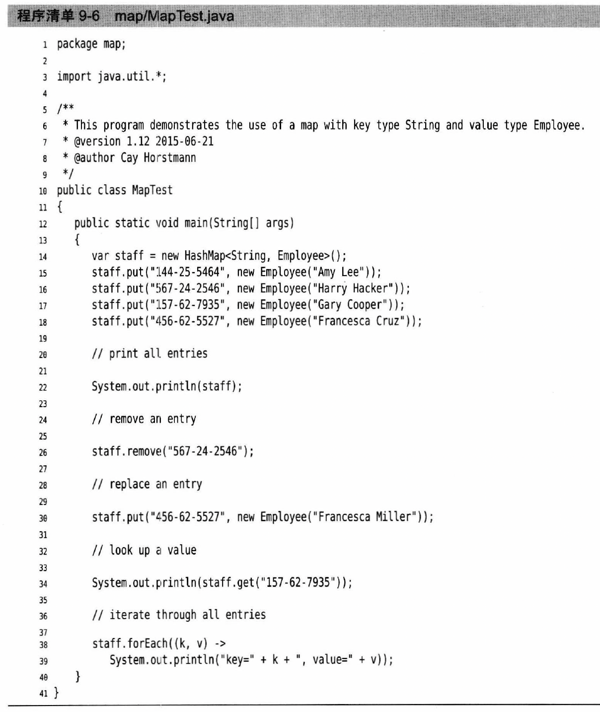

# 第九章 容器

## Concepts
* java api所提供的一系列类的实例，用于在程序中存放对象
* 容器api位于java.util
* 
* 
* 
* 
  * Collection接口定义了存取一组对象的方法，子接口有set（无序不重复）和list（有序可重复）
  * Map接口定义了存储key-value映射对的方法
* 每一次可以使用接口存放实现类,e.g.`List<String> a = new ArrayList<String>();`

## Collection接口
* collection接口方法
  * 
  * `<T> T[] toArray(T[] arrayToFill)` - 和toArray()差不多，不过提前建好了一个数组作为参数传进去，把集合里的元素都放进这个数组之中，类型是定好的T，如果arragToFill足够大，就会放进去，多余空间放null。如果空间不够，方法另建新数组，长度和集合大小一样
  * `V put(K key, V value)`
  * `V get(K key)`
* 使用举例
  * `Collection c = new ArrayList()`
* add方法一般添加成功会返回true，否则false
* remove、contains方法一般需要比较是否相等，一般用hashcode比较，所以自定义类必须同时改写hashcode和equals方法，内容一样hashcode一定一样（当对象需要当索引的时候需要改写这两个）
* 所有实现了collection的容器类都有一个iterator的方法用来return一个实现了Iterator接口的对象

### Iterator < E > 接口
* 迭代器，用于遍历，所有Collection接口都扩展了这个接口
* 可以认为java的迭代器位于两个元素之间，当调用next时，迭代器就越过下一个元素，并返回刚刚越过的那个元素的引用
* 方法
  * boolean hasNext() - 判断游标右边是否有元素
  * E next() - 返回游标右边的元素并移动到下一个位置,到了末尾会抛出NoSuchElementException
  * void remove() - 删除游标左边的元素，在执行完next之后该操作只能执行一次。必须和next配合使用，一个前进，一个删除
  * default void forEachRemaining(Consumer<? super E> action)
    * 如果不打算用foreach方法，可以用这个方法，传一个lambda表达式来处理每一个元素`iterator.forEachRemaining(e -> do sth)`
* example

* iterator对象的remove方法在迭代过程中删除元素的唯一安全方法
* 一旦有Iterator方法，集合其实可以直接用foreach循环，因为foreach可以处理任何实现了Iterable接口的对象

### AbstractCollection类
* 实现了Collection接口，保持了size和iterator仍未抽象方法，但给其他方法提供了基本实现，可以直接extends这个类，只需要把size和iterator进行override即可
* 还有很多默认方法，大部分和stream有关
* `default boolean removeIf(Predicate<? super E> filter)`

## Set接口
* 没有添加新方法，不会重复，无顺序
* 有HashSet、TreeSet等
* s.retainall(s2) - 找交集
* Set和list容器类都具有Constructor(Collection c)
  * 举例:`Set s2 = new HashSet(); Set sn = new HashSet(s1)`

### HashSet
* Hash table概念
  * 每一个value都有对应的hashcode整数，由一项实例字段计算得出
  * 必须实现hashcode(),并且与equals相兼容
  * java中，散列表用链表数组实现，每个列表被称为桶（bucket），想要查找对象位置，需要先有hashcode，然后与桶总数取余，得到的结果就是保存这个元素的桶的索引。e.g.hashcode = 76268， 有128个桶，那么对象存在108号桶里，因为76268%128=108
  * 
  * 如果桶被填了，这个现象被称为散列冲突hash collision，这个时候需要将新对象与桶中的所有对象进行比较，查看这个对象是否已经存在，如果hashcode分布合理，桶数量多，需要比较的次数就少。java8之后，桶满了链表会变为平衡二叉树，如果选择的散列函数不好，或者有人恶意添加相同hashcode的值，都会产生很多冲突，用平衡二叉树会提高性能
  * 可以一开始指定初始桶数，一般可以设置为元素数量的75%-150%。标准库里使用的桶数是2的幂数，默认16.
  * 如果散列表满了，需要再散列（rehashed），也就是创造更多桶的表，把原表元素插入进来，删掉原表。填装因子load factor就是确定什么时候再散列，比如一般默认值是0.75，也就是表中填到75%就会再散列，新表桶数为原来两倍。
* add方法会先查是否contains这个要添加的对象，若不存在再添加
* 迭代器会依次访问所有的桶，由于散列元素分散在表中，所以看上去像是随机顺序的访问
* 
* 

### TreeSet

* 有序集合，可以任意顺序插入到集合中，一旦插入元素自动按照排序后顺序呈现
* 排序用的红黑树，每一次添加元素，都会在正确的排序位置上，迭代器总是以有序访问每个元素。
* 整体添加速度比hashset慢，但比检查数组或链表中的重复元素相比，还是快的，一般需要log2n次比较
* 因为需要排序，元素必须实现Comparable接口，或者构造集的时候提供Comparator
* 不需要排序，没必要构造
* 举例
  * 
* 方法
  * 

## Queue & Deque

* 两个都是接口，Deque是Queue的子接口
* 先进先出原则，deque可以两头加两头删
* ArrayDeque和LinkedList都实现了Deque
* 
* 

## PriorityQueue
* 添加是可以随意顺序的，但检索的时候按优先度弹出。优先度最高的是最小的元素，每次调用remove，最小元素先走。
* 使用的是heap来实现的，可以自组织的二叉树，add和remove操作可以让最小的元素移动到根
* 需要实现比较，可以是实现Comparable,也可以是提供Comparator
* 举例
  * 
* 方法
  * 

## List接口
* 有顺序，可以重复,属于有序集合（ordered collection）
* 元素都有整数型序号记载位置
* 方法
  * void add(int index, E element)
  * E get(int index)
  * E set(int index, E element)
  * void remove(int index)
  * indexOf(Object o)
  * lastIndexOf(Object o)
  * add(int index, Object element)
* 遍历：要么迭代器访问，要么索引访问（随机访问random access）
* ListIterator是Iterator的子接口，有一个方法是能够在迭代器位置前面增加一个元素 `void add(E element)`
* 链表和数组的性能差距很大，主要是链表随机访问慢，最好用迭代器
* 为了避免对链表进行随机访问操作，有一个标记接口RandomAccess可以做标记

### ArrayList

* 有参数类型的泛型类
* 可添加或删减元素，不需要管数组容量，因为会自动调节
* ArrayList< T > - Type指定具体class类型
* 原理
  * 一开始的capacity没到之前，正常加入元素
  * 等到了capacity之后，新建一个更大的数组，把已有数组重新加进去
* 举例说明
```java
// 声明构造
ArrayList<String> e = new ArrayList<String>();
ArrayList<String> e1 = new ArrayList<>();
var e3 = new ArrayList<String>();
// add，最后返回true
e.add("aaa");
e.add("bbb");
// remove
e.remove("aaa");
//确认capacity时，可调用的方法，这样达到这个capacity之前，都不用新建数组并转移
e2.ensureCapacity(100);
Var e4 = new ArrayList<String>(100);
//查看实际含有的元素数量，永远不会大于capacity
e.size();
//当确认数组列表大小后，不再发生变化，可以使用trimToSize()
//把多余储存空间剪掉，只保留当前数量元素的储存空间
//set设置index,必须是arraylist里面已有的元素
e.set(3,"bbb");
//get by index
e.get(3);
```
* 方法：
  * `traimToSize()` - 可以将存储块大小调整为保存当前元素数量所需空间，必须确认是否还添加数据，添加就不要用
  * `ensureCapacity(int capacity)` - 给指定cap
  * `toArray(a)` - 将a这个collection变成一个数组return
* 古老的用于动态数组的接口 - Vector，它可以保证数据同步线程安全，但效率会变慢

### LinkedList
* 最后使用迭代器遍历
* `add()` - 只有像是这类有顺序的集合，对于位置也有依赖性，可以用迭代器描述位置，最后在使用add
* 其实extends的是ListIterator,有一个add方法，并且无返回值，并且还有两个方法`E previous(); boolean hasPrevious()`previous方法和next类似,光标往左移，这个时候调用remove的话就会把右边的元素删除，并且同样不能连着用两次
* listIterator方法返回一个实现了ListIterator接口的迭代器对象 `ListIterator<String> i = staff.listIterator();`
* 利于ListIterator的add方法(可以前置添加)来实现指定位置的插入
  
* 还有一个set方法，可以用一个新元素替换调用了next或者previous方法返回的上一个元素
* 如果同时有多个迭代器在修改集合，其中一个修改后，另一个会抛出ConcurrentModificationException。集合可以跟踪修改操作次数，每个迭代器都会为它负责的改改操作维护一个单独的更改操作数，迭代器会检查自己的操作数是否与集合操作数相等，如果不一致就有异常抛出
* nextIndex方法返回下一次调用next方法时返回元素的索引，previousIndex对应previous方法，因为有迭代器在保持着当前位置计数


## Collections类

* java.util。Collections是一个还有多个静态方法的基于List容器的类，和Collection接口不是一个东西
* 方法
  * sort(List)
  * shuffle(List)
  * reverse(List)
  * fill(List, Object) - 用特定对象重写整个List容器
  * copy(List dest, List src)
  * binarySearch(List, Object)

## Comparable接口
* 所有可以排序的类必须实现java.lang.Comparable
* 方法：
  * public int compareTo(T o)
    * 0 ==
    * 正数 >
    * 负数 <
  * 实现了该方法可确定排序方式
  * 与equals相兼容（除了BigDecimal）

## Comparator接口
* 比较器
* `Public interface Comparator<T> {int compare(T first, T seconde)}`
* 指定了类型，放进两个同类型的方法进去比较
* 该方法必须在比较器对象上调用，而不是比较的对象上调用，所以需要建立一个比较器对象的实例
* 举例：根据String的长度来排序
  * 
  * 
  * 

## Map接口
* Array读快改慢，Linked改快读慢，Hash两者之间
* 用来储存key-value对，key不能重复，因为需要用来做标志
* HashMap 和 TreeMap等
* HashMap对key进行散列，TreeMap对key进行顺序组织搜索树，两个都是应用于key，value与它们无关
* 举例
  * 
* 方法
  * Object put(Object key, Object value) - 如果key存在，原来的value会被替换掉，并return原有的value
  * get(key)
  * remove(key)
  * containsKey(Object key)
  * containsValue(Object value)
  * int size()
  * boolean isEmpty()
  * void putAll(Map t)
  * void clear()
  * 
  * 
  * 
* 更新键值的几个方法
  * `getOrDefault(word, 0) + 1`
  * `putIfAbsent(word, 0);put(word, get(word) + 1)`
  * `merge(word, 1, Integer::sum)`
* 映射视图view - 实现了Collection接口或者某个子接口的对象
  * 三个视图：keySet，valueSet, key/value set
  * 相关方法
    * 
* WeakHashMap
  * 当一个key不再使用了，可以由垃圾处理器将删除这个对应的key/value。它使用weak reference来保存key，WeakReference对象包含另一个对象的引用。最终只有WeakReference引用，就会垃圾处理掉，会把这个对象的弱引用放入一个queue中，意味着这个key相关条目不再使用
* LinkedHashSet & LinkedHashMap类
  * 每次添加完后，遍历出来都是添加顺序
  * 也可以用访问顺序来遍历
  * 每次调用get或者put，受到影响的项从当前位置删除，放到链表末尾
  * `LinkedHashMap<K, V>(initialCap, loadFactor, true)`
  * 自动化的话，可以构造一个子类，然后覆盖下面的方法 `protected boolean removeEldestEntry(Map.Entry<K, V> eldest)`
* EnumSet & EnumMap
  * 
  * EnumMap的key都是Enum
* IdentityHashMap
  * 它的hashcode计算用的是Object.hashcode(),所以是根据地址来算的，因此使用==而不是equals，内存地址不一样就是不相等
* 各种类方法汇总
  * 
  * 

## 泛型Generic

* jdk1.4之前：所有类型进入集合被当做Object,经常需要强制转化，容易出错，效率慢，并失去原有类型
* jdk1.5之后：generic
* 好处
  * 可以不用强制转换，增加可读性和稳定性，也更安全
  * 可以对多种不同类型的对象重用
  * 编译器可以检查类型
* 定义集合的时候同时定义集合中对象的类型
* 用集合尽量使用泛型
* 可以在定义Collection的时候指定，也可以在循环时Iterator指定
* 具体查对应类或者接口的api
* 类型参数type parameter
  * 放在`< >`之中
  * 通配符wildcard type - `T, U, V....`
    * 
* 举例：`Comparable < T >`
```java
Map<String, Integer> m1 = new HashMap<String, Integer> ();
```
* 定义泛型类
  * 泛型类就是有一个或者多个类型变量的类
  * ```java
    public class Pair<T> { //多个定义  - <T, U>
      private T first;
      private T second;

      public Pair() {
        first = null;
        second = null;
      }

      public Pair(T first, T seconde) {
        this.first = first;
        this.second = second;
      }

      public T getFirst(){return first;}
      public T getSecond(){return second;}

      public void setSecond(T value){this.second = value;}
      public void setFirst(T value){this.first = value;}
    }
    ```
  * T，U，S一般是任意类型，K和V分别是表的key和value，E表示集合的元素类型
  * 
* 泛型方法
  * ```java
    class ArrayAlg {
      public static < T > T getMiddle(T... a) {
        return a[a.length / 2];
      }
    }
    ```
  * 类型变量放在修饰符（public static）的后面，返回类型之前
  * 泛型方法可以在普通类中定义，也可以在泛型类中定义
* 调用
  * `String middle = ArrayAlg.<String>getMiddle("ABC", "DEF")`
  * 类型放在方法名之前
  * 一般上面这种情况，可以省< >以及类型名，因为后面方法参数已经代表了类型了
* 类型变量的限定
  * 可以加约束在类型变量上
  * `<T, U,... extends BoundingType1 & BoundingType2 &...>`
  * 表示类型变量是限定类型bounding type的子类型subtype，可以都是类也可以都是接口
  * e.g. `public static <T extends Comparable> T min(T[] a)`
  * 如果有一个类作为限定，它必须是限定列表中的第一个限定
  * 
* 通配符
  * `Pair<? extends Employee>`意思是他的类型参数是Employee子类，不可能是String之类的，可以解决方法参数无法传递一类子类的类型参数
  * `Pair<Manager>` 和 `Pair<Employee>` 是 `Pair<? extends Employee>`的子类
  * `Pair<Manager>` 不是 `Pair<Employee>`的子类
  * `void setFirst(? extends Employee)`会出现编译错误，因为无法确定?是啥。可以作为返回值，但不能作为参数
  * 超类型限定
    * `? super Manager` - 表示？是Manager的所有超类型
    * 这个能做参数，但不能做返回值
    * `Pair<Employee>`和`Pair<Object>`是`Pair<？ super Manager>`的子类，`Pair<？ super Manager>`是`Pair<?>`的子类
  * 无限定通配符
    * `Pair<?>`, 和Pair类型有区别
    * `Pair<?>`含有的方法 - `? getFirst(); void setFirst(?)`,这些方法，返回值只能赋给Object，set方法直接不能调用了，不能用Object调用（但可以set null，这个还是有用的）。但是`Pair`就可以用任意Object对象调用上面两个方法
  * 有通配符的方法就不属于泛型方法了，想要捕获通配符可以另写泛型方法捕获，而且必须保证T捕获的是明确的一个类型，像是`Pair<?>`这样的就不行
* 反射和泛型
  * 一般来说，无法获得相关泛型类型参数信息
  * Class泛型
    * Class类本质就是泛型的，比如String.class就是Class< String >
    * Class的很多方法都是用了类型参数，比如`T newInstance()`
    * 
    * 使用Class< T >参数进行类型匹配
      * 
    * 虚拟机中的泛型类性信息
      * 
      * 
      * 
    * TypeLiteral类可以捕获泛型超类型
      * 
      * 
      * 
  * 相关方法
    * 

