**第二章 java基本语法**

* 程序执行过程：


注意：jdk1.7以后，字符串常量搬到heap里了

- **关键词keyword；保留字reservedword**


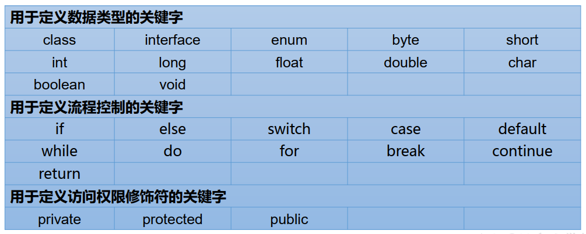

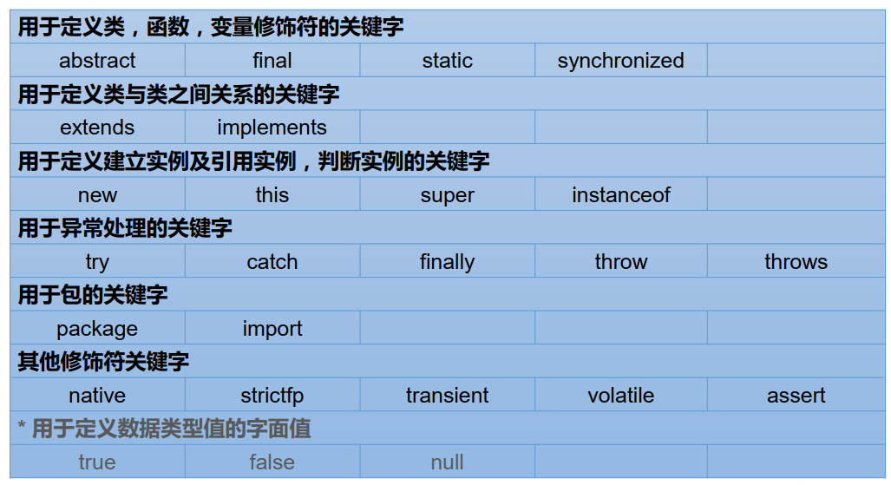


- **保留字：**
  - 现有Java版本尚未使用， 但以后版本可能会作为关键字用。自己命名标识符时要避免使用这些保留字
  - goto 、 const

- **标志符identifier（不可通过）**
  - 由26个英文字母大小写， 0-9 ， \_或 $ 以及某种语言中表示字幕的任何Unicode字符组成
  - 检测Unicode字符哪些属于java的字母 - `Character类 - isJavaIdentifierStart or isJavaIdentifierPart`
  - 数字不可以开头。
  - 尽量不用美刀符号
  - 不可以使用关键字和保留字，但能包含关键字和保留字。
  - Java中严格区分大小写，长度无限制。
  - 标识符不能包含空格
  - 采用unicode字符集

- **命名规范（可通过）**
  - 包名：多单词组成时所有字母都小写：xxxyyyzzz
  - 类名、接口名：多单词组成时，所有单词的首字母大写：XxxYyyZzz
  - 变量名、方法名：多单词组成时，第一个单词首字母小写，第二个单词开始每个单词首字母大写：xxxYyyZzz
  - 常量名：所有字母都大写。多单词时每个单词用下划线连接：XXX\_YYY\_ZZZ

- **变量variable**
  - 变量类型+变量名+存储值
  - 必须先声明并赋值再使用
  - 在作用域内有效
    - 成员变量： class里面但不在方法体里，前面的声明里出现
    - 局部变量：方法体里面以及方法参数
  - 分类：

  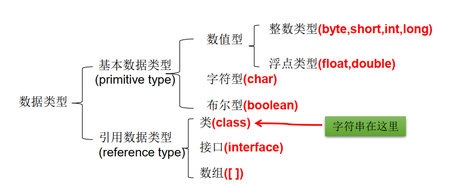

  - 声明long型常量须后加‘l’或‘L’
  - 可以在数字字面量里面加下划线，更易读：1_000_000。编译器会去除这些下划线
  - 整型一般默认int
  - java中，int等类型的大小与平台无关（与c/c++的区别）
  - 可以将有符号整数处理为无符号，比如byte范围0 - 255，对于其他运算需要调用Byte.toUnsignedInt(b)来可到一个0-255的int值，然后处理，再把它转为byte。其他整数类也提供了无符号除方法和求余数方法
  - float 精确7位 声明常量后面加f或者F 数值范围比long还大
  - double 精确15位（双精度） 一般默认浮点为double 可以在后面添加d或者D但没必要
  - 所有浮点数计算都遵循IEEE754规范，下面用于表示溢出和出错的情况的三个特殊浮点数值：
    - 正无穷大（比如正整数除以0的结果）- Double.POSITIVE_INFINITY
    - 负无穷大 - Double.NEGATIVE_INFINITY
    - Nan(非数字)（比如0/0或者负数的平方根）
  - 无法用特定值检测这个值是否等于上面的三个值，只认为不相等，但有个方法Double.isNaN可以检测NaN值
  - 浮点计算有时候是不精确的，因为它采用二进制系统表示，二进制系统无法精确表示1/10，所以如果不允许任何舍入误差，就应该使用BigDecimal
  - 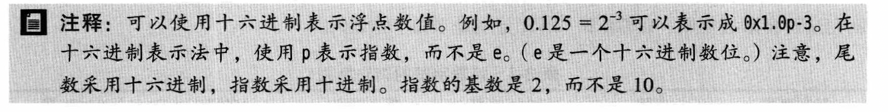 Double.NaN

  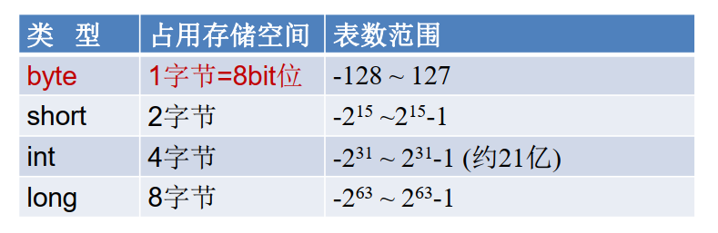

  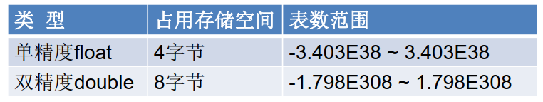

  - char
    - 原本是表示一个字符，现在Unicode有的是用一个char，有的需要两个char值
    - 单引号`
    - 可用十六进制表示 - \u0000~\uFFFF

  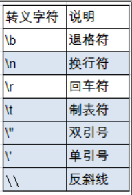

  - 直接使用 Unicode 值来表示字符型常量：‘\\uXXXX’。其中，XXXX代表一个十六进制整数。如：\\u000a表示\\n。
  - Unicode转移序列在解析代码之前进行处理
  - 转移序列\u还可以出现在加引号的字符常量或者字符串之外 - `String\u005B\u005D args`其中\u005B和\u005D表示”和“
  - ASCII码： 上个世纪60年代， 美国制定了一套字符编码， 对英语字符与二进制位之间的关系， 做了统一规定。 这被称为ASCII码。 ASCII码一共规定了128个字符的编码， 比如空格“SPACE”是32（二进制00100000）， 大写的字母A是65（二进制01000001）。 这128个符号（包括32个不能打印出来的控制符号）， 只占用了一个字节的后面7位， 最前面的1位统一规定为0。
  - Unicode： 一种编码，将世界上所有的符号都纳入其中。每一个符号都给予一个独一无二的编码，使用 Unicode 没有乱码的问题。只规定了符号的二进制代码，却没有规定这个二进制代码应该如何存储：无法区别 Unicode 和 ASCII
  - 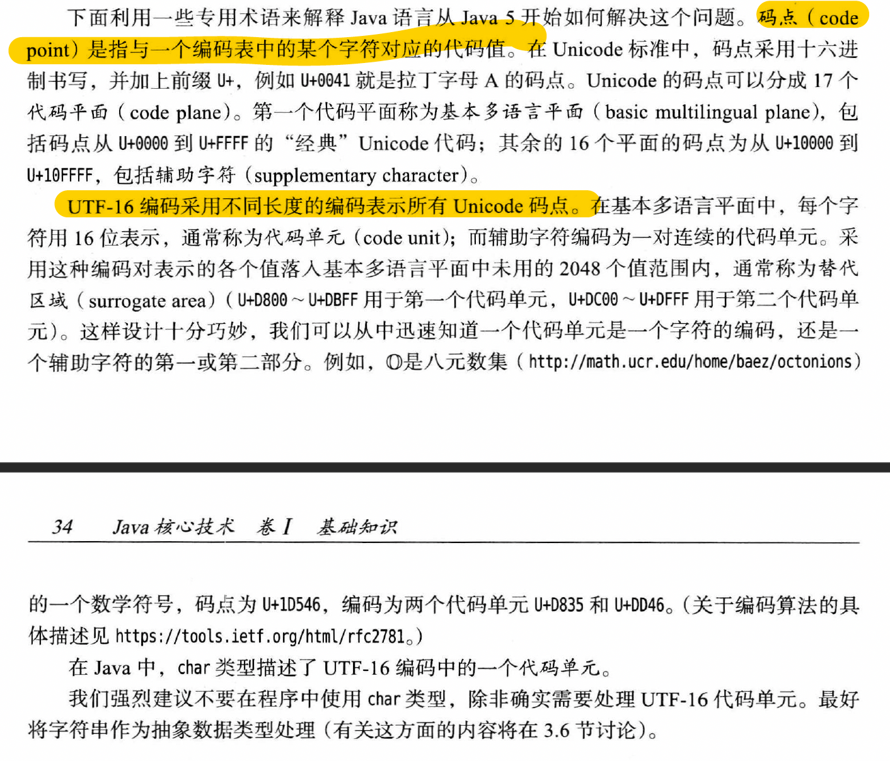
  - UTF-8 是在互联网上使用最广的一种 Unicode 的实现方式。一种变长的编码方式。它可以使用 1-6 个字节表示一个符号，根据不同的符号而变化字节长度
    - Uncidoe 字符集≠UTF-8 编码方式
    - Unicode 只是定义了一个庞大的、全球通用的字符集，并为每个字符规定了唯一确定的编号，具体存储成什么样的字节流，取决于字符编码方案。推荐的 Unicode 编码是 UTF-16 和UTF-8。
    - 常见 CharSet 有： GBK、 GB2312、 US-ASCII、 ISO-8859-1、 UTF-8、 UTF-16BE、 UTF-16LE、 UTF-16
    -        // 编译 `javac -encoding utf-8 test2.java`
    -    // 运行 `java -Dfile.encoding=”utf-8” test2`
  - boolean: true false - 整数值与布尔值不能相互转换
  - 基本数据类型转换Conversion：
    - 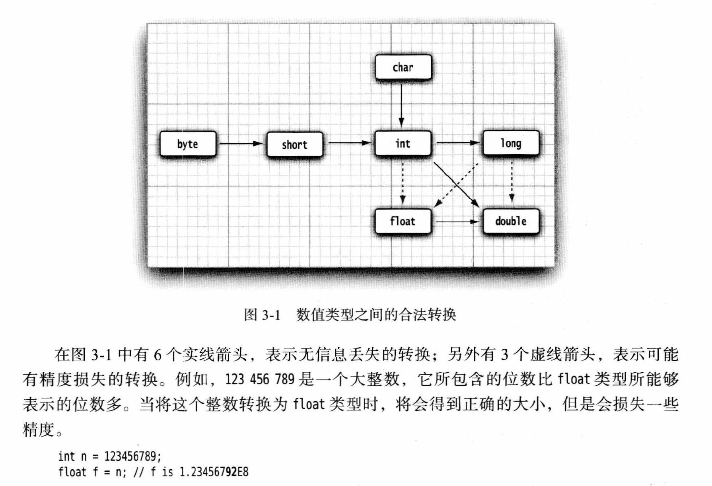
    - byte,char,short ->int ->long -> float -> double
    - 容量小的类型自动转换为容量大的数据类型。
    - byte,short,char之间不会相互转换，他们三者在计算时首先转换为int类型。
    - 强制转换Cast （int） i2，会有精度损失
    - 想进行四舍五入 - long Math.round()
      - `double x = 9.97; int nx = (int) Math.round(x);//10`
    - boolean类型不可以转换为其它的数据类型。但可以和String连接运算后强制转换为string
    - 强制转换的类型超出了目标类型表示范围，会出现截然不同的数
  - 字符串String
    - 双引号
    - String不是基本数据类型，属于引用数据类型
    - 当把任何基本数据类型的值和字符串(String)进行连接运算时(+)， 基本数据类型的值将自动转化为字符串(String)类型
    - char之间的加法只能是算数计算
    - 字符串不能直接转换为基本类型， 但通过基本类型对应的包装类则可以实现把字符串转换成基本类型
    - e.g. `String a = “43”; int i = Integer.parseInt(a);`
    - 格式化输出
      - `System.out.printf("%8.2f", x)` - 与c类似
      - 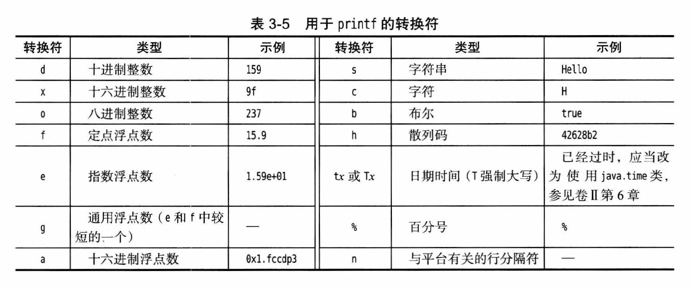
      - 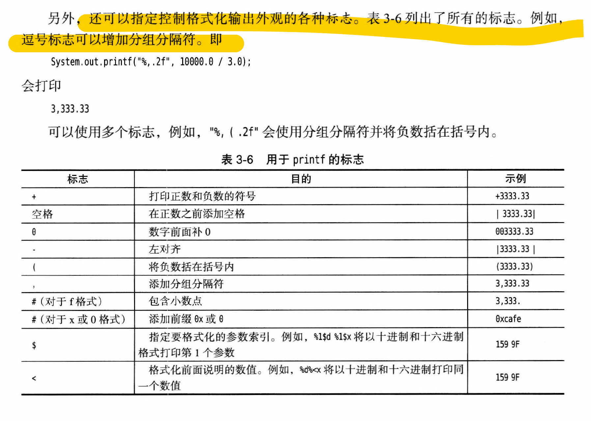
      - String.format方法可以创建一个格式化的字符串
        - `String m = String.format("Hello, %s. Next year, you'll be %d, name, age")`
      - 时间日期的格式化
        - 所有都是以t打头
        - 剩下的根据需求来定
        - e.g.`System.out.printf("%tc", new Date()) - 打印完整的当前日期和时间`
        - 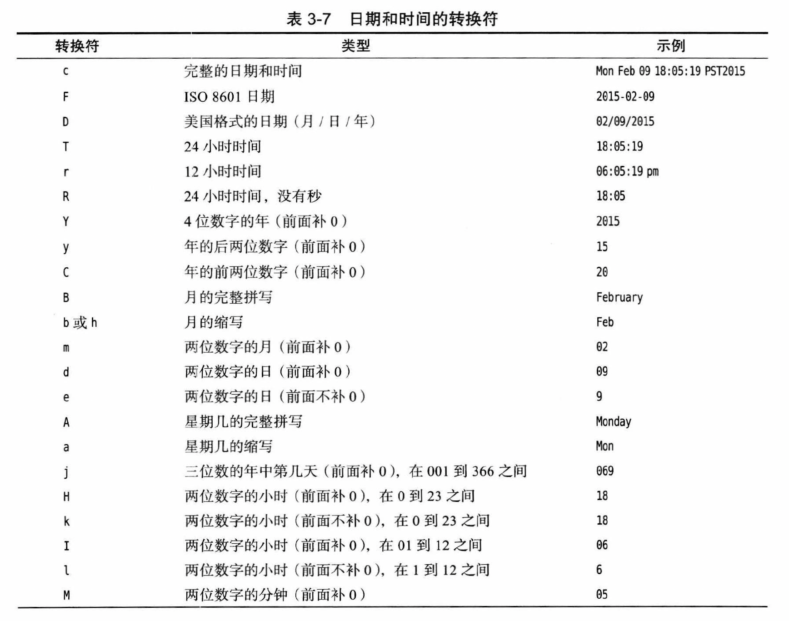
        - 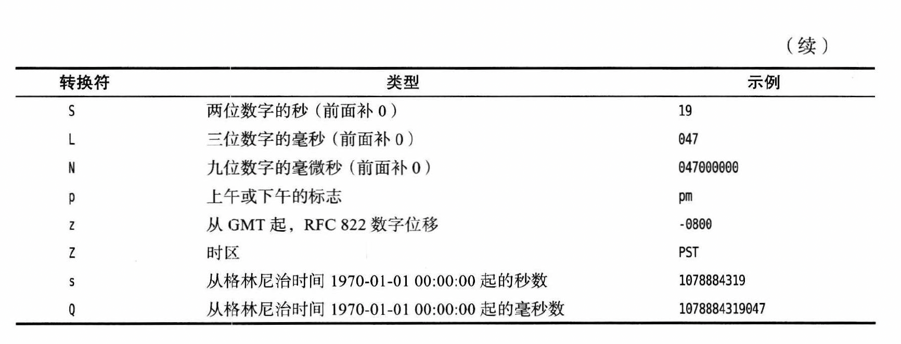
        - 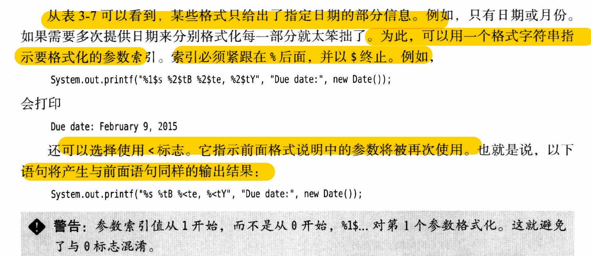
        - 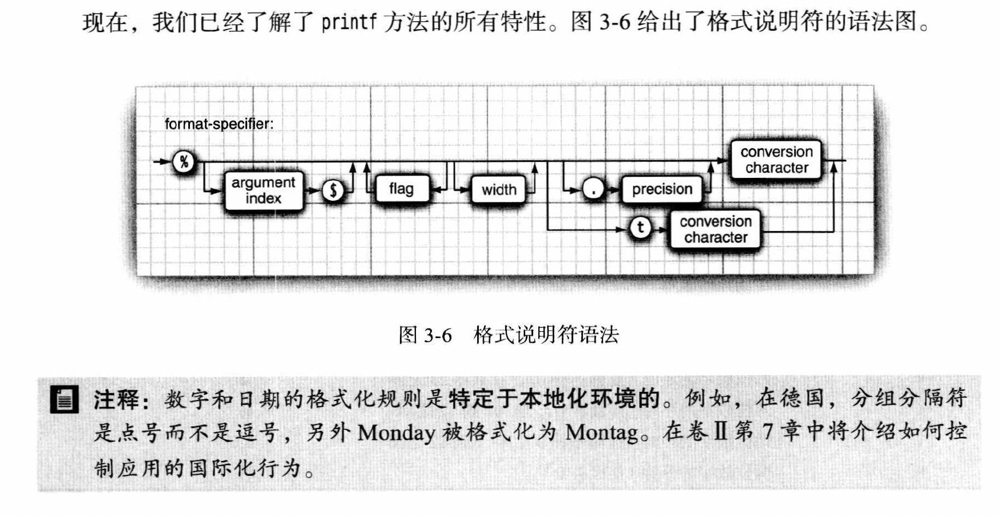


- 常量constant
  - 加了final就不能修改了
  - 一般常量全大写，用_隔开个单词
  - `static final`可以修饰类常量（class constant），一般定义在main方法外部

- **进制**
  - binary：0b 0B
  - octal: 0
  - hexadecimal: 0x 0X

- **binary**
  - 二进制的整数有如下三种形式：
    - 原码：直接将一个数值换成二进制数。最高位是符号位
    - 负数的反码：是对原码按位取反，**只是最高位（符号位）确定为1**。
    - 负数的补码：其反码加1
    - **转换的时候最高位不动，0就是正数，1就是负数**
  - **计算机以二进制补码的形式保存所有的整数**
    - 正数的原码、反码、补码都相同
    - 负数的补码是其反码+1
    - 这样就可以只用加法来表示减法了
  - 转换function：
    - `Integer.toBinaryString(60)`
    - `Integer.toHexString()`

- **运算符**
  - 算数运算符：

  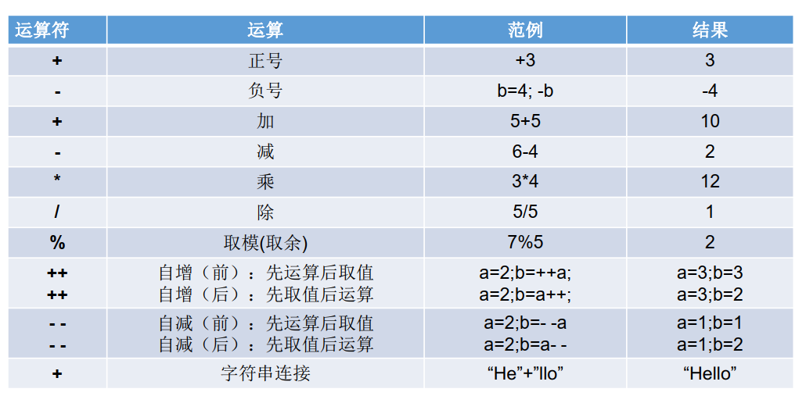

  - 如果对负数取模，可以把模数负号忽略不记，如： 5%-2=1。 但被模数是负数则不可忽略。取模运算的结果不一定总是整数
  - 对于除号“/”，它的整数除和小数除是有区别的：整数之间做除法时，只保留整数部分而舍弃小数部分。否则就是浮点数除法
  - 整数/0出现异常，浮点数/0等于无穷大或者NaN
  - Math.floorMod(a, b)方法：
    - 放入被除数，和除数
    - 因为一般的取模，被除数是负数的话，结果也是负数，用floorMod可以解决这个问题让结果是正数，但如果除数是负数也可能是负数
  - Math提供了一些防止运算溢出的能够抛出异常的方法
    - 举例：int最大值刚超过20亿。10亿*3的结果会是一个负数，这是错误的。但如果使用`Math.multiplyExact(1000000000,3)`就会抛出异常。类似的还有`addExact, subtractExact, incrementExact, decrementExact, negateExact等`
  - 赋值运算符： =，+=, -=, \*=, /=, %=
  - 比较运算符：

  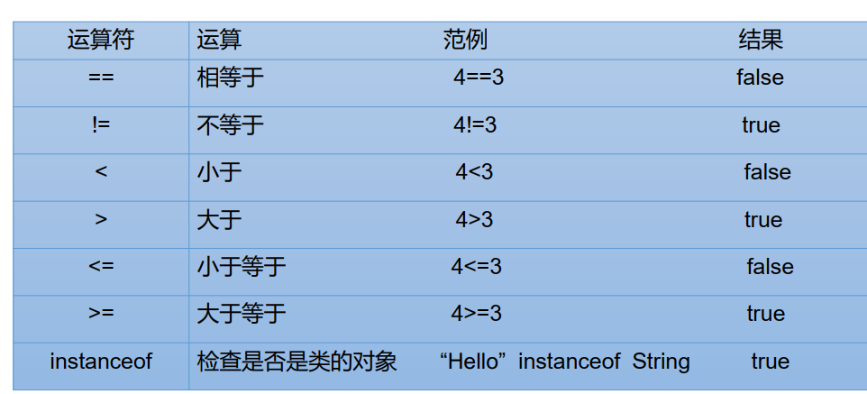

  - \== 还可以使用在其他引用类型变量之间
  - 逻辑运算符：

  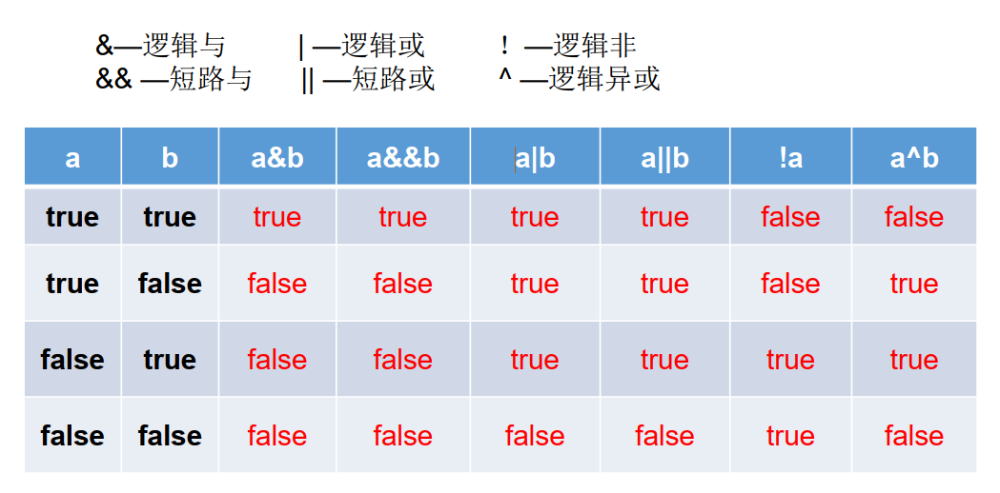

  - &”和“&&”的区别：
    - 单&时，左边无论真假，右边都进行运算；
    - 双&时，如果左边为真，右边参与运算，如果左边为假，那么右边不参与运算。

- “|”和“||”的区别同理， ||表示：当左边为真，右边不参与运算
  - 位运算符：

  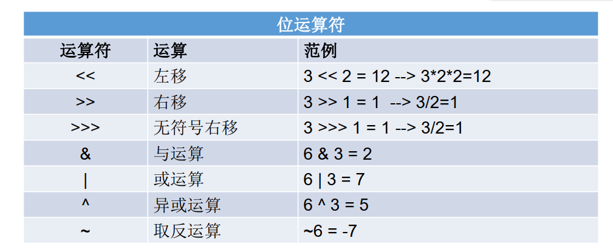

  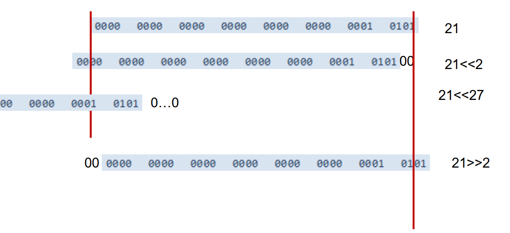

  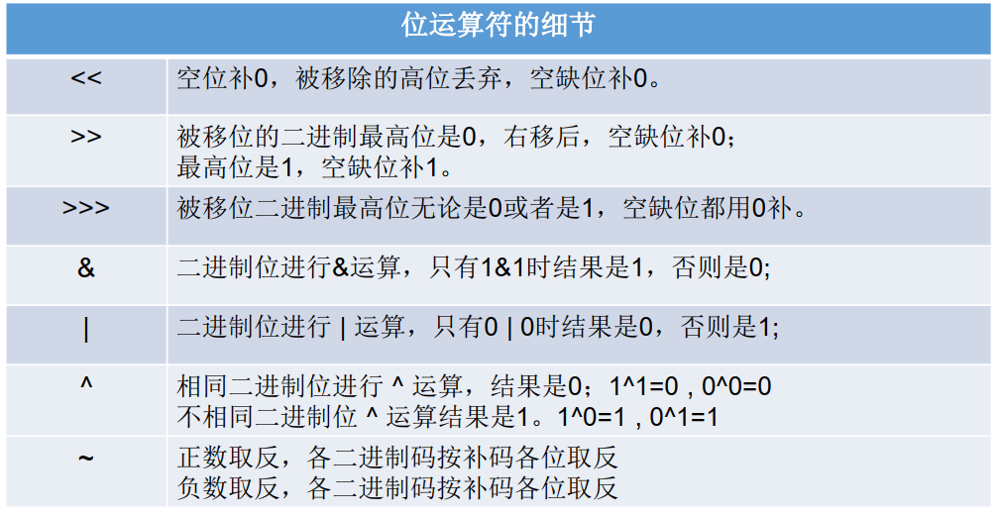

  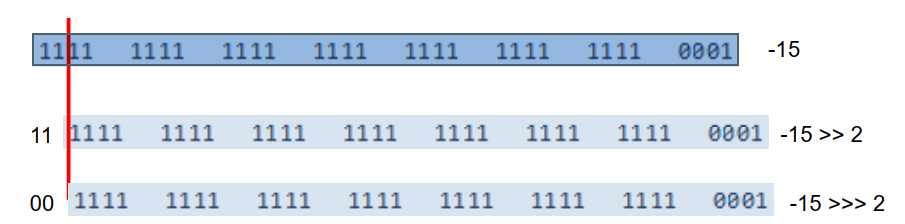

  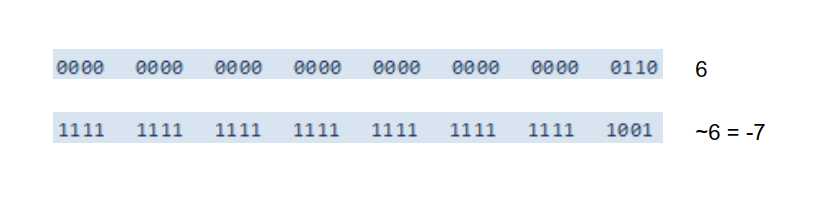

  

  - 位运算是直接对整数的二进制进行的运算
- 每项往左移一位，就\*一个2；右移，除以一个2  21<<2 =84
- 移位运算符的右操作数要完成模32的运算（除非做操作数为long类型，在这种情况下需要对右操作数模64）e.g.1<<35 == 1<<3 or 8
- 负数也一样  -21<<2 = -84
- m = k ^ n = (m ^ n) ^ n = m
- 异或满足交换律和结合律 x^y^x = (x^x)^y = 0^y = y
- 0^N = N, N^N = 0
- 题目：2\*8的最高效实现方式：2<<3 ; 8<<1
  - 三元运算符：
    - n = （条件表达式）？表达式1：表达式2
    - 两个表达式要求是一致的，被赋值的变量要和表达式类型一致
  - 运算符优先级:

  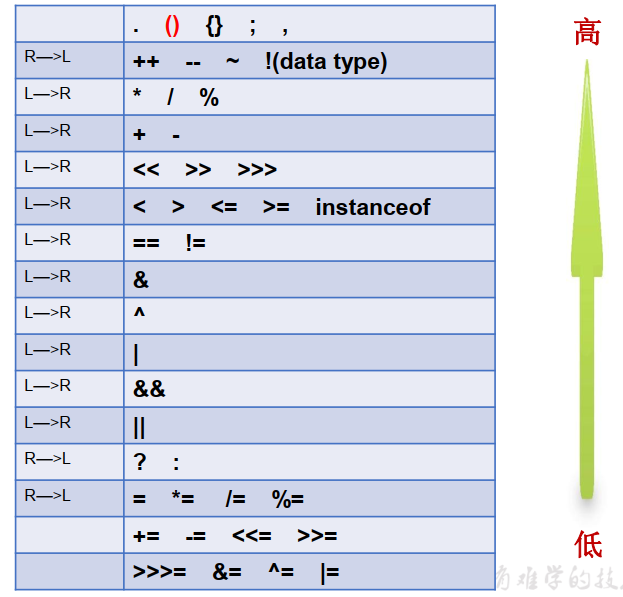


  - 只有单目运算符、三元运算符、赋值运算符是从右向左运算的。

- **从键盘获取不同类型的变量：需要使用Scanner类**
  - 1\. `import java.util.Scanner;`
  - 2\. Scanner的实例化：`Scanner scan = new Scanner(System.in);`
  - 3\. 调用Scanner类的相关方法, 来获取指定类型的变量：`scan.nextInt();scan.nextDouble();`
  - 4\. char没有提供方法，只能获得一个字符串
  - String a = scan.next();
  - char c = a.charAt(index); //获取索引为0位置的字符
  - `string.equals("...")`

- **随机数生成：**
  - Math类中的random方法：Math.random()返回一个\[0.0,1.0)的数
  - 生成\[a,b\]的随机数：(int)(Math.random() \* (b - a + 1) + a)

- **程序流程控制**
  - 顺序结构
    - 定义变量采用合法的前向引用
  - 分支结构
    - if-else
      - 当多个条件是“互斥”关系时，条件判断语句及执行语句间顺序无所谓
      - 当多个条件是“包含”关系时，“小上大下 / 子上父下”
      - if - else : 就近原则
    - switch-case
      - switch(表达式)中表达式的值必须是下述几种类型之一： byte， short，char， int， 枚举 (jdk 5.0)， String (jdk 7.0)；
      - case子句中的值必须是常量
      - 如果没有break，程序会顺序执行到switch结尾
  - 循环结构
    - 初始条件+循环条件+循环体+迭代条件
    - for
      - 初始化部分可以声明多个变量，但必须是同一个类型，用逗号分隔
      - 可以有多个变量更新，用逗号分隔
    - while
      - while(){
      - }
    - Do-while

    ```java
     do{
      Pass;
    }while();
    ```
    * `break` & `continue`
    * 作用在最近的loop
    * 标签:结束特定循环
      ```java
      label：for(;;) {
        for(;;) {
          break label;
          // continue label;
        }
      }
  * return： 结束一个方法，返回特定值 

* 其他method
  * String - readKeyBoard()

## 读取文件

* 需要构造新的Scanner
* `Scanner in = new Scanner(Path.of("file.txt"), standardCharsets.UTF_8)`
* 如果path有反斜杠\需要变成两个\\

## BigInteger & BigDecimal
* 精度不够的替代品，可以处理包含任意长度数字序列的数值
* `BigInteger a = BigInteger.value(100)`
* `BigInteger b = new BigInteger("1234567890")`
* 常量：BigInteger.ZERO BigInteger.ONE等
* 无法使用基本运算符处理IBigInteger，需要使用大数类的add和multiply等
* BigInteger & BigDecimal方法
  * `BigInteger c = a.add(b)`
  * `subtract`
  * `multiply`
  * `divide`
  * `mod`
  * `sqrt`
  * `compareTo`


