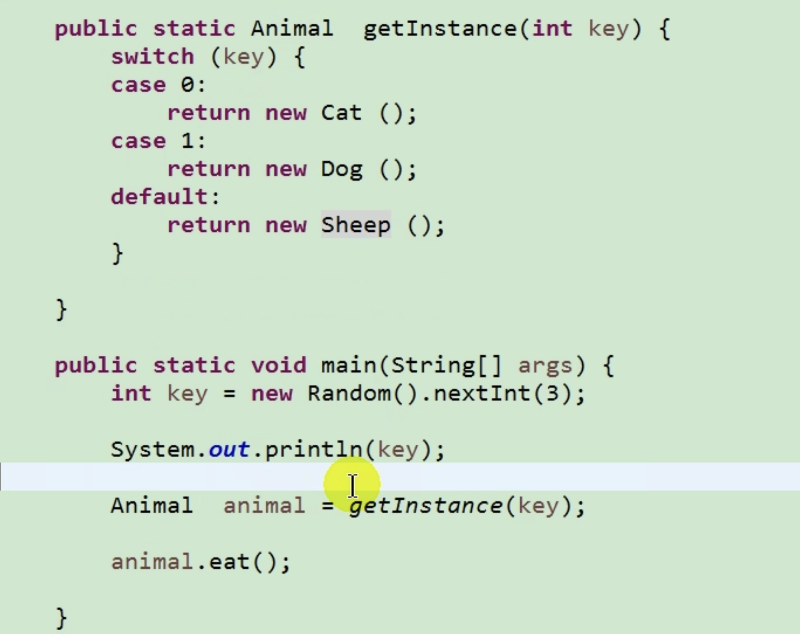
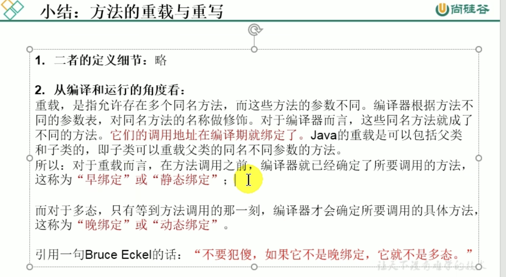
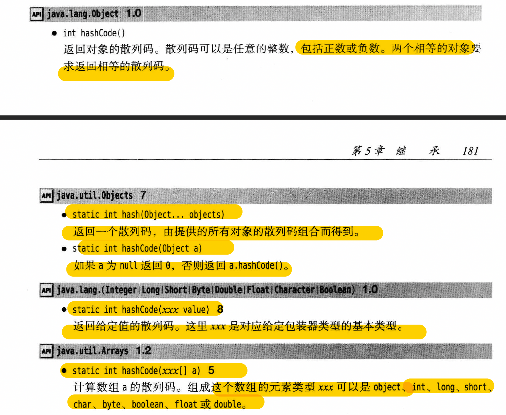

# 第五章 面向对象（中）

## 继承性

* **好处**
  * 减少冗余
  * 便于功能扩展
  * 实现多态性的前提
* **使用**
  * `class A extends B`
  * 子类、派生类、subclass, base class, child class
  * 父类、超类、基类、superclass, derived class, parent class
  * 父类声明的private属性或者方法，子类也获取了，但因为封装性的影响，子类不能直接调用
  * 只能进行单继承或者多层继承
    * 子类对应唯一父类
    * 父类可以有多个子类
  * 所有的类都直接或者间接继承于`java.lang.Objects`类，都具有其功能
  * 继承层次
    * inheritance hierarchy
    * 由父类派生一堆子类的集合
  * 继承链
    * inheritance chain
    * 某个特定的类到其祖先的路径称为该类的继承链
* **重写override/overwrite**
  * @Override
  * 适用于
    * 子类重写父类
    * abstruct class implementing
    * interface implementing
  * 子类使用的方法一定是override之后的，除非使用super，才能使用父类的方法
  * 被重写的方法，返回类型、方法名、形参列表都不变
  * 子类重写方法权限修饰符不小于父类
  * 子类不能修改父类的private方法
  * 如果父类方法返回类型的A，子类重写的话返回值是A或者A的子类
  * 子类throw的exception不大于父类的exception（可以使父类exception的子类）
  * static方法不可重写，要么都设置为非static，要么static但不重写
* **super关键字使用**
  * super调用该子类的父类的方法、字段等
  * 子类本身：this
  * 当this或者super的属性名字一样，可以加this或者super加以区分
  * 如果子类的方法是改写父类的但又想用父类的方法，使用super
  * super调用子类构造器
    * 在子类构造器里，调用父类中声明的指定的构造器
    * **子类的构造过程必须调用super的构造方法**，super(形参列表)使用的时候，**必须在子类构造器的首行**
    * this（形参列表）和super（形参列表）只能二选一
    * 当我们子类构造器的首行，如果没有显示声明，则默认调用父类的空参构造器。如果父类没有空参构造器，子类会报错。
    * 在类的多个构造器中，至少有一个类的构造器中使用super（形参）调用父类中的构造器
    * 在创建子类的对象时，在heap中，就会加载所有父类的声明的属性
    * 子类创建后，一定会直接或者间接调用父类的构造器，进而调用父类的父类的构造器，以此类推，直到能调用到object的空参构造器为止

## 多态性

* 子类对象的多态性，父类引用指向子类的对象
* e.g. `Person p = new Man()`

  使用的时候，Person p调用的方法是Man的方法

  即，当调用子父类同名同参方法，实际执行的是子类重写父类的方法--虚拟方法调用

  但是，如果Man有的方法，Person里面没有，Person没法调用该方法，会报错

* 编译的时候调用左边指定的class（即父类） - 编译状态
* 运行的时候调用右边指定的class（即子类） - 运行状态
* **方法调用**
  * 编译器查看对象的声明类型和方法名
  * 编译器要确定方法调用中的提供的参数类型，存在一个与所提供参数完全匹配的方法就选它 - overloading resolution重载解析
  * 没找到对应方法或者找到了多个方法 - 编译器报错
  * 允许子类将覆盖的方法返回类型变成原返回类型的子类
  * final，private，static方法或者构造器，编译器能快速准确找到（static binding），依赖于隐式参数的实际类型需要dynamic binding
  * 动态绑定时，虚拟机必须调用实际类型的方法
  * 因为以上流程耗时长，一般虚拟机会提前生成每个类的方法表method table，列出所有方法签名和实际方法
* **好处**
  * 比如写一个method，形参是Person，那么调用的时候可以放入Man或者Woman，不需要写重复的method了
* **使用前提：**
  * 继承关系
  * 方法的重写
  * 父类引用指向子类对象
* **对象的多态性，只适用于方法，不适用于属性（编译运行都看左边，即父类）**
* **虚拟方法的调用virtual method invocation**
  * 定义
    * 多态情况下，子类重写父类的方法，此时父类的方法叫做虚拟方法
    * 父类根据赋给的不同子类对象，动态调用属于子类的该方法
    * 该方法在编译器是无法确定的
  * 动态绑定 dynamic binding
    * 一个对象变量可以只是多种实际类型，在运行时能够自动适当选择方法
    * 运行时行为
  ```java
  Person e = new Student();
  e.getInfo();
  // 编译的时候，e为Person类型，方法在运行时确定，所以调用的是Student的getInfo方法 
  ```
  * 证明运行时呈现子类 - 运行时行为
  
  * overload vs overwrite
  
  * 多态性其他性质：
    * 向下转型：使用instanceof（）来判断 - 强制类型转化
    * 向上转型：多态性 - 自动类型转换
  * instanceof()
    * 判断a是否是类A的实例
    * e.g. `a instanceof A`

## 继承设计技巧
* 公共操作和字段放在超类中
* 不要使用受保护的字段
* 有is-a关系再用继承
* 除非所有继承的方法都有意义，否则不要使用继承
* 在覆盖方法时，不要改变预期的行动
* 使用多态，不要使用类型信息
* 不要滥用反射
  * 反射可以使人们在运行时查看字段和方法，但是不适用于编写应用，其很脆弱，编译器无法发现错误，运行的时候才会发现错误并导致异常

## 各种类的使用

### Object

* 所有类的父类
* class位置：jdk -- jre -- lib -- rt.jar -- java -- lang -- Object.class
* 若类没有用extends声明父类，默认extends java.lang.Object
* 所有方法具有通用性
* 有一个空参构造器
* **方法:** 
  * protected Object clone()
  * protected void finalize()
    * 不要主动用，让垃圾回收机制调用
    * 释放某个instance的内存，垃圾回收，释放堆的内存
    * 可以重载
  * 以下方法都是public
  * boolean equals(Object obj)
    * == 和 equals的区别
      * == 运算符：
        * 可以使同在基本数据类型变量以及引用数据类型变量中
        * 但在引用类型比较的时候，比较的是地址值
        * 基本数据类型比较的是保存的数据（不一定类型相同）
      * equals Object方法
        * 只用于引用数据类型
        * Object类中equals()定义和==定义一样，所以使用差不多 - 比较地址值
        * 先调用super的equal，检测失败后，直接false。否则，进入子类的字段比较
        * String、Date、File、包装类等重写了equal的方法，比较的不是地址值，而是比较是否是真的是一类
        * 如果希望自己写的class的equal也能像String一样，需要自己重写override
        * 通常情况，把类型以及里面的fields都比较一下
        * 重写举例
        ```java
        if (this == obj) {
            return true;
        }
        if (obj == null) return false;
        //子类有相同语句，可以改成
        //if (!(other instance of Classname)) return false
        if (getClass() != obj.getClass()) return false;
        //方法一：
        //if (obj instanceof Customer) {
        //    Customer cust = (Customer) obj;
        //    return this.age == cust.age && this.name.equals(cust.name);
        //}
        //return false;
        //方法二：
        Customer other = (Customer) obj;
        if (age != other.age) return false;
        if (name == null) {
            if (other.name != null)
                return false;
        } else if (!name.equals(other.name)) return false;
        return true;
        //其实最好能改用Objects.equals(field, other.field)
        //数组类型：Arrays.equals
        ```
        * 可以自动生成
        * 重写原则
          * 对称性 x = y -> y = x
          * 自反性 x = x
          * 传递性 x = y, y = z -> x = z
          * 一致性 x = y -> x, y不变 -> x = y
          * 任何东西要equal(null)，返回都是false
  * String toString()
    * 当我们输出一个对象的引用时，就是调用tostring方法
    * 可重写
    * 可自动生成
    * 原Object定义：
      * `return getClass().getName()+"@"+Integer.toHexString(hashcode())`
    * String等引用类型都重写了toString
    * 最好把类名部分改成`getClass().getName()`这样子类就不用手动改名字了
    * 子类可以直接`super.toString()`
    * 对象与+连接，就会自动调用toString
    * 可以用`""+x`代替`x.toString()`，x就算是基本类型也能用这个方法
    * println方法自动用tostring
    * 数组的打印用的是Object方法，所以最好调用静态方法`Arrays.toString`
    * 多维数组 - `Arrays.deepToString`
    * `Class getSuperClass()`
      * 返回这个类的超类
  * int hashcode()
    * 导出来哈希值，一个整型值，没有规律
    * 默认的Object方法定义的hashcode是根据地址写的
    * String的hashcode是利用内容导出的，所以相同内容不同地址的hashcode一样
    * equals如果相等，两个物品的hashcode必须相等，所以这两个方法必须相容
    * 相关方法

    
  * getClass()
  * wait()
  * notify()
  * notifyAll()()

