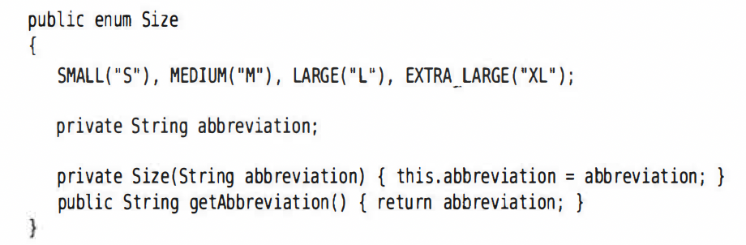

# 第八章 常用类

## String

* java.lang.String - 不可变的字符序列(immutable)
* 构造方法（很多，需要查api）
  * String(String original)
  * String(char[] value)
  * String(char[] value, int offset, int count)
* equals方法重写了，只要内容一样就是true
* 常见方法  
```java
public char charAt(int index)
public int offsetByCodePoints(int start, int cpCount)//返回从startIndex码点开始，cpCount个码点后的码点索引
public int codePointAt(int index) //返回从给定位置开始的码点
public intStream codePoints() //将这个字符串的码点做一个流返回，可以调用 toArray将它们放在一个数组中
new String(int[] codePoints, int offset, int count)//用数组中从offset开始的count个码点构造一个字符串
int codePointCount(int cp, int fromIndex)//返回startIndex和endIndex-1之间的码点个数
boolean empty()
boolea blank() //字符串是否为空或者空格组成
public int length()
public int indexOf(String str)
public int indexOf(String str, int fromIndex)
public int lastIndexOf(String str)
public boolean equalsIgnoreCase(String another) //是否equal，忽略大小写
public String replace(char oldChar, char newChar)
public boolean startsWith(String prefix)
public boolean endsWith(String suffix)
public String toUpperCase()
public String toLowerCase()
public String substring(int beginIndex)
public String substring(int beginIndex, int endIndex)//endIndex不包含
public String trim() //前后的空白符（小于等于U+0020字符）删掉
public String strip() //删除前后空格
//静态重载方法
public static String valueOf() //把其他类型给转换为string，基本类型直接转，Object的子类们则是使用它的toString方法
public String[] split(String regex) //可以将一个字符串按照指定的分隔符分隔，返回分隔后的字符串数组
public String join(String seperator,String args...)
public String repeat(int repeatNumber) //e.g. String repeated = "java".repeat(3) -> javajavajava
```
* 
* 

## 包装类的使用Wrapper
* 八种基本数据类型都有对应的引用类型 - 包装类（封装类） - 首字母大写
* 好处就是可以调用类中的方法，以及Object等super类的方法和属性
* 体现了面向对象
* 数值类还有个superclass叫做Number
* 基本数据类型，包装类，String类的转换
  
  * 基本数据类型->包装类
    * 调用包装类的构造器
    ```java
    Integer in1 = new Integer(10);
    //Integer in1 = new Integer("asd"); -- Wrong
    //Integer in1 = new Integer("123"); is okay
    System.out.printlnb(in1.toString());
    Boolean b = new Boolean("true")
    Boolean b1 = new Boolean("123asd"); //只要不是true，都是false
    ```
  * 包装类 -> 基本数据类型
    * 使用包装类的xxxValue()
    ```java
    Integer in1 = new Integer(12);
    int i = int1.intValue();
    ```
  * 新特性：jdk5.0 -- 自动装箱&自动拆箱
    * 自动装箱 auto-boxing
    ```java
    int num2 = 10;
    Integer in2 = num2;
    ```
    * 自动拆箱 auto-unboxing
    ```java
    int num3 = in2;
    ```
    * 即无需转换，直接用=
    * 基本数据类型，包装类 -> String
      * 连接运算
      ```java
      int num = 10;
      String str1 = num + "";
      String str2 = valueof(num);
      ```
      * 使用String的valueOf(xxx xxx)
      ```java
      String str2 = String.valueOf(num);
      ```
    * String -> 基本数据类型&包装类
      * 可以直接构造器
      * 包装类的parseXxx方法(String)
      ```java
      int num2 = Integer.parseInt("123"); //可能会有numberFormat的问题
      ```

## StringBuffer
* java.lang.StringBuffer代表可变的字符序列
* 与String类似，但可以对字符串进行改变，String不可变
  * 比如你必须删除字符串中的某个字符，String必须截出前后的string，再拼起来，生成的是个new出来的新的string，但stringbuffer可以在原来内存的基础上直接删，不需要其他内存空间
* 构造方法
  * `StringBuffer()` - 不含字符序列的空的对象
  * `StringBuffer(String str)`
* 常用方法
  * `public StringBuffer append(String str)`
  * `insert`
  * `delete`
  * `indexOf`
  * `substring`
  * `length`
  * `reverse`

## StringBuilder
* java.lang.StringBuffer也是可变的字符序列
* 构造方法
  * `StringBuffer()`
  * `StringBuffer(String str)`
* 常用方法
  * `append(str)` or `append(chr)`
  * `delete`
  * `insert`
  * `setCharAt`
  * `appendCodePoint`
* **StringBuilder和StringBuffer的区别**
  * 

## Scanner
* java.util.Scanner
* 里面的方法可以读取输入，与标准输入流System.in相关联
* 构造方法
  * `Scanner in = new Scanner(System in)`
* 方法
  * `String name = in.nextLine()`
  * `nextInt` `nextDouble`
  * `String next()` - 以空白符作为分隔符
  * `boolean hasNext()`
  * `boolean hasNextInt()`
  * `boolean hasNextDouble()`

## Console
* 可以读取密码
* java.io.Console
```java
//static Console console() - java.lang.System
//java.io.Console
Console cons = System.console();
String username = cons.readLine("User name: ");
char[] passwd = cons.readPasssword("Password: "); //为安全起见，存在字符数组中。对密码处理完后，应该马上会用一个填充值覆盖数组元素
```

## Math

* 提供了很多静态方法，参数和返回值大部分是double
* 方法
  * `abs`
  * `acos asin atan cos sin tan`
  * `sqrt`
  * `pow(double a, double b)`
  * `log`
  * `log10`
  * `exp e`
  * `max min`
  * `random 0-1`
  * `long round(double a)` 四舍五入
  * `toDegree(double angrad)` rad - degree
  * `toRadians(double angdeg)` degree - rad
* 常量
  * Math.PI
  * Math.E

## File

* java.io.File，代表系统文件名（路径+文件名）
* 构造方法
  * public File(String pathname) - 以pathname为路径创建File对象，如果pathname是相对路径，默认当前路径在系统属性user.dir中储存
  * public File(String parent, String child) - 以parent为父路径，child为子路径创建File对象
* File静态属性String separator储存了当前系统的路径分隔符
* 方法
  * canRead
  * canWrite
  * exists
  * isDirectory
  * isFile
  * isHidden
  * lastModified return为long 从1970之后的一共的毫秒数
  * length 内容长度
  * getName 拿到文件名
  * getPath 拿到路径 还有一个能拿到绝对路径的（里面加了absolute）
  * createNewFile() throws IOException
  * delete
  * mkdir
  * mkdirs
  * getParentFile - 找父文件夹，不是包文件夹，是包外面那层

# 枚举类 Enumeration

* jang.lang.Enum
* **本质：是一个类，而它里面的元素是这个类的实例，不会再构造出新的对象**
* e.g. `public enum Size{SMALL, MEDIUM, LARGE}`
* example
```java
public enum MyColor {red, green, blue};
MyColor m = Mycolor.red;
MyColor n = null;
```
* 不需要equals, 用==
* 可以有构造器、方法和字段
* 构造器必须是private
  
  e.g.

  

* 所有枚举类型都是Enum类的子类，继承了这个类的很多方法
* `Size.SMALL.toString()` 直接获得字符串SMALL
* static方法 - valueOf  `Size s = Enum.valueOf(Size.class, "SMALL")`
* `Size[] values = Size.values();`该静态方法能返回所有枚举值的数组
* `int ordinal()`

  返回枚举常量在enum中的位置，从0开始
* `int compareTo(E other)`

  根据元素出现在enum里面的次序比大小，越靠前的越小，返回-负整数；相等返回0，大于返回正整数