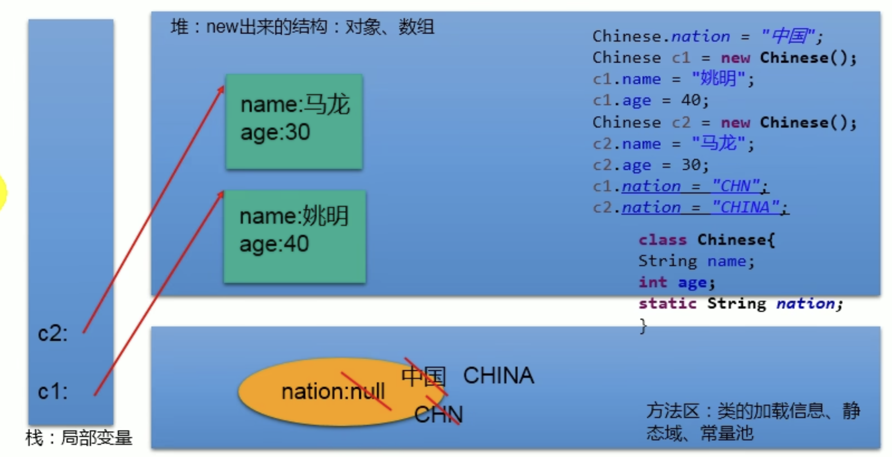
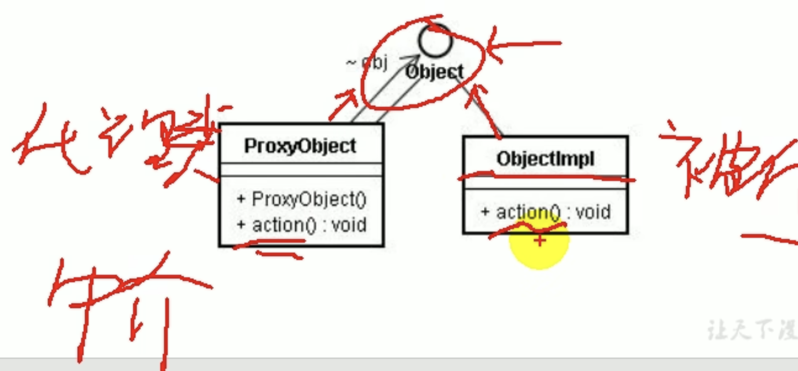
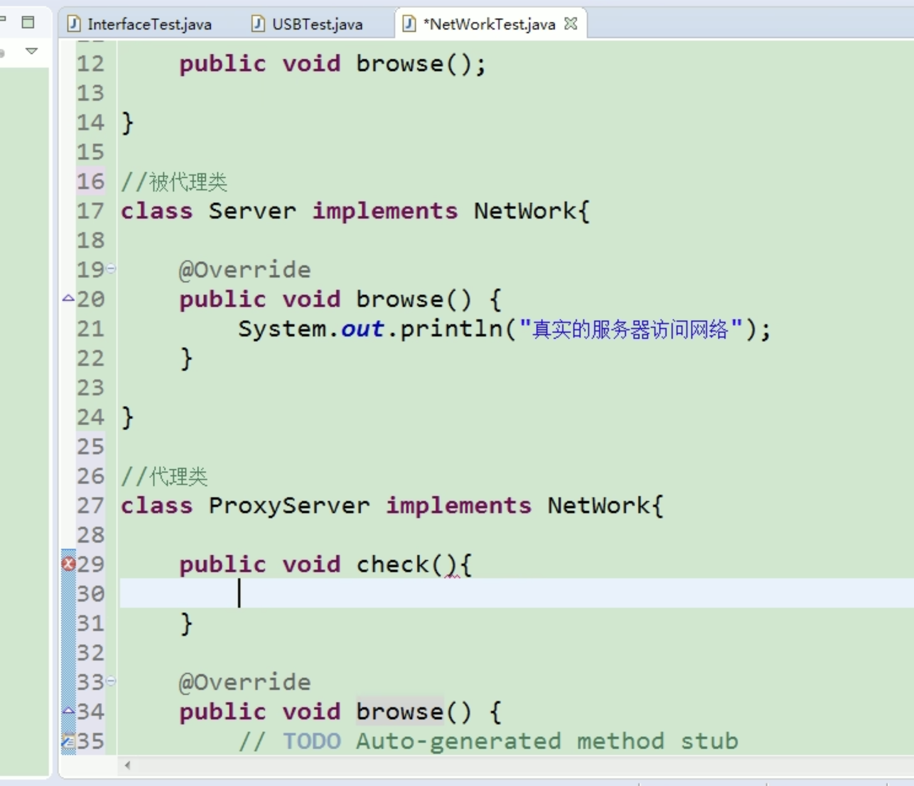
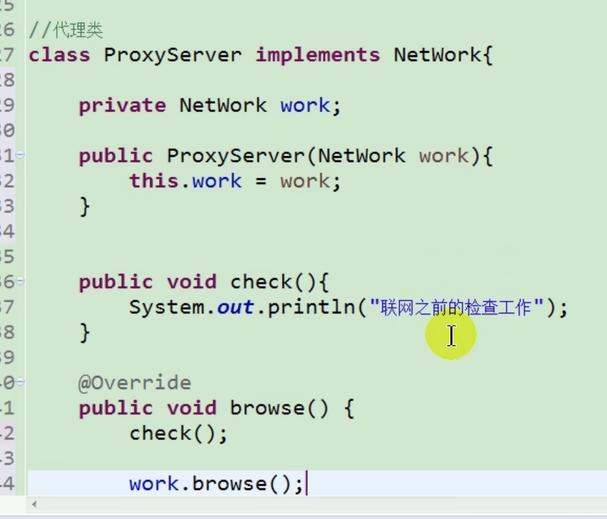

# 第六章 面向对象下

## static关键字

* **定义**
  * 某些特定数据在内存空间只有一份，专属于类的变量、方法、代码块、内部类，不需要new新的instance即可访问或者使用
  * 存在方法区的静态域
* **静态变量**
  * **静态属性 & 非静态属性（实例属性）**
    * 静态属性
      * 创造了类的对象，多个对象共享同一个静态变量，其中一个对象改了静态变量，其他对象静态变量也是修改过的
    * 实际变量
      * 每个对象有独立的一套类中的非静态属性，其他对象不能改其他的对象的非静态属性
  * **static属性其他说明**
    * 静态变量随着类的加载而加载
    * 加载早于对象的创建
  * **举例**
    * `Syetem.out`
    * `Math.PI`
  * **静态变量内存解析**
    
  * **需要用的静态属性的场合**
    * 属性可以被多个对象共享
    * 类中常量
* **静态方法**
  * **调用**
    * `class.staticMethod()`的方式调用
  * **静态方法与非静态方法**
    * 静态方法只能调用静态方法和属性
    * 非静态方法都能调用
  * **注意**
    * 静态方法不能使用this或者super
  * **需要用的静态方法的场合**
    * 工具类方法 - 不需要建立实例，只需要访问方法
    * 操作静态属性或者方法的方法需要设置为static
      * 举例: `Math`
* **单例（Singleton）设计模式**
  * **设计模式**
    * 其实就是编码套路
  * **单例设计模式**
    * 只能存在一个对象实例
    * 构造器需要权限设置private
    * 不能用new产生对象
    * 内部仍可以产生该类的对象，已达到只有一个对象
    * 只能调用该类的静态方法来返回这个实例
  * **如何实现**
    * 饿汉式
    * 懒汉式
  * **举例**
    ```java
    //饿汉式
    class Bank {
        //1.private constructor
        private Bank() {

        }

        //2.内部创建类的对象,必须静态，不然下面的返回方法返回不了
        private static Bank instance = new Bank();

        //3.提供public static方法，返回类对象
        public static Bank getInstance() {
            return instance;
        }
    }
    //懒汉式
    class Order {
        //1. private constructor
        private Order() {

        }

        //2. 声明当前类对象，null, 必须static
        private Order instance = null;

        //3.声明public、static返回当前类对象的方法
        public static Order getInstance() {
            if (instance == null) { //防止建立多个对象
                instance = new Order();
            }
            return instance
        }
    }
    ```
  * **区分**
    * 懒汉式
      * 延迟对象的创建
      * 线程不安全 -> 多线程时需要加强
    * 饿汉式
      * 加载时间变长
      * 线程安全
  * **好处**
    * 只有一个对象，减少消耗
    * 举例：`Runtime`，网站计数器，应用程序日志应用，数据库连接池，读取配置文件的类，Application，windows的Task manager，windows的recycle bin

## main方法
* main方法是程序入口
* 也是一个普通静态方法
* String[] args
  * 存的都是用户在command line传进去的arguments

## 代码块
* 类的成员之一，也叫初始化块
* **作用**
  * 用来初始化类、对象
* 里面可以有输出语句
* **如果修饰，只能static**
  * 静态代码块
    * 随着类的加载而执行 - 一般执行一次
    * 定义多个代码块，按照声明顺序执行
    * 一定是静态代码块先执行，之后是非静态代码块
    * 只能调用静态属性、方法
    * 作用
      * 初始化类的信息 - 静态属性
  * 非静态代码块
    * 随着对象的创建而执行 - 建一个执行一次
    * 按顺序执行
    * 可以调用各种属性和方法
    * 作用
      * 可以给对象的属性初始化
* **举例**
```java
class Person {
    String name;
    int age;

    public Person() {

    }

    public Person(String name, int age) {
        this.name = name;
        this.age = age;
    }

    //static代码块
    static {
        sout("Hello");
    }

    //非静态代码块
    {
        sout("hello non-static");
    }
}
```
* **属性赋值顺序**
  * 默认初始化
  * 显式初始化 / 代码块中赋值(看顺序)
  * 构造器中赋值
  * 对象.属性方式赋值

## final关键字
* 可用来修饰类、方法、变量
* final类
  * 不能被类继承
  * 里面的方法自动变final，除了字段
  * 如果一个方法没有被覆盖并且很短，编译器能进行优化处理 - inlining内联
  * 举例：`String`, `System`, `StringBuffer`类
* final方法
  * 此方法不能被重写
  * 举例：`Object.getClass()`
* final变量
  * 此变量赋值后不能变了
  * 无法用默认初始化和.属性来赋值
  * 常用于全局常量，并且跟随有static


## 抽象类和方法 abstract
* **概念**
  * 子类共享一些方法，但是具体实施不一样都需要override，可以在父类之中写上方法签名都是不implement - abstract class and method
* **抽象类**
  * 不能实例化  
  * 但是抽象类也得有构造器，便于子类对象的实例化调用
  * 可以建立抽象类的引用对象，但里面只能放子类的实例
  * 抽象类一定要提供子类，从而实现子类实例化
  * 抽象类匿名子类
    * 匿名对象
      * e.g. 假设有Student class，`new Student()`就是匿名对象
      * 就是不增加一个引用对象，直接new对象
      * 非匿名对象
        * `Student s = new Student()`
    * 匿名类
      * e.g. 假设Person是抽象类

        ```java
        //创建了一个匿名子类的对象 - p
        Person p = new Person() {
            @Override
            public void eat() {

            }
        }
        //匿名子类的匿名对象
        method1（newPerson(){
            @Override
            public void eat() {

            }
        });
        ```
* **抽象方法**
  * 只有签名，没有方法体
  * 包含抽象方法的类一定是抽象类
  * 抽象类可以没有抽象方法
  * 若子类没有重写父类的所有抽象方法，那么子类也必须是抽象类
* **注意**
  * 不能修饰属性、构造器等结构
  * 不能修饰私有方法和静态方法和final方法
  * abstract都是公共的
* **设计模式 - TemplateMethod模板方法**
  * 整体步骤固定、通用，都在父类中写好，但不确定的部分可以抽象化，由不同子类实现
  * 应用
    * JUnit单元测试
    * Hibernate中模板程序


## Interface

* **理解**
  * java无法实现多重继承，即一个子类继承多个父类
  * interface解决这个问题
  * 接口就是规范，定义一组规则，而不是"is a"关系
  * 接口具体使用，体现多态性
  * 体现面向接口的编程

* **应用**
  * JDBC
  * 代理模式Proxy
    * 使用较多
    * 好处
      * 安全代理
      * 远程代理
      * 延迟加载
    * 分类
      * 静态代理 - 静态定义代理
      * 动态代理 - 动态生成代理
      * jdk自带动态代理，利用反射知识
    * 为其他对象提供一个代理来控制对象的访问

        
        
        
  * 工厂模式
    * 实行了创建者与调用者分离
    * 分类
      * 无工厂模式
      * 简单工厂模式
      * 工厂方法模式
      * 抽象工厂模式

* **如何定义接口**
  * 里面所有方法都是public
  * jdk7以前：只能定义全局常量和抽象方法
    * 全局常量public static final（可省略）
    * 抽象方法public abstract
  * **jdk8: 除以上，还可以定义静态方法和默认方法**
    * 静态方法 - 只能通过接口调用
    * 默认方法 - 建立对象后可以调用接口的默认方法
      * 重写了默认方法后，调用时，仍然调用重写后的方法
  * 如果子类或者实现类继承的父类和实现的接口中声明了同名同参数的方法，那么子类在没有重写此方法的情况下，优先调用父类方法 -- 类优先
  * 如果多个接口有相同名字同参数方法，而有个类实现了这多个接口，那么类如果没有重写方法，会报错 -- 接口冲突 -- 必须重写此方法
  * 调用default方法，如果同时还有一个同名同参数的从父类继承的方法，default方法可以使用`interface.super.method()`调用

    ```java
    interface USB {
        void start();
        public static void method() { //static
            sout("...");
        }
        puvlic default void method2() { //default
            sout(",,,");
        }
    }

    class Flash implements USB {
        @Override
        public void start(){
            ;
        }
    }
    ```

* **接口实现implement**
  * 建立接口后，不能实例化接口
  * 如果一个类全实现了接口方法(implement) - concrete class
  * `class Bullet implements flyable, damage {}`
  * 如果一个类没全部实现接口方法 - abstract class
  * 一个类可以实现多个接口，**用逗号隔开，** 同时还能进行extends一个父类
  * 接口与接口之间可以继承，并且可以多继承
    * e.g. `interfac CC extends BB, AA{}`
  * 可以实现多态性
    * e.g. `USB usb = new Flash();`
  * 创建接口匿名实现类
    * e.g. `USB phone = new USB(){@Override method{}};`
  * 创建接口匿名实现类的匿名对象
    * e.g. `void method(USB usb{......});`

## 内部类

* **理解**
  * 一个部分需要完整结构描述，但是只需要为外部事物服务
  * 讲一个类A声明在类B中，A就是内部类，B是外部类

* **分类**
  * 成员内部类(静态、非静态)
    * 可以定义属性、方法、构造器等
    * 可以被final修饰，即可以不被继承。不使用就可以继承
    * 静态无法调用外部类方法，非静态可以调用外部类方法
      * `Person.this.eat() / eat()`
    * 可以用abstract
    * 可以被static修饰
    * 可以调用外部类结构
    * 可被4种权限修饰
    * 如何实例化成员内部类

        ```java
        Person.Dog dog = new Person.Dog(); //非静态
        Person p = new Person();
        Person.Bird bird = p.new Bird(); //静态
        ```
    * 如何在成员内部类中区别调用外部类的结构

        ```java
        name //形参
        this.name //调用自己的
        Person.this.name //调用外部类的name
        ```
  * 局部内部类（方法，代码块，构造器内）

    ```java
    //返回一个实现了Comparable接口的类的对象
    //方式一
    public Comparable getComparable() {
        //创建一个实现了Comparable接口的类：局部内部李
        class MyComparable implements Comparable {
            @Override
            public int compareTo(Object o) {
                return 0;
            }
        }

        return new MyComparable();
        //方法二
        return new MyComparable() {
            @Override
            public int compareTo() {
                ...
            }
        }
    }
    ```

* **举例**
  ```java
  class Person {
    //成员内部类
    static Class Dog { //静态

    }
    Class Bird { //非静态
        String name;

        public Bird() {

        }
    }

    public void method() { //少见
        //局部内部类
        int num = 10;
        Class Brain {
            //num = 20; 会报错，num必须是final
            //jdk7及以前必须显式声明final
            //jdk8以后可以省略final声明
        }
    }
  }
  ```