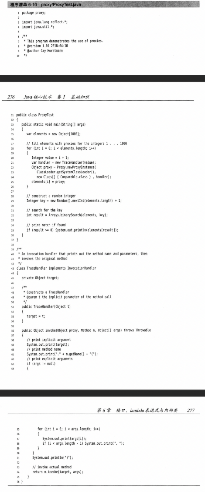

# 第六章 面向对象下

## static关键字

* **定义**
  * 某些特定数据在内存空间只有一份，专属于类的变量、方法、代码块、内部类，不需要new新的instance即可访问或者使用
  * 存在方法区的静态域
* **静态变量**
  * **静态属性 & 非静态属性（实例属性）**
    * 静态属性
      * 创造了类的对象，多个对象共享同一个静态变量，其中一个对象改了静态变量，其他对象静态变量也是修改过的
      * 可以用对象或者类本身调用
    * 实际变量
      * 每个对象有独立的一套类中的非静态属性，其他对象不能改其他的对象的非静态属性
  * **static属性其他说明**
    * 静态变量随着类的加载而加载
    * 加载早于对象的创建
  * **举例**
    * `Syetem.out`
    * `Math.PI`
  * **静态变量内存解析**
    
  * **需要用的静态属性的场合**
    * 属性可以被多个对象共享
    * 类中常量
* **静态方法**
  * **调用**
    * `class.staticMethod()`的方式调用
  * **静态方法与非静态方法**
    * 静态方法只能调用静态方法和属性，因为不会传递给它对象的引用
    * 非静态方法都能调用
  * **注意**
    * 静态方法不能使用this或者super
  * **需要用的静态方法的场合**
    * 工具类方法 - 不需要建立实例，只需要访问方法
    * 操作静态属性或者方法的方法需要设置为static
      * 举例: `Math`
* **单例（Singleton）设计模式**
  * **设计模式**
    * 其实就是编码套路
  * **单例设计模式**
    * 只能存在一个对象实例
    * 构造器需要权限设置private
    * 不能用new产生对象
    * 内部仍可以产生该类的对象，已达到只有一个对象
    * 只能调用该类的静态方法来返回这个实例
  * **如何实现**
    * 饿汉式
    * 懒汉式
  * **举例**
    ```java
    //饿汉式
    class Bank {
        //1.private constructor
        private Bank() {

        }

        //2.内部创建类的对象,必须静态，不然下面的返回方法返回不了
        private static Bank instance = new Bank();

        //3.提供public static方法，返回类对象
        public static Bank getInstance() {
            return instance;
        }
    }
    //懒汉式
    class Order {
        //1. private constructor
        private Order() {

        }

        //2. 声明当前类对象，null, 必须static
        private Order instance = null;

        //3.声明public、static返回当前类对象的方法
        public static Order getInstance() {
            if (instance == null) { //防止建立多个对象
                instance = new Order();
            }
            return instance
        }
    }
    ```
  * **区分**
    * 懒汉式
      * 延迟对象的创建
      * 线程不安全 -> 多线程时需要加强
    * 饿汉式
      * 加载时间变长
      * 线程安全
  * **好处**
    * 只有一个对象，减少消耗
    * 举例：`Runtime`，网站计数器，应用程序日志应用，数据库连接池，读取配置文件的类，Application，windows的Task manager，windows的recycle bin

## main方法
* main方法是程序入口
* 也是一个普通静态方法
* String[] args
  * 存的都是用户在command line传进去的arguments

## 代码块
* 类的成员之一，也叫初始化块
* **作用**
  * 用来初始化类、对象
* 里面可以有输出语句
* **如果修饰，只能static**
  * 静态代码块
    * 随着类的加载而执行 - 一般执行一次
    * 定义多个代码块，按照声明顺序执行
    * 一定是静态代码块先执行，之后是非静态代码块
    * 只能调用静态属性、方法
    * 作用
      * 初始化类的信息 - 静态属性
  * 非静态代码块
    * 随着对象的创建而执行 - 建一个执行一次
    * 按顺序执行
    * 可以调用各种属性和方法
    * 作用
      * 可以给对象的属性初始化
* **举例**
```java
class Person {
    String name;
    int age;

    public Person() {

    }

    public Person(String name, int age) {
        this.name = name;
        this.age = age;
    }

    //static代码块
    static {
        sout("Hello");
    }

    //非静态代码块
    {
        sout("hello non-static");
    }
}
```
* **属性赋值顺序**
  * 默认初始化
  * 显式初始化 / 代码块中赋值(看顺序)
  * 构造器中赋值
  * 对象.属性方式赋值

## final关键字
* 可用来修饰类、方法、变量
* final类
  * 不能被类继承
  * 里面的方法自动变final，除了字段
  * 如果一个方法没有被覆盖并且很短，编译器能进行优化处理 - inlining内联
  * 举例：`String`, `System`, `StringBuffer`类
* final方法
  * 此方法不能被重写
  * 举例：`Object.getClass()`
* final变量
  * 此变量赋值后不能变了
  * 无法用默认初始化和.属性来赋值
  * 常用于全局常量，并且跟随有static
* 有很多核心final class
  * String，Math，etc


## 抽象类和方法 abstract
* **概念**
  * 子类共享一些方法，但是具体实施不一样都需要override，可以在父类之中写上方法签名都是不implement - abstract class and method
* **抽象类**
  * 不能实例化  
  * 但是抽象类也得有构造器，便于子类对象的实例化调用
  * 可以建立抽象类的引用对象，但里面只能放子类的实例
  * 抽象类一定要提供子类，从而实现子类实例化
  * 抽象类匿名子类
    * 匿名对象
      * e.g. 假设有Student class，`new Student()`就是匿名对象
      * 就是不增加一个引用对象，直接new对象
      * 非匿名对象
        * `Student s = new Student()`
    * 匿名类
      * e.g. 假设Person是抽象类

        ```java
        //创建了一个匿名子类的对象 - p
        Person p = new Person() {
            @Override
            public void eat() {

            }
        }
        //匿名子类的匿名对象
        method1（newPerson(){
            @Override
            public void eat() {

            }
        });
        ```
* **抽象方法**
  * 只有签名，没有方法体
  * 包含抽象方法的类一定是抽象类
  * 抽象类可以没有抽象方法
  * 若子类没有重写父类的所有抽象方法，那么子类也必须是抽象类
* **注意**
  * 不能修饰属性、构造器等结构
  * 不能修饰私有方法和静态方法和final方法
  * abstract都是公共的
* **设计模式 - TemplateMethod模板方法**
  * 整体步骤固定、通用，都在父类中写好，但不确定的部分可以抽象化，由不同子类实现
  * 应用
    * JUnit单元测试
    * Hibernate中模板程序


## Interface

* **理解**
  * 抽象方法和常量值的定义的集合，一种特殊的抽象类，无implement
  * `public static final`是成员变量的默认声明,也只能是这个
  * java无法实现多重继承，即一个子类继承多个父类
  * interface解决这个问题
  * 接口就是规范，定义一组规则，而不是"is a"关系
  * 接口具体使用，体现多态性
  * 体现面向接口的编程
  * 多个类可以实现一个接口
  * 一个类可以有多个接口
  * 接口与实现类存在多态性

* **应用**
  * JDBC
  * 代理模式Proxy
    * 使用较多
    * 好处
      * 安全代理
      * 远程代理
      * 延迟加载
    * 分类
      * 静态代理 - 静态定义代理
      * 动态代理 - 动态生成代理
      * jdk自带动态代理，利用反射知识
    * 为其他对象提供一个代理来控制对象的访问

        
        
        
  * 工厂模式
    * 实行了创建者与调用者分离
    * 分类
      * 无工厂模式
      * 简单工厂模式
      * 工厂方法模式
      * 抽象工厂模式

* **如何定义接口**
  * 一般名字是形容词，后缀是-able
  * 里面所有方法都是public
  * jdk7以前：只能定义全局常量和抽象方法
    * 全局常量public static final（可省略）（有的接口甚至只有定义常量）
    * 抽象方法public abstract
  * 可以接成其他的接口，并添加新的属性和抽象方法
  * **jdk8: 除以上，还可以定义静态方法和默认方法，并且静态方法可以private**
    * 静态方法 - 只能通过接口调用 - 可以private
    * 默认方法 - 建立对象后可以调用接口的默认方法 - 必须加default
      * 重写了默认方法后，调用时，仍然调用重写后的方法
      * 默认方法可以为之后实施这个接口的类具有源代码兼容性（source compatible），这个就是接口演化（interface evolution）
    * 经常能看到成对出现的类，比如Collection/Collections,Path/Paths，带s的都是前一个的伴随类，相关静态方法就放在里面
    * 默认方法冲突：如果某个类的接口有默认方法，但超类或者其他接口有一模一样的方法，超类优先，其它接口会冲突
  * 如果子类或者实现类继承的父类和实现的接口中声明了同名同参数的方法，那么子类在没有重写此方法的情况下，优先调用父类方法 -- 类优先
  * 如果多个接口有相同名字同参数方法，而有个类实现了这多个接口，那么类如果没有重写方法，会报错 -- 接口冲突 -- 必须重写此方法
  * 调用default方法，如果同时还有一个同名同参数的从父类继承的方法，default方法可以使用`interface.super.method()`调用

    ```java
    interface USB {
        void start();
        public static void method() { //static
            sout("...");
        }
        puvlic default void method2() { //default
            sout(",,,");
        }
    }

    class Flash implements USB {
        @Override
        public void start(){
            ;
        }
    }
    ```

* **接口实现implement**
  * 建立接口后，不能实例化接口，但是可以声明接口引用变量，引用的必须是实现了接口的类对象
  * `instanceOf`可以检测对象是否实现了某个接口
  * 如果一个类全实现了接口方法(implement) - concrete class
  * `class Bullet implements flyable, damage {}`
  * 如果一个类没全部实现接口方法 - abstract class
  * 一个类可以实现多个接口，**用逗号隔开，** 同时还能进行extends一个父类
  * 接口与接口之间可以继承，并且可以多继承
    * e.g. `interfac CC extends BB, AA{}`
  * 可以实现多态性 - 只展示实现的interface的那部分属性和方法
    * e.g. `USB usb = new Flash();`
  * 创建接口匿名实现类
    * e.g. `USB phone = new USB(){@Override method{}};`
  * 创建接口匿名实现类的匿名对象
    * e.g. `void method(USB usb{......});`
  * 举例
    * 
    * 
      * compareTo方法必须和equals相兼容（BigDecimal没能实现）
      * 如果有一个Manager extends Employee并且Exmployee实现了Comparable,Manager必须重写compareTo方法不然Manager和Exployee比较的话可能需要强制转换,并且违反了反对称规则
      * 如果不同子类中的比较有不同的含义，就应该将属于不同类的对象之间的比较视为非法，可以进行如下检测`if(getClass() != other.getClass()) throw new ClassCastException();`如果存在一个能够比较子类对象的通用算法，可以在超类中提供，并加上final
  * 接口回调（callback）
    * 常见的设计模式，指定事件时发生的动作，比如按下鼠标会发生的动作
    * 代码举例 - 建立一个定时播报器，每秒报一次时间
      * 
      * 
  * 对象clone
    * 使用Cloneable接口，提供了安全的clone方法
    * Object.clone()本身就可以clone，但它是protected，不能直接调用，只能同类克隆自己，并且如果字段不是基本类型或者不可变的引用类型，最终结果它的子对象引用的拷贝还是会指向原来子对象
    * 这个情况就需要implement Cloneable来重新实现clone方法，保证里面的子对象也都克隆一份（depp copy），并且clone方法得是public，它只能克隆它自己的
    * 其实Clonenable是标记接口（tagging），本身没有方法，唯一的作用就是标志是否是能够clone的
    * 就算默认的clone可以满足要求，也得实现Cloneable，clone定义为public，再调用super.clone().如果没实现会抛出CloneNotSupprotedException
    * 因为clone变成了public，要当心子类也能被克隆，子类一些自己的字段不一定能克隆成功（并且如果字段不是基本类型或者不可变的引用类型，最终结果它的子对象引用的拷贝还是会指向原来子对象）
    * 举例
      * 
      * 

## 内部类

* **理解**
  * 一个部分需要完整结构描述，但是只需要为外部事物服务
  * 讲一个类A声明在类B中，A就是内部类，B是外部类
  * 可以访问自己的以及外部的类的数据，包括private
  * 可以对同一包的其他类隐藏
  * 内部类的对象总有一个隐式引用指向外部类，编译器会自动修改内部类构造器往里面加这个隐式引用参数
  * 

* **分类**
  * 成员内部类(静态、非静态)
    * 可以定义属性、方法、构造器等
    * 可以被final修饰，即可以不被继承。不使用就可以继承.static字段必须final
    * 静态无法调用外部类方法，非静态可以调用外部类方法
      * `Person.this.eat() / eat()`
    * 可以用abstract
    * 可以被static修饰
    * 可以调用外部类结构
    * 可被4种权限修饰，其中接口中声明的内部类自动是static public
    * 如何实例化成员内部类

        ```java
        Person.Dog dog = new Person.Dog(); //静态 - 不会拥有外部对象的引用
        Person p = new Person();
        Person.Bird bird = p.new Bird(); //非静态
        ```
    * 如何在成员内部类中区别调用外部类的结构
        ```java
        name //形参
        this.name //调用自己的
        Person.this.name //调用外部类的name，如果名字和自己的不重复其实可以不用加Person.this.
        ```
  * 局部内部类（方法，代码块，构造器内）
    * 不能有访问权限标志，完全隐蔽在{}之中
    * 好处：除了能访问外部类的字段，还能访问局部变量，最终这些局部变量会成为new的内部类的字段部分，从而不需要copy而保住这些外部来的值了
    ```java
    //返回一个实现了Comparable接口的类的对象
    //方式一
    public Comparable getComparable() {
        //创建一个实现了Comparable接口的类：局部内部类
        class MyComparable implements Comparable {
            @Override
            public int compareTo(Object o) {
                return 0;
            }
        }

        return new MyComparable();
        //方法二
        return new MyComparable() {
            @Override
            public int compareTo() {
                ...
            }
        }
    }
    ```
* **举例1**


* 匿名内部类anonymous inner class


* **举例2**
  ```java
  class Person {
    //成员内部类
    static Class Dog { //静态

    }
    Class Bird { //非静态
        String name;

        public Bird() {

        }
    }

    public void method() { //少见
        
        int num = 10;
        Class Brain {
            //num = 20; 会报错，num必须是final
            //jdk7及以前必须显式声明final
            //jdk8以后可以省略final声明
        }
    }
  }
  ```

## lambda表达式

* 引进原因 - 为了能更便利地把某个代码块导入到某个对象里（比如之前的例子定时器就可以用lambda）
* 形式和最新的javascript 6 的函数简便写法类似
* `(Type param1, Type param2, ...) -> {...//表达式}`
* 没有参数 - `() -> {...}`
* 如果能推导参数类型，可以省略参数类型 `Comparator<String> comp = (first, second) -> first.length() - second.length()`
* 如果只有一个参数，可省略括号 - `param -> {...}`
* 无需返回值类型，可自行推导出来
* 如果{}里面只有一句return语句，可以省略{}甚至是return关键字 - `a -> a * a`
* 举例
  * 
* 函数式接口
  * 只有一个抽象方法的接口，当需要这个接口的对象时，可以提供一个lambda表达式，这种接口就是functional interface
  * 举例：`Arrays.sort(Collection, Compartor接口的实例)`，第二个参数是Compartor，只有一个compare方法，所以可以这么写：`Arrays.sort(words, (first, second) -> first.length() - second.length());`
  * 例子解析：底层原理就是接收到了实现这个接口的某个类的对象，并在对象上上嗲用compare方法会执行lambda表达式的体
  * 好处：高效
  * 可以把lambda看做函数，但不像javascript那样能传给某个Object变量
  * java.util.function有很多函数式接口，比如Bifunction<T, U, R>
    * `Predicate<T> {boolean test(T t)}`,ArryaList有一个removeIf的方法参数就是Predicate，可以传lambda - `list.removeIf(e -> e == null)`
    * `Supplier<T> {T get();}`无参数，调用会生成T类型的值，可以用到`Objects.requireNonNullOrElseGet(Object, () -> new ...)`,这样只有需要值的时候才有Supplier生成对象，少占用一些空间

## 方法引用method reference
* 如果一个lambda语句只有return一句其他方法的引用，可以用方法引用代替lambda语句，编译器会生成一个函数式接口的实例，覆盖这份接口的抽象方法来调用给定的方法。它也不是一个对象，变量如果是函数式接口则会生成一个对象
* 举例：
  * `var timer = new Timer(1000, e -> System.out.println(e))` - `var timer = new Timer(1000, System.out::println)`
* 如果选择的方法引用有很多重载方法，选择方法的时候会根据被赋的那个函数式接口来变化，比如对方的接口里面的那个方法只有一个参数，则方法引用选择的方法就是一个参数的那个方法
  * 举例：
  * 
* 形式:`对象或者类名::方法名`
  * object::instanceMethod
    * 等价于给方法传递参数的lambda表达式
  * Class::instanceMethod
    * 第一个参数会变成能隐式参数 - `String::compareToIgnoreCase - (x, y)->x.compareToIgnoreCase(y)`
  * Class:staticMethod
    * 所有参数都传到静态方法上 - `Math::pow - (x, y)->Math.pow(x, y)`
  * 举例
    * 

* 只有lambda只调用一个方法而不作其他操作的时候，才能把其表达式重写为方法引用
* 与等价lambda表达式的细微区别：如果object::method的object是null，方法引用立马抛出异常，但lambda会在调用的时候才抛出异常

## 构造器引用
* 与方法引用类似，只不过方法名字叫做new `e.g. Person::new`
* 用哪个构造器会根据上下文的情况来选
* 可以配合stream使用
```java
ArrayList<String> names = ...;
Stream<Person> stream = names.stream().map(Person::new);
List<Person> people = stream.collect(Collectors.toList());

//or
Person[] people = stream.toArray(Person[]::new);
```

## 变量作用域
* lambda表达式的三部分:代码块，参数，自由变量的值（非参数而且不在代码中定义的变量）
* 自由变量来自外部的话，有可能在外面方法调用很久后才使用lambda，但那个变量已经没有了。所以必须让lambda储存这个来自外面的变量的值，一般就是把它复制过去。术语叫做闭包（closure），lambda表达式就是闭包
* lambda可以获取外围作用域变量的值
* 前提：该值是不可变的，如果在外面会被改变则不合法；必须是事实最终变量(effectively final),也就是不再给它赋上新值。
* lambda与嵌套块有相同的作用域，即不可以声明同名局部变量的参数或者局部变量
* 使用this关键字是同样是指代外面套的那个class

## 处理lambda表达式
* lambda重点：延迟执行（deferred execution）
* 原因：
  * 单独线程运行代码
  * 多次运行代码
  * 在算法的适当位置运行代码
  * 发生某种情况执行代码（点击按钮等）
  * 只在必要时才运行代码
* 例子：
  
* 常用函数式接口

* 基本类型函数式接口

* 注意


## 再谈Comparator

* Comparator有很多静态方法
  * comparing
  * thenComparing
  * 以上两个方法都是放入方法引用
  * 可以用这个进行排序
* 举例：


## 服务加载器

### 一个简单实现加载服务的机制
* 利用ServiceLoader提供一个加载符合公共接口的服务
* 举例：加密服务


实现类可以放在任意包中，不一定是服务接口所在的包，实现类必须有无参数构造器

除了以上的实现类，还可以有多个实现类，然后加载器从中选择

流方法


## 代理proxy

* 适用场合:想构造一个类的对象，其实现了一个或者多个接口，但编译时可能不知道这些接口到底是什么，你又不能实例化接口，所以就需要一个代理类来在运行时创建全新的类，它能实现你指定的接口，所含方法
  * 指定接口所需要的全部方法
  * Object类中的全部方法，例如，toString,equals等
* 但不能运行时为这些方法定义新代码，必须提供一个调用处理器（invocation handler），它实现了`InvocationHandler接口的类的对象Object invoke(Object proxy, Method method, Object[] args)`
无论何时调用代理对象的方法，invoke都会被调用，处理器必须确定如何处理这个调用

* 创建代理对象 - Proxy.newProxyInstance()
  * 一个类加载器class loader
  * Class对象数组，每个元素对应需要实现的各个接口
  * 一个调用处理器
    * 目的：方法调用到路由到远程服务器；用户界面事件和动作关联自来；调试，跟踪方法调用
  * 代码实例：
    * 
* 代理类的特性
  * 代理类一旦被创建其实和一般的类没有区别
  * 所有代理类都扩展了Proxy类，一个代理类只有一个实力字段 - handle
  * override了Object的toString，equals，hashcode方法，这些方法只是调用handle的invoke
  * 没有定义代理类的名字，
  * 对于一个特定类的加载器以及预设的一组接口来说，只能有一个代理类
  * 代理类都是public和final，如果代理类实现了所有接口都是public，这个代理类就不属于任何特定的包，否则所有非公共接口以及这个代理类都必须一个包
* `java.lang.reflect.Proxy`
  * `static Class<?> getProxyClass(ClassLoader loader, Class<?> ... interfaces)` - 返回实现了的指定接口的代理类
  * `static Object newProxyInstance(ClassLoader loader, Class<?>[] interfaces, InvocationHandler handler)` - 构造实现指定接口的代理类的实例，所有方法只调用handle的invoke
  * `static boolean isProxyClass(Class<?> cl)`