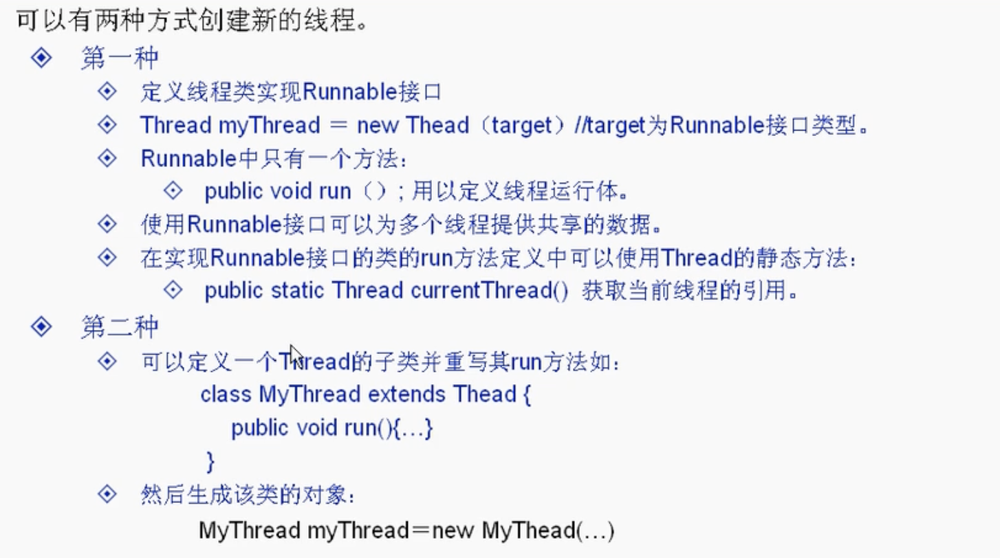
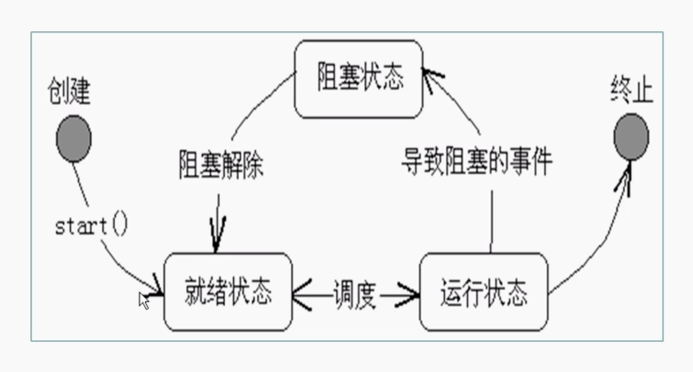
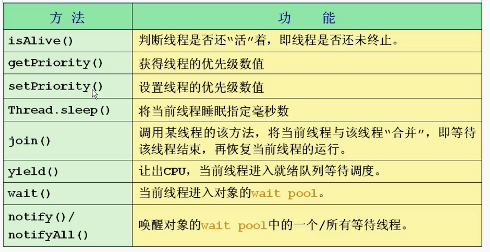
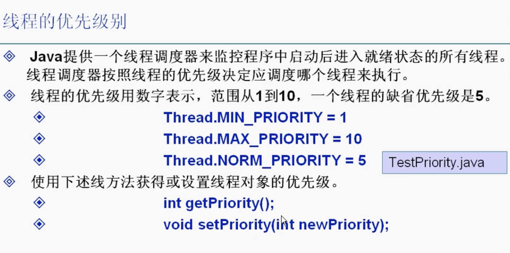
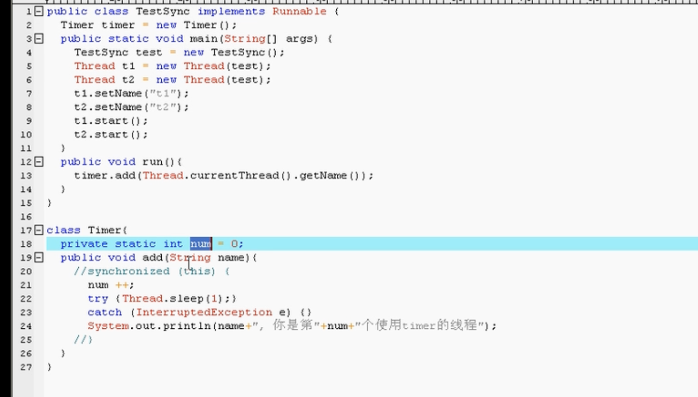
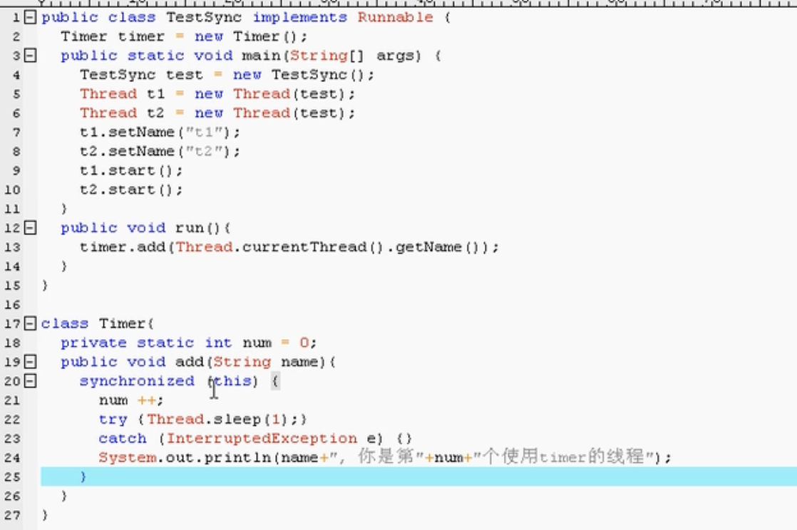
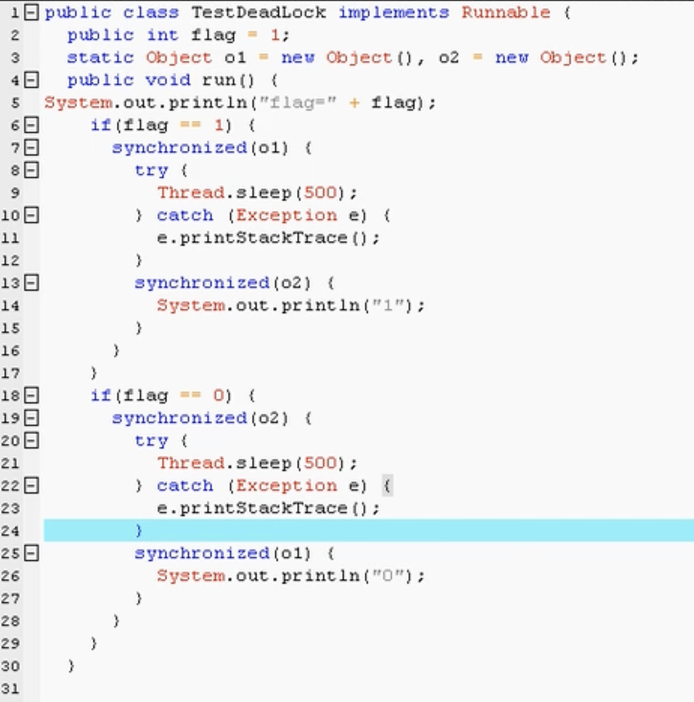

# 第十一章 线程

## 概念
* 线程：**一个程序内部的不同的顺序执行路径（顺序控制流）**。每一个正在执行的分支都是线程。一个进程里面有个主线程（main方法）。可以把它看做轻量级进程。同一类型线程共享代码和数据空间，每个线程有独立的运行栈和程序计数器(PC)，线程切换的开销小。
* 进程：静态的概念，处理资源调度的基本单位，每个核心只能处理一个进程，一个进程执行过程中包含多个线程进行并发执行。每个进程都有独立的代码和数据空间，进程切换会有较大开销。
* 多进程：在操作系统上能同时运行多个任务（程序）
* 多线程：在同一应用程序中有多个顺序流同时运行
* 原理：cpu实际上是把时间弄成碎片，一会儿执行这个线程的一点，一会儿执行那个线程的一点，一直这样交替运行。因为cpu计算速度太快了，所以从人类的角度来看，就好像是多个线程同时运行。**实际上，cpu一个核心每次只能一个线程进行执行**。多个cpu或者cpu是多核的时候才是真正意义上的多线程.
* java线程实现 - java.lang.Thread类
* VM启动时会有一个由主方法所定义的线程
* 可以通过创建Thread的实例来创建新线程
* 每个线程都是通过某个特定Thread对象对应的run()来完成其操作的，方法run被称为线程体 - 在run方法写什么语句就执行什么语句
* 通过调用Thread类的start()方法来启动一个线程

## 线程创建和启动


* 举例
```java
public class TestThread1 {
    public static void main(String args[]) {
        Runner1 r = new Runner1();
        //r.run();
        Thread t = new Thread(r);
        t.start(); //start()让线程开启
        //解释：main一开始正常从上往下执行，但执行到t.start（）的时候，多出了一个分支，也就是runner1开始执行，runner1的执行将会与main往下的代码同时执行，也就是两个for循环同时进行
        //屏幕显示结果:两个for循环交替输出（准确来说就是两个交替上cpu）

        for (int i = 0; i < 100; i++) {
            System.out.println("Main Thread:------" + i);
        }
    }
}

//构造方法一 - 推荐，因为不需要死板继承其他类
class Runner1 implements Runnable {
    public void run() {
        for (int i = 0; i < 100; i++) {
            System.out.println("Runner1: " + i);
        }
    }
}
```
```java
public class TestThread1 {
    public static void main(String args[]) {
        Runner1 t = new Runner1();
        t.start(); //start()让线程开启
        //解释：main一开始正常从上往下执行，但执行到t.start（）的时候，多出了一个分支，也就是runner1开始执行，runner1的执行将会与main往下的代码同时执行，也就是两个for循环同时进行
        //屏幕显示结果:两个for循环交替输出（准确来说就是两个交替上cpu）

        for (int i = 0; i < 100; i++) {
            System.out.println("Main Thread:------" + i);
        }
    }
}

//构造方法二
class Runner2 implements Thread {
    public void run() {
        for (int i = 0; i < 100; i++) {
            System.out.println("Runner1: " + i);
        }
    }
}
```

## 线程状态转换

* 
* run方法结束，线程结束

## 线程控制基本方法

* 

### Sleep方法

* 可以调用Thread的静态方法`public static void sleep(long millis) throws InterruptedException`使得当前线程休眠（暂停millis毫秒）
* 由于静态方法，sleep可以由类名直接调用`Thread.sleep(...)`
* 举例
```java
import java.util.*;
public class TestInterrupt {
    public static void main(String[] args) {
        MyThread thread = new MyThread();
        thread.start();
        try {Thread.sleep(10000);} //main停止十秒，十秒之后（也就是打印了十次时间后）interrupt thread的执行
        catch (InterruptedException e) {}
        thread.interrupt();
        //尽量不要用interrupt（）
    }
}

class MyTread extends Thread {
    public void run() {
        boolean flag = true
        while(flag) {
            System.out.println("===" + new Date() + "===");
            try {
                sleep(1000);
                //每隔一秒打印一次本地现在时间
            } catch (InterruptedException e) {
                return;
            }
        }
    }
}
```

### join方法

* 合并线程
* 举例
```java
import java.util.*;
public class TestJoin {
    public static void main(String[] args) {
        MyThread2 t1 = new MyThread2("abcde");
        t1.start(); //出现分支线程，与main同时进行
        try {
                t1.join(); //本来是同时进行两个线程，但这里t1加入到main线程了，相当于变成了方法调用，先把t1执行完，再执行main
            } catch (InterruptedException e) {
                return;
            }
        for (int i = 1; i<=10; i++) {
                System.out.println("I am main thread");
        }
        
    }
}

class MyTread2 extends Thread {
    MyThread2(String s) {
        super(s);
    }
    public void run() {
            for (int i = 1; i<=10; i++) {
                System.out.println("I am " + getName());
            }
            try {
                sleep(1000); //每十秒打印一次
            } catch (InterruptedException e) {
                return;
            }
        }
 }
```

### yeild方法

* 让出cpu，给其他线程执行的机会
* 举例
```java
import java.util.*;
public class TestYeild {
    public static void main(String[] args) {
       MyThread3 t1 = new MyThread3("t1");
       MyThread3 t2 = new MyThread3("t2");
       t1.start();
       t2.start();
       //每过十个一定换成下一个打印
    }
}

class MyTread3 extends Thread {
    MyThread3(String s) {
        super(s);
    }
    public void run() {
            for (int i = 1; i<=100; i++) {
                System.out.println(getName() + ": " + i);
                if (i%10 == 0) {
                    yield();
                }
            }
            
        }
 }
```

## 线程的优先级


* 优先度高的一般给他分配的cpu使用时间更多，但不代表优先度低的一点没有

## 线程同步

* 两个线程同时访问同一个资源时，协调不好就会出现数据不一致等问题，所以对多个线程访问同一资源的协调就是线程同步
* 举例

  * 执行结果是t1和t2打印出来都是第二个使用timer的线程
  * 首先，t1执行num++，num变成1，然后t1睡眠，t2执行num++，num变成2，t2睡眠，紧接着t1开始打印，打印的就是第2个，紧接着又是t2打印，打印的也是第2个 - 执行过程中被别的线程打断 - 线程不同步
* 解决方法 - synchronized() - 锁定 - 互斥锁 - 保证共享数据操作的完整性，保证列任何时刻，只能有一个线程访问该对象

    * 锁定当前对象 - 使用了this
    * 简洁写法：`public synchronized void add(String name)`之后不用加synchronized(this)
```java
//面试题1：main运行m2到底打出来的b是什么
//打印的是1000。m1只是锁定他里面的三句话，m2只是不能执行这三句话（因为被锁定了），但其他的还是可以访问的
public class TT implements Runnable {
    int b = 100;

    public synchronized void m1() throws Exception {
        b = 1000;
        Thread.sleep(5000);
        System.out.println("b = " + b);
    }

    public void m2() {
        System.out.println(b);
    }

    public void run() {
        try {
            m1();
        } catch (Exception e) {
            e.printStackTrace();
        }
    }

    public static void main(String[] args) {
        TT tt = new TT();
        Thread t = new Thread(tt);
        t.start();

        Thread.sleep(1000);
        tt.m2();
    }
}
```
```java
//面试题2：main运行m2到底打出来的b是什么
//打印的是2000。m1只是锁定他里面的三句话，m2只是不能执行这三句话（因为被锁定了），但其他的还是可以访问的
//如果给m2也上锁，最终打印的是1000，但实际上最终b = 2000
//如果要保证线程安全，一定要把需要锁定的方法都考虑上，保证只有一个方法访问对象，加了同步效率会变慢，但数据能够同步
public class TT implements Runnable {
    int b = 100;

    public synchronized void m1() throws Exception {
        b = 1000;
        Thread.sleep(5000);
        System.out.println("b = " + b);
    }

    public void m2() throws Exception {
        Thread.sleep(2500);
        b = 2000;
    }

    public void run() {
        try {
            m1();
        } catch (Exception e) {
            e.printStackTrace();
        }
    }

    public static void main(String[] args) {
        TT tt = new TT();
        Thread t = new Thread(tt);
        t.start();

        Thread.sleep(1000);
        tt.m2();
    }
}
```
* 死锁 - deadlock
  * 两个线程同时运行，各锁定了一个对象，执行过程中都必须继续访问对方的那个对象才能继续进行，但对方的对象都锁住了，所以就成了死局，两个进程都无法进行下去
  * 举例

  * 解决方法：尽量执行过程中只锁一个对象，而不是两个以上，或者锁的方法变大
* 生产者消费者问题代码举例
```java
//一个桶，有很多人往里面不断放，有很多人往外不断拿
//运行结果：生产消费交替进行，一共二十个窝窝头生产一个消费一个
public class ProducerConsumer {
    public static void main(String[] args) {
        SyncStack ss = new SyncStack();
        Producer p = new Producer(ss);
        Consumer c = new Consumer(ss);
        new Thread(p).start();
        new Thread(c).start();
        //可以继续添加消费者或者生产者
    }
}

//窝窝头
class WoTou {
    int id;
    WoTou(int id) {
        this.id = id;
    }

    public String toString() {
        return "Wotou: " + this.id;
    }
}

//篮子，用stack存
class SyncStack {
    int index = 0;
    WoTou[] arrWT = new WoTou[6];

    //用synchronized来防止多人访问这个stack时候出现数据不同步
    public synchronized void push(WoTou wt) {
        while (index == arrWT.length) {
            //只有锁定了才能wait
            //wait之后必须叫醒，不然无法继续运行
            //意思是这个stack满了，必须等consumer消费一些后才能继续生产
            try {
                this.wait();
            } catch (InterruptedException e) {
                e.printStackTrace();
            }    
        }
        this.notify(); //叫醒正在wait的线程
        arrWT[index] = wt;
        index++;
    }

    public synchronized WoTou pop() {
        //没有了必须等着生产者生产
        while (index == 0) {
            try {
                this.wait();
            } catch (InterruptedException e) {
                e.printStackTrace();
            } 
        }
        this.notify();
        index--;
        return arrWT[index];
    }
}

//生产者
class Producer implements Runnable {
    SyncStack ss = null;
    Producer(SyncStack ss) {
        this.ss = ss;
    }

    public void run(){
        for (int i=0; i<20; i++) {
            Wotou wt = new Wotou(i);
            ss.push(wt);
            System.out.println("Produce: " + wt);
            try {
                Thread.sleep(（int）random() * 1000);
            } catch (InterruptedException e) {
                e.printStackTrace();
            } 
        }
    }
}

//消费者
class Consumer implements Runnable {
    SyncStack ss = null;
    Consumer(SyncStack ss) {
        this.ss = ss;
    }

    public void run(){
        for (int i=0; i<20; i++) {
            Wutou wt =  ss.pop();
            System.out.println("Consume: " + wt);
            try {
                Thread.sleep(（int）random() * 1000);
            } catch (InterruptedException e) {
                e.printStackTrace();
            } 
        }
    }
}
```
* sleep和wait的区别
  * wait（以及notify）属于Object的方法
  * wait时别的线程可以访问锁定对象
  * sleep属于Thread的方法
  * 调用wait的时候必须锁定该对象
  * sleep的时候别的线程也不可以访问锁定对象