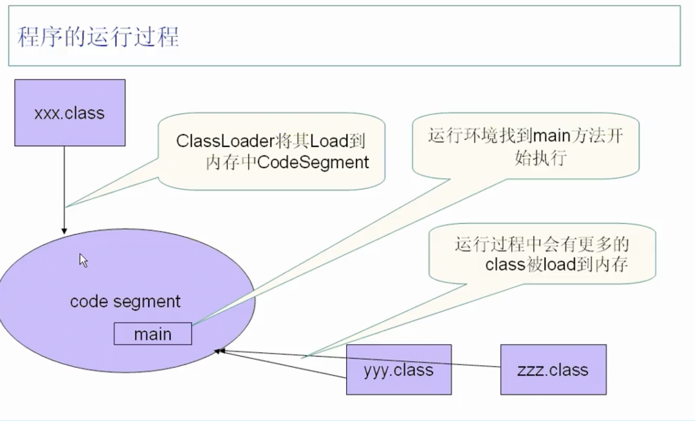
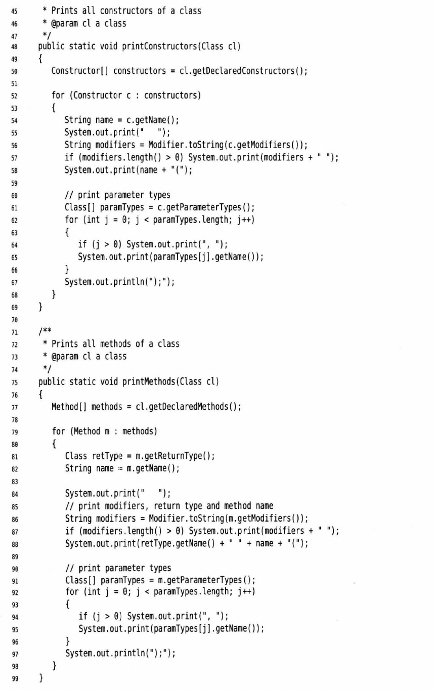

# 第十三章 反射


## ClassLoader
* ClassLoader：把class加载到内存中



* bootstrap class loader是最顶层，一般用c语言之类的写的
  * 调用: `*.class.getClassLoader()`
* extention class loader 是扩展类
    * `*.class.getClassLoader().getClass().getName()`
* Application class loader
    * `ClassLoader.getSystemClassLoader()`
* ClassLoader层次关系：

  * 每个classloader里面有一个引用都是指向上一层的classloader
  * 可以打印出来
```java
ClassLoder c = JDKClassLoaderTest.class.getClassLoader();
while (c != null) {
    System.out.println(c.getClass().getName());
    c = c.getParent();
}
```

## 反射Reflection
* 编写能够动态操纵java代码的程序
* 能够分析类能力的程序称为反射
* 一个class里面的方法属于对象，属性也属于对象
* `java.lang.reflect.Field` `java.lang.reflect.Method`
* Class类
  * java运行时为所有对象维护一个运行时类型标识，会跟踪每个对象所属的类，虚拟机利用这个信息选择正确方法执行
  * 保存这些信息的类名字叫Class,Object类中的getClass()会返回一个Class的实例`Class c = e.getClass`
  * Class会描述一个特定class的属性
  * 常见方法：
    * getName - 获取class的名字，如果class在一个包里，会把包括包名的完全限定名称打出来比如`java.util.Random`
    * Class.forName(className) - 或者某个类的Class实例
      * className如果是string，这个字符串会在运行时变化，可以使用这个方法；如果是类名或者接口名，这个方法也可以正常执行，否则会抛出异常checked Exception
      * 该方法抛出异常，可以throws ReflectiveOperationException
    * 更快捷的获得Class的方法 - 类.class
      * `Class c = Random.class;  Class c1 = int.class; class c2 = Double[].class;`
      * 注意：Class实际上表示的是一个类型，可能是基本类型也可能是引用类型
    * Constructor getConstructor() - 获得Class的构造器，返回的是一个Constructor类型
      * Constructor.newInstance(Object .. params)可以构造实例
      * 如果没有无参数构造器，getConstructor会抛异常
      * newInstance出现的异常全部包装进一个InvocationTargetException中
  * 其中Class是个泛型类，真正的写法是`Random.class -> Class<Random>`
  * 虚拟机对每个类型管理唯一的Class对象，所以比较的时候直接用==，并且子类将与父类不相等
* 资源
  * 类的关联文件（比如图像声音文件，包含消息字符串和按钮标签的文本文件）
  * Class类提供了一个服务可以查找资源文件
    * 首先必须有个Class对象
    * 有些方法，可以接受资源位置的url - `URL getResource(String name)`（找到与类同位置的资源，返回一个可以用来加载资源的url,若没有资源返回null）
    * 否则，使用`InputStream getResourceAsStream(String name)`方法得到一个输入流来读取文件中的数据（找到与类同位置的资源，返回一个可以用来加载资源的输入流,若没有资源返回null）
  * java虚拟机知道如何查找一个类，所以能搜索相同位置上的关联资源（比如把.class文件和对应图片放在同一目录下），也可以放别的位置，提供相对路径或者绝对路径都可以
  * 文件自动装载是利用资源加载特性完成的，没有标准方法解释资源内容，每个程序需要定义自己的方法
  * 
* 利用反射分析类的能力
  * java.lang.reflect - Field, Method, Constructor, Modifier...
  * Field
    * getName
    * getType - 返回字段类型的一个对象，为Class类
    * getModifiers - 返回一个整数，用不同的0/1位描述使用的修饰符，比如public，static
  * Method
    * getName
    * getReturnType
    * getModifiers
    * getParameterTypes
  * Constructor
    * getName
    * getType
    * getModifiers
    * getParameterTypes - return Class[]
  * Modifier
    * 有个静态方法，可以分析getModifiers,isPublic灯返回的那个整数
    * isPublic
    * isPrivate
    * isFinal
    * isAbstract
    * isInterface
    * isNative
    * isProtected
    * isStatic
    * isStrict
    * isSynchronized
    * isVolatile
    * toString - 打印修饰符
  * 以上三个共同方法
    * Class getDeclaringClass
    * Class[] getExceptionTypes
  * Class
    * getFields
    * getMethods
    * getConstructors
    * getSuperclass
    * getPackageName
    * 以上方法返回的是对应类的数组，其中包括super类的公共成员
    * getDeclareFields, getDeclareMethods, getDeclaredConstructors返回类中声明的全部fields，methods，constructors的数组，包括私有成员，包成员，受保护成员，但不包括超类成员
  * 代码举例
    * 
    * 
    * 
    * 
* 使用反射在运行时分析对象
  * 可以查询编译时还不知道的对象字段
  * Field
    * get()
    * f为Field类型的对象，obj为包含f字段的类的对象，f.get(obj)获得一个Object对象，值就是obj那个对应字段值
    * f.set(obj, value)可以为obj设定值
    * 
        其实上面的例子不对，field里面的值如果是private是不能直接get和set的，只能获得对应的Field。除非调用`f.setAccessible(true)`来覆盖java的访问控制
    * setAccessible方法是AccessibleObject类中的一个方法，是Field、Method、Constructor类的公共超类，这个特性是为了调试、持久存储和类似机制提供的。如果不允许访问，setAccessible会抛出异常`IllegalAccessException`
    * boolean trySetAccessible()为这个可访问的对象设置可访问标志，拒绝访问就返回false
    * boolean isAccessible()得到这个可访问对象的可访问标志值
    * static void setAccessible(AccessibleObject[] array. boolean flag),用于设置一个对象数组的可访问标志
  * 利用以上特性写一个通用toString方法
    * 
    * 
    * 
* 利用反射编写泛型数组代码
  * 
  * 
* 调用任意方法和构造器
  * Method - `public Object invoke(Object implicitParam, Object[] explicitParam)`
    * 可以运行Method方法，给定隐形参数和现行参数即可，如果是static方法可以在隐形参数那里放null
    * 返回类型是基本类型的话，会自动装箱
    * 得到Method的方法
      * getDeclareMethod()
      * getMethod(String name, Class ... paramterTypes)
  * Constructor同理
    * c.newInstance(param)
  * 举例
    * 
    * 
  * 
* 代码举例
```java
public class TestReflection throws ClassNotDoundException, InstantiationException, IlligalAccessException, IllegalArgumentException{
    public static void main(String[] args) {
        String str = "T";
        try {
            //动态调用class
            Class c = Class.ForName(str);
            //动态建立一个对象
            Object o = c.newInstance();
            //动态获取这个类的方法
            Method[] methods = c.getMethods();
            //遍历该方法
            for(Method m : methods) {
                System.out.println(m.getName());
                if(m.getName().equals("mm")) {
                    //invoke该方法，必须传一个该对象进去
                    m.invoke(o);
                    //invoke是个可变参数方法 - invoke(Object o, Object... args)
                }
                if(m.getName.equals("m1")) {
                    m.invoke(o, 1);
                    // m.getParameterTypes();
                }
            }
        } catch (ClassNotFoundException e) {
            e.printStackTrace();
        }
        
    }
}

class T {
    static {
        System.out.println("T loaded");
    }
    public T() {
        System.out.println("T constructed");
    }

    int i;
    String s;
    public void m1(int i) {
        this.i = i;
        System.out.println(i);
    }

    public void mm() {
        System.out.println("m invoked");
    }

    public String getS() {
        return s;
    }
}
```
建立一个test.properties
```
Class=T
把这句话读取出来生成一个T
```
* 反射定义：通过反射接口，可以动态地了解一个class的内部结构，并且根据这个内部结构，来决定如何调用class
* 运行期间，动态地加载一个类进来，动态地new一个对象出来，动态地了解一个对象内部的结构，动态地调用这个对象的一些方法，可以查一个方法有几个参数，可以查到它的return类型等等
* 好处：配置文件比如properties，直接写个类名进去，之后就可以动态加载了。这样可拓展性增加

## 代码示例
```java
//封装打折策略
public class Order {
    private String productName = null;
    private int count = 0;
    private int unitPrice = 0;
    //假设都有get和set方法，这里懒得写了

    // private double discount = 1.0; // 这个太死板了，相当于定死，没法设计复杂的打折策略

    public int getTotalPrice() {
        return count * unitPrice;
    }

    @Override
    public String toString() {
        return productName + "-" + getTotalPrice();
    }


    public static void main(String[] args) {
        Order o = new Order();
        o.setProductName("apple");
        o.setCount(10);
        o.setUnitPrice(2);
        System.out.println(o);
    }
}
```


