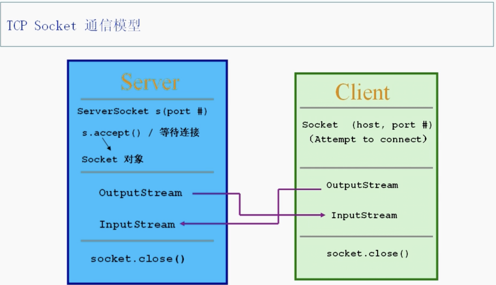

# 第十二章 网络编程

## 网络基本概念

* 计算机网络：不同区域计算机一级专门外部设备用通信线路连成一个规模大、功能强的网络系统，从而多个计算机可以传信息，共享硬件软件数据信息等资源
* 网络通信协议以及接口：计算机网络中实现通信必须有一些约定即通信协议，对速率、传输代码、代码结构、传输控制步骤、出错控制等制定标准
* 网络通信接口：为了使两个接点之间能进行对话，必须在他们之间建立通信工具（接口），从而能进行信息交换。接口有两部分：
  * 硬件装置：实现接口之间的信息传送
  * 软件装置：规定双方进行通信的约定协议
* 通信协议分层


* 物理层 + 网络层（ip层） + 传输层 + 应用层
  * 软件编程就是编写应用层的软件，与传输层打交道
* 数据封装

* 数据拆封

* ip协议
  * Internet Protocol - 网络层主要协议，支持网间互连的数据报通信
  * 主要功能：
    * 无连接数据报传送
    * 数据报路由选择和差错控制
  * 最大贡献 - 提供了独一无二的ip地址，每个机器有自己的ip地址
    * ipv4 - 四个字节表示ip地址，每个字节一段，所以每一段都不会超过255 - 只能表示4亿多个电脑
    * ipv6 - 八个字节
    * 
      * 前面一个网络ip的是a类网，后面还有三个字节，可分配主机最多
      * 前面两个网络ip的是b类网
      * 前面三个网络ip的是c类网，只能连256台电脑
        * 不够的时候，可以采用内网机制，每个子电脑陪虚假ip（内网ip、子ip）连到同一个真实ip电脑上
        * 还想要分成子网：不同子网要通信则需要网关。配子网ip的时候有个东西叫做子网掩码 - 比如常见的255.255.255.0（具体数据用二进制表示） - 凡是1的就是网络ip，凡是0的就是主机ip。可以把其中4位是1，剩下4位可以继续配子网ip。前面网络ip一致的，都是同一个子网内，主机之间可以访问
        * 网关概念：一遍连着内网一遍连着另一个出口
* TCP协议和UDP协议
  * 这两个属于同一层，都是ip的基础之上，都有独一无二的地址后就可以通话了，这两个协议就是通话方式协议
  
  * tcp有建立一个连接通道，一个发信息了，另一个接受了要有回应；发多条消息一定有先后顺序。所以是可靠的。但效率低。
  * udp发消息了，只管消息发出了，不会在乎对方回不回应或者有没有接收到，所以不可靠。类似发电报。效率高。

## TCP程序 - Socket - 插座
* 概念

* ServerSocket是tcp插座，属于server端；Socket属于client端 - 只有tcp会分server和client
* port number:区分电脑上不同程序入口，也就是区分电脑上不同的应用程序 
  * 最多一台电脑有65536个端口（32位电脑）
  * 有些应用程序可以占多个端口号
  * 有些端口已经被重要的系统应用征用了，比如1024以前的，尽量不要调用
  * 有tcp端口和udp端口之分，各有六万多个，分开的
* Socket通信模型
  * 
  * 建好连接后，可以通过流来进行对话
  * 举例
```java
//Server
//server和client一起写，运行的时候先运行server在运行client
import java.net.*;
import java.io.*;

public class TCPServer {
    public static void main(String[] args) throws Exception {
        //6666端口被监听
        ServerSocket ss = new ServerSocket(6666);
        //多个client申请连接这个server，想连接需要server接受才可以，一旦接受了就建立一个socket来与client连接
        while(true) {
            Socket s = ss.accept();
            //accept方法是阻塞式，如果没有client连接上去就一直僵持在那里
            //拿到输入流并加上处理流
            DataInputStream dis = new DataInputStream(s.getInputStream());
            System.out.println(dis.readUTF());//readUTF也是阻塞式的
            dis.close();
            s.close();
            // System.out.println("A client cennects!");
        }
        
    }
}
```
```java
//Client
//server和client一起写，运行的时候先运行server在运行client
import java.net.*;
import java.io.*;

public class TCPClient throws Exception{
    public static void main(String[] args){
        //127.0.0.1是本地ip,也就是连上自己的机器
        //指定连接到server的6666端口
        //client的端口是随机的
        Socket s = new Socket("127.0.0.1", 6666);
        //拿到输出流
        OutputStream os = s.getOutputStream();
        //包一层处理流管道
        DataOutputStream dos = new DataOutputStream(os);
        dos.writeUTF("hello server!");
        dos.flush();
        dos.close();
        s.close();
        
    }
} //先运行server，再运行client，server才会打印
//如果client加了sleep在睡眠中，其他client运行的时候没法连接到server
```
* Socket方法：
  * getInetAddress()：拿到客户端ip地址
  * getPort()：拿到端口

## UDP程序
* 不可靠，效率高，数据报（音频、视频。。。），非连接
* 不区分client和server
* 有socket，但是无线连接 - DatagramPacket & DatagramSocket
* 举例
```java
import java.net.*;
import java.io.*;

public class TestUDPServer {
    public static void main(String args[]) throws Exception {
        byte buf[] = new byte[1024];
        //建一个数据报，用来存接受的数据，划分的区域就是上面的buf，全部用来储存数据
        DatagramPacket dp = new DatagramPacket(buf, buf.length);
        DatagramSocket ds = new DatagramSocket(5678);
        while (true) {
            //扔到建好的dp，receive属于阻塞式
            ds.receive(dp);
            ByteArrayInputStream bais = new ByteArrayInputStream(buf);
            DataInputStream dis = new DataInputStream(basi);
            // System.out.println(new String(buf, 0, dp.getLength()));
            System.out.println(dis.readLong());
        }
    }
}
```
```java
import java.net.*;

public class TestUDPClient {
    public static void main(String args[]) throws Exception {
        // byte buf[] = (new String("Hello")).getBytes();
        long n = 10000L;
        ByteArrayOutputStream baos = new ByteArrayOutputStream();
        DataOutputStream dos = new DataOutputStream(baos);
        dos.writeLong(n);
        byte[] buf = baos.toByteArray();

        DatagramPacket dp = new DatagramPacket(buf, buf.length, new InetSocketAddress("127.0.0.1", 5678));
        DatagramSocket ds = new DatagramSocket(9999);
        ds.send(dp);
        ds.close();
        
    }
}
```

