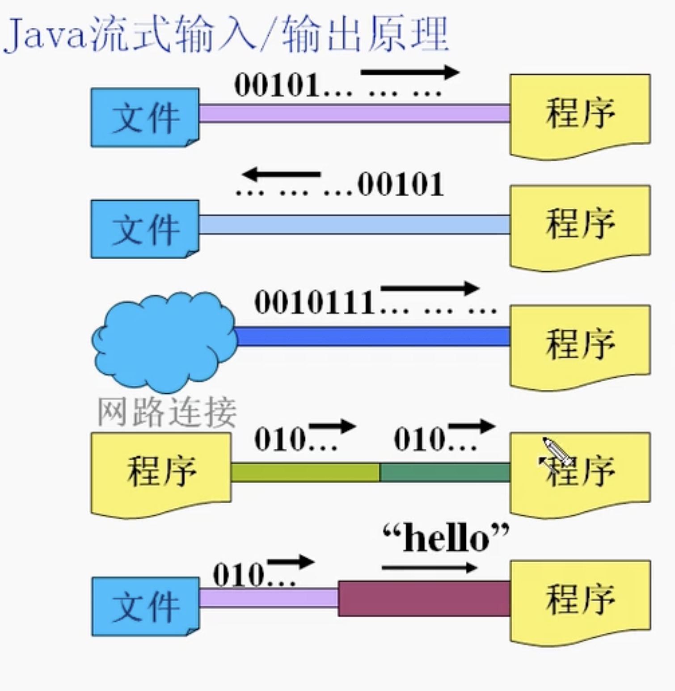
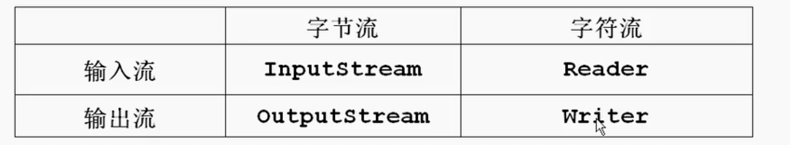
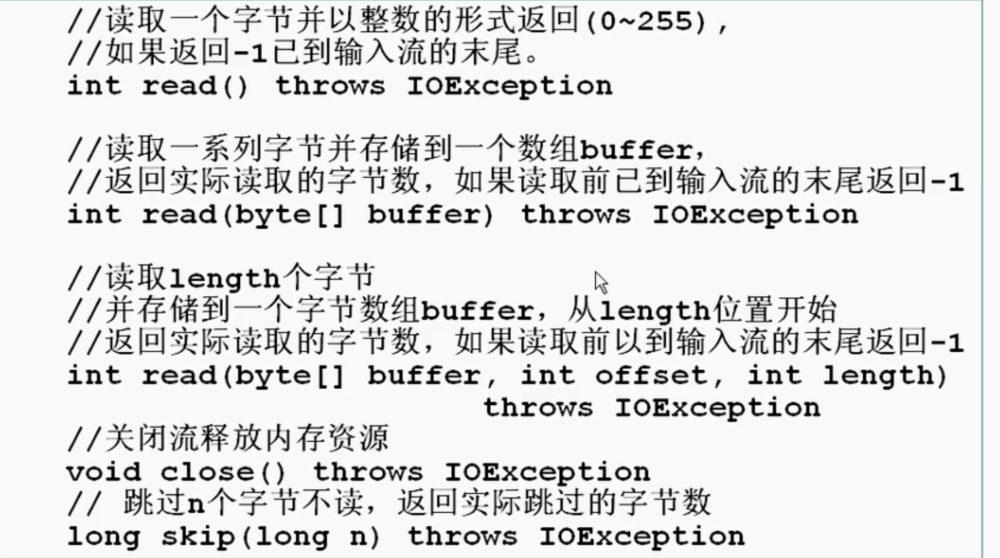
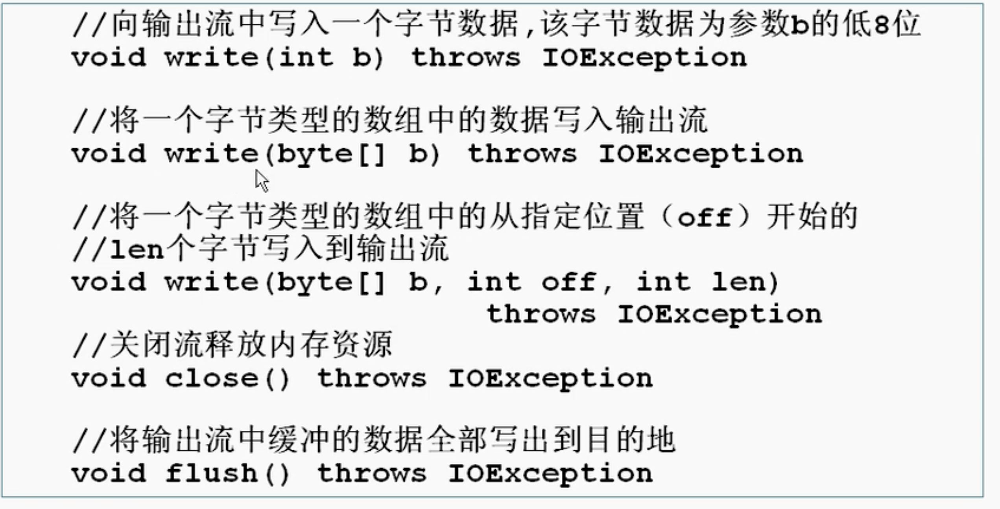
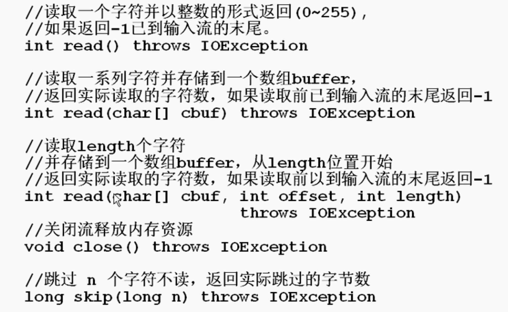
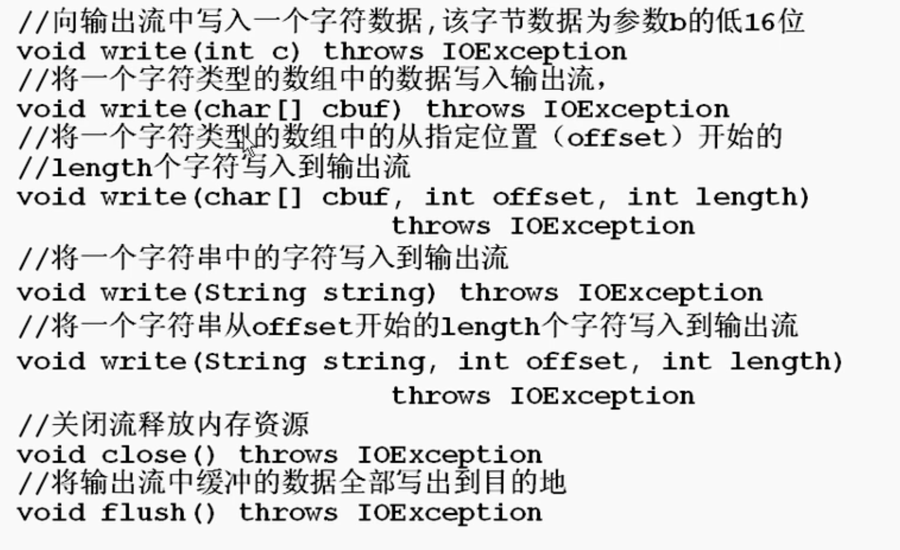
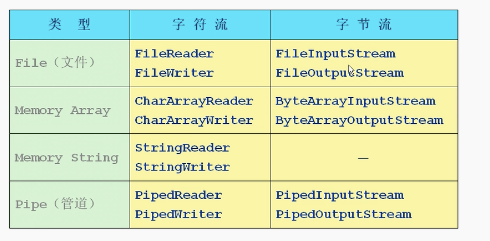
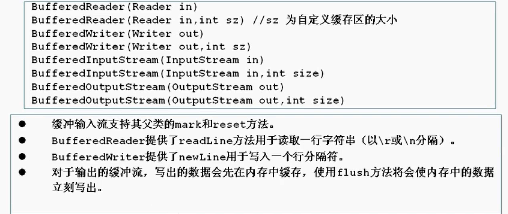

# 第十章 IO流

## 概念
* 在java程序中，对于数据的输入和输出操作以流的形式(stream)方式进行，jdk提供了各种各样的流类，获取不同种类的数据，程序中通过标准的方法输入和输出数据
* 
* IO流 - java.io - 有多种类型的流来实现io功能
* 分类
  * 数据流分类：输入流 输出流
  * 数据单位分类：字节流 字符流
  * 功能分类：节点流 处理流
* 所有java.io的流类型分别继承自以下抽象流类型

* 站在程序的角度来判断输入输出 - 读就是输入，写就是输出
* 节点流：为一个特定的数据源节点读写数据，比如文件或者内存
* 处理流：连接在已存在的流上，通过数据的处理微程序提供更强大的读写功能
* 字节流：一个字节一个字节处理
* 字符流：按字符来处理

## InputStream
* 输入数据，数据单位为字节，子类有节点流类也有处理流类
* 基本方法
  

## OutputStream
* 输出数据，单位为字节，也有节点流和处理流
* 基本方法


## Reader
* 输入数据，数据单位为字符（两个字节），子类有节点流类也有处理流类
* 基本方法


## Writer
* 输出数据，数据单位为字符（两个字节），子类有节点流类也有处理流类
* 基本方法


## 节点流类型

* 举例
  
```java
//FileeInputStream
//使用FileReader同理，只不过这个是按字符输入
//FileInputStream因为是字节输入，所以读取不了需要两个字节表示的中文字符，但FileReader可以
import java.io.*;
public class TestFileInputStream {
    public static void main(String[] args) {
        int b = 0;
        FileInputStream in = null;
        try {
            in = new FileInputStream("d:\\share\\java\\io\\TestFileInputStream.java");
        } catch (FileNotFoundException e) {
            System.out.println("No File");
            System.exit(-1);
        }

        try {
            long num = 0;
            while ((b = in.read()) != -1) {
                System.out.print((char) b);
                num++;
            }
            in.close();
            System.out.println();
            System.out.println("Have Read " + num + " bytes");
        } catch (IOException e1) {
            System.out.println("Error in file reading");
            System.exit(-1);
        }
    }
}
```
```java
//FileOutputStream
//使用FileWriter同理，只不过这个是按字符输出
import java.io.*;
public class TestFileOutputStream {
    public static void main(String[] args) {
        int b = 0;
        FileInputStream in = null;
        FileOutputSream out = null;
        try {
            in = new FileInputStream("d:\\share\\java\\io\\TestFileInputStream.java");
            out = new FileOutputStream("d:/java/io/HW.java"); //没有会新建文件
            while ((b = in.read()) != -1) {
                out.write(b)
            }
            in.close();
            out.close();
        } catch (FileNotFoundException e) {
            System.out.println("No File");
            System.exit(-1);
        } catch (IOException e1) {
            System.out.println("Error in file copying");
            System.exit(-1);
        }
        System.out.println("Have copied the file");
    }
}
```

## 处理流类型


### Buffering
* 缓冲流要“嵌套”在相应的节点流上，对读写数据提供了缓冲功能，提高读写效率，增加新方法
* 常见有四种缓冲流
  
* 举例
```java
//BufferedInputStream
//BufferedReader和BufferedWriter同理，不过有读取或者写入一整行的方法
//BufferedWriter: newLine()换行
//BufferedReader: readLine()读取一行
import java.io.*;
public class TestBufferStream1 {
    public static void main(String[] args) {
        try {
            //构造方法
            //相当于在inputStream管道上面又套了一层bufferedStream管道
            //处理流必须一开始就有相应的节点流
            FileInputStream fis = new FileInputStream("d:\\share\\java\\io\\HelloWorld.java");
            BufferedInputStream bis = new BufferedInputStream(fis);
            int c = 0;
            System.out.println(bis.read());
            System.out.println(bis.read());
            bis.mark(100); //在字符100做个标记
            for (int i = 0; i <= 10 && (c = bis.read()) != -1; i++) {
                System.out.print((char) c+" ");
            }
            System.out.println();
            bis.reset(); //回到做标记的那个点
            for (int i = 0; i <= 10 && (c = bis.read()) != -1; i++) {
                System.out.print((char) c+" ");
            }
            bis.close();

        } catch (IOException e) {
            e.printStackTrace();
            System.exit(-1);
        }
    }
}
```

### TransformIO 转换流
* 用于字符数据与字节数据的转换
* InputStreamReader - 必须和InputStream嵌套，字节转字符
* OutputStreamWriter - 必须和OutputStream嵌套，字节转字符
* 举例
```java
import java.io.*;
public class TestTransform1 {
    public static void main(String[] args) {
        //OutputStreamWriter
        //包了这层就可以直接以字符形式输出了，也可以使用writer的那个string方法来输入string
        try {
            OutputStreamWriter osw = new OutputStreamWriter(new FileOutputStream("d:\\bsk\\char.txt"));
            osw.write("hahahahahahha");
            System.out.println(osw.getEncoding());//拿到它的字符编码
            osw.close();
            osw = new OutputStreamWriter(new FileOutputStream("d:\\bak\\char.txt"), true, "ISO8859_1") //true指的是在文件后面追加，否则就重写覆盖了，第三个参数是指定的字符编码
            ows.write("hahahahahaha");
            System.out.println(osw.getEncoding());
            osw.close();

            //以上运行出来的结果：
            //第一次用的字符编码是操作系统默认字符编码
            //第二次用的是指定的那个字符编码
            //ISO8859_1是包含所有西欧语言的字符编码

        } catch (IOException e) {
            e.printStackTrace();
            System.exit(-1);
        }

        //InputStreamReader
        try {
            InputStreamReader isr = new InputStreamReader(System.in); //System.in本身就是一个inputStream，连接的是我们的键盘，键盘输入然后程序接收 - 标准输入
            BufferedReader br = new BufferedReader(isr);
            String s = null;

            s = br.readLine();
            while(s!=null) {
                if(s.equalIgnoreCase("exit")) break;
                System.out.println(s.toUpperCase());
                s = br.readLine();
                //阻塞式方法，你不输入就无法继续进行，除非输入exit。也叫做同步式方法
            }
            br.close();

        } catch (IOException e) {
            e.printStackTrace();
            System.exit(-1);
        }

    }
}
```

### DataIO 数据流 & ByteArrayIO
* DataInputStream DataOutputStream分别继承于对应的InputStream和OutputStream，属于处理流
* 如果要输入一些数字，比如long，如果没有数据流，需要转换成字符，非常占内存，但是long只占八个字节。数据流就能让long用八个字节输入输出
* 提供了存取机器无关的java原始类型数据比如int和double
* 举例
```java
import java.io.*;
public class Test1 {
    public static void main(String[] args) {
        ByteArrayOutputStream baos = new ByteArrayOutputStream(); // 分配了一个字节数组的管道
        DataOutputStream dos = new DataOutputStream(baos);
        try {
            dos.writeDouble(Math.random());
            dos.writeBoolean(true);
            ByteArrayInputStream bais = new ByteArrayInputStream(baos.toByteArray());
            System.out.println(basi.available()); //9
            System.out.println(dis.readDouble()); //先进先出
            System.out.printLn(dis.readBoolean());
            dos.close();
            dis.close();
        } catch (IOException e) {
            e.printStackTrace();
            System.exit(-1);
        }
    }
}
```

### PrintIO
* PrintWriter和PrintStream都属于输出流，一个是字符流，一个字节流
* 提供了重载的print,println方法用于多种数据类型的输出
* 输出操作不会抛出异常，用户通过检测错误状态获取错误信息
* 有自动flush功能
* 举例
```java
import java.io.*;
public class Test2 {
    public static void main(String[] args) {
        PrintStream ps = null;
        try {
            FileOutputStream fos = new FileOutputStream("d:\\bak\\log.dat");
        } catch (IOException e) {
            e.printStackTrace();
            System.exit(-1);
        }
        if (ps != null) {
            System.setOut(ps);
            //System.out原本的管道（PrintStream）是程序连着输出屏幕（标准输出），现在换管道了
        }
        int ln = 0;
        for (char c = 0; c <= 60000; c++) [
            System.out.print(c+" ");
            if(ln++ >= 100) {System.out.println(); ln = 0;}
        ]
    }
}
```
```java
import java.io.*;
public class Test3 {
    //一个log的实现
    public static void main(String[] args) {
        String s = null;
        BufferedReader br = new BufferedReader(new InputStreamReader(System.in));
        try {
            FileWriter fw = new FileWriter("d:\\bak\\logfile.log", true);
            PrintWriter log = new PrintWriter(fw);
            while ((s = br.readLine()) != null) {
                if (s.equalsIgnoreCase("exit")) break;
                System.out.println(s.toUpperCase());
                log.println("-----");
                log.println(s.toUpperCase());
                log.flush();
            }
            log.println("===" + new Date() + "===");
            log.flush();
            log.close();
            
        } catch (IOException e) {
            e.printStackTrace();
            System.exit(-1);
        }
    }
}
```

### ObjectIO
* 直接将Object写入或者输出
* 举例
```java
import java.io.*;
public class Test4 {
    public static void main(String[] args) throws Exception{
        T t = new T();
        t.k = 8;
        try {
            FileOutputStream fos = new FileOutputStream("./data.dat");
            ObjectOutputStream oos = new ObjectOutputStream(fos);
            oos.writeObject(t);
            oos.flush();
            oos.close();

            FileInputStream fis = new FileInputStream("./java.dat");
            ObjectInputStream ois = new ObjectInputStream(fis);
            T tReaded = (T) ois.readObject();
            System.out.println(tReaded.i + " " + tReaded.j + " " + tReaded.d + " " + tReaded.k);
            
        } catch (IOException e) {
            e.printStackTrace();
            System.exit(-1);
        }
    }
}

class T implements Serializable {
    //可以被序列化的接口
    //Serializable是一个标记性接口，实际没有抽象方法
    int i = 10;
    int j = 9;
    double d = 2.3;
    transient int k = 15; //k是透明的，意思是序列化的时候不考虑k，所以输出k的时候会是默认值0
}
```
* Externalizable接口
  * Serializable的序列化看不到具体实施的，是jdk控制的，所以有了extend serializable的externalizable接口，可以自定义序列化方法
  * 方法：
    * void readExternal(ObjectInput in)
    * void writeExternal(ObjectOutput out)