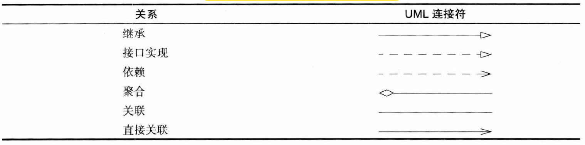
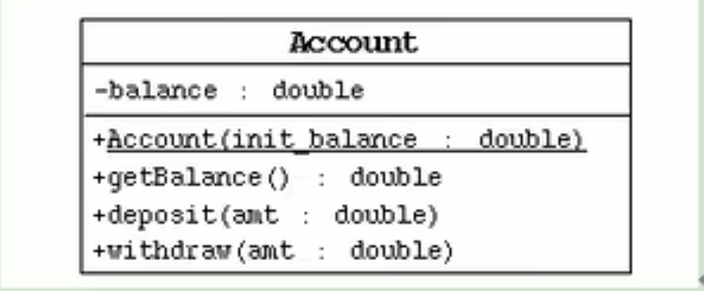
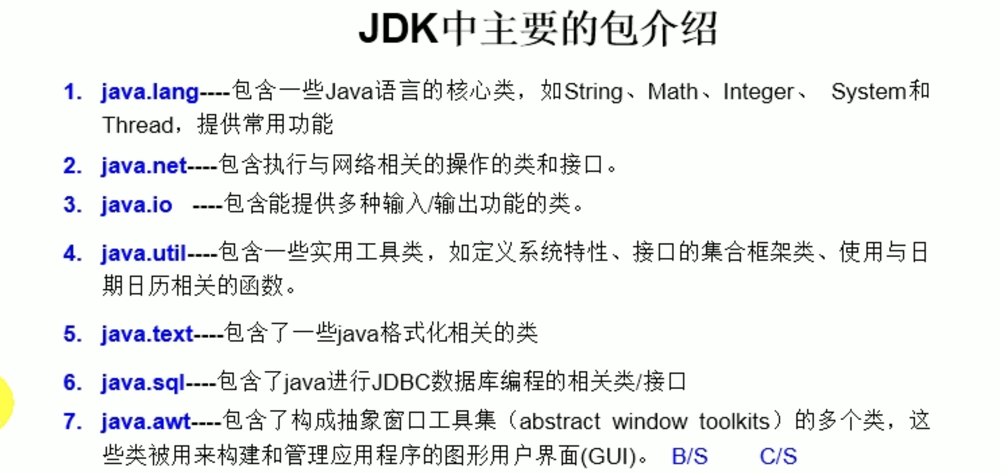
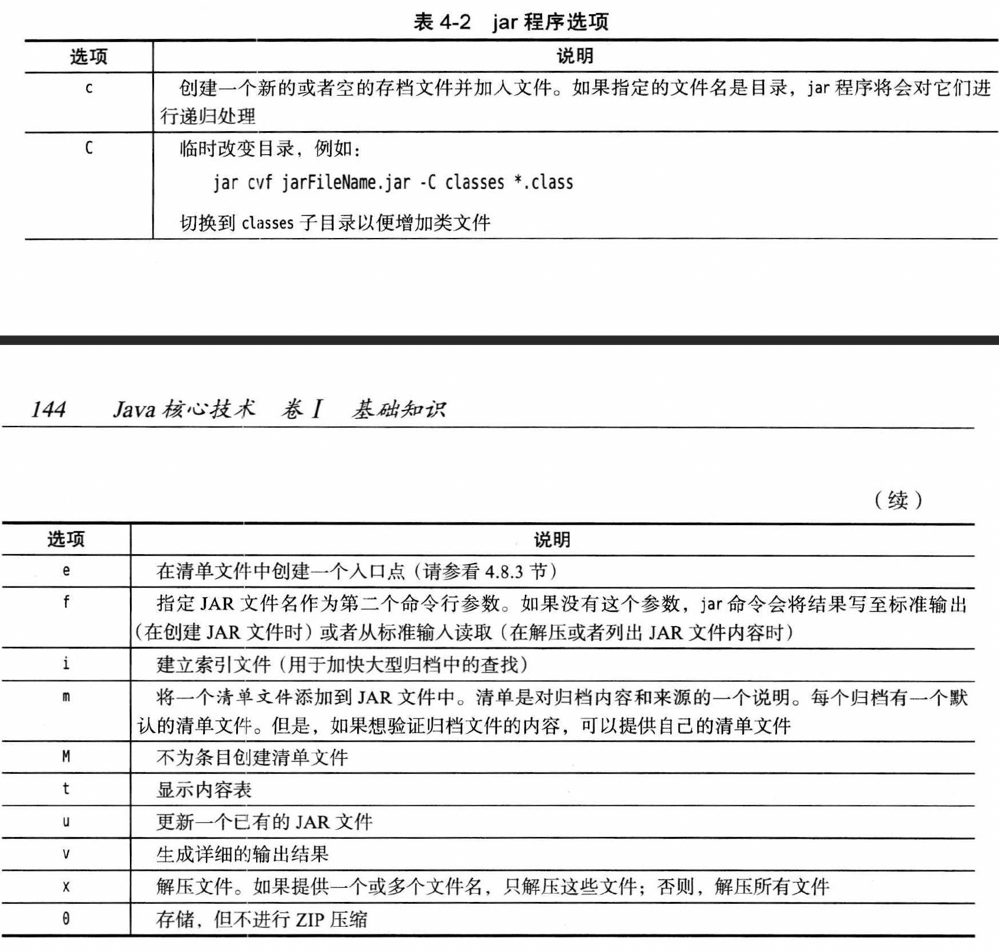
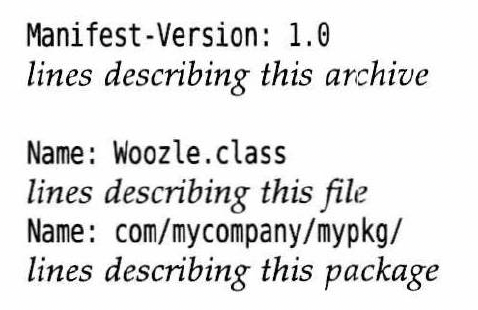
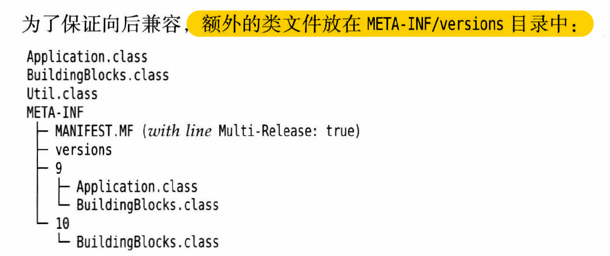
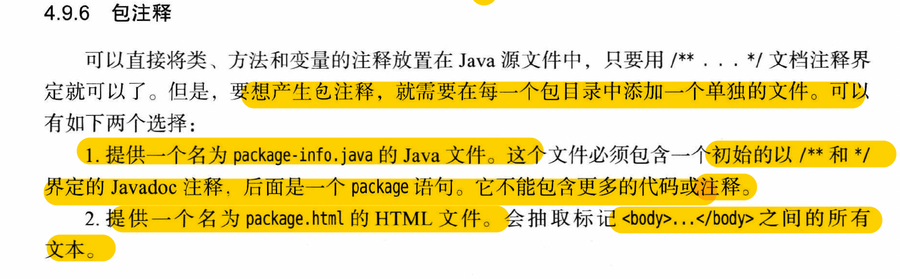
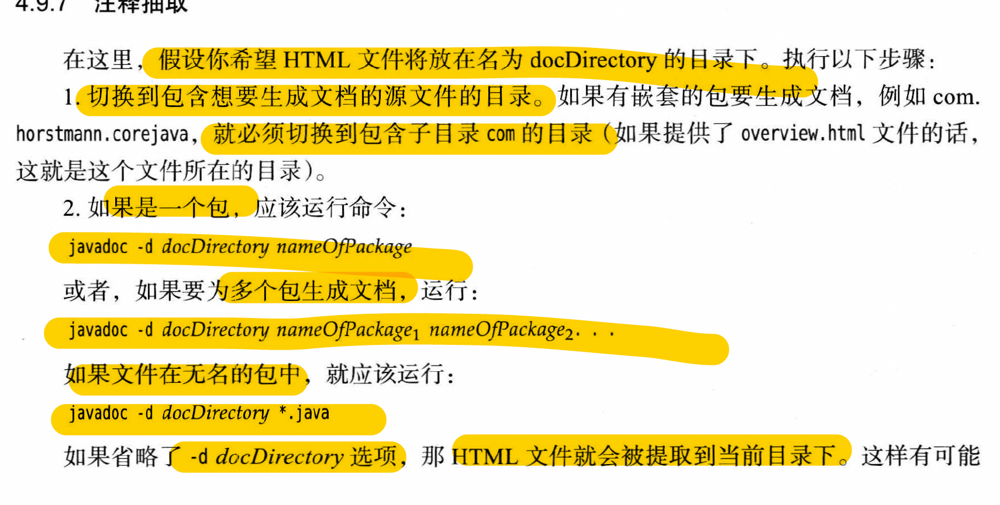
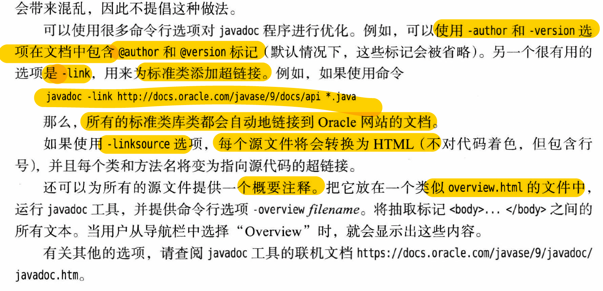
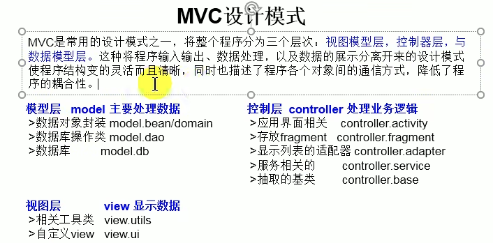

# 第四章 面向对象(上)  object-oriented programming

## java class 类以及类的成员
* **面向过程：** 强调功能行为，以函数为最小单位，考虑怎么做
* **面向对象：** 强调具备了功能的对象，以类或者对象为最小单位，考虑谁做
* **类：** 抽象概念、对象的模板
* **对象：** 实际存在、构造出来的的类，也叫做instance
* **设计类以及设计类的成员就是终点**
* **类 = 属性-instance field实例字段（成员变量） + 行为-method函数**
* **每一个实例的属性和行为构成状态state**
* **创建类的对象-对类的实例化**
* **字段和属性是一个意思**
* **举例**
  ```java
  public static void main(String[] args) {
    Person p = new Person();
    p.name = "Tom";
    p.isMale  = true;
    p.age = 20;
    p.eat();
  }
  class Person {
    //属性
    String name;
    int age;
    boolean isMale;

    //method
    public void eat() {
        System.out.println("eat!");
    }

    public void sleep() {
        System.out.println("sleep!");
    }
  }
  ```
* **类之间的关系**
  * dependence依赖 uses a: 需要某个类，尽量减少使用这个
  * aggregation聚合 has a：包含某个类
  * inheritance继承 is a
  * UML(United Modeling Languge)画类的关系图
  * 
* **类的使用**
  * 创建类，设计类的对象
  * 创建类的对象
    * 使用类的构造器（构造函数）
    * 对象变量
      * e.g. `Date deadline`
    * 构造对象
      * e.g. `new Date()`
    * 对象变量只是引用了一个对象，new构造器才是构造一个新对象，并且返回一个引用
  * 调用 x.属性 x.方法()
    * 一个类的方法可以访问所有属于这个类的对象的私有数据
  * 编译运行
    * `javac Name.java` - 里面有几个类就生成几个字节码文件.class
    * 多文件编译
      * 方法一：通配符（wildcard）
        * e.g. `javac Employee*.java` - 所有包含Employee名字的都编译
      * 方法二：直接编译包含所有需要的class的那个class（或者有main方法的class）
        * 当编译器编译该文件需要某个类的时候，会自己去找相应的.class文件，如果找不到就会去找相应的.java文件进行编译。如果java文件更新过，也会再编译一次（类似make）
* **this关键字**
  * 类方法中定义的使用该方法对象的引用
  * 必须指明当前使用方法的对象是谁的时候要使用this
  * 可以看做是处理方法中成员变量和参数重名的情况
  * this可以看做是变量，它的值是当前对象的引用
* **构造器constructors**
  * 与类同名
  * 使实例字段初始化
  * 需要用new来建立
  * 可以有多个构造器，每个构造器的参数数量、类型都不同，也可以什么参数也没有（重载）
  * **没有设置构造器的话，会默认一个无形参的公共构造器，并且给字段默认初始化**
  * 无返回值
  * 建立的实例都存在heap中
  * 定义字段的时候就可以给字段赋值了，对于固定的字段特别有用
  * 调用另一个构造器
    * 如果构造器第一个语句是this(各种形参)，意思是调用同一个类的其他构造器
  * **字段赋值方法**
    * 初始化块
    * 默认初始化
    * 显性初始化
    * 构造器中赋值
    * 修改器赋值
    * （无private）对象.属性赋值
* **初始化块initialization block**
  * 可以包含多个代码块
  * 不常用
  * 举例
  ```java
  class Person {
    private static int nextId;
    private int id;
    private String name;
  }

  //initialization block
  {
    id = nextId;
    nextId++;
  }

  public Person(String name){
    this.name = name;
  }
  public Person() {
    this.name = "";
  }
  //无论调用那个构造器，初始化块都会运行
  //先运行初始化块，再运行构造器主体
  ```
  * 类的静态字段可以使用初始化块实现复杂的初始化代码
  ```java
  static
  {
    var genarator = new Random();
    nextId = generator.nextInt(10000);
    // nextId被赋值为一个小于10000的随机整数
  }
  ```
* 不同的包可以创造相同名字的类
* 类的属性有初始化值，可以一开始定义类的时候就定义初始化值
* 如果创建同一个类的多个对象，每一个对象都有一套类的属性 **（非static）**
* 将一个新的对象赋值给另一个对象（同一类），**传送的是地址**
* **对象的创建和使用内存解析：**
  * 堆：存放创建的instance
  * 栈：存放各种局部变量，以及instance的地址
  * 方法区：各种静态值、方法、即时编译的代码等
* **属性（成员变量）以及局部变量的区别**
  * 属性（成员变量）：直接定义在class{}之中，自动初始化
  * 局部变量：方法形参，方法内部变量，代码块内，构造器形参，构造器内部的变量，无法自动初始化
  * `val`只用在方法的局部变量
* **null引用**
  * 可对引用变量赋值null
  * 如果对null进行方法操作 - NullPointerException
  * 解决方法：
    * 换成非null值
  
    `name = Objects.requireNonNullElse(n, "unknown")`
    * 直接拒绝并且打出message
    
    `Objects.requireNonNull(n, "Name cannot be found")`
* **参数类型**
  * 隐式参数implicit  - `this`
    * 表示类自己，可以用this调用自己的字段和方法
    * 调用自己的方法时不要调用自己，也不要循环调用
    * this调用构造器必须声明在构造器的开头
    * this调用构造器不能调用多个构造器，只能一个
    * 如果构造器或者其他方法的形参名字和字段名一样，可以用this来区分，即调用字段使前面加上`this.`
  * 显式参数explicit  - 方法形参
* **权限修饰符-封装性**
  * 用于修饰属性、方法、构造器、内部类（正常的类不行）
  * private
    * 类内部
  * 无 default
    * 类内部 & 同一个包
  * protected
    * 类内部 & 同一个包 & 不同包的子类
  * public
    * 全部都行
  * 注意：class只能用private和default（或者不写）来修饰
* **默认初始化**
  * 根据类型都有默认初始化值
  * **与数组类似**
    * 整型：0
    * 浮点型：0.0
    * 字符型：0 or '\u0000'
    * 布尔类型：false
    * 引用类型（类、数组、接口）：null
* **方法声明：**
  * 关于权限修饰符
    * private
    * public
    * protected
    * 无
  * 其他修饰
    * final
      * final字段必须在构造对象时初始化，之后不能再改变
      * 适合基本数据类型以及不可变类
    * static
      * 静态字段
        * 一个类只有一个静态字段
        * 静态字段属于类，不属于任何创造的实例对象，所以不用创造实例也可以直接用它
        * 也叫做类字段
        * 如果不赋值，会默认初始化
      * 静态常量
        * 属于类的常量
        * e.g. `Math.PI`
      * 静态方法
        * 不在对象上执行的方法
          * e.g. `Math.pow(x, a)`
        * 可以认为就是没有this的方法
        * 静态方法只能访问静态字段
        * 也可以使用对象调用静态方法
      * 静态工厂方法factory method
        * e.g. `LocalDate.of()` or `LocalDate.now()`
      * main方法也是静态方法
        * 每个类都可以有一个main方法
        * 可用于测试
      * 静态导入
        ```java
        import static java.lang.System.*
        // 可以使用System的静态方法和字段，不用添加前缀
        import static java.lang.Syetem.out
        // 导入特定的方法和字段
        ```
    * abstract
  * 方法名：aaaBbbb
  * 方法中不可以再定义方法
* **访问器方法：** getter（accessor method)
* **更改器方法：** setter (mutator method)
* **递归：** 方法内部调用方法本身
* **引用类型变量只存储null或者地址**
* **匿名对象**
  * new出来的实例没有赋给引用变量
  * e.g. `new Phone().price()`
* **重载overload**
  * 同一个类，存在同名方法，只要参数个数或者类型不同就行或者参数顺序不同
  * 返回类型必须相同
  * 找不到匹配的参数就会产生编译错误
  * 可以用任何方法，包括构造器
  * 可变参数个数的方法：
    * jdk 5.0内容
    * 举例
      ```java
      show(int a, String ... strs) {}
      private static void main(String[] args) {
          test.show(1, "aaa", "bbb");
      }
      ```
  * 可以传0、1、2...以上的参数
  * 其实...就是数组
* **方法传参**
  * 形参是基本数据类型 - 形参获取的是实参的数据副本 - 方法不会改变实参
  * 形参是引用数据类型 - 形参获取的是实参的保存的数据的地址 - 方法可以改变实参
* **封装和隐藏**
  * encapsulation
  * 该隐藏的隐藏，让不想被用户直接访问的信息隐藏起来，从而不通过`对象.属性`的方式直接访问
  * 想要访问就必须使用公共方法-访问器getter
    ```java
    public int getLegs() {
        return legs;
    }
    ```
  * 需要重新赋值只能通过公共方法-修改器setter
    ```java
    public void setLegs(int legs) {
        this.legs = legs;
    }
    ```
  * 利用方法来修改和访问可以加入自定义限制
  * `private`用在字段上即可隐藏私人字段或者私人方法
  * 接口interface也是封装性的体现，即只对外公开公共方法
* **常用预定义类**
  * ArrayList
  * LocalDate
  * LocalDateTime
  * Date
  * Random
  * Math
* **JavaBean**
  * 一种java写成的可重用组件
  * 指符合以下标准的类
    * public
    * 含无参数公共构造器
    * 有属性以及对应的setter、getter
* **对象析构**
  * 析构器 - 最常见的操作是回收分配给对象的存储空间，即清理不再使用的对象
  * java有自动垃圾处理器，所以没有析构器
  * 如果对象使用了内存以外的存储空间
    * 需要一个close方法来关闭空间和清理
    * 可以用`Runtime.addShutDownHook`增加关闭钩
    * java 9 - 可以用cleaner类注册一个动作
* **UML类图**
  * 用于观察类之间的关系
  * 举例

  

  -是private，+是public
  下划线是构造器
  * 还有用线条箭头表示的方式
* **包package**
  * `package com.home.project_name`
  * 类如果在不同的包里，可以使用相同的类名
  * 包名
    * 为保证唯一性，需要一个**因特网域名的逆序**来命名
    * 都是小写
    * 每一个点都是一个文件目录
    * 举例
      * `house.com`
      * `com.house`
      * 追加工程名字：`com.house.corejava`
      * 如果里面存入Employee这个类，那么类的完全限定名字：`com.house.corejava.Employee`
  * 包中类(接口)的调用
    * 一个类可以调用所属的包的其他类，以及其他包的公共类(接口)
    * 方法一：完全限定名
      * e.g. `java.time.LocalDate`
      * 麻烦
      * 同名类不同包，调用类时只能用这个方法区分
    * 方法二：import 导入
      * 特定类
        * e.g. `import java.time.LocalDate`
        * 包名路径一定要输对，一开始都是先从自己的位置的包往下找，如果找不到就去找环境变量PATH（以前是classpath）的路径往下找
      * 特定包下的所有结构
        * e.g. `import java.time.*`
        * 但这个形式没有考虑子包，子包仍需要import声明
      * 声明在包之后，构造器和方法之前
      * import static可以导入类或者接口的静态结构
    * 多个结构并列写
    * java.lang和同一个包下的，可忽略import结构
  * 每个类的开头都有声明所属的包
    * e.g. `package com.house.corejava`
  * 常见预设包（存在jdk里）
    * 存在jdk--jre--lib--rt.jar--java里面,有各种常用class
  
  * 编译器处理文件带有分隔符和扩展名.java的文件，解释器加载类（带有.分隔符）
  * 编译器在编译源文件的时候不检查目录结构，所以也可以编译一些不在对应包的类，只要其不依赖其他包。但最终程序无法运行，因为虚拟机找不到对应包的类
  * 编译器总是看当前目录查找文件，虚拟机先在JAVA API类中找文件，找不到后再在类路径里查找。如果类路径包含"."目录时才看当前目录
  * 编译器会先查找各种import的包，确定是否包含类（java.lang默认导入，所以也会查）。如果查到一个以上的类，就有编译错误
  * 一个源文件只能包含一个公共类，文件名与公共类名必须匹配，这样编译器很容易查找类的源文件
  * 当前包也可以导入非公共类
  * 类路径
    * 类文件可以存在JAR(java归档）文件里，里面包含多个压缩形式的类文件以及子目录，可以节省空间，其使用zip格式
    * 类能被多个程序共享的方法
      * 把类放在一个目录里
      * 将JAR文件放在一个目录里
      * 设置类路径class path
        * UNIX
          * 利用：分隔符分开各项
          * e.g. `/home/user/classdir:.:/home/user/archives/archive.jar`
        * Windows
          * 利用;
          * e.g. `c:\classdir;.;c:\archives\archive.jar`
        * jar文件目录可以使用通配符*
        * 设置方法
          * `java classpath home/user/classdir:.:/home/user/archives/archive.jar MyProg`
          * `java -classpath c:\classdir;.;c:\archives\archive.jar MyProg`
          * 也可以利用CLASSPATH环境变量来设定，具体细节依赖于shell
* **JAR文件**
  * 定义
    * 当希望给用户提供一个单独文件而不是一堆类文件目录结构的时候，java归档文件（JAR）起了作用。
    * 可以包含图像、声音等其他类型文件
    * jar是压缩形式的，可以用zip查看
    * 可以将应用程序和代码库打包进入jar
    * jar option
    
  * 创建jar文件
    * jar工具制作，默认jdk安装路径下，jdk/bin
    * `jar -cvf jarFileName.jar file1 file2...`
    * `jar -cvf jarName.jar *.*`
    * `jar option file1 file2 ...`
  * 清单文件
    * manifest
    * 每个jar文件都包含的，用于描述归档文件的特殊特性
    * MANIFEST.MF
    * 位于jar文件的一个META-INF子目录
    * 最简单的清单文件
      * `Manifest-Version: 1.0`
    * 最后一行必须是换行符
    * 复杂的清单文件包含多个条目，可以分成多个节
      * 第一节 - main section，作用于整个jar
      * 随后的条目用来指定命名实体的属性，如单个文件、包或者url
      
      * 希望添加到清单文件的行放到文本里

        `jar cfm jarFileName manifestFileName`

        `jar cfm MyArchive.jar manifest.mf com/java/*.calss`

      * 更新已有jar，需要添加部分放置到文本里

        `jar ufm MyArchive.jar manifest-add.mf`
  * 可执行jar文件
    * 可以使用jar命令中的e选项指定程序的入口点

      `jar cvfe myprogram.jar com.mycompay,MainAppClass files to add`

      或者可以在清单文件中指定程序main class

      `Main-class: com.mycompany.MainAppClass`

    * 不要为main class添加.class
    * 执行
      * `java -jar Myprogram.jar`
      * 甚至可以双击jar文件图标启动程序
      * windows - `javaw -jar`启动文件
      * macosx - 直接双击
  * 多版本jar文件
    * java9引入多版本jar，可包含面向不同java版本的类文件

    
    * 增加不同版本类文件
      * `jar uf Myprogram.jar --release 9 Application.class`
      * 新构建多版本jar，使用`-C`对应每个版本要切换不同类文件目录

        `jar cf myprogram.jar -C bin/8 . --release 9 -C bin/9 Application.class`
      
    * 不同版本编译

      `javac -d bin/8 --release 8 ...`
    * 多版本jar不适用于不同版本的程序或者库，所有类的公共api要一样  
* **文档注释**
  * javadoc
    * 源文件生成一个html文档
    * `/**  */`
  * 构成
    * 自由格式文本，@
    * 第一句是概述文字
    * 可以使用html修饰符来编辑页面
    * 其他文件需要放到doc-files这个子目录之中
  * 类注释
    * import之后，类之前
  * 方法注释
    * 每个方法之前
    * @param variable description
    * @return description
    * @throws class description
  * 字段注释
    * 对公共字段（静态常量）注释
  * 通用注释
    * @since text(可以是版本信息)  e.g. `@since 1.7.1`
    * @author name
    * @version text
    * @see reference  超链接
      * `package.class#featrue label` -- 内部相关部分超链接
        e.g. `@see com.mycompany.Employee#raiseSalary(double)`
      * `<a href="...">label</a>` -- 外部网页超链接

        e.g. `@see <a href="www.horstmancom/corejava.html">The Core Java home</a>`
      * text

        e.g. `@see "Core java 2 volumn 2"`
    * `{@link package.class#feature label}`
      * 任何地方加入指向类或者方法的超链接
    * @index entry -- 增加搜索条目
  * 包注释
    
  * 注释提取
    
    
  * 类设计技巧
    * 数据私有化
    * 数据初始化
    * 不要用过多基本数据类型，用对应的引用类型比较好
    * 字段的setter和getter按需添加
    * 类的职责要单一明确，不要过多
    * 类名方法名要体现职责
    * 优先使用不可变类
* **MVC设计模式**
  
