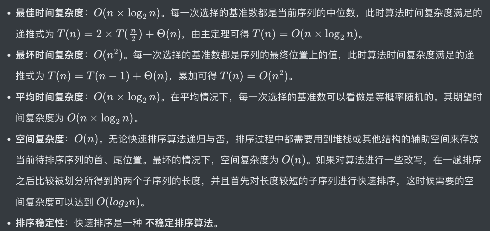
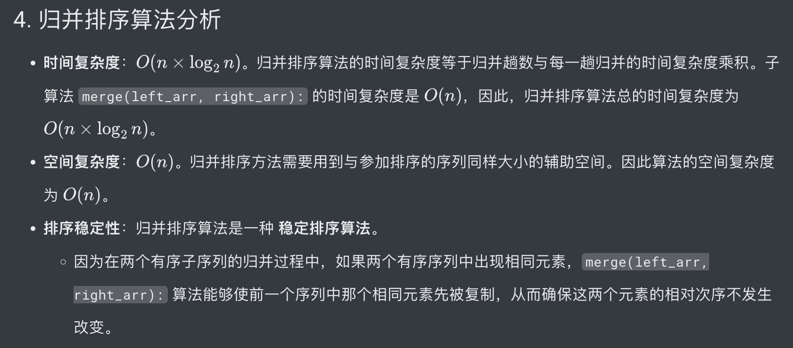

# Leetcode Note

* 必须进行null和0检测
* 必要的话需要把不简洁的部分放在function里
* 检查index问题
* 检查是否符合题目

# Array & LinkedList

## implement ArrayList & LinkedList

## Two Pointers

### opposite-direction pointers
* ```
    left, right = 0, len(nums) - 1

    while left < right: #重点
        if 满足要求的特殊条件:
            return 符合条件的值 
        elif 一定条件 1:
            left += 1 #很重要
        elif 一定条件 2:
            right -= 1 #很重要

    return 没找到 或 找到对应值
    ```

* Reverse
* Two Sum
* Partition

### same-direction pointers
* ```python
    slow = 0
    fast = 1
    while 没有遍历完：
        if 满足要求的特殊条件:
            slow += 1
        fast += 1
    return 合适的值
    ```

### seperate pointers
* ```python
    left_1 = 0
    left_2 = 0

    while left_1 < len(nums1) and left_2 < len(nums2):
        if 一定条件 1:
            left_1 += 1
            left_2 += 1
        elif 一定条件 2:
            left_1 += 1
        elif 一定条件 3:
            left_2 += 1
    ```

## Quick Sort

* leetcode912
* ```python
    class Solution(object):
    def sortArray(self, nums):
        """
        :type nums: List[int]
        :rtype: List[int]
        """
        if not nums:
            return
        
        self.quick_sort(nums, 0, len(nums) - 1)
        
        return nums
        
    def quick_sort(self, nums, start, end):
        if start >= end:   # check if start >= end
            return

        left, right = start, end
        pivot = nums[(start + end) // 2]

        while left <= right:   # Using <= avoids dublicates
            while left <= right and nums[left] < pivot:  # exchange the number equal to pivot
                left += 1
            while left <= right and nums[right] > pivot:
                right -= 1
            if left <= right:
                nums[left], nums[right] = nums[right], nums[left]
                left += 1
                right -= 1
        
        self.quick_sort(nums, start, right) # Because left = right + 1 -> left > right
        self.quick_sort(nums, left, end)  
    ```
* ```python
    import random

    class Solution:
        # 从 arr[low: high + 1] 中随机挑选一个基准数，并进行移动排序
        def randomPartition(self, arr: [int], low: int, high: int):
            # 随机挑选一个基准数
            i = random.randint(low, high)
            # 将基准数与最低位互换
            arr[i], arr[low] = arr[low], arr[i]
            # 以最低位为基准数，然后将序列中比基准数大的元素移动到基准数右侧，比他小的元素移动到基准数左侧。最后将基准数放到正确位置上
            return self.partition(arr, low, high)
        
        # 以最低位为基准数，然后将序列中比基准数大的元素移动到基准数右侧，比他小的元素移动到基准数左侧。最后将基准数放到正确位置上
        def partition(self, arr: [int], low: int, high: int):
            pivot = arr[low]            # 以第 1 为为基准数
            i = low + 1                 # 从基准数后 1 位开始遍历，保证位置 i 之前的元素都小于基准数
            
            for j in range(i, high + 1):
                # 发现一个小于基准数的元素
                if arr[j] < pivot:
                    # 将小于基准数的元素 arr[j] 与当前 arr[i] 进行换位，保证位置 i 之前的元素都小于基准数
                    arr[i], arr[j] = arr[j], arr[i]
                    # i 之前的元素都小于基准数，所以 i 向右移动一位
                    i += 1
            # 将基准节点放到正确位置上
            arr[i - 1], arr[low] = arr[low], arr[i - 1]
            # 返回基准数位置
            return i - 1

        def quickSort(self, arr, low, high):
            if low < high:
                # 按照基准数的位置，将序列划分为左右两个子序列
                pi = self.randomPartition(arr, low, high)
                # 对左右两个子序列分别进行递归快速排序
                self.quickSort(arr, low, pi - 1)
                self.quickSort(arr, pi + 1, high)

            return arr

        def sortArray(self, nums: List[int]) -> List[int]:
            return self.quickSort(nums, 0, len(nums) - 1)
  ```
* 

## Bubble Sort:
* ```python
    class Solution:
        def bubbleSort(self, arr):
            # 第 i 趟排序
            for i in range(len(arr) - 1):
                # 从序列中前 n - i + 1 个元素的第 1 个元素开始，相邻两个元素进行比较
                for j in range(len(arr) - i - 1):
                    # 相邻两个元素进行比较，如果前者大于后者，则交换位置
                    if arr[j] > arr[j + 1]:
                        arr[j], arr[j + 1] = arr[j + 1], arr[j]

        return arr

    def sortArray(self, nums: List[int]) -> List[int]:
        return self.bubbleSort(nums)
    ```

## Merge Sort
* ```python
    class Solution:
    def merge(self, left_arr, right_arr):           # 归并过程
        arr = []
        left_i, right_i = 0, 0
        while left_i < len(left_arr) and right_i < len(right_arr):
            # 将两个有序子序列中较小元素依次插入到结果数组中
            if left_arr[left_i] < right_arr[right_i]:
                arr.append(left_arr[left_i])
                left_i += 1
            else:
                arr.append(right_arr[right_i])
                right_i += 1
        
        while left_i < len(left_arr):
            # 如果左子序列有剩余元素，则将其插入到结果数组中
            arr.append(left_arr[left_i])
            left_i += 1
            
        while right_i < len(right_arr):
            # 如果右子序列有剩余元素，则将其插入到结果数组中
            arr.append(right_arr[right_i])
            right_i += 1
        
        return arr                                  # 返回排好序的结果数组

    def mergeSort(self, arr):                       # 分割过程
        if len(arr) <= 1:                           # 数组元素个数小于等于 1 时，直接返回原数组
            return arr
        
        mid = len(arr) // 2                         # 将数组从中间位置分为左右两个数组。
        left_arr = self.mergeSort(arr[0: mid])      # 递归将左子序列进行分割和排序
        right_arr =  self.mergeSort(arr[mid:])      # 递归将右子序列进行分割和排序
        return self.merge(left_arr, right_arr)      # 把当前序列组中有序子序列逐层向上，进行两两合并。

    def sortArray(self, nums: List[int]) -> List[int]:
        return self.mergeSort(nums)
    ```
* 

## Binary Search

* leetcode704
### Search directly
```python
class Solution:
    def search(self, nums: List[int], target: int) -> int:
        left, right = 0, len(nums) - 1
        
        # 在区间 [left, right] 内查找 target
        while left <= right:
            # 取区间中间节点
            mid = left + (right - left) // 2
            # 如果找到目标值，则直接范围中心位置
            if nums[mid] == target:
                return mid
            # 如果 nums[mid] 小于目标值，则在 [mid + 1, right] 中继续搜索
            elif nums[mid] < target:
                left = mid + 1
            # 如果 nums[mid] 大于目标值，则在 [left, mid - 1] 中继续搜索
            else:
                right = mid - 1
        # 未搜索到元素，返回 -1
        return -1
```

### Exclusion
```python
# method 1
class Solution:
    def search(self, nums: List[int], target: int) -> int:
        left, right = 0, len(nums) - 1
        
        # 在区间 [left, right] 内查找 target
        while left < right:
            # 取区间中间节点
            mid = left + (right - left) // 2
            if nums[mid] < target:
                left = mid + 1
            else:
                right = mid
        # 判断区间剩余元素是否为目标元素，不是则返回 -1
        if left < 0 or left >= len(nums):
            return -1
        return left if nums[left] == target else -1
# method 2
class Solution:
    def search(self, nums: List[int], target: int) -> int:
        left, right = 0, len(nums) - 1
        
        # 在区间 [left, right] 内查找 target
        while left < right:
            # 取区间中间节点
            mid = left + (right - left + 1) // 2
            if nums[mid] > target:
                right = mid - 1 
            else:
                left = mid
        # 判断区间剩余元素是否为目标元素，不是则返回 -1
        if right < 0 or right >= len(nums):
            return -1
        return right if nums[right] == target else -1
```
* T(o) = O(logn)
* S(o) = O(1)

### Application
*   ```
    // 函数 f 是关于自变量 x 的单调函数
    int f(int x) {
        // ...
    }

    // 主函数，在 f(x) == target 的约束下求 x 的最值
    int solution(int[] nums, int target) {
        if (nums.length == 0) return -1;
        // 问自己：自变量 x 的最小值是多少？
        int left = ...;
        // 问自己：自变量 x 的最大值是多少？
        int right = ... + 1;

        while (left < right) {
            int mid = left + (right - left) / 2;
            if (f(mid) == target) {
                // 问自己：题目是求左边界还是右边界？
                // ...
            } else if (f(mid) < target) {
                // 问自己：怎么让 f(x) 大一点？
                // ...
            } else if (f(mid) > target) {
                // 问自己：怎么让 f(x) 小一点？
                // ...
            }
        }
        return left;
    }
    ```

## 前缀和数组

* ```python
    class NumArray(object):

        def __init__(self, nums):
            """
            :type nums: List[int]
            """
            self.prenums = [0 for _ in range(len(nums) + 1)]
            for i in range(1, len(self.prenums)):
                self.prenums[i] = (nums[i - 1] + self.prenums[i - 1])

        def sumRange(self, left, right):
            """
            :type left: int
            :type right: int
            :rtype: int
            """
            if left > right or left < 0 or right >= len(self.prenums) - 1:
                return -1

            return self.prenums[right + 1] - self.prenums[left]
    ```

## 差分和数组

```python
    # 差分数组工具类
class Difference:
    # 差分数组
    def __init__(self, nums: List[int]):
        assert len(nums) > 0
        self.diff = [0] * len(nums)
        # 根据初始数组构造差分数组
        self.diff[0] = nums[0]
        for i in range(1, len(nums)):
            self.diff[i] = nums[i] - nums[i - 1]

    # 给闭区间 [i, j] 增加 val（可以是负数）
    def increment(self, i: int, j: int, val: int) -> None:
        self.diff[i] += val
        if j + 1 < len(self.diff):
            self.diff[j + 1] -= val

    # 返回结果数组
    def result(self) -> List[int]:
        res = [0] * len(self.diff)
        # 根据差分数组构造结果数组
        res[0] = self.diff[0]
        for i in range(1, len(self.diff)):
            res[i] = res[i - 1] + self.diff[i]
        return res
```


