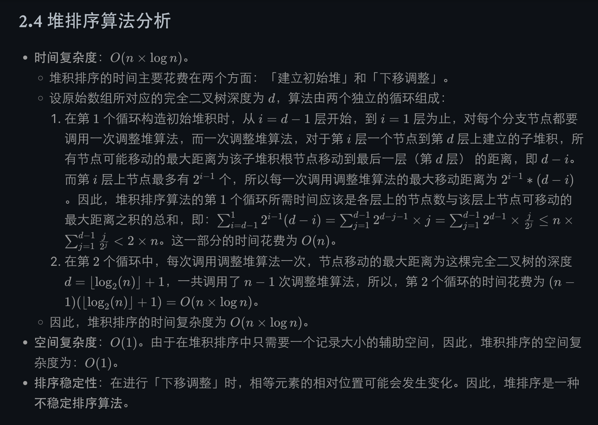
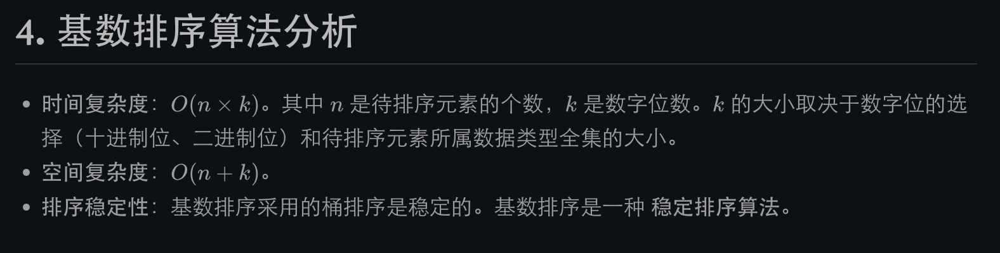

# Leetcode Note

* if,for,while等与{}或者（）之间必须有一个空格
* =左右要加空格
* 必须进行null和0长度检测
* 必要的话需要把不简洁的部分放在function里
* 检查index问题
* 检查是否符合题目
* 时间复杂度其实看的是最坏

# Array & LinkedList

## implement ArrayList & LinkedList

## Two Pointers

### opposite-direction pointers
* ```
    left, right = 0, len(nums) - 1

    while left < right: #重点
        if 满足要求的特殊条件:
            return 符合条件的值 
        elif 一定条件 1:
            left += 1 #很重要
        elif 一定条件 2:
            right -= 1 #很重要

    return 没找到 或 找到对应值
    ```
* 不适用于linked list
* Reverse
* Two Sum
* Partition

### same-direction pointers
* ```python
    # array
    slow = 0
    fast = 1
    while 没有遍历完：
        if 满足要求的特殊条件:
            slow += 1
        fast += 1
    return 合适的值
    ```

* ```
    # linkedlist
    # 步长一样
    # fast先到指定位置，然后fast与slow保持一定距离前进
    slow = head
    fast = head

    while n:
        fast = fast.next
        n -= 1
    while fast:
        fast = fast.next
        slow = slow.next
    ```

* ```
    // 步长不一样的快慢指针
    fast = head
    slow = head

    while fast and fast.next:
        slow = slow.next
        fast = fast.next.next
    ```

### seperate pointers
* ```python
    left_1 = 0
    left_2 = 0

    while left_1 < len(nums1) and left_2 < len(nums2):
        if 一定条件 1:
            left_1 += 1
            left_2 += 1
        elif 一定条件 2:
            left_1 += 1
        elif 一定条件 3:
            left_2 += 1
    ```

* ```
    // linkedlist
    left_1 = list1
    left_2 = list2

    while left_1 and left_2:
        if 一定条件 1:
            left_1 = left_1.next
            left_2 = left_2.next
        elif 一定条件 2:
            left_1 = left_1.next
        elif 一定条件 3:
            left_2 = left_2.next
    ```

* ```python
    class Solution(object):
        def mergeTwoLists(self, list1, list2):
            """
            :type list1: Optional[ListNode]
            :type list2: Optional[ListNode]
            :rtype: Optional[ListNode]
            """
            if not list2:
                return list1
            elif not list1:
                return list2

            dummy_node = ListNode(-1)
            cur = dummy_node

            while list1 and list2:
                if list1.val <= list2.val:
                    cur.next = list1
                    list1 = list1.next
                else:
                    cur.next = list2
                    list2 = list2.next
                cur = cur.next
            
            cur.next = list1 if list1 is not None else list2

            return dummy_node.next
    ```

## Quick Sort

* leetcode912
* ```python
    class Solution(object):
    def sortArray(self, nums):
        """
        :type nums: List[int]
        :rtype: List[int]
        """
        if not nums:
            return
        
        self.quick_sort(nums, 0, len(nums) - 1)
        
        return nums
        
    def quick_sort(self, nums, start, end):
        if start >= end:   # check if start >= end
            return

        left, right = start, end
        pivot = nums[(start + end) // 2]

        while left <= right:   # Using <= avoids dublicates
            while left <= right and nums[left] < pivot:  # exchange the number equal to pivot
                left += 1
            while left <= right and nums[right] > pivot:
                right -= 1
            if left <= right:
                nums[left], nums[right] = nums[right], nums[left]
                left += 1
                right -= 1
        
        self.quick_sort(nums, start, right) # Because left = right + 1 -> left > right
        self.quick_sort(nums, left, end)  
    ```
* ```python
    import random

    class Solution:
        # 从 arr[low: high + 1] 中随机挑选一个基准数，并进行移动排序
        def randomPartition(self, arr: [int], low: int, high: int):
            # 随机挑选一个基准数
            i = random.randint(low, high)
            # 将基准数与最低位互换
            arr[i], arr[low] = arr[low], arr[i]
            # 以最低位为基准数，然后将序列中比基准数大的元素移动到基准数右侧，比他小的元素移动到基准数左侧。最后将基准数放到正确位置上
            return self.partition(arr, low, high)
        
        # 以最低位为基准数，然后将序列中比基准数大的元素移动到基准数右侧，比他小的元素移动到基准数左侧。最后将基准数放到正确位置上
        def partition(self, arr: [int], low: int, high: int):
            pivot = arr[low]            # 以第 1 为为基准数
            i = low + 1                 # 从基准数后 1 位开始遍历，保证位置 i 之前的元素都小于基准数
            
            for j in range(i, high + 1):
                # 发现一个小于基准数的元素
                if arr[j] < pivot:
                    # 将小于基准数的元素 arr[j] 与当前 arr[i] 进行换位，保证位置 i 之前的元素都小于基准数
                    arr[i], arr[j] = arr[j], arr[i]
                    # i 之前的元素都小于基准数，所以 i 向右移动一位
                    i += 1
            # 将基准节点放到正确位置上
            arr[i - 1], arr[low] = arr[low], arr[i - 1]
            # 返回基准数位置
            return i - 1

        def quickSort(self, arr, low, high):
            if low < high:
                # 按照基准数的位置，将序列划分为左右两个子序列
                pi = self.randomPartition(arr, low, high)
                # 对左右两个子序列分别进行递归快速排序
                self.quickSort(arr, low, pi - 1)
                self.quickSort(arr, pi + 1, high)

            return arr

        def sortArray(self, nums: List[int]) -> List[int]:
            return self.quickSort(nums, 0, len(nums) - 1)
  ```
* 

## Bubble Sort:
* ```python
    class Solution:
        def bubbleSort(self, arr):
            # 第 i 趟排序
            for i in range(len(arr) - 1):
                # 从序列中前 n - i + 1 个元素的第 1 个元素开始，相邻两个元素进行比较
                for j in range(len(arr) - i - 1):
                    # 相邻两个元素进行比较，如果前者大于后者，则交换位置
                    if arr[j] > arr[j + 1]:
                        arr[j], arr[j + 1] = arr[j + 1], arr[j]

        return arr

    def sortArray(self, nums: List[int]) -> List[int]:
        return self.bubbleSort(nums)
    ```

* 

## Selection Sort

leetcode 75

* ```python
    class Solution:
    def selectionSort(self, arr):
        for i in range(len(arr) - 1):
            # 记录未排序部分中最小值的位置
            min_i = i
            for j in range(i + 1, len(arr)):
                if arr[j] < arr[min_i]:
                    min_i = j
            # 如果找到最小值的位置，将 i 位置上元素与最小值位置上的元素进行交换
        if min_i != i:
            arr[i], arr[min_i] = arr[min_i], arr[i]
            
        return arr

    def sortArray(self, nums: List[int]) -> List[int]:
        return self.selectionSort(nums)
    ```

* 

## Insertion Sort

leetcode 75

* ```python
    class Solution:
        def insertionSort(self, arr):
            for i in range(1, len(arr)):
                temp = arr[i]
                j = i
                while j > 0 and arr[j - 1] > temp:
                    arr[j], arr[j - 1] = arr[j - 1], arr[j]
                    j -= 1
                
                arr[j] = temp
        
        def sortArray(self, nums):
            return self.indertionSort(nums)
  ```

## Merge Sort
* ```python
    # Array
    class Solution:
    def merge(self, left_arr, right_arr):           # 归并过程
        arr = []
        left_i, right_i = 0, 0
        while left_i < len(left_arr) and right_i < len(right_arr):
            # 将两个有序子序列中较小元素依次插入到结果数组中
            if left_arr[left_i] < right_arr[right_i]:
                arr.append(left_arr[left_i])
                left_i += 1
            else:
                arr.append(right_arr[right_i])
                right_i += 1
        
        while left_i < len(left_arr):
            # 如果左子序列有剩余元素，则将其插入到结果数组中
            arr.append(left_arr[left_i])
            left_i += 1
            
        while right_i < len(right_arr):
            # 如果右子序列有剩余元素，则将其插入到结果数组中
            arr.append(right_arr[right_i])
            right_i += 1
        
        return arr                                  # 返回排好序的结果数组

    def mergeSort(self, arr):                       # 分割过程
        if len(arr) <= 1:                           # 数组元素个数小于等于 1 时，直接返回原数组
            return arr
        
        mid = len(arr) // 2                         # 将数组从中间位置分为左右两个数组。
        left_arr = self.mergeSort(arr[0: mid])      # 递归将左子序列进行分割和排序
        right_arr =  self.mergeSort(arr[mid:])      # 递归将右子序列进行分割和排序
        return self.merge(left_arr, right_arr)      # 把当前序列组中有序子序列逐层向上，进行两两合并。

    def sortArray(self, nums: List[int]) -> List[int]:
        return self.mergeSort(nums)
    ```
* ```python
    # Linked list
    class ListNode(object):
        def __init__(self, val=0, next=None):
            self.val = val
            self.next = next
    class Solution(object):
        def mergeKLists(self, lists):
            """
            :type lists: List[ListNode]
            :rtype: ListNode
            """
            if not lists:
                return None
            
            return self.merge_sort(lists, 0, len(lists) - 1)
            
        def merge(self, node1, node2):
            dummy = ListNode(-1)
            cur = dummy
            while node1 and node2:
                if node1.val < node2.val:
                    cur.next = node1
                    node1 = node1.next
                else:
                    cur.next = node2
                    node2 = node2.next
                cur = cur.next
            if node1:
                cur.next = node1
            if node2:
                cur.next = node2
            
            return dummy.next

        def merge_sort(self, lists, left, right):
            if left == right:
                return lists[left]
            
            mid = left + (right - left) // 2
            left_node = self.merge_sort(lists, left, mid)
            right_node = self.merge_sort(lists, mid + 1, right)

            return self.merge(left_node, right_node)
    ```
* 

## heap sort
* ```python
    # heap data structure
    class MaxHeap:
        def __init__(self):
            self.max_heap = []
    ```
* ```python
    # get_max
    class MaxHeap:
    ......
    def peek(self) -> int:
        # 大顶堆为空
        if not self.max_heap:
            return None
        # 返回堆顶元素
        return self.max_heap[0]

    ```
* ```python
    # insert
    class MaxHeap:
    ......
    def push(self, val: int):
        # 将新元素添加到堆的末尾
        self.max_heap.append(val)
        
        size = len(self.max_heap)
        # 从新插入的元素节点开始，进行上移调整
        self.__shift_up(size - 1)
        
    def __shift_up(self, i: int):
        while (i - 1) // 2 >= 0 and self.max_heap[i] > self.max_heap[(i - 1) // 2]:
            self.max_heap[i], self.max_heap[(i - 1) // 2] = self.max_heap[(i - 1) // 2], self.max_heap[i]
            i = (i - 1) // 2

    ```
* ```python
    # Heapify function
    def __shift_down(self, i: int, n: int):
        while 2 * i + 1 < n:
            # 左右子节点编号
            left, right = 2 * i + 1, 2 * i + 2
            
            # 找出左右子节点中的较大值节点编号
            if 2 * i + 2 >= n:
                # 右子节点编号超出范围（只有左子节点
                larger = left
            else:
                # 左子节点、右子节点都存在
                if self.max_heap[left] >= self.max_heap[right]:
                    larger = left
                else:
                    larger = right
            
            # 将当前节点值与其较大的子节点进行比较
            if self.max_heap[i] < self.max_heap[larger]:
                # 如果当前节点值小于其较大的子节点，则将它们交换
                self.max_heap[i], self.max_heap[larger] = self.max_heap[larger], self.max_heap[i]
                i = larger
            else:
                # 如果当前节点值大于等于于其较大的子节点，此时结束
                break
    ```
* ```python
    # delete - need to use heapify function
    class MaxHeap:
    ......        
    def pop(self) -> int:
        # 堆为空
        if not self.max_heap:
            raise IndexError("堆为空")
        
        size = len(self.max_heap)
        self.max_heap[0], self.max_heap[size - 1] = self.max_heap[size - 1], self.max_heap[0]
        # 删除堆顶元素
        val = self.max_heap.pop()
        # 节点数减 1
        size -= 1 
        
        # 下移调整
        self.__shift_down(0, size)
        
        # 返回堆顶元素
        return val

    
    def __shift_down(self, i: int, n: int):
        while 2 * i + 1 < n:
            # 左右子节点编号
            left, right = 2 * i + 1, 2 * i + 2
            
            # 找出左右子节点中的较大值节点编号
            if 2 * i + 2 >= n:
                # 右子节点编号超出范围（只有左子节点
                larger = left
            else:
                # 左子节点、右子节点都存在
                if self.max_heap[left] >= self.max_heap[right]:
                    larger = left
                else:
                    larger = right
            
            # 将当前节点值与其较大的子节点进行比较
            if self.max_heap[i] < self.max_heap[larger]:
                # 如果当前节点值小于其较大的子节点，则将它们交换
                self.max_heap[i], self.max_heap[larger] = self.max_heap[larger], self.max_heap[i]
                i = larger
            else:
                # 如果当前节点值大于等于于其较大的子节点，此时结束
                break

    ```
* ```python
    # heap sort
    class MaxHeap:
    ......
        def __buildMaxHeap(self, nums: [int]):
            size = len(nums)
            # 先将数组 nums 的元素按顺序添加到 max_heap 中
            for i in range(size):
                self.max_heap.append(nums[i])
            
            # 从最后一个非叶子节点开始，进行下移调整
            for i in range((size - 2) // 2, -1, -1):
                self.__shift_down(i, size)

        def maxHeapSort(self, nums: [int]) -> [int]:
            # 根据数组 nums 建立初始堆
            self.__buildMaxHeap(nums)
            
            size = len(self.max_heap)
            for i in range(size - 1, -1, -1):
                # 交换根节点与当前堆的最后一个节点
                self.max_heap[0], self.max_heap[i] = self.max_heap[i], self.max_heap[0]
                # 从根节点开始，对当前堆进行下移调整
                self.__shift_down(0, i)
            
            # 返回排序后的数组
            return self.max_heap
    
    class Solution:
        def maxHeapSort(self, nums: [int]) -> [int]:
            return MaxHeap().maxHeapSort(nums)
            
        def sortArray(self, nums: [int]) -> [int]:
            return self.maxHeapSort(nums)
        
    print(Solution().sortArray([10, 25, 6, 8, 7, 1, 20, 23, 16, 19, 17, 3, 18, 14]))

    ```
* 算法思想
    
    构建初始大顶堆：

    定义一个数组实现的堆结构，将原始数组的元素依次存入堆结构的数组中（初始顺序不变）。
    从数组的中间位置开始，从右至左，依次通过「下移调整」将数组转换为一个大顶堆。
    
    交换元素，调整堆：

    交换堆顶元素（第 1 个元素）与末尾（最后 1 个元素）的位置，交换完成后，堆的长度减 1。
    交换元素之后，由于堆顶元素发生了改变，需要从根节点开始，对当前堆进行「下移调整」，使其保持堆的特性。

    重复交换和调整堆：

    重复第 2 步，直到堆的大小为 1 时，此时大顶堆的数组已经完全有序。
* 

## Counting sort

* ```python
    class Solution:
    def countingSort(self, nums: [int]) -> [int]:
        # 计算待排序数组中最大值元素 nums_max 和最小值元素 nums_min
        nums_min, nums_max = min(nums), max(nums)
        # 定义计数数组 counts，大小为 最大值元素 - 最小值元素 + 1
        size = nums_max - nums_min + 1
        counts = [0 for _ in range(size)]
        
        # 统计值为 num 的元素出现的次数
        for num in nums:
            counts[num - nums_min] += 1
        
        # 生成累积计数数组
        for i in range(1, size):
            counts[i] += counts[i - 1]

        # 反向填充目标数组
        res = [0 for _ in range(len(nums))]
        for i in range(len(nums) - 1, -1, -1):
            num = nums[i]
            # 根据累积计数数组，将 num 放在数组对应位置
            res[counts[num - nums_min] - 1] = num
            # 将 num 的对应放置位置减 1，从而得到下个元素 num 的放置位置
            counts[nums[i] - nums_min] -= 1

        return res

    def sortArray(self, nums: [int]) -> [int]:
        return self.countingSort(nums)

    ```

## Radix sort
* ```python
    class Solution:
        def radixSort(self, nums: [int]) -> [int]:
            # 桶的大小为所有元素的最大位数
            size = len(str(max(nums)))
            
            # 从最低位（个位）开始，逐位遍历每一位
            for i in range(size):
                # 定义长度为 10 的桶数组 buckets，每个桶分别代表 0 ~ 9 中的 1 个数字。
                buckets = [[] for _ in range(10)]
                # 遍历数组元素，按照每个元素当前位上的数字，将元素放入对应数字的桶中。
                for num in nums:
                    buckets[num // (10 ** i) % 10].append(num)
                # 清空原始数组
                nums.clear()
                # 按照桶的顺序依次取出对应元素，重新加入到原始数组中。
                for bucket in buckets:
                    for num in bucket:
                        nums.append(num)
                        
            # 完成排序，返回结果数组
            return nums
        
        def sortArray(self, nums: [int]) -> [int]:
            return self.radixSort(nums)

    ```

* 

## Binary Search

* leetcode704
### Search directly
```python
class Solution:
    def search(self, nums: List[int], target: int) -> int:
        left, right = 0, len(nums) - 1
        
        # 在区间 [left, right] 内查找 target
        while left <= right:
            # 取区间中间节点
            mid = left + (right - left) // 2
            # 如果找到目标值，则直接范围中心位置
            if nums[mid] == target:
                return mid
            # 如果 nums[mid] 小于目标值，则在 [mid + 1, right] 中继续搜索
            elif nums[mid] < target:
                left = mid + 1
            # 如果 nums[mid] 大于目标值，则在 [left, mid - 1] 中继续搜索
            else:
                right = mid - 1
        # 未搜索到元素，返回 -1
        return -1
```


### Exclusion
```python
# method 1
class Solution:
    def search(self, nums: List[int], target: int) -> int:
        left, right = 0, len(nums) - 1
        
        # 在区间 [left, right] 内查找 target
        while left < right:
            # 取区间中间节点
            mid = left + (right - left) // 2
            if nums[mid] < target:
                left = mid + 1
            else:
                right = mid
        # 判断区间剩余元素是否为目标元素，不是则返回 -1
        if left < 0 or left >= len(nums):
            return -1
        return left if nums[left] == target else -1
# method 2
class Solution:
    def search(self, nums: List[int], target: int) -> int:
        left, right = 0, len(nums) - 1
        
        # 在区间 [left, right] 内查找 target
        while left < right:
            # 取区间中间节点
            mid = left + (right - left + 1) // 2
            if nums[mid] > target:
                right = mid - 1 
            else:
                left = mid
        # 判断区间剩余元素是否为目标元素，不是则返回 -1
        if right < 0 or right >= len(nums):
            return -1
        return right if nums[right] == target else -1
```
* T(o) = O(logn)
* S(o) = O(1)

### Application
*   ```
    // 函数 f 是关于自变量 x 的单调函数
    int f(int x) {
        // ...
    }

    // 主函数，在 f(x) == target 的约束下求 x 的最值
    int solution(int[] nums, int target) {
        if (nums.length == 0) return -1;
        // 问自己：自变量 x 的最小值是多少？
        int left = ...;
        // 问自己：自变量 x 的最大值是多少？
        int right = ... + 1;

        while (left < right) {
            int mid = left + (right - left) / 2;
            if (f(mid) == target) {
                // 问自己：题目是求左边界还是右边界？
                // ...
            } else if (f(mid) < target) {
                // 问自己：怎么让 f(x) 大一点？
                // ...
            } else if (f(mid) > target) {
                // 问自己：怎么让 f(x) 小一点？
                // ...
            }
        }
        return left;
    }
    ```

## 前缀和数组

* ```python
    class NumArray(object):

        def __init__(self, nums):
            """
            :type nums: List[int]
            """
            self.prenums = [0 for _ in range(len(nums) + 1)]
            for i in range(1, len(self.prenums)):
                self.prenums[i] = (nums[i - 1] + self.prenums[i - 1])

        def sumRange(self, left, right):
            """
            :type left: int
            :type right: int
            :rtype: int
            """
            if left > right or left < 0 or right >= len(self.prenums) - 1:
                return -1

            return self.prenums[right + 1] - self.prenums[left]
    ```

## 差分和数组

```python
    # 差分数组工具类
class Difference:
    # 差分数组
    def __init__(self, nums: List[int]):
        assert len(nums) > 0
        self.diff = [0] * len(nums)
        # 根据初始数组构造差分数组
        self.diff[0] = nums[0]
        for i in range(1, len(nums)):
            self.diff[i] = nums[i] - nums[i - 1]

    # 给闭区间 [i, j] 增加 val（可以是负数）
    def increment(self, i: int, j: int, val: int) -> None:
        self.diff[i] += val
        if j + 1 < len(self.diff):
            self.diff[j + 1] -= val

    # 返回结果数组
    def result(self) -> List[int]:
        res = [0] * len(self.diff)
        # 根据差分数组构造结果数组
        res[0] = self.diff[0]
        for i in range(1, len(self.diff)):
            res[i] = res[i - 1] + self.diff[i]
        return res
```

## Sliding Window (2-pointers)

* ```python
    window = []
    left = 0
    right = 0

    while right < len(nums):
        window.append(nums[right])
        
        # 定长度：超过窗口大小时，缩小窗口，维护窗口中始终为 window_size 的长度
        if right - left + 1 >= window_size:
            # ... 维护答案
            window.popleft()
            left += 1
        
        # 如果是不定长度窗口：忽略上面的if内容，写下面的while： 
        while 窗口需要缩小:
            window.popleft()
            left += 1
        
        # 向右侧增大窗口
        right += 1
    ```

* ```python
    def slidingWindow(s: str):
    # 用合适的数据结构记录窗口中的数据
    window = {}
    
    left = 0
    right = 0
    
    while right < len(s):
        # c 是将移入窗口的字符
        c = s[right]
        if c not in window:
            window[c] = 1
        else:
            window[c] += 1
            
        # 增大窗口
        right += 1
        
        # 进行窗口内数据的一系列更新
        # ...
        
        # 判断左侧窗口是否要收缩
        while left < right and window needs shrink:
            # d 是将移出窗口的字符
            d = s[left]
            
            # 缩小窗口
            left += 1
            
            # 进行窗口内数据的一系列更新
            # ...
    ```

* ```python
    import collections

    class Solution(object):
        def minWindow(self, s, t):
            """
            :type s: str
            :type t: str
            :rtype: str
            """
            window = collections.defaultdict(int)
            need = collections.defaultdict(int)
            valid = 0

            start = 0
            size = len(s) + 1
            left, right = 0, 0

            for c in t:
                need[c] += 1
            
            while right < len(s):
                insert_ch = s[right]
                right += 1

                if insert_ch in need:
                    window[insert_ch] += 1
                    if window[insert_ch] == need[insert_ch]:
                        valid += 1
                
                while valid == len(need):
                    if right - left < size:
                        start = left
                        size = right - left
                    remove_ch = s[left]
                    left += 1
                    if remove_ch in need:
                        if window[remove_ch] == need[remove_ch]:
                            valid -= 1
                        window[remove_ch] -= 1
            
            if size >= len(s) + 1:
                return ''
            
            return s[start: start + size]
    ```
* ```python
    # Rabin karp Algorithm
    # 文本串
    txt = ""
    # 模式串
    pat = ""

    # 需要寻找的子串长度为模式串 pat 的长度
    L = len(pat)
    # 仅处理 ASCII 码字符串，可以理解为 256 进制的数字
    R = 256
    # 存储 R^(L - 1) 的结果
    RL = R**(L - 1)
    # 维护滑动窗口中字符串的哈希值
    windowHash = 0
    # 计算模式串的哈希值
    patHash = 0
    for i in range(len(pat)):
        patHash = R * patHash + ord(pat[i])

    # 滑动窗口代码框架
    left, right = 0, 0
    while right < len(txt):
        # 扩大窗口，移入字符（在最低位添加数字）
        windowHash = R * windowHash + ord(txt[right])
        right += 1

        # 当子串的长度达到要求
        if right - left == L:
            # 根据哈希值判断窗口中的子串是否匹配模式串 pat
            if patHash == windowHash:
                # 找到模式串
                print("找到模式串，起始索引为", left)
                return left

            # 缩小窗口，移出字符（删除最高位数字）
            windowHash = windowHash - ord(txt[left]) * RL
            left += 1
    # 没有找到模式串
    return -1
    ```

# Tree - Binary Tree

## Traverse
### Preorder traversal
```python
class Solution:
    # Recursion
    def preorderTraversal(self, root: TreeNode) -> List[int]:
        res = []
        
        def preorder(root):
            if not root:
                return
            res.append(root.val)
            preorder(root.left)
            preorder(root.right)

        preorder(root)
        return res
```

```python
class Solution:
    # Stack
    def preorderTraversal(self, root: Optional[TreeNode]) -> List[int]:
        if not root:                        # 二叉树为空直接返回
            return []
            
        res = []
        stack = [root]

        while stack:                        # 栈不为空
            node = stack.pop()              # 弹出根节点
            res.append(node.val)            # 访问根节点
            if node.right:
                stack.append(node.right)    # 右子树入栈
            if node.left:
                stack.append(node.left)     # 左子树入栈

        return res

```
### inorder traversal
```python
# Recursion
class Solution:
    def inorderTraversal(self, root: TreeNode) -> List[int]:
        res = []
        def inorder(root):
            if not root:
                return
            inorder(root.left)
            res.append(root.val)
            inorder(root.right)

        inorder(root)
        return res
```

```python
class Solution:
    # Stack
    def inorderTraversal(self, root: Optional[TreeNode]) -> List[int]:
        if not root:                # 二叉树为空直接返回
            return []
        
        res = []
        stack = []

        while root or stack:        # 根节点或栈不为空
            while root:             
                stack.append(root)  # 将当前树的根节点入栈
                root = root.left    # 找到最左侧节点
            
            node = stack.pop()      # 遍历到最左侧，当前节点无左子树时，将最左侧节点弹出
            res.append(node.val)    # 访问该节点
            root = node.right       # 尝试访问该节点的右子树
        return res
```

### Postorder traversal
```python
class Solution:
    def postorderTraversal(self, root: TreeNode) -> List[int]:
        res = []
        def postorder(root):
            if not root:
                return
            postorder(root.left)
            postorder(root.right)
            res.append(root.val)

        postorder(root)
        return res
```
```python
class Solution:
    def postorderTraversal(self, root: Optional[TreeNode]) -> List[int]:
        # Stack
        res = []
        stack = []
        prev = None                 # 保存前一个访问的节点，用于确定当前节点的右子树是否访问完毕
        
        while root or stack:        # 根节点或栈不为空
            while root:
                stack.append(root)  # 将当前树的根节点入栈
                root = root.left    # 继续访问左子树，找到最左侧节点

            node = stack.pop()      # 遍历到最左侧，当前节点无左子树时，将最左侧节点弹出

            # 如果当前节点无右子树或者右子树访问完毕
            if not node.right or node.right == prev:
                res.append(node.val)# 访问该节点
                prev = node         # 记录前一节点
                root = None         # 将当前根节点标记为空
            else:
                stack.append(node)  # 右子树尚未访问完毕，将当前节点重新压回栈中
                root = node.right   # 继续访问右子树
                
        return res
```

### Level-order Traversal
```python
class Solution:
    # Queue
    def levelOrder(self, root: TreeNode) -> List[List[int]]:
        if not root:
            return []
        queue = [root]
        order = []
        while queue:
            level = []
            size = len(queue)
            for _ in range(size):
                curr = queue.pop(0)
                level.append(curr.val)
                if curr.left:
                    queue.append(curr.left)
                if curr.right:
                    queue.append(curr.right)
            if level:
                order.append(level)
        return order

```
## Restoration
### preorder + inorder
```python
class Solution:
    # Recursion
    def buildTree(self, preorder: List[int], inorder: List[int]) -> TreeNode:
        def createTree(preorder, inorder, n):
            if n == 0:
                return None
            k = 0
            while preorder[0] != inorder[k]:
                k += 1
            node = TreeNode(inorder[k])
            node.left = createTree(preorder[1: k + 1], inorder[0: k], k)
            node.right = createTree(preorder[k + 1:], inorder[k + 1:], n - k - 1)
            return node
        return createTree(preorder, inorder, len(inorder))
```

### postorder + inorder:
```python
    def buildTree(self, inorder, postorder):
        # Recursion
        def createTree(inorder, postorder, n):
            if n == 0:
                return None
            k = 0
            while postorder[n-1] != inorder[k]:
                k += 1
            node =  TreeNode(inorder[k])
            node.left = createTree(inorder[0: k], postorder[0: k], k)
            node.right = createTree(inorder[k + 1: n], postorder[k: n - 1], n - k - 1)
            return node
        return createTree(inorder, postorder, len(postorder))
```

### preorder + postorder:
```python
    def buildTree(self, preorder, postorder):
        # Recursion
        def createTree(preorder, postorder, n):
            if n == 0:
                return None
            node = TreeNode(preorder[0])
            if n == 1:
                return node
            k = 0
            while postorder[k] != preorder[1]:
                k += 1
            node.left = createTree(preorder[1: k + 2], postorder[: k + 1], k + 1)
            node.right = createTree(preorder[k + 2: ], postorder[k + 1: -1], n - k - 2)
            return node
        return createTree(preorder, postorder, len(preorder))
```

# Binary Search Tree(BST)
## find
```python
class TreeNode:
    def __init__(self, val=0, left=None, right=None):
        self.val = val
        self.left = left
        self.right = right

class Solution:
    def searchBST(self, root: TreeNode, val: int) -> TreeNode:
        if not root:
            return None
        
        if val == root.val:
            return root
        elif val < root.val:
            return self.searchBST(root.left, val)
        else:
            return self.searchBST(root.right, val)

```
## insert
```python
class TreeNode:
    def __init__(self, val=0, left=None, right=None):
        self.val = val
        self.left = left
        self.right = right

class Solution:
    def insertIntoBST(self, root: TreeNode, val: int) -> TreeNode:
        if root == None:
            return TreeNode(val)

        if val < root.val:
            root.left = self.insertIntoBST(root.left, val)
        if val > root.val:
            root.right = self.insertIntoBST(root.right, val)
        return root

```
## create
```python
class TreeNode:
    def __init__(self, val=0, left=None, right=None):
        self.val = val
        self.left = left
        self.right = right

class Solution:
    def insertIntoBST(self, root: TreeNode, val: int) -> TreeNode:
        if root == None:
            return TreeNode(val)

        if val < root.val:
            root.left = self.insertIntoBST(root.left, val)
        if val > root.val:
            root.right = self.insertIntoBST(root.right, val)
        return root
    def buildBST(self, nums) -> TreeNode:
        root = TreeNode(val)
        for num in nums:
            self.insertIntoBST(root, num)
        return root

```
## delete
```python
class TreeNode:
    def __init__(self, val=0, left=None, right=None):
        self.val = val
        self.left = left
        self.right = right

class Solution:
    def deleteNode(self, root: TreeNode, val: int) -> TreeNode:
        if not root:
            return root

        if root.val > val:
            root.left = self.deleteNode(root.left, val)
            return root
        elif root.val < val:
            root.right = self.deleteNode(root.right, val)
            return root
        else:
            if not root.left:
                return root.right
            elif not root.right:
                return root.left
            else:
                curr = root.right
                while curr.left:
                    curr = curr.left
                curr.left = root.left
                return root.right

```

# Hashmap
## Concept
* string or others -> prehashing -> integer -> hashing -> hashcode
* int(large) -> hash function(h(x)) -> int(small)
* hash function (m: the size of the table)
  * 直接定址法：hash(key) = a * key + b -> 线性
  * 除留余数法：hash(key) = key mod p (p is a prime number and less than m)
  * 平方取中法：hash(key) = (key * key) // 100 mod 1000
  * 基数转换法：看成某种进制，再转回十进制
* hash collision
  * hash(key1) = hash(key2)
  * methods:
    * open addressing: H(i) = (Hash(key) + F(i)) mod m
    * chaining: hash(key) -> put all the keys of the same value into the same position -> use linked-list -> find a value -> traverse the linked-list

# Dynamic Programming(DP)