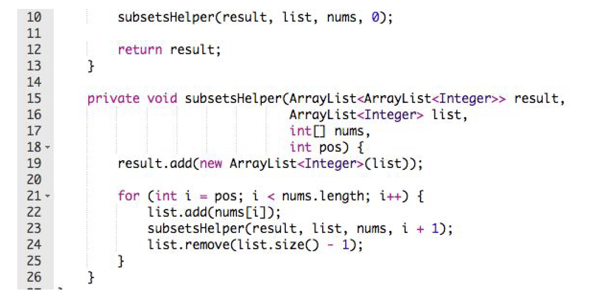
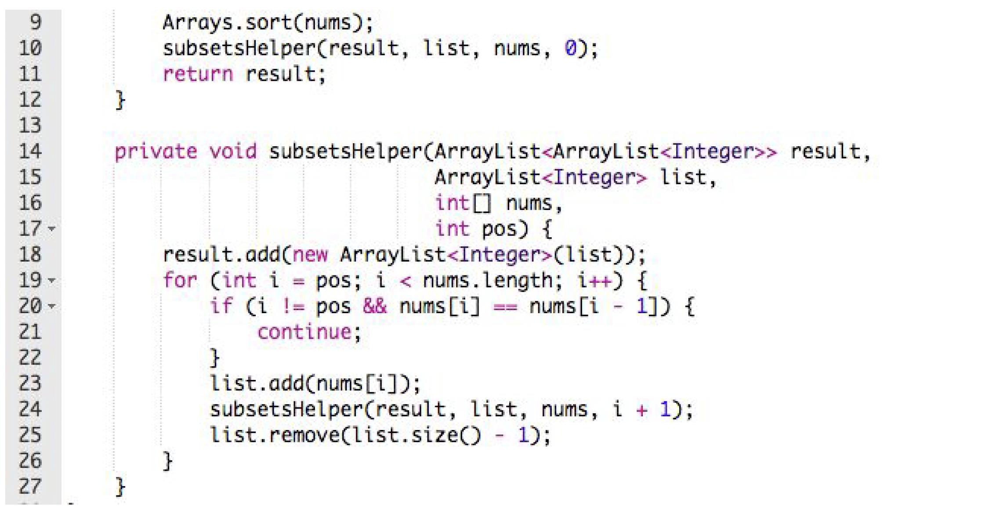
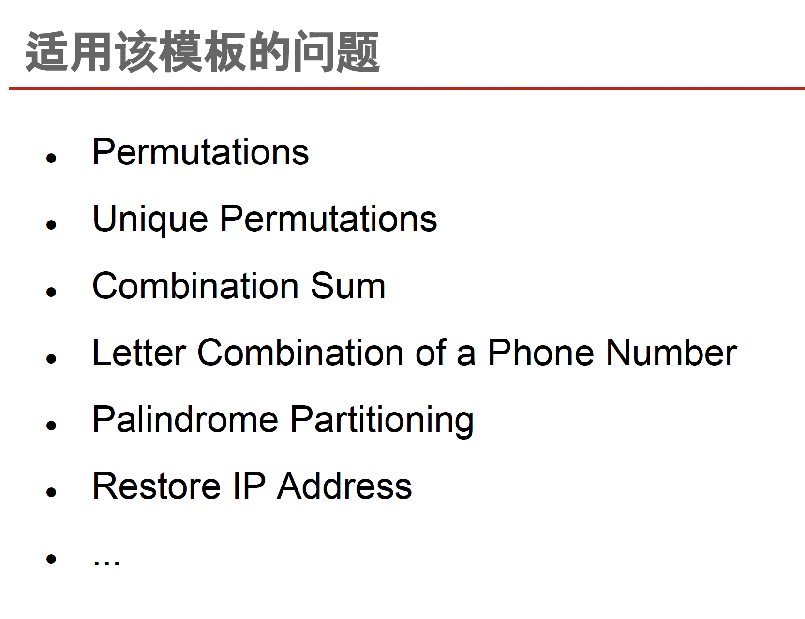
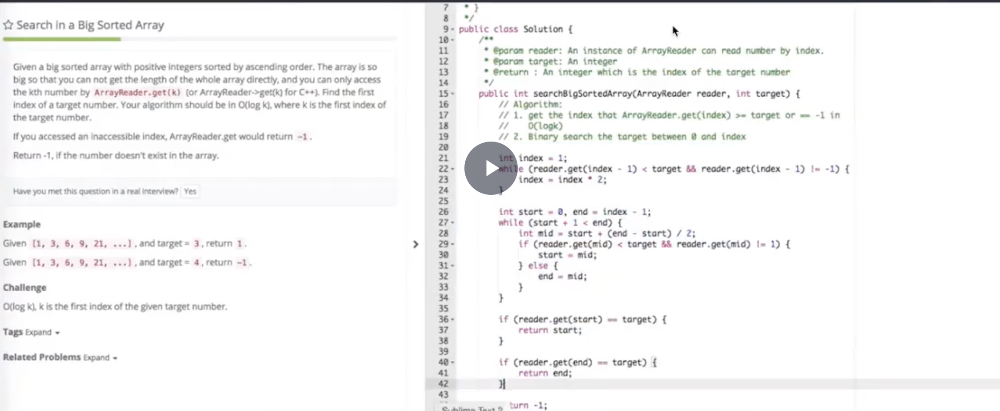
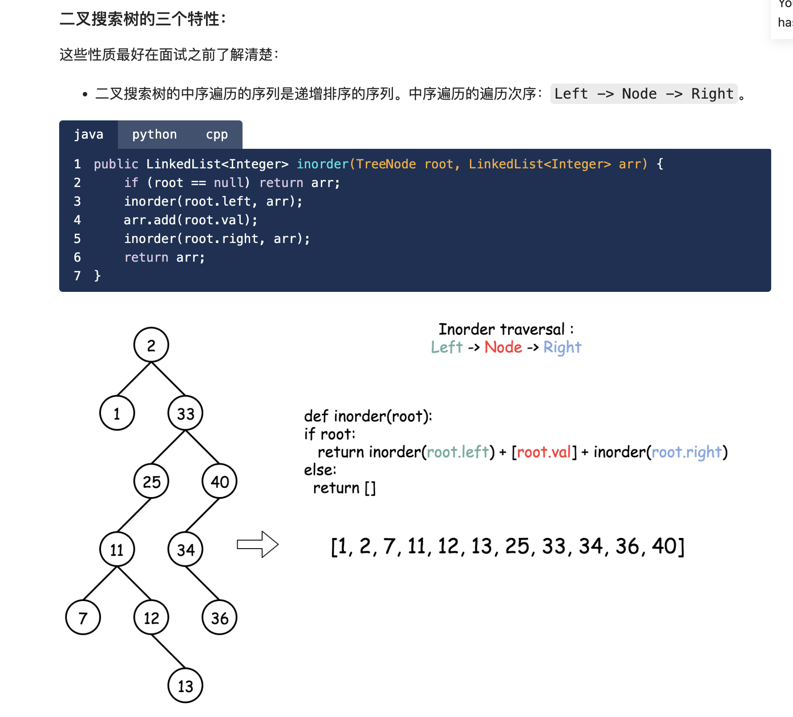
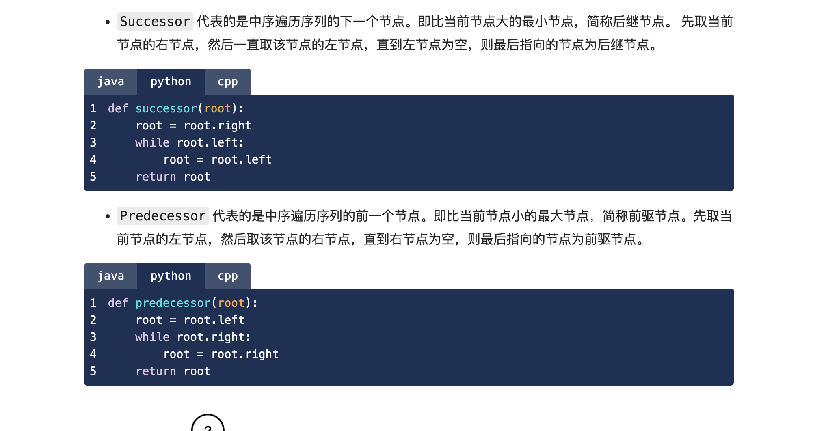
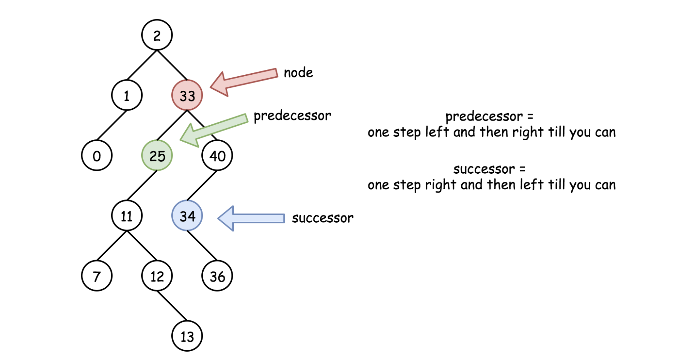
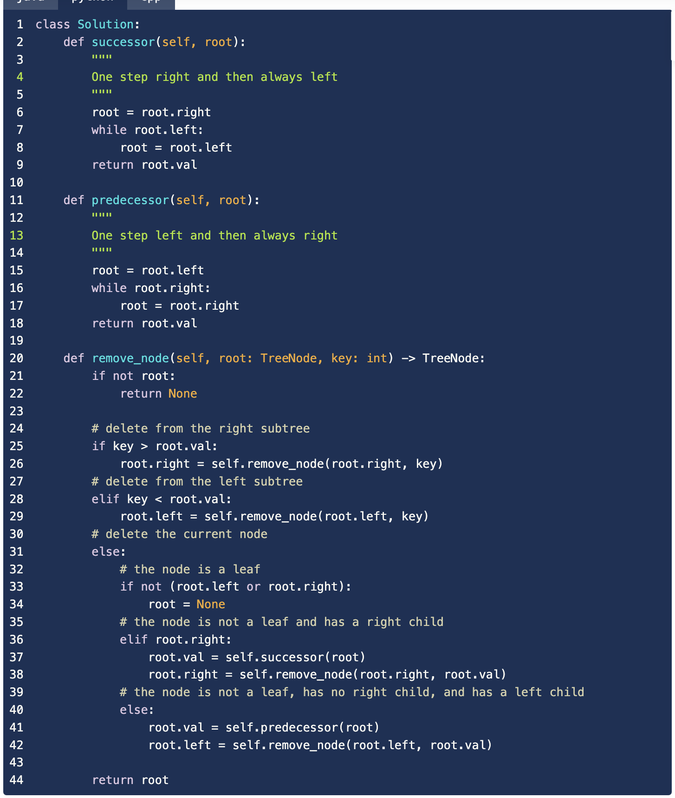
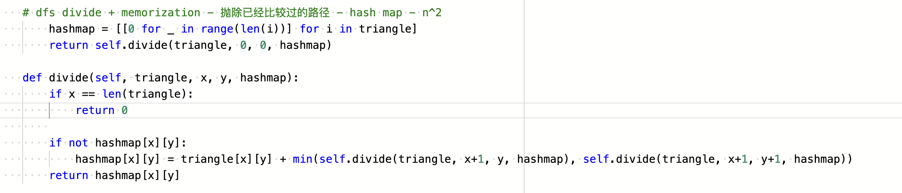
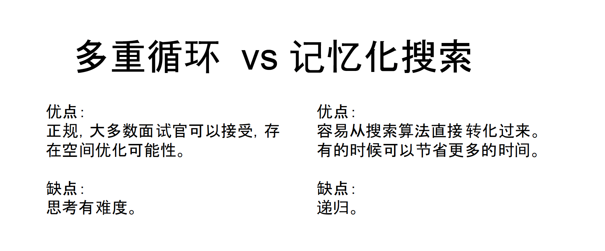

# 九章算法模板

## Search - Recursion - Backtracking

### 排列组合模板

* 例题：lintcode：17 18
  * lintcode17: Given a set with distinct integers, return all possible subsets (in any order).
  * 
  * lintcode18: Given a collection of integers that might contain duplicate numbers, return all possible subsets.
  * 

* 适用范围
  * 似乎所有搜索问题，会有细微改动
  * 什么时候输出
  * 哪些情况需要跳过
  * 

## binary search
* 所有比较全部统一`<`或者`<=`
```java
class Solution {
    // First Search
    public int binarySearch(int[] nums, int target) {
        if (nums == null) || (nums.length == 0) {
            return -1;
        }

        int left = 0;
        int right = nums.length - 1;

        while (left + 1 < right) { // 为了使得退出循环的时候left和right是挨着的(或者相等，如果一开始left和right就是相等的），并且mid始终没有取到left或者right（mid如果等于left或者right可能出现死循环）
            int mid = left + (right - left) / 2;  //防止溢出
            if (nums[mid] == target) {
                right = mid; //往左，找第一个position
                //找最后一个position
                //left = mid;
            } else if (nums[mid] < target) {
                left = mid;
            } else {
                right = mid;
            }
        } //核心：一直二分到只剩两个数

        if (nums[left] == target) {
            return left;
        }
        if (nums[right] == target) {
            return right;
        }

        return -1;
    }
}
```
```java
class Solution {
    //LastSearch
    public int binarySearch(int[] nums, int target) {
        if (nums == null) || (nums.length == 0) {
            return -1;
        }

        int left = 0;
        int right = nums.length - 1;

        while (left + 1 < right) { // 为了使得退出循环的时候left和right是挨着的(或者相等，如果一开始left和right就是相等的），并且mid始终没有取到left或者right（mid如果等于left或者right可能出现死循环）
            int mid = left + (right - left) / 2;  //防止溢出
            if (nums[mid] == target) {
                left = mid; 
            } else if (nums[mid] < target) {
                left = mid;
            } else {
                right = mid;
            }
        } //核心：一直二分到只剩两个数

        //这个前后顺序不要搞错
        if (nums[right] == target) {
            return right;
        }
        if (nums[left] == target) {
            return left;
        }

        return -1;
    }
}
```
* 复杂度：o（logn）
* 使用场景：
  * 需要优化O(n)的暴力算法（除了logn，还有1，n，根号n可以用于优化n）
  * Sorted array or Ratated sorted array
* logn算法：
  * 二分法
  * 倍增法
* lintcode


## 二叉树 binary tree

### 复杂度分析
* traverse-recursion
  * 时间复杂度：o（n）空间 o（n）

* divide-conquer-recursion
  * 时间复杂度：o（n）空间 o（n）

### preorder

#### stack-version
```java
public class TreeNode {
    int val;
    TreeNode left;
    TreeNode right;
    TreeNode(int val) {
        this.val = val;
    }
}

public class Solution {
    public List<Integer> preorderTraversal(TreeNode root) {
        Stack<TreeNode> stack = new Stack<TreeNode>();
        List<Integer> preorder = new ArrayList<Integer>();

        if (root == null) {
            return preorder;
        }

        stack.push(root);
        while (!stack.empty()) {
            TreeNode node = stack.pop();
            preorder.add(node.val);
            if (node.right != null) {
                stack.push(node.right);
            }
            if (node.left != null) {
                stack.push(node.left);
            }
        }

        return preorder;
    }
}
```

#### recursion-traverse-version
```java
//无返回值
//需要helper
// top down
public class Solution {
    public ArrayList<Integer> preorderTraversal(TreeNode root) {
    ArrayList<Integer> res = new ArrayList<Integer>();
    preorder(root, res);
    return res;
}

    public void preorder(TreeNode root, ArrayList<Integer> res) {
        if (root == null) {
            return;
        }

        res.add(root.val);
        preorder.add(root.left, res);
        preorder.add(root.right, res);
    }
}
```

#### recursion-divide-conquer-version
```java
// 有返回值
// bottom up
public class Solution {
    public ArrayList<Integer> preorderTraversal(TreeNode root) {
        ArrayList<Integer> res = new ArrayList<Integer>();
        // null or leaf
        if (root == null) {
            return res;
        }

        // Divide
        ArrayList<Integer> left = preorderTraversal(root.left);
        ArrayList<Integer> right = preorderTraversal(root.right);

        res.add(root.val);
        res.addAll(left);
        res.addAll(right);

        return res;
    }
}
```


### inorder

#### stack-version
```java
// TreeNode above

public class Solution {
    public ArrayList<Integer> inorder(TreeNode root) {
        Stack<Integer> stack = new Stack<Integer>();
        ArrayList<Integer> res = new ArrayList<Integer>();

        if (root == null) {
            return res;
        }

        while (root != null || !stack.empty()) {
            while (root != null) {
                stack.push(root);
                root = root.left;
            }

            TreeNode node = stack.pop();
            res.add(node.val);
            root = node.right;
        }
        return res;
    }
}
```

#### recursion-traverse-version

```java
public class Solution {
    public ArrayList<Integer> inorderTraversal(TreeNode root) {
        ArrayList<Integer> res = new ArrayList<Integer>();
        inorder(root, res);
        return res;
    }

    public void inorder(TreeNode root, ArrayList<Integer> res) {
        if (root == null) {
            return;
        }

        inorder(root.left, res);
        res.add(root.val);
        inorder(root.right, res);
    }
}
```

#### recursion-divide-conquer-version

```java
public class Solution {
    public ArrayList<Integer> inorderTraversal(TreeNode root) {
        ArrayList<Integer> res = new ArrayList<Integer>();
        if (root == null) {
            return res;
        }

        ArrayList<Integer> left = inorderTraversal(root.left);
        ArrayList<Integer> right = inorderTraversal(root.right);

        res.addAll(root.left);
        res.add(root.val);
        res.addAll(root.right);

        return res;
    }
}
```

### postorder

#### stack-version
```java
public class Solution {
    public ArrayList<Integer> postorderTraversal(TreeNode root) {
        ArrayList<Integer> res = new ArrayList<Integer>();
        Stack<Integer> stack = new Stack<Integer>();
        TreeNode pre;

        if (root == null) {
            return res;
        }

        while (root != null || !stack.empty()) {
            while (root != null) {
                stack.push(root);
                root = root.left;
            }

            TreeNode node = stack.pop();

            if (node.right == null || node.right == pre) {
                res.add(node.val);
                pre = node;
                root = null;
            } else {
                stack.push(node);
                root = node.right;
            }
        }

        return res;
    }
}
```

#### recursion-traverse-version

```java
public class Solution {
    public ArrayList<Integer> postorderTraversal(TreeNode root) {
        ArrayList<Integer> res = new ArrayList<Integer>();
        postorder(root, res);
        return res;
    }

    public void postorder(TreeNode root, ArrayList<Integer> res) {
        if (root == null) {
            return;
        }

        postorder(root.left, res);
        postorder(root.right, res);
        res.add(root.val);
    }
}
```

#### recursion-divide-conquer-version

```java
public class Solution {
    public ArrayList<Integer> postorderTraversal(TreeNode root) {
        ArrayList<Integer> res = new ArrayList<Integer>();
        if (root == null) {
            return res;
        }

        ArrayList<Integer> left = postorderTraversal(root.left);
        ArrayList<Integer> right = postorderTraversal(root.right);

        res.addAll(root.left);
        res.addAll(root.right);
        res.add(root.val);

        return res;
    }
}
```

### level-order

### 1 Queue - Best
```java
public class Solution {
    public List<List<Integer>> levelOrderTraversal(TreeNode root) {
        List<List<Integer>> ret = new ArrayList<List<Integer>>();
        if (root == null) {
            return ret;
        }

        Queue<TreeNode> queue = new LinkedList<TreeNode>();
        queue.offer(root); // 加入到尾巴
        while (!queue.isEmpty()) {
            List<Integer> level = new ArrayList<Integer>();
            int currentLevelSize = queue.size();
            for (int i = 1; i <= currentLevelSize; ++i) {
                TreeNode node = queue.poll(); // 从头部pop
                level.add(node.val);
                if (node.left != null) {
                    queue.offer(node.left);
                }
                if (node.right != null) {
                    queue.offer(node.right);
                }
            }
            ret.add(level);
        }
        
        return ret;
    }
}
```

### DFS-version
```java
public class Solution {
    public ArrayList<ArrayLisy<Integer>> levelOrderTraversal(TreeNode root) {
        ArrayList<ArrayLisy<Integer>> ret = new ArrayList<ArrayLisy<Integer>>();
        if (root == null) {
            return ret;
        }

        int maxLevel = 0;
        while(true) {
            ArrayList<Integer> level = new ArrayList<Integer>();
            dfs(root, level, 0, maxLevel);
            if (level.size(0) == 0) {
                break;
            }

            ret.add(level);
            maxLevel++;
        }
        
        return ret;
    }
}

public void dfs(TreeNode root, ArrayLisy<Integer> level, int curtLevel, int maxLevel) {
    if (root == null || curtLevel > maxLevel) {
        return;
    }

    if (curtLevel == maxLevel) {
        level.add(root.val)
        return;
    }

    dfs(root.left, level, curtLevel + 1, maxLevel);
    dfs(root.right, level, curtLevel + 1, maxLevel);
}
```

### 2 Queue
```java
```

### 1 Queue + dummy node
```java
```

### binary search tree
* inorder
* 
* 
* 
* 

## Dynamic Programming
* lintcode
  * 多重循环、记忆搜索、分治法、traverse - 109

* 使用情况（极有可能）
  * 最小值最大值（a-b路径的最小值）
  * 判断可信性（a-b有没有路径）
  * 统计方案个数（多少条路径）
* 不使用情况
  * 求所有的具体方案而非方案个数 - lintcode136
  * 输入数据是集合而不是序列 - lintcode124
* 从递归到动归 - triangle问题 - lintcode109
  * 
* 记忆化搜索本质 - 动态规划
* 动态规划与分治的区别：分治有重复，动态规划没有 - 效率
* 

### 多重循环
* lintcode - 109
* 自底向上
  * 状态定义
  * 初始化最后一层
  * bottom up 递归循环
* 自顶向下
  * 状态定义
  * 初始化开头或者需要的部分
  * top down 递归循环

### 记忆化搜索
* lintcode - 109

