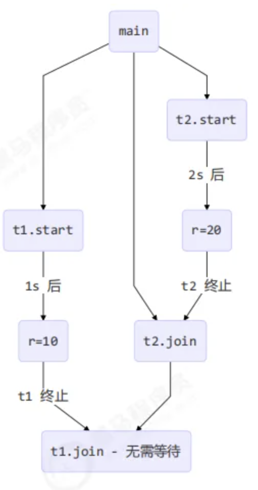

# Java并发编程

## 概览
### 学习内容
* 进程
* 线程
* 并发
* 并行
* java并发工具、并发问题以及解决方案等

### 学习框架

## 线程与进程

### 进程与线程概念

#### 进程
* e.g. windows下的exe程序执行 - 可以在任务调度表查看
* **进程用来加载指令、管理内存和IO。一个程序被运行需要从磁盘加载这个程序代码到内存 - 开启一个进程 - 一个程序的实例**
* 大部分程序可以同时运行多个实例进程，也可能只启动一个实例进程
* **上下文切换**：指内存容量不够的情况下，要运行某个进程，可以先把不运行的进程暂停，临时存储，切换到其他程序（进程）运行
* java中，作为**资源分配的最小单位**，在windows下不活动，只作为线程的容器

#### 进程
* **一个进程含有一到多个线程**
* 属于一个指令流，里面一条条指令cpu按顺序执行
* java中，作为**最小调度单位**

#### 对比
* **进程基本相互独立**；线程在进程内作为一个**子集**
* **进程拥有共享资源**，如内存空间等，供其**内部的线程共享**
* **进程间通信**较为复杂
  * **同一台**计算机的进程通信称为**IPC（Inter-process communication）** 
  * **不同计算机**之间的进程通信，需要通过**网络**，并遵守共同的**协议**，例如**HTTP** 
* **线程通信相对简单**，因为它们**共享进程内的内存**，一个例子是多个线程可以访问同一个共享变量 
* 线程更轻量，**线程上下文切换成本一般上要比进程上下文切换低**

### 并行与并发

#### 并发
* **单核 cpu** 下，线程 - **串行执行**
* 操作系统中有一个组件叫做**任务调度器**，将 cpu 的时间片（windows 下时间片最小约为 15 毫秒）分给不同的程序使用，只是由于 cpu 在**线程间（时间片很短）的切换非常快**，人类感觉是同时运行的 - **微观串行，宏观并行**
* **线程轮流使用CPU的做法称为并发（concurrent）**

#### 并行
* **多核cpu下，每个 核（core） 都可以调度运行线程**，这时候线程可以是并行的
* **核数比线程少的时候，是并行和并发都有**

#### 应用

* **异步调用**
  * 同步：等待结果返回后再继续运行
  * **异步：不用等待结果返回直接继续运行**
  * 设计方案
    * 多线程 - 建立多个线程并行（或者并发）操作，互相不干扰，共同进行
  * 应用场景
    * 大视频转换用新线程防止阻塞主线程
    * tomcat的异步servlet - 让用户线程处理耗时较长的操作，避免阻塞tomcat的工作线程 
    * ui程序中，开线程进行其他操作，避免阻塞ui线程

* **提高效率**
  * **多线程充分利用多个cpu优势，提高运行效率**
  * 注意：**必须是多核，单核仍然要轮流执行**（要并发即串行执行）
  * 设计方案
    * cpu核数限制
      * 使用虚拟机分配核数
      * 使用msconfig分配核数，但需要重启
  * 结论
    * **单核**基本不能用多线程提高效率，但**能够并发使线程轮流切换使用cpu**，不至于一个线程总是占用cpu
    * **多核能够并行跑，但效率提高看情况**
      * **有些任务需要精心设计和任务拆分来并行执行**，才能提高效率，但很多任务不能拆分
      * 如果**任务目的不同**，谈拆分和效率没有意义
    * **IO操作不占用cpu，导致拷贝文件用的是阻塞IO，必须等IO结束，无法充分利用线程** - 优化：非阻塞IO & 异步IO

## Java线程

### 创建和运行线程

#### 方法一：直接使用Thread
* ```java
    // 创建线程对象
    Thread t = new Thread() {
        public void run() {
            // 要执行的任务
        }
    };
    // 启动线程
    t.start();
* ```java
    // 举例
    // 构造方法的参数是给线程指定名字，推荐
    Thread t1 = new Thread("t1") {
        @Override
        // run 方法内实现了要执行的任务
        public void run() {
            log.debug("hello");
        }
    };
    t1.start();
#### 方法二：使用 Runnable 配合 Thread 
* 把【线程】和【任务】（要执行的代码）分开 
* ```java
    Runnable runnable = new Runnable() {
    public void run(){
        // 要执行的任务
    }
    };
    // 创建线程对象
    Thread t = new Thread( runnable );
    // 启动线程
    t.start();
* ```java
    // 举例
    // 创建任务对象
    Runnable task2 = new Runnable() {
        @Override
        public void run() {
            log.debug("hello");
        }
    };

    // 参数1 是任务对象; 参数2 是线程名字，推荐
    Thread t2 = new Thread(task2, "t2");
    t2.start();
* **Runnable源码**
  * 属于interface
  * 有注解`@FunctionalInterface`，意味着可以使用java8之后lambda简化 - 必须只有一个抽象方法
    * ```java
        // 创建任务对象
        Runnable task2 = () -> log.debug("hello");
        // Runnable task2 = () -> {log.debug("hello");};

        // 参数1 是任务对象; 参数2 是线程名字，推荐
        Thread t2 = new Thread(task2, "t2");
        // Thread t2 = new Thread(() -> {log.debug("hello");}, "t2");
        t2.start();
  * Runnable只有一个`public abstract void run()`
* **原理之 Thread 与 Runnable 的关系** 
  * ```
    private Runnable target;
    // Thread class
    @Override
    public void run() {
        if (target != null) {
            target.run();
        }
    }
  * Thread本质是一个class，我们**写一个他的新子类然后override他的run方法来实现方法一**
  * 使用**方法二最终本质还是调用thread的run方法**
  * 方法1是把线程和任务合并在了一起，**方法2 是把线程和任务分开了**
  * 用 Runnable 更容易与**线程池等高级 API 配合** 
  * 用 Runnable 让任务类脱离了 Thread 继承体系，更灵活
#### 方法三：FutureTask 配合 Thread
* FutureTask 能够**接收 Callable 类型的参数**，用来处理**有返回结果**的情况
* **FutureTask解析**
  * 是个Class，`implements RunnableFuture<V>`这个接口
  * `RunnableFuture<V>`这个接口 `extends Runnable, Future<V>`,里面就一个`void run()`
  * Future<V>接口里面有`V get()`方法用来返回执行结果
  * Runnable的run方法是void
* **Callable解析**
  * 跟Runnable基本一样的接口，多了个`V call() throws Exception`方法，可以返回结果，并且可以抛出异常
* ```java
    // 创建任务对象
    FutureTask<Integer> task3 = new FutureTask<>(() -> {
        log.debug("hello");
        Thread.sleep(1000);
        return 100;
    });
    //FutureTask<Integer> task3 = new FutureTask<>(new Callable<Integer>() {
    //      @Override
    //      public Integer call() throws Exception {
    //        log.debug("hello");
    //        Thread.sleep(1000);
    //        return 100;
    //      }
    //});

    // 参数1 是任务对象; 参数2 是线程名字，推荐
    new Thread(task3, "t3").start();

    // 主线程阻塞，同步等待 task 执行完毕的结果
    Integer result = task3.get();
    log.debug("结果是:{}", result);
* ```
    19:22:27 [t3] c.ThreadStarter - hello
    19:23:27 [main] c.ThreadStarter - 结果是:100
### 观察多个线程同时运行
* **交替执行,谁先谁后，不由我们控制**

### 查看进程线程的方法
* **windows**
  * windows下出现异常(例如jps看不到,jconsole也没有可用pid),尝试管理员身份运行cmd。cmd在 C:\Users\{用户名}\AppData\Roaming\Microsoft\Windows\Start Menu\Programs\System Tools
  * 任务管理器可以查看进程和线程数，也可以用来杀死进程 
  * tasklist 查看进程 
    * `tasklist | findstr java` -- 找到java相关的进程
  * taskkill 杀死进程
    * `taskkill -F /PID 28060` -- 杀死PID为28060的进程，-F为强制
* **Java** 
  * jps 命令查看所有 Java 进程 
  * jstack <PID> 查看某个 Java 进程（PID）的所有线程状态 - 某一刻
  * jconsole 来查看某个 Java 进程中线程的运行情况（图形界面）
* **linux** 
  * ps -fe 查看所有进程
    * `ps -fe | grep java` -- 找到java相关的进程
  * ps -fT -p <PID> 查看某个进程（PID）的所有线程 
  * kill杀死进程
    * `kill 4202`
  * top 动态显示进程 按大写H切换是否显示线程
  * top -H -p <PID> 查看某个进程（PID）的所有线程
* **jconsole 远程监控配置**
  * 需要以如下方式运行你的 java 类
    ```
    java -Djava.rmi.server.hostname=`ip地址` -Dcom.sun.management.jmxremote -
    Dcom.sun.management.jmxremote.port=`连接端口` -Dcom.sun.management.jmxremote.ssl=是否安全连接 -
    Dcom.sun.management.jmxremote.authenticate=是否认证 java类
  * linux可以用ifconfig查看ip地址
  * 修改 /etc/hosts 文件将 127.0.0.1 映射至主机名
  * 如果要认证访问，还需要做如下步骤
    * 复制 jmxremote.password 文件 
    * 修改 jmxremote.password 和 jmxremote.access 文件的权限为 600 即文件所有者可读写 
    * 连接时填入 controlRole（用户名），R&D（密码）

### 原理之线程运行
#### 栈与栈帧 Java Virtual Machine Stacks （Java 虚拟机栈）
* **栈内存是给线程使用**，每个线程启动后，虚拟机就会为其**分配一块栈内存** 
* 每个**栈由多个栈帧（Frame）组成**，对应着**每次方法调用时所占用的内存** 
*** 每个线程只能有一个活动栈帧**，对应着**当前**正在执行的那个**方法**
* **单个线程**
  * 
  * 
  * 
  * 
  * 
  * 
  * 
  * 
* **多个线程**
  * debug断点需要换成thread模式，然后就能切换线程看各个线程运行到哪儿了
  * 线程运行，互不干扰
### 线程上下文切换（Thread Context Switch） 
* 导致 cpu 不再执行当前的线程，转而执行另一个线程的代码的**可能原因**
  * 线程的 cpu 时间片用完 
  * 垃圾回收 
  * 有更高优先级的线程需要运行 
  * 线程自己调用了 **sleep、yield、wait、join、park、synchronized、lock 等方法（这个是主动的切换）**
* 当 **Context Switch** 发生时，需要**由操作系统保存当前线程的状态，并恢复另一个线程的状态**，Java 中对应的概念就是**程序计数器（Program Counter Register）**，它的作用是记住**下一条 jvm 指令的执行地址**，是**线程私有**的 
    * 状态包括**程序计数器、虚拟机栈中每个栈帧的信息**，如局部变量、操作数栈、返回地址等 
    * Context Switch **频繁发生会影响性能**
* 
### 常见方法

* 
* 

### start 与 run
* 调用run
    * ```java
        public static void main(String[] args) {
        Thread t1 = new Thread("t1") {
            @Override
            public void run() {
                log.debug(Thread.currentThread().getName());
                FileReader.read(Constants.MP4_FULL_PATH);
            }
        };
        
        t1.run();
        log.debug("do other things ...");
        }
        // t1.run()是在main调用的，而非t1调用，所以下一条log必须等这条执行完才能被运行
    * ```
        19:39:14 [main] c.TestStart - main
        19:39:14 [main] c.FileReader - read [1.mp4] start ...
        19:39:18 [main] c.FileReader - read [1.mp4] end ... cost: 4227 ms
        19:39:18 [main] c.TestStart - do other things ...
        程序仍在 main 线程运行， FileReader.read() 方法调用还是同步的
* 调用 start
  * 将上述代码的 t1.run(); 改为 t1.start();
  * ```
        19:41:30 [main] c.TestStart - do other things ...
        19:41:30 [t1] c.TestStart - t1
        19:41:30 [t1] c.FileReader - read [1.mp4] start ...
        19:41:35 [t1] c.FileReader - read [1.mp4] end ... cost: 4542 ms
        程序在 t1 线程运行， FileReader.read() 方法调用是异步的
* 结论
  * **直接调用 run 是在主线程中执行**了 run，没有启动新的线程 
  * **使用 start 是启动新的线程，通过新的线程间接执行 run 中的代码**
  * `t1.getState()`可以查看线程状态，如果**刚建成打印出来时NEW**，如果**已经start了则打印出来是RUNNABLE**

### sleep 与 yield

#### sleep
* 调用 sleep 会让当前线程从 Running进入 **Timed Waiting 状态**（阻塞，一定不执行）- getState()
* 其它线程可以使用 **interrupt 方法打断正在睡眠**的线程，这时 sleep 方法会抛出 **InterruptedException** 
* 睡眠**结束后**的线程**未必会立刻得到执行**
* 建议用 **TimeUnit 的 sleep** 代替 Thread 的 sleep 来获得**更好的可读性** 
  * e.g. `TimeUnit.SECONDS.sleep(1);`

#### yield
* 调用 yield 会让当前线程从 Running 进入 **Runnable就绪状态**，**然后调度执行其它线程** 
* 具体的实现依**赖于操作系统的任务调度器**
* Runnable状态 - **依旧有可能被执行**，比如就只有这一个线程的时候
* 没有等待时间

#### 线程优先级
* 优先级1-10级，**数字越大优先级越高**，默认5
* 线程优先级会提示（hint）调度器优先调度该线程，但它**仅仅是一个提示**，调度器可以忽略它 
* 如果 **cpu 比较忙，那么优先级高的线程会获得更多的时间片**，但 cpu **闲时，优先级几乎没作用**
* ```java
    Runnable task1 = () -> {
        int count = 0;
        for (;;) {
            System.out.println("---->1 " + count++);
        }
    };
    Runnable task2 = () -> {
        int count = 0;
        for (;;) {
            // Thread.yield();
            System.out.println(" ---->2 " + count++);
        }
    };
    Thread t1 = new Thread(task1, "t1");
    Thread t2 = new Thread(task2, "t2");
    // t1.setPriority(Thread.MIN_PRIORITY);
    // t2.setPriority(Thread.MAX_PRIORITY);
    t1.start();
    t2.start();

#### 应用: 限制-1.限制对CPU的使用
* **sleep 实现**
  * ```java
        while(true) {
            try {
                Thread.sleep(50);
            } catch (InterruptedException e) {
                e.printStackTrace();
            }
        }
* **wait实现**
    * ```java
        synchronized(锁对象) {
            while(条件不满足) {
                try {
                    锁对象.wait();
                } catch(InterruptedException e) {
                    e.printStackTrace();
                }
            }
            // do sth...
        }
* **条件变量实现**
  * ```java
        lock.lock();
        try {
            while(条件不满足) {
                try {
                    条件变量.await();
                } catch (InterruptedException e) {
                    e.printStackTrace();
                }
            }
            // do sth...
        } finally {
            lock.unlock();
        }
* **方法区别**
  * **后两种都需要加锁**，并且需要相应的**唤醒操作**，一般适用于要进行**同步**的场景 
  * **sleep** 适用于**无需锁同步**的场景
### join方法详解
#### 需要join原因
* ```java
    static int r = 0;
    public static void main(String[] args) throws InterruptedException {
        test1();
    }

    private static void test1() throws InterruptedException {
        log.debug("开始");
        Thread t1 = new Thread(() -> {
            log.debug("开始");
            sleep(1);
            log.debug("结束");
            r = 10;
        });
        t1.start();
        // t1.join(); 等待t1结束
        log.debug("结果为:{}", r);
        log.debug("结束");
    }
* 结果：打印出来的是r=0
* 分析
  * 因为主线程和线程 t1 是并行执行的，t1 线程需要 1 秒之后才能算出 r=10 
  * 而主线程一开始就要打印 r 的结果，所以只能打印出 r=0 
* **解决方法**
  * 用sleep可以，但选取的**等待时间不好把控**
  * **用 join，加在 t1.start() 之后即可**
#### 应用案例
  * 同步
    * 
  * 多个结果
    * ```java
        static int r1 = 0;
        static int r2 = 0;
        public static void main(String[] args) throws InterruptedException {
            test2();
        }
        private static void test2() throws InterruptedException {
            Thread t1 = new Thread(() -> {
                sleep(1);
                r1 = 10;
            });
            Thread t2 = new Thread(() -> {
                sleep(2);
                r2 = 20;
            });
            long start = System.currentTimeMillis();
            t1.start();
            t2.start();
            t1.join();
            t2.join();
            long end = System.currentTimeMillis();
            log.debug("r1: {} r2: {} cost: {}", r1, r2, end - start);
        }
    * 分析
      * 第一个 join：等待 t1 时, t2 并没有停止, 而在运行 
      * 第二个 join：1s 后, 执行到此, t2 也运行了 1s, 因此也只需再等待 1s
      * 
      * 如果调换t1和t2 
#### 有时效的join
* 等够时间
  * ```java
        static int r1 = 0;
        static int r2 = 0;
        public static void main(String[] args) throws InterruptedException {
            test3();
        }
        public static void test3() throws InterruptedException {
            Thread t1 = new Thread(() -> {
                sleep(1);
                r1 = 10;
            });
            long start = System.currentTimeMillis();
            t1.start();
            // 线程执行结束会导致 join 结束
            t1.join(1500);
            long end = System.currentTimeMillis();
            log.debug("r1: {} r2: {} cost: {}", r1, r2, end - start);
            //输出：r1: 10 r2: 0 cost: 1010
        }
* 没有等够时间
  * ```java
        static int r1 = 0;
        static int r2 = 0;
        public static void main(String[] args) throws InterruptedException {
            test3();
        }
        public static void test3() throws InterruptedException {
            Thread t1 = new Thread(() -> {
                sleep(2);
                r1 = 10;
            });
            long start = System.currentTimeMillis();
            t1.start();
            // 线程执行结束会导致 join 结束
            t1.join(1500);
            long end = System.currentTimeMillis();
            log.debug("r1: {} r2: {} cost: {}", r1, r2, end - start);
            // 输出：20:52:15.623 [main] c.TestJoin - r1: 0 r2: 0 cost: 1502
        }

### interrupt 方法详解
#### 打断 sleep，wait，join 的线程（阻塞线程）
* 这几个方法都会让线程进入**阻塞状态** 
* **打断 sleep，wait，join 的线程, 会清空打断状态**，isInterrupted() -> false（正常运行被打断就是true）
* 打断阻塞的线程（sleep,wait,join）线程会**抛出异常InterruptedException**
* ```java
    private static void test1() throws InterruptedException {
        Thread t1 = new Thread(()->{
            sleep(1);
        }, "t1");
        t1.start();
        sleep(0.5);
        t1.interrupt();
        log.debug(" 打断状态: {}", t1.isInterrupted());
    }
#### 打断正常运行的线程
* ```java
    private static void test2() throws InterruptedException {
        Thread t2 = new Thread(()->{
            while(true) {
                Thread current = Thread.currentThread();
                boolean interrupted = current.isInterrupted();
                if(interrupted) {
                    log.debug(" 打断状态: {}", interrupted);
                    break;
                }
            }
        }, "t2");
        t2.start();
        sleep(0.5);
        t2.interrupt();
        // 输出：打断状态: true
    }
* 由线程自己决定是否被打断
#### 打断park线程
* 打断 park 线程, **不会清空打断状态**
* ```java
    private static void test3() throws InterruptedException {
        Thread t1 = new Thread(() -> {
            log.debug("park...");
            LockSupport.park();
            log.debug("unpark...");
            log.debug("打断状态：{}", Thread.currentThread().isInterrupted());
        }, "t1");
        t1.start();
        sleep(0.5);
        t1.interrupt();
    }
* ```
    21:11:52.795 [t1] c.TestInterrupt - park... 
    21:11:53.295 [t1] c.TestInterrupt - unpark... 
    21:11:53.295 [t1] c.TestInterrupt - 打断状态：true
* 如果打断标记已经是 **true**, 则 **park 会失效**，可以使用 **Thread.interrupted() 清除打断状态**

### 不推荐的方法
* 这些方法已过时，容易破坏同步代码块，造成线程死锁
* 

### 主线程与守护线程
* 默认情况下，**Java 进程需要等待所有线程都运行结束，才会结束**
* **守护线程**
  * 只要**其它非守护线程运行结束**了，即使守护线程的代码没有执行完，也会**强制结束**
* ```java
    log.debug("开始运行...");
    Thread t1 = new Thread(() -> {
    log.debug("开始运行...");
    sleep(2);
    log.debug("运行结束...");
    }, "daemon");
    // 设置该线程为守护线程
    t1.setDaemon(true);
    t1.start();

    sleep(1);
    log.debug("运行结束...");
* ```
    08:26:38.123 [main] c.TestDaemon - 开始运行... 
    08:26:38.213 [daemon] c.TestDaemon - 开始运行... 
    08:26:39.215 [main] c.TestDaemon - 运行结束...
### 五种线程状态 (操作系统层面)
* 
*【初始状态】**仅是在语言层面创建了线程对象**，还未与操作系统线程关联 
* 【可运行状态】（就绪状态）指该线程**已经被创建**（**与操作系统线程关联**），可以**由 CPU 调度执行** 
* 【运行状态】指**获取了 CPU 时间片运行中的状态** 
  * 当 CPU **时间片用完**，会从【运行状态】转换至【可运行状态】，会**导致线程的上下文切换** 
* 【阻塞状态】 
  * 如果**调用了阻塞 API，如 BIO 读写文件，这时该线程实际不会用到 CPU**，会导致线程**上下文切换**，进入【阻塞状态】 
  * 等 BIO 操作完毕，会**由操作系统唤醒阻塞的线程**，转换至【可运行状态】 
  * 与【可运行状态】的区别是，**对【阻塞状态】的线程来说只要它们一直不唤醒，调度器就一直不会考虑调度它们** 
  * 网络IO、文件IO类似的操作都会使得线程进入阻塞状态，CPU不会调度该线程，方法会卡住，该线程中后续的方法无法执行，因此**一般我们将这种阻塞的方法与操作单独开一个线程出来进行执行，等该阻塞操作完成，操作系统会唤醒该阻塞的线程，将该线程切换至可运行状态**
* 【终止状态】表示线程**已经执行完毕**，生命周期已经结束，不**会再转换为其它状态**

### 六种状态(Thread.State)(Java API 层面)
* 
* Thread.State - 枚举类 - **六个枚举项**
* NEW线程刚被创建，但是还没有调用 start() 方法 
* **RUNNABLE** 当调用了 start() 方法之后，注意，Java API 层面的 RUNNABLE 状态涵盖了 **操作系统 层面的【可运行状态】、【运行状态】和【阻塞状态】（由于 BIO 导致的线程阻塞，在 Java 里无法区分，仍然认为是可运行）** 
* **BLOCKED ， WAITING ， TIMED_WAITING** 都是 **Java API 层面对【阻塞状态】的细分**
* TERMINATED 当线程代码运行结束

### 习题 - 统筹方法
* 阅读华罗庚《统筹方法》，给出烧水泡茶的多线程解决方案
  * 
  * 参考图，用两个线程（两个人协作）模拟烧水泡茶过程 
    * 文中办法乙、丙都相当于任务串行 
    * 而图一相当于启动了 4 个线程，有点浪费 
  * 用 sleep(n) 模拟洗茶壶、洗水壶等耗费的时间
* 解决方法
* 方法一
    * ```java
        Thread t1 = new Thread(() -> {
            log.debug("洗水壶");
            sleep(1);
            log.debug("烧开水");
            sleep(15);
        }, "老王");

        Thread t2 = new Thread(() -> {
            log.debug("洗茶壶");
            sleep(1);
            log.debug("洗茶杯");
            sleep(2);
            log.debug("拿茶叶");
            sleep(1);
            try {
                t1.join();
            } catch (InterruptedException e) {
                e.printStackTrace();
            }
            log.debug("泡茶");
        }, "小王");

        t1.start();
        t2.start();
    * 缺陷
      * 上面模拟的是小王等老王的水烧开了，小王泡茶，如果反过来要实现老王等小王的茶叶拿来了，老王泡茶呢？代码最好能适应两种情况 
      * 上面的两个线程其实是各执行各的，如果要模拟老王把水壶交给小王泡茶，或模拟小王把茶叶交给老王泡茶呢?

## 共享模型之管程
### 共享带来的问题
* 经典案例：夫妻在不同银行同时取钱
* 案例：两个线程同时对一个变量=0进行操作，一个++，一个--，本以为最终结果只可能是0或者1，但实际是各种数（正数、负数、0）
  * 原因
    *  Java 中对静态变量的自增，自减并不是原子操作
    *  Java 的内存模型如下，完成静态变量的自增，自减需要在主存和工作内存中进行数据交换
  * 
  * 顺序运行-0：
  * 交错运行导致负数
  * 交错运行导致正数
* **问题：多个线程读共享资源其实也没有问题，在多个线程对共享资源读写操作时发生指令交错，就会出现问题** 
* **临界区 Critical Section**
  * 一段**代码块内如果存在对共享资源的多线程读写操作**，称这段代码块为临界区
  * ```java
        static int counter = 0;
        static void increment()
        // 临界区
        {
            counter++; 
        }

        static void decrement()
        // 临界区
        {
            counter--; 
        }
* **竞态条件 Race Condition**
  * 多个线程在临界区内执行，由于**代码的执行序列不同而导致结果无法预测**，称之为发生了竞态条件

### synchronized解决方案
* 为了避免临界区的竞态条件发生的**解决方案**
  * **阻塞式**的解决方案：**synchronized，Lock** 
  * **非阻塞式**的解决方案：**原子变量** 

* **synchronized概念**
  * **对象锁**：它采用互斥的方式让**同一时刻至多只有一个线程能持有【对象锁】，其它线程再想获取这个【对象锁】时就会阻塞住**
  * 这样就能保证拥有锁的线程可以**安全的执行临界区内的代码**，**不用担心线程上下文切换**

* **注意** 
  * 虽然 java 中互斥和同步都可以采用 synchronized 关键字来完成，但它们还是有区别的： 
    * **互斥**是保证临界区的竞态条件发生，**同一时刻只能有一个线程执行临界区代码** 
    * **同步**是由于线程执行的先后、顺序不同、**需要一个线程等待其它线程运行到某个点**

* **使用**
  * ```java
    synchronized(对象) // 线程1， 线程2(blocked)
    {
        临界区
    }
* **应用举例**
  * ```java
    static int counter = 0;
    static final Object room = new Object();

    public static void main(String[] args) throws InterruptedException {
        
        Thread t1 = new Thread(() -> {
            for (int i = 0; i < 5000; i++) {
                synchronized (room) {
                    counter++;
                }
            }
        }, "t1");
        
        Thread t2 = new Thread(() -> {
            for (int i = 0; i < 5000; i++) {
                synchronized (room) {
                    counter--;
                }
            }
        }, "t2");
        
        t1.start();
        t2.start();
        t1.join();
        t2.join();
        log.debug("{}",counter);
    }
  * 
  * 
* **作用**
  * synchronized 实际是用对象锁**保证了临界区内代码的原子性**，临界区内的**代码对外是不可分割的，不会被线程切换所打断**。 

* **加深理解**
  * 如果把 synchronized(obj) 放在 for 循环的外面，如何理解？-- 原子性 
  * 如果 t1 synchronized(obj1) 而 t2 synchronized(obj2) 会怎样运作？ - 无法保护 -- 不是同一个锁 - 锁对象 
  * 如果 t1 synchronized(obj) 而 t2 没有加会怎么样？如何理解？-- 无法保护，所有线程都必须对同一对象进行锁住 - 锁对象 

* **面向对象改进** 
  * 把需要保护的**共享变量放入一个类**
  * ```java
        class Room {
            int value = 0;
            public void increment() {
                synchronized (this) {
                    value++;
                }
            }
            public void decrement() {
                synchronized (this) {
                    value--;
                }
            }
            public int get() {
                synchronized (this) {
                    return value;
                }
            }
        }

        @Slf4j
        public class Test1 {

            public static void main(String[] args) throws InterruptedException {
                Room room = new Room();
                Thread t1 = new Thread(() -> {
                    for (int j = 0; j < 5000; j++) {
                        room.increment();
                    }
                }, "t1");
                
                Thread t2 = new Thread(() -> {
                    for (int j = 0; j < 5000; j++) {
                        room.decrement();
                    }
                }, "t2");
                
                t1.start();
                t2.start();
                t1.join();
                t2.join();
                
                log.debug("count: {}" , room.get());
            }
        }

### 方法上的synchronized
* **与使用synchronized(X)等效**
    * ```java
        class Test{
            public synchronized void test() {

            }
        }
        等价于
        class Test{
            public void test() {
                synchronized(this) {

                }
            }
        }
    * ```java
        class Test{
            public synchronized static void test() {
                
            }
        }
        等价于
        class Test{
            public static void test() {
                synchronized(Test.class) {

                }
            }
        }
* **不加synchronized的方法**
  * 不加 synchronzied 的方法就好比不遵守规则的人，不去老实排队（好比翻窗户进去的）

* **所谓的“线程八锁”** 
    * synchronized 锁住的是**哪个对象** 

    * 情况1：12 或 21
        * ```java
            @Slf4j(topic = "c.Number")
            class Number{
                public synchronized void a() {
                    log.debug("1");
                }
                public synchronized void b() {
                    log.debug("2");
                }
            }

            public static void main(String[] args) {
                Number n1 = new Number();
                new Thread(()->{ n1.a(); }).start();
                new Thread(()->{ n1.b(); }).start();
            }

    * 情况2：1s后12，或 2 1s后 1
        * ```java
            @Slf4j(topic = "c.Number")
            class Number{
                public synchronized void a() {
                    sleep(1);
                    log.debug("1");
                }
                public synchronized void b() {
                    log.debug("2");
                }
            }

            public static void main(String[] args) {
                Number n1 = new Number();
                new Thread(()->{ n1.a(); }).start();
                new Thread(()->{ n1.b(); }).start();
            }

    * 情况3：3 1s 12 或 23 1s 1 或 32 1s 1
        * ```java
            @Slf4j(topic = "c.Number")
            class Number{
                public synchronized void a() {
                    sleep(1);
                    log.debug("1");
                }
                public synchronized void b() {
                    log.debug("2");
                }
                public void c() {
                    log.debug("3");
                }
            }
            public static void main(String[] args) {
                Number n1 = new Number();
                new Thread(()->{ n1.a(); }).start();
                new Thread(()->{ n1.b(); }).start();
                new Thread(()->{ n1.c(); }).start();
            }

    * 情况4：2 1s 后 1
    * ```java
        @Slf4j(topic = "c.Number")
        class Number{
            public synchronized void a() {
                sleep(1);
                log.debug("1");
            }
            public synchronized void b() {
                log.debug("2");
            }
        }

        public static void main(String[] args) {
            Number n1 = new Number();
            Number n2 = new Number();
            new Thread(()->{ n1.a(); }).start();
            new Thread(()->{ n2.b(); }).start();
        }

    * 情况5：2 1s 后 1
        * ```java
            @Slf4j(topic = "c.Number")
            class Number{
                public static synchronized void a() {
                    sleep(1);
                    log.debug("1");
                }
                public synchronized void b() {
                    log.debug("2");
                }
            }

            public static void main(String[] args) {
                Number n1 = new Number();
                new Thread(()->{ n1.a(); }).start();
                new Thread(()->{ n1.b(); }).start();
            }

    * 情况6：1s 后12， 或 2 1s后 1
        * ```java
            @Slf4j(topic = "c.Number")
            class Number{
                public static synchronized void a() {
                    sleep(1);
                    log.debug("1");
                }
                public static synchronized void b() {
                    log.debug("2");
                }
            }

            public static void main(String[] args) {
                Number n1 = new Number();
                new Thread(()->{ n1.a(); }).start();
                new Thread(()->{ n1.b(); }).start();
            }

    * 情况7：2 1s 后 1
        * ```java
            @Slf4j(topic = "c.Number")
            class Number{
                public static synchronized void a() {
                    sleep(1);
                    log.debug("1");
                }
                public synchronized void b() {
                    log.debug("2");
                }
            }

            public static void main(String[] args) {
                Number n1 = new Number();
                Number n2 = new Number();
                new Thread(()->{ n1.a(); }).start();
                new Thread(()->{ n2.b(); }).start();
            }

    * 情况8：1s 后12， 或 2 1s后 1
        * ```java
            @Slf4j(topic = "c.Number")
            class Number{
                public static synchronized void a() {
                    sleep(1);
                    log.debug("1");
                }
                public static synchronized void b() {
                    log.debug("2");
                }
            }

            public static void main(String[] args) {
                Number n1 = new Number();
                Number n2 = new Number();
                new Thread(()->{ n1.a(); }).start();
                new Thread(()->{ n2.b(); }).start();
            }

### 变量的线程安全分析

* **成员变量和静态变量**是否线程安全？
    * 如果它们**没有共享**，则**线程安全** 
    * 如果它们**被共享**了，根据它们的状态是否能够改变，又分两种情况 
        * 如果只有读操作，则线程安全 
        * 如果**有读写操作，则这段代码是临界区，需要考虑线程安全** 

* **局部变量**是否线程安全？ 
  * 局部变量是**线程安全**的 
  * 但局部变量**引用的对象则未必** 
    * 如果该对象**没有逃离方法的作用访问**，它是**线程安全**的 
    * 如果该对象**逃离方法的作用范围**，需要**考虑线程安全**

* **局部变量线程安全分析**
    * ```java
        public static void test1() {
            int i = 10;
            i++; 
        }

    * 每个线程调用 test1() 方法时局部变量 i，会在**每个线程的栈帧内存中被创建多份，因此不存在共享**

    * ```java
        public static void test1();
            descriptor: ()V
            flags: ACC_PUBLIC, ACC_STATIC
            Code:
                stack=1, locals=1, args_size=0
                0: bipush            10
                2: istore_0
                3: iinc               0, 1
                6: return
            LineNumberTable:
                line 10: 0
                line 11: 3
                line 12: 6
            LocalVariableTable:
                Start Length Slot Name Signature
                    3      4     0    i   I
    * 

* **局部变量的引用线程分析**
  * 先看一个成员变量的例子
    ```java
        class ThreadUnsafe {
            ArrayList<String> list = new ArrayList<>();
            public void method1(int loopNumber) {
                for (int i = 0; i < loopNumber; i++) {
                    // { 临界区, 会产生竞态条件
                    method2();
                    method3();
                    // } 临界区
                }
            }
            private void method2() {
                list.add("1");
            }
            private void method3() {
                list.remove(0);
            }
        }

        static final int THREAD_NUMBER = 2;
        static final int LOOP_NUMBER = 200;
        public static void main(String[] args) {
            ThreadUnsafe test = new ThreadUnsafe();
            for (int i = 0; i < THREAD_NUMBER; i++) {
                new Thread(() -> {
                    test.method1(LOOP_NUMBER);
                }, "Thread" + i).start();
            }
        } // 其中一种情况是，如果线程2 还未 add，线程1 remove 就会报错

  * 分析： 
    * 无论哪个线程中的 method2 **引用的都是同一个对象中的 list 成员变量** 
    * method3 与 method2 分析相同
    * 

  * **将 list 修改为局部变量的**
    * ```java
            class ThreadSafe {
                public final void method1(int loopNumber) {
                    ArrayList<String> list = new ArrayList<>();
                    for (int i = 0; i < loopNumber; i++) {
                        method2(list);
                        method3(list);
                    }
                }
                private void method2(ArrayList<String> list) {
                    list.add("1");
                }
                private void method3(ArrayList<String> list) {
                    list.remove(0);
                }
            }

    * 分析： 
      * 不会有上述问题了
      * list 是局部变量，**每个线程调用时会创建其不同实例，没有共享** 
      * 而 method2 的参数是从 method1 中传递过来的，与 method1 中引用同一个对象 
      * method3 的参数分析与 method2 相同
      * 

* **方法访问修饰符带来的思考**：如果把 method2 和 method3 的方法修改为 public 会不会出现线程安全问题？ 
  * 情况1：有其它线程调用 method2 和 method3 
  * 情况2：在 情况1 的基础上，**为 ThreadSafe 类添加子类，子类覆盖 method2 或 method3 方法**，即
  * ```java
    class ThreadSafe {
        public final void method1(int loopNumber) {
            ArrayList<String> list = new ArrayList<>();
            for (int i = 0; i < loopNumber; i++) {
                method2(list);
                method3(list);
            }
        }
        private void method2(ArrayList<String> list) {
            list.add("1");
        }
        private void method3(ArrayList<String> list) {
            list.remove(0);
        }
    }

    class ThreadSafeSubClass extends ThreadSafe{
        @Override
        public void method3(ArrayList<String> list) {
            new Thread(() -> {
                list.remove(0);
            }).start();
        }
    }
  * 从这个例子可以看出 **private 或 final 提供【安全】的意义所在**，请体会开闭原则中的【闭】

* **常见线程安全类**
  * String 
  * Integer 
  * StringBuffer 
  * Random 
  * Vector 
  * Hashtable 
  * java.util.concurrent包下的类
* 这里说它们是线程安全的是指，**多个线程调用它们同一个实例的某个方法时，是线程安全的**。也可以理解为
  * 它们的**每个方法是原子的**，很多方法都直接用**synchronized修饰**的
  * 但注意它们**多个方法的组合不是原子**的，见后面分析
* **String为什么是安全的原因**：他的类用final修饰了，所以他的方法不可以改变，他的子类无法重写他的方法，所以不会破坏他的方法导致影响它的状态资源
* 举例
    * ```java
        Hashtable table = new Hashtable();

        new Thread(()->{
            table.put("key", "value1");
        }).start();

        new Thread(()->{
            table.put("key", "value2");
        }).start();
* 线程安全类方法的组合的举例
    *  ```java
        Hashtable table = new Hashtable();
        // 线程1，线程2，get和put方法组合使用，不安全
        if( table.get("key") == null) {
            table.put("key", value);
        }
    * 
* **不可变类线程安全性**
  * **String、Integer 等都是不可变类**，因为其**内部的状态不可以改变**，因此它们的方法都是**线程安全**的 
  * String 有 replace，substring 等方法【可以】改变值啊，那么这些方法又是如何保证线程安全的呢？ -- **并没有改变，而是新建了一个String实例然后重新赋值给String引用**
  * ```java
      public class Immutable{
          private int value = 0;
          
          public Immutable(int value){
              this.value = value;
          }
          
          public int getValue(){
              return this.value;
          }

          public Immutable add(int v){
              return new Immutable(this.value + v);
          }
      }

* **实例分析**
* ```java
    public class MyServlet extends HttpServlet {
        // 是否安全？  不安全
        Map<String,Object> map = new HashMap<>();
        // 是否安全？  安全
        String S1 = "...";
        // 是否安全？  安全
        final String S2 = "...";
        // 是否安全？  不安全
        Date D1 = new Date();
        // 是否安全？  不安全
        final Date D2 = new Date();

        public void doGet(HttpServletRequest request, HttpServletResponse response) {
            // 使用上述变量
        }
    }

* ```java
    public class MyServlet extends HttpServlet {
        // 是否安全？  不安全
        private UserService userService = new UserServiceImpl();

        public void doGet(HttpServletRequest request, HttpServletResponse response) {
            userService.update(...);
        }
    }

    public class UserServiceImpl implements UserService {
        // 记录调用次数
        private int count = 0;

        public void update() {
            // ...
            count++;
        }
    }

* ```java
    @Aspect
    @Component
    public class MyAspect {
        // 是否安全？ 不安全
        private long start = 0L;

        @Before("execution(* *(..))")
        public void before() {
            start = System.nanoTime();
        }

        @After("execution(* *(..))")
        public void after() {
            long end = System.nanoTime();
            System.out.println("cost time:" + (end-start));
        }
    }

* ```java
    public class MyServlet extends HttpServlet {
        // 是否安全  安全
        private UserService userService = new UserServiceImpl();

        public void doGet(HttpServletRequest request, HttpServletResponse response) {
            userService.update(...);
        }
    }

    public class UserServiceImpl implements UserService {
        // 是否安全 安全
        private UserDao userDao = new UserDaoImpl();

        public void update() {
            userDao.update();
        }
    }

    public class UserDaoImpl implements UserDao {
        //没有状态改变，安全
        public void update() {
            String sql = "update user set password = ? where username = ?";
            // 是否安全 安全
            try (Connection conn = DriverManager.getConnection("","","")){
                // ...
            } catch (Exception e) {
                // ...
            }
        }
    }

* ```java
    public class MyServlet extends HttpServlet {
    // 是否安全 -- 不安全
        private UserService userService = new UserServiceImpl();

        public void doGet(HttpServletRequest request, HttpServletResponse response) {
            userService.update(...);
        }
    }

    public class UserServiceImpl implements UserService {
        // 是否安全 -- 不安全
        private UserDao userDao = new UserDaoImpl();

        public void update() {
            userDao.update();
        }
    }

    public class UserDaoImpl implements UserDao {
        // 是否安全 -- 不安全
        private Connection conn = null; // 这个是成员变量，不安全
        public void update() throws SQLException {
            String sql = "update user set password = ? where username = ?";
            conn = DriverManager.getConnection("","","");
            // ...
            conn.close();
        }
    }

* ```java
    public class MyServlet extends HttpServlet {
        // 是否安全
        private UserService userService = new UserServiceImpl();

        public void doGet(HttpServletRequest request, HttpServletResponse response) {
            userService.update(...);
        }
    }

    public class UserServiceImpl implements UserService {
        public void update() {
            // 使用了局部变量，安全，但一般不这么用（最好是让下面的conn作为局部变量）
            UserDao userDao = new UserDaoImpl();
            userDao.update();
        }
    }

    public class UserDaoImpl implements UserDao {
        // 是否安全
        private Connection conn = null;
        public void update() throws SQLException {
            String sql = "update user set password = ? where username = ?";
            conn = DriverManager.getConnection("","","");
            // ...
            conn.close();
        }
    }

* ```java
    public abstract class Test {

        public void bar() {
            // 是否安全
            SimpleDateFormat sdf = new SimpleDateFormat("yyyy-MM-dd HH:mm:ss");
            foo(sdf);
        }

        public abstract foo(SimpleDateFormat sdf); //不安全


        public static void main(String[] args) {
            new Test().bar();
        }
        
    }
    // 某个子类的foo的implement
    // 其中 foo 的行为是不确定的，可能导致不安全的发生，被称之为外星方法
    public void foo(SimpleDateFormat sdf) {
        String dateStr = "1999-10-11 00:00:00";
        for (int i = 0; i < 20; i++) {
            new Thread(() -> {
                try {
                    sdf.parse(dateStr);
                } catch (ParseException e) {
                    e.printStackTrace();
                }
            }).start();
        }
    }

* 练习：卖票
* ```java
    // 是否存在现存安全问题 - 存在
    public class ExerciseSell {
        public static void main(String[] args) {
            TicketWindow ticketWindow = new TicketWindow(2000);
            List<Thread> list = new ArrayList<>();
            // 用来存储买出去多少张票
            List<Integer> sellCount = new Vector<>();//vector安全
            for (int i = 0; i < 2000; i++) {
                Thread t = new Thread(() -> {
                    // 分析这里的竞态条件
                    int count = ticketWindow.sell(randomAmount());
                    
                    try {
                        Thread.sleep(randomAmount()); //用来增大出现问题的可能
                    } catch (InterruptedException e) {
                        e.printStackTrace();
                    }

                    sellCount.add(count);
                });
                list.add(t);
                t.start();
            }
            list.forEach((t) -> {
                try {
                    t.join();
                } catch (InterruptedException e) {
                    e.printStackTrace();
                }
            });
            // 卖出去的票求和
            log.debug("selled count:{}",sellCount.stream().mapToInt(c -> c).sum());
            // 剩余票数
            log.debug("remainder count:{}", ticketWindow.getCount());
        }
        // Random 为线程安全
        static Random random = new Random();
        // 随机 1~5
        public static int randomAmount() {
            return random.nextInt(5) + 1;
        }
    }

    class TicketWindow {
        private int count;
        public TicketWindow(int count) {
            this.count = count;
        }
        public int getCount() {
            return count;
        }
        public int sell(int amount) {
            if (this.count >= amount) {
                this.count -= amount;
                return amount;
            } else {
                return 0;
            }
        }
    }
* 测试脚本
    * ```
        for /L %n in (1,1,10) do java -cp ".;C:\Users\manyh\.m2\repository\ch\qos\logback\logback-classic\1.2.3\logback-classic-1.2.3.jar;C:\Users\manyh\.m2\repository\ch\qos\logback\logback-core\1.2.3\logback-core-1.2.3.jar;C:\Users\manyh\.m2\repository\org\slf4j\slf4j-api\1.7.25\slf4j-api-1.7.25.jar" cn.itcast.n4.exercise.ExerciseSell
* 解决问题
  * 共享对象：TicketWindow的count；sellAcount，但是它是vector，它的方法已经修饰了synchronized，所以可以不用管
  * 给TicketWindow的sell方法添加synchronized，因为这个是临界区
* 练习：转账
  * ```java
    public class ExerciseTransfer {
        public static void main(String[] args) throws InterruptedException {
            Account a = new Account(1000);
            Account b = new Account(1000);
            Thread t1 = new Thread(() -> {
                for (int i = 0; i < 1000; i++) {
                    a.transfer(b, randomAmount());
                }
            }, "t1");
            Thread t2 = new Thread(() -> {
                for (int i = 0; i < 1000; i++) {
                    b.transfer(a, randomAmount());
                }
            }, "t2");
            t1.start();
            t2.start();
            t1.join();
            t2.join();
            // 查看转账2000次后的总金额
            log.debug("total:{}",(a.getMoney() + b.getMoney()));
        }
        // Random 为线程安全
        static Random random = new Random();
        // 随机 1~100
        public static int randomAmount() {
            return random.nextInt(100) +1;
        }
    }

    class Account {
        private int money;
        public Account(int money) {
            this.money = money;
        }
        public int getMoney() {
            return money;
        }
        public void setMoney(int money) {
            this.money = money;
        }
        public void transfer(Account target, int amount) {
            if (this.money > amount) {
                this.setMoney(this.getMoney() - amount);
                target.setMoney(target.getMoney() + amount);
            }
        }
    }
    * 解决方法：
        * 首先，两个account的money都是共享对象，transfer方法是临界区
        * 不能直接给transfer方法加synchronized，因为只保护了this也就是自己，没有保护target，所以可以给Account类对象加锁。**锁要用同一个共用锁,而这里的account是不同对象**
        * ```java
            public synchronized void transfer(Account target, int amount) {
                synchronized(Account.class){
                    if (this.money > amount) {
                    this.setMoney(this.getMoney() - amount);
                    target.setMoney(target.getMoney() + amount);
                }
                }
            }

### Monitor概念
#### Java对象
* 对象在内存中的存储布局分三个部分
  * **对象头（Header）**
  * **实例数据（Instantce data）**
  * **对齐填充（Padding）**
* **对象头 - 存储两类信息**
  * **Mark Word**
    * 用于存储对象自身的运行时数据，比如hashcode、gc分代年龄、锁状态信息、线程持有的锁、偏向线程id、偏向时间戳等
    * 动态定义的数据结构 - 在极小空间存储尽量多的数据，并且根据对象状态复用空间
    * 
  * **类型指针klass word**
    * 对象指向它的类型元数据的指针
    * 用来确认对象为哪个类的实例
  * 如果对象是**java数组，还需一块记录数组长度的数据** - java对象元数据可以判断对象大小，但如果数组长度不确定就无法推断数组大小
* 以 32 位虚拟机为例，mark word占32位，klass word占32位，对象头一共64位（如果是数组，还有32位数组长度，一共96位）

#### Monitor(锁) 

* Monitor 被翻译为**监视器或管程** 
* 每个 Java 对象都可以**关联一个 Monitor 对象**，如果使用 **synchronized 给对象上锁（重量级）之后，该对象头的Mark Word 中就被设置指向 Monitor 对象的指针**
* **Monitor 结构**
  * 刚开始 Monitor 中 Owner 为 null 
  * 当 Thread-2 执行 synchronized(obj) 就会将 Monitor 的所有者 Owner 置为 Thread-2，Monitor中只能有一个 Owner 
  * 在 Thread-2 上锁的过程中，如果 Thread-3，Thread-4，Thread-5 也来执行 synchronized(obj)，就会进入EntryList BLOCKED 
  * Thread-2 执行完同步代码块的内容，然后唤醒 EntryList 中等待的线程来竞争锁，竞争时是非公平的 (执行哪个不一定)
  * 图中 WaitSet 中的 Thread-0，Thread-1 是之前获得过锁，但条件不满足进入 WAITING 状态的线程，后面讲wait-notify 时会分析
* 
* 
* 
* 注意
  * synchronized 必须是**进入同一个对象的 monitor **才有上述的效果 
  * **不加 synchronized 的对象不会关联监视器**，不遵从以上规则

#### 原理之 synchronized (字节码)

* ```java
    static final Object lock = new Object();
    static int counter = 0;
    public static void main(String[] args) {
        synchronized (lock) {
            counter++;
        }
    }
* 字节码：

#### 原理之 synchronized 进阶 (锁升级)

* **不涉及Monitor的轻量级锁**

  * **使用场景**：如果一个对象虽然有多线程要加锁，但**加锁的时间是错开的（也就是没有竞争），那么可以使用轻量级锁来优化**。 
  * 轻量级锁对使用者是透明的，即**语法仍然是 synchronized** 
  * 假设有两个方法同步块，利用同一个对象加锁
      * ```java
          static final Object obj = new Object();

          public static void method1() {
              synchronized( obj ) {
                  // 同步块 A
                  method2();
              }
          }

          public static void method2() {
              synchronized( obj ) {
                  // 同步块 B
              }
          }
      * 创建 **锁记录（Lock Record）对象**，每个线程的**栈帧都会包含一个锁记录的结构**，内部可以存储锁定对象的Mark Word
      * 让锁记录中 Object reference 指向锁对象，并尝试用 cas 替换 Object 的 Mark Word，将 Mark Word 的值存入锁记录
      * 如果 cas 替换成功，对象头中存储了 锁记录地址和状态 00 ，表示由该线程给对象加锁，这时图示如下
      * 如果 cas 失败，有两种情况 
         * 如果是其它线程已经持有了该 Object 的轻量级锁，这时表明有竞争，进入锁膨胀过程 
         * 如果是自己执行了 synchronized 锁重入，那么再添加一条 Lock Record 作为重入的计数
         * 
      * 当退出 synchronized 代码块（解锁时）如果有取值为 null 的锁记录，表示有重入，这时重置锁记录，表示重入计数减一
      *  当退出 synchronized 代码块（解锁时）锁记录的值不为 null，这时使用 cas 将 Mark Word 的值恢复给对象头 
          * 成功，则解锁成功 
          * 失败，说明轻量级锁进行了锁膨胀或已经升级为重量级锁，进入重量级锁解锁流程

* **(轻量级)锁膨胀(为重量级锁)**
  * 如果在尝试加轻量级锁的过程中，**CAS 操作无法成功，这时一种情况就是有其它线程为此对象加上了轻量级锁（有竞争）**，这时需要进行**锁膨胀**，将轻量级锁变为重量级锁。
  * ```java
      static Object obj = new Object();
      public static void method1() {
          synchronized( obj ) {
              // 同步块
          }
      }
  * 当 Thread-1 进行轻量级加锁时，Thread-0 已经对该对象加了轻量级锁
  
  * 这时 Thread-1 加轻量级锁失败，进入锁膨胀流程 
    * 即为 Object 对象申请 Monitor 锁，让 Object 指向重量级锁地址 
    * 然后自己进入 Monitor 的 EntryList BLOCKED
    * 

  * 当 Thread-0 退出同步块解锁时，使用 cas 将 Mark Word 的值恢复给对象头，失败。这时会进入重量级解锁流程，即按照 Monitor 地址找到 Monitor 对象，设置 Owner 为 null，唤醒 EntryList 中 BLOCKED 线程
* **(竞争重量级锁时的)自旋优化**
  * 重量级锁竞争的时候，还可以使用自旋(循环尝试获取重量级锁)来进行优化，**如果当前线程自旋成功（即这时候持锁线程已经退出了同步块，释放了锁），这时当前线程就可以避免阻塞**。 (进入阻塞再恢复,会发生**上下文切换,比较耗费性能**)
  * **自旋重试成功的情况**
  
  * **自旋重试失败的情况**
  
  * 自旋会**占用 CPU 时间**，单核 CPU 自旋就是浪费，**多核 CPU 自旋才能发挥优势**。 
  * **在 Java 6 之后自旋锁是自适应的**，比如对象刚刚的一次自旋操作成功过，那么认为这次自旋成功的可能性会高，就多自旋几次；反之，就少自旋甚至不自旋，总之，比较智能。 
  * Java 7 之后不能控制是否开启自旋功能

* **(比轻量级锁更轻的)偏向锁**
  * 轻量级锁在没有竞争时（就自己这个线程），每**次重入仍然需要执行 CAS 操作**。 
  * Java 6 中引入了偏向锁来做进一步优化：只有第一次使用 CAS 将线程 ID 设置到对象的 Mark Word 头，之后发现这个线程 ID 是自己的就表示没有竞争，不用重新 CAS。以后只要不发生竞争，这个对象就归该线程所有 
  * 这里的线程id是操作系统赋予的id 和 Thread的id是不同的
  * ```java
      static final Object obj = new Object();
      public static void m1() {
          synchronized( obj ) {
              // 同步块 A
              m2();
          }
      }

      public static void m2() {
          synchronized( obj ) {
              // 同步块 B
              m3();
          }
      }

      public static void m3() {
          synchronized( obj ) {
              // 同步块 C
          }
      }
  * 
  * 
  * 偏向状态
    * 对象头格式 
  * 一个对象创建时： 
      * 如果开启了偏向锁（默认开启），那么对象创建后，markword 值为 0x05 即最后 3 位为 101，这时它的 thread、epoch、age 都为 0 
      * 偏向锁是默认是延迟的，不会在程序启动时立即生效，如果想避免延迟，可以加 VM 参数 -XX:BiasedLockingStartupDelay=0 来禁用延迟 
      * 如果没有开启偏向锁，那么对象创建后，markword 值为 0x01 即最后 3 位为 001，这时它的 hashcode、age 都为 0，第一次用到 hashcode 时才会赋值
  * 处于偏向锁的对象解锁后，线程 id 仍存储于对象头中也就是偏(心)向某个线程了
  * 添加 VM **参数 -XX:-UseBiasedLocking** 禁用偏向锁
  * 正常状态对象一开始是没有 hashCode 的，第一次调用才生成
  * 调用了 hashCode() 后会撤销该对象的偏向锁
  * **优先级：偏向锁>轻量级锁>重量级锁**

  * 撤销(偏向) - 调用对象 hashCode 
    * 调用了对象的 hashCode，但偏向锁的对象 MarkWord 中存储的是线程 id，如果调用 hashCode 会导致偏向锁被撤销 
    * 轻量级锁会在锁记录中记录 hashCode 
    * 重量级锁会在 Monitor 中记录 hashCode 
    * 记得去掉 -XX:-UseBiasedLocking 在调用 hashCode 后使用偏向锁时

  * 撤销(偏向) - 其它线程(错开)使用对象 
    * 当有其它线程使用偏向锁对象时，会将偏向锁升级为轻量级锁

  * 撤销(偏向) - 调用 wait/notify
    * 重量级锁才支持 wait/notify

  * 批量重偏向 
    * 如果对象虽然被多个线程访问，但没有竞争，这时偏向了线程 T1 的对象仍有机会重新偏向 T2，重偏向会重置对象的 Thread ID 
    * 当(某类型对象)撤销偏向锁阈值超过 20 次后，jvm 会这样觉得，我是不是偏向错了呢，于是会在给(所有这种类型的状态为偏向锁的)对象加锁时重新偏向至新的加锁线程

  * 批量撤销(偏向) 
    * 当撤销偏向锁阈值超过 40 次后，jvm 会这样觉得，自己确实偏向错了，根本就不该偏向。于是整个类的所有对象都会变为不可偏向的，新建的该类型对象也是不可偏向的
* **锁消除**
  * JIT即时编译器会对字节码做进一步优化，所以a和b差不多性能
  * ```java
    @Fork(1)
    @BenchmarkMode(Mode.AverageTime)
    @Warmup(iterations=3)
    @Measurement(iterations=5)
    @OutputTimeUnit(TimeUnit.NANOSECONDS)
    public class MyBenchmark {
        static int x = 0;
        @Benchmark
        public void a() throws Exception {
            x++;
        }
        @Benchmark
        public void b() throws Exception {
            //这里的o是局部变量,不会被共享,JIT做热点代码优化时会做锁消除
            Object o = new Object();
            synchronized (o) {
                x++;
            }
        }
    }
  * 使用 -XX:-EliminateLocks禁用锁消除后就会发现 b性能比a差劲多了
* **锁粗化**
  * 对相同对象多次加锁，导致线程发生多次重入，可以使用锁粗化方式来优化，这不同于之前讲的细分锁的粒度

### wait / notify
#### 原理之 wait / notify
* 
* Owner 线程发现条件不满足，调用 wait 方法，即可进入 WaitSet 变为 WAITING 状态 
* BLOCKED 和 WAITING 的线程都处于阻塞状态，不占用 CPU 时间片 
* BLOCKED 线程会在 Owner 线程释放锁时唤醒 
* WAITING 线程会在 Owner 线程调用 notify 或 notifyAll 时唤醒，但唤醒后并不意味者立刻获得锁，仍需进入EntryList 重新竞争

#### API介绍
* obj.wait() 让进入 object 监视器的线程到 waitSet 等待 
* obj.notify() 在 object 上正在 waitSet 等待的线程中挑一个唤醒 
* obj.notifyAll() 让 object 上正在 waitSet 等待的线程全部唤醒
* 它们都是线程之间进行协作的手段，都属于 Object 对象的方法。**必须获得此对象的锁，才能调用这几个方法**
* ```java
    final static Object obj = new Object();
    public static void main(String[] args) {
        new Thread(() -> {
            synchronized (obj) {
                log.debug("执行....");
                try {
                    obj.wait(); // 让线程在obj上一直等待下去
                } catch (InterruptedException e) {
                    e.printStackTrace();
                }
                log.debug("其它代码....");
            }
        }).start();
        
        new Thread(() -> {
            synchronized (obj) {
                log.debug("执行....");
                try {
                    obj.wait(); // 让线程在obj上一直等待下去
                } catch (InterruptedException e) {
                    e.printStackTrace();
                }
                log.debug("其它代码....");
            }
        }).start();
        
        // 主线程两秒后执行
        sleep(2);
        log.debug("唤醒 obj 上其它线程");
        synchronized (obj) {
            obj.notify(); // 唤醒obj上一个线程，随机
            // obj.notifyAll(); // 唤醒obj上所有等待线程
        }
    }
* wait() 方法会释放对象的锁，进入 WaitSet 等待区，从而让其他线程就机会获取对象的锁。无限制等待，直到notify 为止 
* wait(long n) 有时限的等待, 到 n 毫秒后结束等待，或是被 notify

### wait notify 的正确姿势

#### sleep(long n) 和 wait(long n) 的区别
* sleep 是 Thread 方法，而 wait 是 Object 的方法 
* sleep 不需要强制和 synchronized 配合使用，但 wait 需要和 synchronized 一起用 
* sleep 在睡眠的同时，不会释放对象锁的，但 wait 在等待的时候会释放对象锁 
* 它们状态 TIMED_WAITING

#### 例 1 : sleep会阻碍其它线程执行
```java
static final Object room = new Object();
static boolean hasCigarette = false;
static boolean hasTakeout = false;

public static void main(String[] args) {
    new Thread(() -> {
        synchronized (room) {
            log.debug("有烟没？[{}]", hasCigarette);
            if (!hasCigarette) {
                log.debug("没烟，先歇会！");
                sleep(2);
            }
            log.debug("有烟没？[{}]", hasCigarette);
            if (hasCigarette) {
                log.debug("可以开始干活了");
            }
        }
    }, "小南").start();

    for (int i = 0; i < 5; i++) {
        new Thread(() -> {
            synchronized (room) {
                log.debug("可以开始干活了");
            }
        }, "其它人").start();
    }

    sleep(1);
    new Thread(() -> {
        // 这里能不能加 synchronized (room)？ 不能
        hasCigarette = true;
        log.debug("烟到了噢！");
    }, "送烟的").start();
        
    }
```
```
20:49:49.883 [小南] c.TestCorrectPosture - 有烟没？[false] 
20:49:49.887 [小南] c.TestCorrectPosture - 没烟，先歇会！
20:49:50.882 [送烟的] c.TestCorrectPosture - 烟到了噢！
20:49:51.887 [小南] c.TestCorrectPosture - 有烟没？[true] 
20:49:51.887 [小南] c.TestCorrectPosture - 可以开始干活了
20:49:51.887 [其它人] c.TestCorrectPosture - 可以开始干活了
20:49:51.887 [其它人] c.TestCorrectPosture - 可以开始干活了
20:49:51.888 [其它人] c.TestCorrectPosture - 可以开始干活了
20:49:51.888 [其它人] c.TestCorrectPosture - 可以开始干活了
20:49:51.888 [其它人] c.TestCorrectPosture - 可以开始干活了
```
* 其它干活的线程，都要一直阻塞，效率太低 
* 小南线程必须睡足 2s 后才能醒来，就算烟提前送到，也无法立刻醒来 
* 加了 synchronized (room) 后，就好比小南在里面反锁了门睡觉，烟根本没法送进门，main 没加 synchronized 就好像 main 线程是翻窗户进来的 
* sleep妨碍其它人干活
* **解决方法:使用 wait - notify**

#### 例 2 : wait替代sleep
```java
new Thread(() -> {
    synchronized (room) {
        log.debug("有烟没？[{}]", hasCigarette);
        if (!hasCigarette) {
            log.debug("没烟，先歇会！");
            try {
                room.wait(2000);
            } catch (InterruptedException e) {
                e.printStackTrace();
            }
        }
        log.debug("有烟没？[{}]", hasCigarette);
        if (hasCigarette) {
            log.debug("可以开始干活了");
        }
    }
}, "小南").start();

for (int i = 0; i < 5; i++) {
    new Thread(() -> {
        synchronized (room) {
            log.debug("可以开始干活了");
        }
    }, "其它人").start();
}

sleep(1);
new Thread(() -> {
    synchronized (room) {
        hasCigarette = true;
        log.debug("烟到了噢！");
        room.notify();
    }
}, "送烟的").start();
```
```
20:51:42.489 [小南] c.TestCorrectPosture - 有烟没？[false] 
20:51:42.493 [小南] c.TestCorrectPosture - 没烟，先歇会！
20:51:42.493 [其它人] c.TestCorrectPosture - 可以开始干活了
20:51:42.493 [其它人] c.TestCorrectPosture - 可以开始干活了
20:51:42.494 [其它人] c.TestCorrectPosture - 可以开始干活了
20:51:42.494 [其它人] c.TestCorrectPosture - 可以开始干活了
20:51:42.494 [其它人] c.TestCorrectPosture - 可以开始干活了
20:51:43.490 [送烟的] c.TestCorrectPosture - 烟到了噢！
20:51:43.490 [小南] c.TestCorrectPosture - 有烟没？[true] 
20:51:43.490 [小南] c.TestCorrectPosture - 可以开始干活了
```
* 解决了其它干活的线程阻塞的问题 
* 但如果有其它线程也在等待条件呢? --有可能错误叫醒其他线程

#### 例 3 : 会发生虚假唤醒
```java
//虚假唤醒
new Thread(() -> {
    synchronized (room) {
        log.debug("有烟没？[{}]", hasCigarette);
        if (!hasCigarette) {
            log.debug("没烟，先歇会！");
            try {
                room.wait();
            } catch (InterruptedException e) {
                e.printStackTrace();
            }
        }
        log.debug("有烟没？[{}]", hasCigarette);
        if (hasCigarette) {
            log.debug("可以开始干活了");
        } else {
            log.debug("没干成活...");
        }
    }
}, "小南").start();

new Thread(() -> {
    synchronized (room) {
        Thread thread = Thread.currentThread();
        log.debug("外卖送到没？[{}]", hasTakeout);
        if (!hasTakeout) {
            log.debug("没外卖，先歇会！");
            try {
                room.wait();
            } catch (InterruptedException e) {
                e.printStackTrace();
            }
        }
        log.debug("外卖送到没？[{}]", hasTakeout);
        if (hasTakeout) {
            log.debug("可以开始干活了");
        } else {
            log.debug("没干成活...");
        }
    }
}, "小女").start();

sleep(1);
new Thread(() -> {
    synchronized (room) {
        hasTakeout = true;
        log.debug("外卖到了噢！");
        room.notify();
    }
}, "送外卖的").start();
```
```
20:53:12.173 [小南] c.TestCorrectPosture - 有烟没？[false] 
20:53:12.176 [小南] c.TestCorrectPosture - 没烟，先歇会！
20:53:12.176 [小女] c.TestCorrectPosture - 外卖送到没？[false] 
20:53:12.176 [小女] c.TestCorrectPosture - 没外卖，先歇会！
20:53:13.174 [送外卖的] c.TestCorrectPosture - 外卖到了噢！
20:53:13.174 [小南] c.TestCorrectPosture - 有烟没？[false] 
20:53:13.174 [小南] c.TestCorrectPosture - 没干成活...
```
* notify 只能随机唤醒一个 WaitSet 中的线程，这时如果有其它线程也在等待，那么就可能唤醒不了正确的线程，称之为【虚假唤醒】 
* **解决方法：改为 notifyAll**

#### if+wait 仅由1次判断机会
* 用 notifyAll 仅解决某个线程的唤醒问题，但使用 if + wait 判断仅有一次机会，一旦条件不成立，就没有重新判断的机会了 
* notifyAll唤醒了所有,但使用if+wait仅有一次机会,解决方法，一旦条件不成立，就没有重新判断的机会了
* **解决办法: 用 while + wait，当条件不成立，再次 wait**

#### while+wait
```java
while (!hasCigarette) {
    log.debug("没烟，先歇会！");
    try {
        room.wait();
    } catch (InterruptedException e) {
        e.printStackTrace();
    }
}
```
```
20:58:34.322 [小南] c.TestCorrectPosture - 有烟没？[false] 
20:58:34.326 [小南] c.TestCorrectPosture - 没烟，先歇会！
20:58:34.326 [小女] c.TestCorrectPosture - 外卖送到没？[false] 
20:58:34.326 [小女] c.TestCorrectPosture - 没外卖，先歇会！
20:58:35.323 [送外卖的] c.TestCorrectPosture - 外卖到了噢！
20:58:35.324 [小女] c.TestCorrectPosture - 外卖送到没？[true] 
20:58:35.324 [小女] c.TestCorrectPosture - 可以开始干活了
20:58:35.324 [小南] c.TestCorrectPosture - 没烟，先歇会！
```

#### 整体套路
```java
synchronized(lock) {
    while(条件不成立) {
        lock.wait();
    }
    // 干活
}

//另一个线程
synchronized(lock) {
    lock.notifyAll();
}
```

### Park & Unpark
#### 基本使用 
它们是 LockSupport 类中的方法
```java
    // 暂停当前线程
    LockSupport.park(); 
    // 恢复某个线程的运行
    LockSupport.unpark(暂停线程对象)
```
先 park 再 unpark
```java
    Thread t1 = new Thread(() -> {
        log.debug("start...");
        sleep(1);
        log.debug("park...");
        LockSupport.park();
        log.debug("resume...");
    },"t1");
    t1.start();

    sleep(2);
    log.debug("unpark...");
    LockSupport.unpark(t1);
```
    18:42:52.585 c.TestParkUnpark [t1] - start... 
    18:42:53.589 c.TestParkUnpark [t1] - park... 
    18:42:54.583 c.TestParkUnpark [main] - unpark... 
    18:42:54.583 c.TestParkUnpark [t1] - resume...
先 unpark 再 park
```java
    Thread t1 = new Thread(() -> {
        log.debug("start...");
        sleep(2);
        log.debug("park...");
        LockSupport.park();
        log.debug("resume...");
    }, "t1");
    t1.start();

    sleep(1);
    log.debug("unpark...");
    LockSupport.unpark(t1);
```
    18:43:50.765 c.TestParkUnpark [t1] - start... 
    18:43:51.764 c.TestParkUnpark [main] - unpark... 
    18:43:52.769 c.TestParkUnpark [t1] - park... 
    18:43:52.769 c.TestParkUnpark [t1] - resume...
#### 特点 
* 与 Object 的 wait & notify 相比 
  * wait，notify 和 notifyAll 必须配合 Object Monitor 一起使用，而 park，unpark 不必
  * park & unpark 是以线程为单位来【阻塞】和【唤醒】线程，而 notify 只能随机唤醒一个等待线程，notifyAll是唤醒所有等待线程，就不那么【精确】 
  * park & unpark 可以先 unpark，而 wait & notify 不能先 notify 
#### 原理之 park & unpark
* 每个线程都有自己的一个(C代码实现的) **Parker 对象**，由**三部分组成 _counter ， _cond 和_mutex** 
* 打个比喻 
  * 线程就像一个旅人，Parker 就像他随身携带的背包，条件变量就好比背包中的帐篷。_counter 就好比背包中的备用干粮（0 为耗尽，1 为充足） 
  * 调用 park 就是要看需不需要停下来歇息 
    * 如果备用干粮耗尽，那么钻进帐篷歇息 
    * 如果备用干粮充足，那么不需停留，继续前进 
  * 调用 unpark，就好比令干粮充足 
    * 如果这时线程还在帐篷，就唤醒让他继续前进 
    * 如果这时线程还在运行，那么下次他调用 park 时，仅是消耗掉备用干粮，不需停留,继续前进 
      * 因为背包空间有限，多次调用 unpark 仅会补充一份备用干粮,也就是多次unpark后只会让紧跟着的一次park失效
* 先调用park 再调用unpark
  * 
  1. 当前线程调用 Unsafe.park() 方法 
  2. 检查 _counter ，本情况为 0，这时，获得 _mutex 互斥锁 
  3. 线程进入 _cond 条件变量阻塞 
  4. 设置 _counter = 0
  
  * 
  1. 调用 Unsafe.unpark(Thread_0) 方法，设置 _counter 为 1 
  2. 唤醒 _cond 条件变量中的 Thread_0 
  3. Thread_0 恢复运行 
  4. 设置 _counter 为 0
* 先调用unpark 再调用park
  * 
  1. 调用 Unsafe.unpark(Thread_0) 方法，设置 _counter 为 1 
  2. 当前线程调用 Unsafe.park() 方法 
  3. 检查 _counter ，本情况为 1，这时线程无需阻塞，继续运行 
  4. 设置 _counter 为 0

### 重新理解线程状态转换

假设有线程 Thread t
#### 情况1 NEW --> RUNNABLE
* 当调用 t.start() 方法时，由 NEW --> RUNNABLE
#### 情况2 RUNNABLE <--> WAITING
t 线程用 synchronized(obj) 获取了对象锁后 
* 调用 obj.wait() 方法时，t 线程从 RUNNABLE --> WAITING 
* 调用 obj.notify() ， obj.notifyAll() ， t.interrupt() 时 
    * 竞争锁成功，t 线程从WAITING --> RUNNABLE 
    * 竞争锁失败，t 线程从WAITING --> BLOCKED
#### 情况3 RUNNABLE <--> WAITING
* 当前线程调用 t.join() 方法时，当前线程从 RUNNABLE --> WAITING 
  * 注意是当前线程在t 线程对象的监视器上等待 
* t 线程运行结束，或调用了当前线程的 interrupt() 时，当前线程从 WAITING --> RUNNABLE
#### 情况 4 RUNNABLE <--> WAITING
* 当前线程调用 LockSupport.park() 方法会让当前线程从 RUNNABLE --> WAITING 
* 调用 LockSupport.unpark(目标线程) 或调用了线程 的 interrupt() ，会让目标线程从 WAITING -->RUNNABLE 

#### 情况 5 RUNNABLE <--> TIMED_WAITING
t 线程用 synchronized(obj) 获取了对象锁后 
* 调用 obj.wait(long n) 方法时，t 线程从 RUNNABLE --> TIMED_WAITING 
* t 线程等待时间超过了 n 毫秒，或调用 obj.notify() ， obj.notifyAll() ， t.interrupt() 时 
  * 竞争锁成功，t 线程从TIMED_WAITING --> RUNNABLE 
  * 竞争锁失败，t 线程从TIMED_WAITING --> BLOCKED
#### 情况 6 RUNNABLE <--> TIMED_WAITING
* 当前线程调用 t.join(long n) 方法时，当前线程从 RUNNABLE --> TIMED_WAITING 
  * 注意是当前线程在t 线程对象的监视器上等待 
* 当前线程等待时间超过了 n 毫秒，或t 线程运行结束，或调用了当前线程的 interrupt() 时，当前线程从 TIMED_WAITING --> RUNNABLE

#### 情况 7 RUNNABLE <--> TIMED_WAITING

* 当前线程调用 Thread.sleep(long n) ，当前线程从 RUNNABLE --> TIMED_WAITING 
* 当前线程等待时间超过了 n 毫秒，当前线程从TIMED_WAITING --> RUNNABLE

#### 情况 8 RUNNABLE <--> TIMED_WAITING
* 当前线程调用 LockSupport.parkNanos(long nanos) 或 LockSupport.parkUntil(long millis) 时，当前线 程从 RUNNABLE --> TIMED_WAITING 
* 调用 LockSupport.unpark(目标线程) 或调用了线程 的 interrupt() ，或是等待超时，会让目标线程从 TIMED_WAITING--> RUNNABLE

#### 情况 9 RUNNABLE <--> BLOCKED
* t 线程用synchronized(obj) 获取对象锁时如果竞争失败，从RUNNABLE --> BLOCKED 
* 持 obj 锁线程的同步代码块执行完毕，会唤醒该对象上所有 BLOCKED的线程重新竞争，如果其中 t 线程竞争 成功，从 BLOCKED --> RUNNABLE ，其它失败的线程仍然BLOCKED 

#### 情况 10 RUNNABLE --> TERMINATED 
* 当前线程所有代码运行完毕，进入 TERMINATED 

### 多把锁
#### 多把不相干的锁 
* 一间大屋子有两个功能：睡觉、学习，互不相干 
* 现在小南要学习，小女要睡觉，但如果只用一间屋子（一个对象锁）的话，那么并发度很低 
* **解决方法:准备多个房间（多个对象锁）** 
* ```java
    class BigRoom {
        private final Object studyRoom = new Object();
        private final Object bedRoom = new Object();
        
        public void sleep() {
            synchronized (bedRoom) {
                log.debug("sleeping 2 小时");
                Sleeper.sleep(2);
            }
        }
        
        public void study() {
            synchronized (studyRoom) {
                log.debug("study 1 小时");
                Sleeper.sleep(1);
            }
        }
    }
* 将锁的粒度细分 
  * 好处，是可以增强并发度 
  * 坏处，如果一个线程需要同时获得多把锁，就容易发生死锁

### 活跃性
#### 死锁
* 有这样的情况：一个线程需要同时获取多把锁，这时就容易发生死锁 
* t1 线程 获得 A对象 锁，接下来想获取 B对 的锁
* t2 线程 获得 B对象 锁，接下来想获取 A对象 的锁
* ```java
    Object A = new Object();
    Object B = new Object();

    Thread t1 = new Thread(() -> {
        synchronized (A) {
            log.debug("lock A");
            sleep(1);
            synchronized (B) {
                log.debug("lock B");
                log.debug("操作...");
            }
        }
    }, "t1");

    Thread t2 = new Thread(() -> {
        synchronized (B) {
            log.debug("lock B");
            sleep(0.5);
            synchronized (A) {
                log.debug("lock A");
                log.debug("操作...");
            }
        }
    }, "t2");

    t1.start();
    t2.start();
* 定位死锁
  * 检测死锁可以使用 jconsole工具，或者使用 jps 定位进程 id，再用 jstack 定位死锁
  * 
  * 
  * 
  * 避免死锁要注意加锁顺序 
  * 另外如果由于某个线程进入了死循环，导致其它线程一直等待，对于这种情况 linux 下可以通过 top 先定位到CPU 占用高的 Java 进程，再利用 top -Hp 进程id 来定位是哪个线程，最后再用 jstack 排查
* 哲学家就餐问题
  * 有五位哲学家，围坐在圆桌旁。 
  * 他们只做两件事，思考和吃饭，思考一会吃口饭，吃完饭后接着思考。 
  * 吃饭时要用两根筷子吃，桌上共有 5 根筷子，每位哲学家左右手边各有一根筷子。 
  * 如果筷子被身边的人拿着，自己就得等待
  * 
  * ```java
    class Chopstick {
        String name;
        
        public Chopstick(String name) {
            this.name = name;
        }
        
        @Override
        public String toString() {
            return "筷子{" + name + '}';
        }
    }
    class Philosopher extends Thread {
        Chopstick left;
        Chopstick right;
        
        public Philosopher(String name, Chopstick left, Chopstick right) {
            super(name);
            this.left = left;
            this.right = right;
        }
        
        private void eat() {
            log.debug("eating...");
            Sleeper.sleep(1);
        }
        
        @Override
        public void run() {
            while (true) {
                // 获得左手筷子
                synchronized (left) {
                    // 获得右手筷子
                    synchronized (right) {
                        // 吃饭
                        eat();
                    }
                    // 放下右手筷子
                }
                // 放下左手筷子
            }
        }
        
    }

    Chopstick c1 = new Chopstick("1");
    Chopstick c2 = new Chopstick("2");
    Chopstick c3 = new Chopstick("3");
    Chopstick c4 = new Chopstick("4");
    Chopstick c5 = new Chopstick("5");

    new Philosopher("苏格拉底", c1, c2).start();
    new Philosopher("柏拉图", c2, c3).start();
    new Philosopher("亚里士多德", c3, c4).start();
    new Philosopher("赫拉克利特", c4, c5).start();
    new Philosopher("阿基米德", c5, c1).start();
  * ```
    12:33:15.575 [苏格拉底] c.Philosopher - eating... 
    12:33:15.575 [亚里士多德] c.Philosopher - eating... 
    12:33:16.580 [阿基米德] c.Philosopher - eating... 
    12:33:17.580 [阿基米德] c.Philosopher - eating... 
    // 卡在这里, 不向下运行，全部死锁
#### 活锁
* 活锁出现在两个线程互相改变对方的结束条件，最后谁也无法结束，例如
* ```java
    public class TestLiveLock {
        static volatile int count = 10;
        static final Object lock = new Object();
        
        public static void main(String[] args) {
            new Thread(() -> {
                // 期望减到 0 退出循环
                while (count > 0) {
                    sleep(0.2);
                    count--;
                    log.debug("count: {}", count);
                }
            }, "t1").start();
            
            new Thread(() -> {
                // 期望超过 20 退出循环
                while (count < 20) {
                    sleep(0.2);
                    count++;
                    log.debug("count: {}", count);
                }
            }, "t2").start();
            
        }
    }
#### 饥饿
* 很多教程中把饥饿定义为，一个线程由于优先级太低，始终得不到 CPU 调度执行，也不能够结束，饥饿的情况不 
易演示，讲读写锁时会涉及饥饿问题 

* 一个线程饥饿的例子，先来看看使用顺序加锁的方式解决之前的死锁问题

* 但顺序加锁容易产生饥饿问题,例如哲学家就餐时
* ```java
    new Philosopher("苏格拉底", c1, c2).start();
    new Philosopher("柏拉图", c2, c3).start();
    new Philosopher("亚里士多德", c3, c4).start();
    new Philosopher("赫拉克利特", c4, c5).start();
    // new Philosopher("阿基米德", c5, c1).start();
    new Philosopher("阿基米德", c1, c5).start(); //线程饥饿
    // 有好几个哲学家得到锁的机会特别少
### ReentrantLock
* 相对于 synchronized 它具备如下特点
    * 可中断 
    * 可以设置超时时间 
    * 可以设置为公平锁 
    * 支持多个条件变量 
    * 与 synchronized 一样，都支持可重入
* 基本语法
* ```java
    // 获取锁
    reentrantLock.lock();
    try {
        // 临界区
    } finally {
        // 释放锁
        reentrantLock.unlock();
    }
* **可重入** 
  * 可重入是指同一个线程如果首次获得了这把锁，那么因为它是这把锁的拥有者，因此有权利再次获取这把锁 
  * 如果是不可重入锁，那么第二次获得锁时，自己也会被锁挡住
  *  ```java
        static ReentrantLock lock = new ReentrantLock();

        public static void main(String[] args) {
            method1();
        }

        public static void method1() {
            lock.lock();
            try {
                log.debug("execute method1");
                method2();
            } finally {
                lock.unlock();
            }
        }

        public static void method2() {
            lock.lock();
            try {
                log.debug("execute method2");
                method3();
            } finally {
                lock.unlock();
            }
        }

        public static void method3() {
            lock.lock();
            try {
                log.debug("execute method3");
            } finally {
                lock.unlock();
            }
        } //可正常运行
* **可打断  lock.lockInterruptibly()**
    * ```java
        ReentrantLock lock = new ReentrantLock();

        Thread t1 = new Thread(() -> {
            log.debug("启动...");
            
            try {
                //没有竞争就会获取锁
                //有竞争就进入阻塞队列等待,但可以被打断
                lock.lockInterruptibly();
                //lock.lock(); //不可打断,用interrupt也打断不了
            } catch (InterruptedException e) {
                e.printStackTrace();
                log.debug("等锁的过程中被打断");
                return;
            }
            
            try {
                log.debug("获得了锁");
            } finally {
                lock.unlock();
            }
        }, "t1");

        lock.lock();
        log.debug("获得了锁");
        t1.start();

        try {
            sleep(1);
            log.debug("执行打断");
            t1.interrupt();
        } finally {
            lock.unlock();
        }
    * ```
        18:02:40.520 [main] c.TestInterrupt - 获得了锁
        18:02:40.524 [t1] c.TestInterrupt - 启动... 
        18:02:41.530 [main] c.TestInterrupt - 执行打断
        java.lang.InterruptedException 
        at 
        java.util.concurrent.locks.AbstractQueuedSynchronizer.doAcquireInterruptibly(AbstractQueuedSynchr
        onizer.java:898) 
            at 
            java.util.concurrent.locks.AbstractQueuedSynchronizer.acquireInterruptibly(AbstractQueuedSynchron
            izer.java:1222) 
            at java.util.concurrent.locks.ReentrantLock.lockInterruptibly(ReentrantLock.java:335) 
            at cn.itcast.n4.reentrant.TestInterrupt.lambda$main$0(TestInterrupt.java:17) 
            at java.lang.Thread.run(Thread.java:748) 
        18:02:41.532 [t1] c.TestInterrupt - 等锁的过程中被打断
#### 锁(可设置)超时
* 立刻返回结果 lock.tryLock()
    * ```java
        ReentrantLock lock = new ReentrantLock();

        Thread t1 = new Thread(() -> {
            log.debug("启动...");
            if (!lock.tryLock()) {
                log.debug("获取立刻失败，返回");
                return;
            }
            try {
                log.debug("获得了锁");
            } finally {
                lock.unlock();
            }
        }, "t1");

        lock.lock();
        log.debug("获得了锁");
        t1.start();

        try {
            sleep(2);
        } finally {
            lock.unlock();
        }
    * ```
        18:15:02.918 [main] c.TestTimeout - 获得了锁
        18:15:02.921 [t1] c.TestTimeout - 启动... 
        18:15:02.921 [t1] c.TestTimeout - 获取立刻失败，返回
* 尝试一定时间 lock.tryLock
    * ```java
        ReentrantLock lock = new ReentrantLock();

        Thread t1 = new Thread(() -> {
            log.debug("启动...");
            
            try {
                if (!lock.tryLock(1, TimeUnit.SECONDS)) {
                    log.debug("获取等待 1s 后失败，返回");
                    return;
                }
            } catch (InterruptedException e) {
                e.printStackTrace();
            }
            try {
                log.debug("获得了锁");
            } finally {
                lock.unlock();
            }
        }, "t1");

        lock.lock();
        log.debug("获得了锁");
        t1.start();

        try {
            sleep(2);
        } finally {
            lock.unlock();
        }
* 使用 tryLock 解决哲学家就餐问题
    * ```java
        class Chopstick extends ReentrantLock {
            String name;
            
            public Chopstick(String name) {
                this.name = name;
            }
            
            @Override
            public String toString() {
                return "筷子{" + name + '}';
            }
        }

        class Philosopher extends Thread {
            
            Chopstick left;
            Chopstick right;
            
            public Philosopher(String name, Chopstick left, Chopstick right) {
                super(name);
                this.left = left;
                this.right = right;
            }
            
            @Override
            public void run() {
                while (true) {
                    // 尝试获得左手筷子
                    if (left.tryLock()) {
                        try {
                            // 尝试获得右手筷子
                            if (right.tryLock()) {
                                try {
                                    eat();
                                } finally {
                                    right.unlock();
                                }
                            }
                        } finally {
                            left.unlock(); //释放左手的筷子
                        }
                    }
                }
            }
            
            private void eat() {
                log.debug("eating...");
                Sleeper.sleep(1);
            }
            
        }

#### (可设置是否为)公平锁
* 公平: 先来就能先执行
* 不公平: 不保证先来就先执行
* ReentrantLock 默认是不公平的
* 公平锁一般没有必要，会降低并发度，后面分析原理时会讲解

#### (多个)条件变量 
* synchronized 中也有条件变量，就是我们讲原理时那个 waitSet 休息室，当条件不满足时进入 waitSet 等待 
* ReentrantLock 的条件变量比 synchronized 强大之处在于，它是支持多个条件变量的，这就好比 
  * synchronized 是那些不满足条件的线程都在一间休息室等消息 
  * 而 ReentrantLock 支持多间休息室，有专门等烟的休息室、专门等早餐的休息室、唤醒时也是按休息室来唤醒
* 使用要点： 
  * await 前需要获得锁 
  * await 执行后，会释放锁，进入 conditionObject 等待 
  * await 的线程被唤醒（或打断、或超时）去重新竞争 lock 锁 
  * 竞争 lock 锁成功后，从 await 后继续执行
* ```java
    static ReentrantLock lock = new ReentrantLock();

    static Condition waitCigaretteQueue = lock.newCondition();
    static Condition waitbreakfastQueue = lock.newCondition();

    static volatile boolean hasCigrette = false;
    static volatile boolean hasBreakfast = false;

    public static void main(String[] args) {
        
        new Thread(() -> {
            try {
                lock.lock();
                while (!hasCigrette) {
                    try {
                        waitCigaretteQueue.await();
                    } catch (InterruptedException e) {
                        e.printStackTrace();
                    }
                }
                log.debug("等到了它的烟");
            } finally {
                lock.unlock();
            }
        }).start();
        
        new Thread(() -> {
            try {
                lock.lock();
                while (!hasBreakfast) {
                    try {
                        waitbreakfastQueue.await();
                    } catch (InterruptedException e) {
                        e.printStackTrace();
                    }
                }
                log.debug("等到了它的早餐");
            } finally {
                lock.unlock();
            }
        }).start();
        
        sleep(1);
        sendBreakfast();
        sleep(1);
        sendCigarette();
    }

    private static void sendCigarette() {
        lock.lock();
        try {
            log.debug("送烟来了");
            hasCigrette = true;
            waitCigaretteQueue.signal();
        } finally {
            lock.unlock();
        }
    }

    private static void sendBreakfast() {
        lock.lock();
        try {
            log.debug("送早餐来了");
            hasBreakfast = true;
            waitbreakfastQueue.signal();
        } finally {
            lock.unlock();
        }
    }

## 共享模型之内存
共享变量在多线程间的【可见性】问题与多条指令执行时的【有序性】问题
### Java 内存模型 
* JMM 即 Java Memory Model，它定义了主存、工作内存抽象概念，底层对应着 CPU 寄存器、缓存、硬件内存、CPU 指令优化等。 
* JMM 体现在以下几个方面 
  * 原子性 - 保证指令不会受到线程上下文切换的影响 
  * 可见性 - 保证指令不会受 cpu 缓存的影响 
  * 有序性 - 保证指令不会受 cpu 指令并行优化的影响
### 可见性
#### 退不出的循环
先来看一个现象，main 线程对 run 变量的修改对于 t 线程不可见，导致了 t 线程无法停止
```java
static boolean run = true;

public static void main(String[] args) throws InterruptedException {
    
    Thread t = new Thread(()->{
        while(run){
            // ....
        }
    });
    t.start();
    
    sleep(1);
    run = false; // 线程t不会如预想的停下来
}
```
* **分析**
  *1. 初始状态， t 线程刚开始从主内存读取了 run 的值到工作内存。
  2. 因为 t 线程要频繁从主内存中读取 run 的值，JIT 编译器会将 run 的值缓存至自己工作内存中的高速缓存中，减少对主存中 run 的访问，提高效率
  3. 1 秒之后，main 线程修改了 run 的值，并同步至主存，而 t 是从自己工作内存中的高速缓存中读取这个变量的值，结果永远是旧值*

* **解决方法**

  * volatile（易变关键字） 
    * 它可以用来修饰成员变量和静态成员变量，他可以避免线程从自己的工作缓存中查找变量的值，必须到主存中获取它的值，线程操作 volatile 变量都是直接操作主存

#### 可见性 vs 原子性
* 前面例子体现的实际就是可见性，它保证的是在多个线程之间，一个线程对 volatile 变量的修改对另一个线程可见，不能保证原子性，仅用在一个写线程，多个读线程的情况
* 上例从字节码理解是这样的：

* 比较一下之前我们讲线程安全时举的例子：两个线程一个 i++ 一个 i-- ，只能保证看到最新值，不能解决指令交错

* 注意
  * synchronized 语句块既可以保证代码块的原子性，也同时保证代码块内变量的可见性。但缺点是 
  * synchronized 是属于重量级操作，性能相对更低 
  * 如果在前面示例的死循环中加入 System.out.println() 会发现即使不加 volatile 修饰符，线程 t 也能正确看到对 run 变量的修改了,因为其内部包含了synchronized 的使用

### 有序性
#### 指令重排特性
* JVM 会在不影响正确性的前提下，可以调整语句的执行顺序
* 这种特性称之为『指令重排』，多线程下『指令重排』会影响正确性
* 为什么要有重排指令这项优化呢？从 CPU 执行指令的原理来理解一下吧
#### 原理之(CPU)指令级并行
* 名词
  * Clock Cycle Time  时钟周期时间：
  主频的概念大家接触的比较多，而 CPU 的 Clock Cycle Time（时钟周期时间），等于主频的倒数，意思是 CPU 能够识别的最小时间单位，比如说 4G 主频的 CPU 的 Clock Cycle Time 就是 0.25 ns，作为对比，我们墙上挂钟的Cycle Time 是 1s。 例如，运行一条加法指令一般需要一个时钟周期时间 

  * CPI 平均时钟周期数：
  有的指令需要更多的时钟周期时间，所以引出了 CPI （Cycles Per Instruction）指令平均时钟周期数 

  * IPC  即 CPI 的倒数：
  IPC（Instruction Per Clock Cycle）即 CPI 的倒数，表示每个时钟周期能够运行的指令数 

  * CPU 执行时间：
  程序的 CPU 执行时间，即我们前面提到的 user + system 时间，可以用下面的公式来表示 
  程序 CPU 执行时间 = 指令数 * CPI * Clock Cycle Time 
* 指令重排序优化
  * 事实上，现代处理器会设计为一个时钟周期完成一条执行时间最长的 CPU 指令。为什么这么做呢？
  * 可以想到指令还可以再划分成一个个更小的阶段，例如，每条指令都可以分为： 取指令 - 指令译码 - 执行指令 - 内存访问 - 数据写回 这 5 个阶段
  
  * 在不改变程序结果的前提下，这些指令的各个阶段可以通过重排序和组合来实现指令级并行，这一技术在 80's 中叶到 90's 中叶占据了计算架构的重要地位。分阶段，分工是提升效率的关键！
  * 指令重排的前提是，重排指令不能影响结果，例如
  * ```
    // 可以重排的例子
    int a = 10; // 指令1
    int b = 20; // 指令2
    System.out.println( a + b );

    // 不能重排的例子
    int a = 10; // 指令1
    int b = a - 5; // 指令2
* 支持流水线的处理器
  * 现代 CPU 支持多级指令流水线，例如支持同时执行 取指令 - 指令译码 - 执行指令 - 内存访问 - 数据写回 的处理器，就可以称之为五级指令流水线。这时 CPU 可以在一个时钟周期内，同时运行五条指令的不同阶段（相当于一条执行时间最长的复杂指令），IPC = 1，本质上，流水线技术并不能缩短单条指令的执行时间，但它变相地提高了指令地吞吐率。  
  * 奔腾四（Pentium 4）支持高达 35 级流水线，但由于功耗太高被废弃
  * 

#### (指令重排序导致的)诡异的结果
```java
int num = 0;
boolean ready = false;

// 线程1 执行此方法
public void actor1(I_Result r) {
    if(ready) {
        r.r1 = num + num;
    } else {
        r.r1 = 1;
    }
}

// 线程2 执行此方法
public void actor2(I_Result r) { 
    //这里可能发生指令重排序
    num = 2;
    ready = true; 
}
```
* I_Result 是一个对象，有一个属性 r1 用来保存结果，问，可能的结果有几种？ 
  * 情况1：线程1 先执行，这时 ready = false，所以进入 else 分支结果为 1 
  * 情况2：线程2 先执行 num = 2，但没来得及执行 ready = true，线程1 执行，还是进入 else 分支,结果为1 
  * 情况3：线程2 执行到 ready = true，线程1 执行，这回进入 if 分支，结果为 4（因为 num 已经执行过了） 
  **情况4：线程2 执行 ready = true，切换到线程1，进入 if 分支，相加为 0，再切回线程2 执行 num = 2，所以结果为0**

* 这种现象叫做指令重排，是 JIT 编译器在运行时的一些优化，这个现象需要通过大量测试才能复现
* 借助 java 并发压测工具 jcstress

* **解决方法 ：volatile 修饰的变量，可以禁用指令重排**
```java
@JCStressTest
@Outcome(id = {"1", "4"}, expect = Expect.ACCEPTABLE, desc = "ok")
@Outcome(id = "0", expect = Expect.ACCEPTABLE_INTERESTING, desc = "!!!!")
@State
public class ConcurrencyTest {
    
    int num = 0;
    volatile boolean ready = false;
    
    @Actor
    public void actor1(I_Result r) {
        if(ready) {
            r.r1 = num + num;
        } else {
            r.r1 = 1;
        }
    }
    
    @Actor
    public void actor2(I_Result r) {
        num = 2;
        ready = true;
    }
    
}
```

#### 原理之 volatile (写屏障和读屏障来保证可见性和有序性)
* volatile 的底层实现原理是内存屏障，Memory Barrier（Memory Fence） 
  * 对 volatile 变量的写指令后会加入写屏障 
  * 对 volatile 变量的读指令前会加入读屏障
* 如何保证可见性
  * 写屏障（sfence）保证在该屏障之前的，对共享变量的改动，都同步到主存当中
    * ```java
        public void actor2(I_Result r) {
            num = 2;
            ready = true; // ready 是 volatile 赋值带写屏障
            // 写屏障
        }

    * 而读屏障（lfence）保证在该屏障之后，对共享变量的读取，加载的是主存中最新数据
        * ```java
            public void actor1(I_Result r) {
                // 读屏障
                // ready 是 volatile 读取值带读屏障
                if(ready) {
                    r.r1 = num + num;
                } else {
                    r.r1 = 1;
                }
            }

* 如何保证有序性
    * 写屏障会确保指令重排序时，不会将写屏障之前的代码排在写屏障之后
    * 读屏障会确保指令重排序时，不会将读屏障之后的代码排在读屏障之前

* 还是那句话，不能解决指令交错： 
  * 写屏障仅仅是保证之后的读能够读到最新的结果，但不能保证读跑到它前面去 
  * 而有序性的保证也只是保证了本线程内相关代码不被重排序
* (实现单例的)double-checked locking 问题
    * ```java
        public final class Singleton {
            private Singleton() { }
            private static Singleton INSTANCE = null;
            
            public static Singleton getInstance() { 
                if(INSTANCE == null) { // t2
                    // 首次访问会同步，而之后的使用没有 synchronized
                    synchronized(Singleton.class) {
                        if (INSTANCE == null) { // t1
                            INSTANCE = new Singleton(); 
                        } 
                    }
                }
                return INSTANCE;
            }
        }
  * 以上的实现特点是： 
    * 懒惰实例化 
    * 首次使用 getInstance() 才使用 synchronized 加锁，后续使用时无需加锁
    * 有隐含的，但很关键的一点：第一个 if 使用了 INSTANCE 变量，是在同步块之外，无法保证有序性和可见性
  * 但在多线程环境下，上面的代码是有问题的，getInstance 方法对应的字节码为：
    *  
    * 17 表示创建对象，将对象引用入栈 // new Singleton 
    * 20 表示复制一份对象引用 // 引用地址 
    * 21 表示利用一个对象引用，调用构造方法 
    * 24 表示利用一个对象引用，赋值给 static INSTANCE
  * 
  * 关键在于 0: getstatic 这行代码在 monitor 控制之外，它就像之前举例中不守规则的人，可以越过 monitor 读取INSTANCE 变量的值
  * 这时 t1 还未完全将构造方法执行完毕，如果在构造方法中要执行很多初始化操作，那么 t2 拿到的是将是一个未初始化完毕的单例
  * 对 INSTANCE 使用 volatile 修饰即可，可以禁用指令重排，但要注意在 JDK 5 以上的版本的 volatile 才会真正有效
  * 解决:
    * ```java
        public final class Singleton {
            private Singleton() { }
            private static volatile Singleton INSTANCE = null;
            
            public static Singleton getInstance() {
                // 实例没创建，才会进入内部的 synchronized代码块
                if (INSTANCE == null) { 
                    synchronized (Singleton.class) { // t2
                        // 也许有其它线程已经创建实例，所以再判断一次
                        if (INSTANCE == null) { // t1
                            INSTANCE = new Singleton();
                        }
                    }
                }
                return INSTANCE;
            }
        }
    * 
    * 如上面的注释内容所示，读写 volatile 变量时会加入内存屏障（Memory Barrier（Memory Fence）），保证下面两点： 
      * 可见性 
        * 写屏障（sfence）保证在该屏障之前的 t1 对共享变量的改动，都同步到主存当中 
        * 而读屏障（lfence）保证在该屏障之后 t2 对共享变量的读取，加载的是主存中最新数据 
      * 有序性 
        * 写屏障会确保指令重排序时，不会将写屏障之前的代码排在写屏障之后 
        * 读屏障会确保指令重排序时，不会将读屏障之后的代码排在读屏障之前 

      * 更底层是读写变量时使用 lock 指令来多核 CPU 之间的可见性与有序性
#### happens-before 的几个规则
happens-before 规定了对共享变量的写操作对其它线程的读操作可见，它是可见性与有序性的一套规则总结，抛开以下 happens-before 规则，JMM 并不能保证一个线程对共享变量的写，对于其它线程对该共享变量的读可见
  * 情况1.线程解锁 m 之前对变量的写，对于接下来对 m 加锁的其它线程对该变量的读可见
  * 情况2.线程对 volatile 变量的写，对接下来其它线程对该变量的读可见
  * 情况3.线程 start 前对变量的写，对该线程开始后对该变量的读可见
  情况4.线程结束前对变量的写，对其它线程得知它结束后的读可见（比如其它线程调用 t1.isAlive() 或 t1.join()等待它结束）
  * 情况5.线程 t1 打断 t2（interrupt）前对变量的写，对于其他线程得知 t2 被打断后对变量的读可见（通过t2.interrupted 或 t2.isInterrupted）
  * 情况6: 对变量默认值（0，false，null）的写，对其它线程对该变量的读可见 
  * 情况7: 具有传递性，如果 x hb-> y 并且 y hb-> z 那么有 x hb-> z ，配合 volatile 的防指令重排

#### 线程安全单例习题
单例模式有很多实现方法，饿汉、懒汉、静态内部类、枚举类，试分析每种实现下获取单例对象（即调用getInstance）时的线程安全，并思考注释中的问题 
* 饿汉式：类加载就会导致该单实例对象被创建 
* 懒汉式：类加载不会导致该单实例对象被创建，而是首次使用该对象时才会创建
```java
// 饿汉式
// 问题1：为什么加 final - 害怕有子类覆盖方法，破坏单例
// 问题2：如果实现了序列化接口, 还要做什么来防止反序列化破坏单例 - readResolve方法 - 反序列化的结果
public final class Singleton implements Serializable {
    // 问题3：为什么设置为私有? 是否能防止反射创建新的实例? - 别的类或者实例就能够无限制创建了，破坏单例；不能，可以设置构造器对象setAccessible=True，就可以暴力反射（反射很强大）
    private Singleton() {}
    // 问题4：这样初始化是否能保证单例对象创建时的线程安全? - 没有，因为静态成员变量在类加载阶段完成，由jvm保证线程安全性
    private static final Singleton INSTANCE = new Singleton();
    // 问题5：为什么提供静态方法而不是直接将 INSTANCE 设置为 public, 说出你知道的理由 - 1.用方法可以提供更好的封装性，实现一些懒惰的初始化，可以给创建的单例更多的控制 2. 可以提供泛型的支持
    public static Singleton getInstance() {
        return INSTANCE;
    }
    public Object readResolve() {
        return INSTANCE;
    }
}
```
```java
// 问题1：枚举单例是如何限制实例个数的 - 它里面就是罗列了所有的自己的实例
// 问题2：枚举单例在创建时是否有并发问题 - 没有，因为静态成员变量在类加载阶段完成，由jvm保证线程安全性，没有多线程并发问题
// 问题3：枚举单例能否被反射破坏单例 - 不能
// 问题4：枚举单例能否被反序列化破坏单例 - 默认继承序列化接口，可以避免破坏
// 问题5：枚举单例属于懒汉式还是饿汉式 - 饿汉式
// 问题6：枚举单例如果希望加入一些单例创建时的初始化逻辑该如何做 - 写个构造方法即可
enum Singleton { 
    INSTANCE; 
}
```
```java
public final class Singleton {
    private Singleton() { }
    private static Singleton INSTANCE = null;
    // 分析这里的线程安全, 并说明有什么缺点 - 可以保证线程安全，相当于锁了Singleton.Class - 作用范围太大，导致每次读取都要加锁，性能低
    public static synchronized Singleton getInstance() {
        if( INSTANCE != null ){
            return INSTANCE;
        } 
        INSTANCE = new Singleton();
        return INSTANCE;
    }
}
```
```java
// double-check-log-in
public final class Singleton {
    private Singleton() { }
    
    // 问题1：解释为什么要加 volatile ? 防止构造函数和赋值指令发生重排序
    private static volatile Singleton INSTANCE = null;
    
    // 问题2：对比实现3, 说出这样做的意义
    public static Singleton getInstance() {
        if (INSTANCE != null) { 
            return INSTANCE;
        }
        synchronized (Singleton.class) { 
            // 问题3：为什么还要在这里加为空判断, 之前不是判断过了吗
            // 防止一开始null的时候，两个线程一起进来，多次new
            if (INSTANCE != null) { // t2 
                return INSTANCE;
            }
            INSTANCE = new Singleton(); // t1
            return INSTANCE;
        } 
    }
}
```
```java
// 推荐方法
public final class Singleton {
    private Singleton() { }
    // 问题1：属于懒汉式还是饿汉式  懒汉式
    // 类加载本身是懒惰的，除非调用了getInstance方法，否则LazyHolder这个类都不会被加载
    private static class LazyHolder {
        static final Singleton INSTANCE = new Singleton();
    }
    // 问题2：在创建时是否有并发问题   JVM保证其安全性
    public static Singleton getInstance() {
        return LazyHolder.INSTANCE;
    }
}
```

## 共享模型之无锁
### 问题提出 (如何保证取款方法的线程安全)
有如下需求，保证 account.withdraw 取款方法的线程安全
```java
import java.util.ArrayList;
import java.util.List;

interface Account {
    
    // 获取余额
    Integer getBalance();
    
    // 取款
    void withdraw(Integer amount);
    
    /**
    * 方法内会启动 1000 个线程，每个线程做 -10 元 的操作
    * 如果初始余额为 10000 那么正确的结果应当是 0
    */
    static void demo(Account account) {
        List<Thread> ts = new ArrayList<>();
        
        long start = System.nanoTime();
        for (int i = 0; i < 1000; i++) {
            ts.add(new Thread(() -> {
                account.withdraw(10);
            }));
        }
        ts.forEach(Thread::start);
        
        ts.forEach(t -> {
            try {
                t.join();
            } catch (InterruptedException e) {
                e.printStackTrace();
            }
        });
        long end = System.nanoTime();
        
        System.out.println(account.getBalance() 
                           + " cost: " + (end-start)/1000_000 + " ms");
    }
}
```
原有实现并不是线程安全的
```java
class AccountUnsafe implements Account {
    private Integer balance;
    
    public AccountUnsafe(Integer balance) {
        this.balance = balance;
    }
    
    @Override
    public Integer getBalance() {
        return balance;
    }
    
    @Override
    public void withdraw(Integer amount) {
        balance -= amount;
    }
}

public static void main(String[] args) {
    Account.demo(new AccountUnsafe(10000));
}
```
#### 为什么不安全
withdraw不安全

#### 解决思路-synchronized锁
```java
class AccountUnsafe implements Account {
    private Integer balance;
    
    public AccountUnsafe(Integer balance) {
        this.balance = balance;
    }
    
    @Override
    public synchronized Integer getBalance() {
        return balance;
    }
    
    @Override
    public synchronized void withdraw(Integer amount) {
        balance -= amount;
    }
    
}
```
#### 解决思路-无锁(AtomicInteger)
```java
// 比方法一更快
class AccountSafe implements Account {
    
    private AtomicInteger balance; //原子整数
    
    public AccountSafe(Integer balance) {
        this.balance = new AtomicInteger(balance);
    }
    
    @Override
    public Integer getBalance() {
        return balance.get();
    }
    
    @Override
    public void withdraw(Integer amount) {
        while (true) {
            // 获取最新余额
            int prev = balance.get();
            // 要修改的余额
            int next = prev - amount;
            // 真正修改，成功就true
            if (balance.compareAndSet(prev, next)) {
                break;
            }
        }
        // 可以简化为下面的方法
        // balance.addAndGet(-1 * amount);
    }
}
```
### CAS 与 volatile
前面看到的 AtomicInteger 的解决方法，内部并没有用锁来保护共享变量的线程安全。那么它是如何实现的呢？
```java
public void withdraw(Integer amount) {
    while(true) {
        // 需要不断尝试，直到成功为止
        while (true) {
            // 比如拿到了旧值 1000
            int prev = balance.get();
            // 在这个基础上 1000-10 = 990
            int next = prev - amount;
            /*
            compareAndSet 正是做这个检查，在 set 前，先比较 prev 与当前值
            - 不一致了，next 作废，返回 false 表示失败
            比如，别的线程已经做了减法，当前值已经被减成了 990
            那么本线程的这次 990 就作废了，进入 while 下次循环重试
            - 一致，以 next 设置为新值，返回 true 表示成功
            */
            if (balance.compareAndSet(prev, next)) {
                break;
            }
        }
    }
}     
```
其中的关键是 compareAndSet，它的简称就是 CAS （也有 Compare And Swap 的说法），它必须是原子操作。

* 注意 
  * 其实 CAS 的底层是 lock cmpxchg 指令（X86 架构），在单核 CPU 和多核 CPU 下都能够保证【比较-交换】的原子性。
    * 在多核状态下，某个核执行到带 lock 的指令时，CPU 会让总线锁住，当这个核把此指令执行完毕，再开启总线。这个过程中不会被线程的调度机制所打断，保证了多个线程对内存操作的准确性，是原子的。
  
#### volatile
* 获取共享变量时，为了保证该变量的可见性，需要使用 volatile 修饰。 
* 它可以用来修饰成员变量和静态成员变量，他可以避免线程从自己的工作缓存中查找变量的值，必须到主存中获取它的值，线程操作 volatile 变量都是直接操作主存。即一个线程对 volatile 变量的修改，对另一个线程可见。 
* 注意 
  * volatile 仅仅保证了共享变量的可见性，让其它线程能够看到最新值，但不能解决指令交错问题（不能保证原子性） 
* CAS 必须借助 volatile 才能读取到共享变量的最新值来实现【比较并交换】的效果
  
#### 为什么(相对而言)无锁效率高
* synchronized 和 cas 没有绝对的谁效率高,要看所处的场景
* 无锁情况下，即使重试失败，线程始终在高速运行，没有停歇，而 synchronized 会让线程在没有获得锁的时候，发生上下文切换，进入阻塞。打个比喻
* 线程就好像高速跑道上的赛车，高速运行时，速度超快，一旦发生上下文切换，就好比赛车要减速、熄火,等被唤醒又得重新打火、启动、加速... 恢复到高速运行，代价比较大 
* 但无锁情况下，因为线程要保持运行，需要额外 CPU 的支持，CPU 在这里就好比高速跑道，没有额外的跑道，线程想高速运行也无从谈起，虽然不会进入阻塞，但由于没有分到时间片，仍然会进入可运行状态，还是会导致上下文切换(线程数尽量和核数相近)

#### CAS 的特点
结合 CAS 和 volatile 可以实现无锁并发，适用于**线程数少、多核 CPU 的场景**下
* CAS 是基于**乐观锁**的思想：最乐观的估计，不怕别的线程来修改共享变量，就算改了也没关系，我吃亏点再重试呗。 
* synchronized 是基于**悲观锁**的思想：最悲观的估计，得防着其它线程来修改共享变量，我上了锁你们都别想改，我改完了解开锁，你们才有机会。 
* CAS 体现的是**无锁并发、无阻塞并发**，请仔细体会这两句话的意思 
  * 因为没有使用 synchronized，所以线程不会陷入阻塞，这是效率提升的因素之一 
  * 但如果**竞争激烈**，可以想到重**试必然频繁发生，反而效率会受影响**

### 原子整数
J.U.C 并发包提供了： 
* AtomicBoolean 
* AtomicInteger 
* AtomicLong
```java
AtomicInteger i = new AtomicInteger(0);

// 获取并自增（i = 0, 结果 i = 1, 返回 0），类似于 i++
System.out.println(i.getAndIncrement());

// 自增并获取（i = 1, 结果 i = 2, 返回 2），类似于 ++i
System.out.println(i.incrementAndGet());

// 自减并获取（i = 2, 结果 i = 1, 返回 1），类似于 --i
System.out.println(i.decrementAndGet());

// 获取并自减（i = 1, 结果 i = 0, 返回 1），类似于 i--
System.out.println(i.getAndDecrement());

// 获取并加值（i = 0, 结果 i = 5, 返回 0）
System.out.println(i.getAndAdd(5));

// 加值并获取（i = 5, 结果 i = 0, 返回 0）
System.out.println(i.addAndGet(-5));

// 获取并更新（i = 0, p 为 i 的当前值, 结果 i = -2, 返回 0）
// 其中函数中的操作能保证原子，但函数需要无副作用
System.out.println(i.getAndUpdate(p -> p - 2));
// 里面的参数是一个interface：IntUnaryOperator，是一个FunctionalInterface，里面只包含一个抽象方法：applyAsInt（int operand）

// 更新并获取（i = -2, p 为 i 的当前值, 结果 i = 0, 返回 0）
// 其中函数中的操作能保证原子，但函数需要无副作用
System.out.println(i.updateAndGet(p -> p + 2));

// 获取并计算（i = 0, p 为 i 的当前值, x 为参数1, 结果 i = 10, 返回 0）
// 其中函数中的操作能保证原子，但函数需要无副作用
// getAndUpdate 如果在 lambda 中引用了外部的局部变量，要保证该局部变量是 final 的
// getAndAccumulate 可以通过 参数1 来引用外部的局部变量，但因为其不在 lambda 中因此不必是 final
System.out.println(i.getAndAccumulate(10, (p, x) -> p + x));

// 计算并获取（i = 10, p 为 i 的当前值, x 为参数1, 结果 i = 0, 返回 0）
// 其中函数中的操作能保证原子，但函数需要无副作用
System.out.println(i.accumulateAndGet(-10, (p, x) -> p + x));
```

### 原子引用  AtomicXXXReference
为什么需要原子引用类型？ - 还需要保护float等其他类型
* AtomicReference 
* AtomicMarkableReference 
* AtomicStampedReference
```java
public interface DecimalAccount {
    // 获取余额
    BigDecimal getBalance();
    
    // 取款
    void withdraw(BigDecimal amount);
    
    /**
    * 方法内会启动 1000 个线程，每个线程做 -10 元 的操作
    * 如果初始余额为 10000 那么正确的结果应当是 0
    */
    static void demo(DecimalAccount account) {
        List<Thread> ts = new ArrayList<>();
        for (int i = 0; i < 1000; i++) {
            ts.add(new Thread(() -> {
                account.withdraw(BigDecimal.TEN);
            }));
        }
        ts.forEach(Thread::start);
        
        ts.forEach(t -> {
            try {
                t.join();
            } catch (InterruptedException e) {
                e.printStackTrace();
            }
        });
        System.out.println(account.getBalance());
    }
    
}
```
试着提供不同的 DecimalAccount 实现，实现安全的取款操作
#### 不安全实现
```java
class DecimalAccountUnsafe implements DecimalAccount {
    BigDecimal balance;
    
    public DecimalAccountUnsafe(BigDecimal balance) {
        this.balance = balance;
    }
    
    @Override
    public BigDecimal getBalance() {
        return balance;
    }
    
    @Override
    public void withdraw(BigDecimal amount) {
        BigDecimal balance = this.getBalance();
        this.balance = balance.subtract(amount);
    }
    
}
```
#### 安全实现-使用锁
```java
class DecimalAccountSafeLock implements DecimalAccount {
    
    private final Object lock = new Object();
    BigDecimal balance;
    
    public DecimalAccountSafeLock(BigDecimal balance) {
        this.balance = balance;
    }
    
    @Override
    public BigDecimal getBalance() {
        return balance;
    }
    
    @Override
    public void withdraw(BigDecimal amount) {
        synchronized (lock) {
            BigDecimal balance = this.getBalance();
            this.balance = balance.subtract(amount);
        }
    }
    
}
```
#### 安全实现-使用 CAS AtomicReference
```java
class DecimalAccountSafeCas implements DecimalAccount {
    AtomicReference<BigDecimal> ref;
    
    public DecimalAccountSafeCas(BigDecimal balance) {
        ref = new AtomicReference<>(balance);
    }
    
    @Override
    public BigDecimal getBalance() {
        return ref.get();
    }
    
    @Override
    public void withdraw(BigDecimal amount) {
        while (true) {
            BigDecimal prev = ref.get();
            BigDecimal next = prev.subtract(amount);
            if (ref.compareAndSet(prev, next)) {
                break;
            }
        }
    }
    
}
```
#### ABA 问题及解决
* ABA 问题
    * ```java
        static AtomicReference<String> ref = new AtomicReference<>("A");

        public static void main(String[] args) throws InterruptedException {
            log.debug("main start...");
            // 获取值 A
            // 这个共享变量被它线程修改过？
            String prev = ref.get();
            
            other();
            
            sleep(1);
            // 尝试改为 C
            log.debug("change A->C {}", ref.compareAndSet(prev, "C"));
            // 没有感知到变化，因为变回最初的A了
        }

        private static void other() {
            
            new Thread(() -> {
                log.debug("change A->B {}", ref.compareAndSet(ref.get(), "B"));
            }, "t1").start();
            
            sleep(0.5);
            
            new Thread(() -> {
                log.debug("change B->A {}", ref.compareAndSet(ref.get(), "A"));
            }, "t2").start();
            
        }
* 主线程仅能判断出共享变量的值与最初值 A 是否相同，不能感知到这种从 A 改为 B 又 改回 A 的情况，如果主线程希望： 
* 只要有其它线程【动过了】共享变量，那么自己的 cas 就算失败，这时，仅比较值是不够的，需要再加一个版本号
* AtomicStampedReference(维护版本号)
  * ```java
        static AtomicStampedReference<String> ref = new AtomicStampedReference<>("A", 0);

        public static void main(String[] args) throws InterruptedException {
            log.debug("main start...");
            // 获取值 A
            String prev = ref.getReference();
            // 获取版本号
            int stamp = ref.getStamp();
            log.debug("版本 {}", stamp);
            // 如果中间有其它线程干扰，发生了 ABA 现象
            other();
            sleep(1);
            // 尝试改为 C
            log.debug("change A->C {}", ref.compareAndSet(prev, "C", stamp, stamp + 1));
        }

        private static void other() {
            new Thread(() -> {
                log.debug("change A->B {}", ref.compareAndSet(ref.getReference(), "B", ref.getStamp(), ref.getStamp() + 1));
                log.debug("更新版本为 {}", ref.getStamp());
            }, "t1").start();
            
            sleep(0.5);
            
            new Thread(() -> {
                log.debug("change B->A {}", ref.compareAndSet(ref.getReference(), "A", ref.getStamp(), ref.getStamp() + 1));
                log.debug("更新版本为 {}", ref.getStamp());
            }, "t2").start();
        }
  * ```
    15:41:34.891 c.Test36 [main] - main start... 
    15:41:34.894 c.Test36 [main] - 版本 0 
    15:41:34.956 c.Test36 [t1] - change A->B true 
    15:41:34.956 c.Test36 [t1] - 更新版本为 1 
    15:41:35.457 c.Test36 [t2] - change B->A true 
    15:41:35.457 c.Test36 [t2] - 更新版本为 2 
    15:41:36.457 c.Test36 [main] - change A->C false
  * AtomicStampedReference 可以给原子引用加上版本号，追踪原子引用整个的变化过程，如：A -> B -> A -> C ，通过AtomicStampedReference，我们可以知道，引用变量中途被更改了几次。 
* AtomicMarkableReference 
  * 但是有时候，并不关心引用变量更改了几次，只是单纯的关心是否更改过，所以就有AtomicMarkableReference
  * ```java
        class GarbageBag {
            String desc;
            
            public GarbageBag(String desc) {
                this.desc = desc;
            }
            
            public void setDesc(String desc) {
                this.desc = desc;
            }
            
            @Override
            public String toString() {
                return super.toString() + " " + desc;
            }
            
        }
        @Slf4j
        public class TestABAAtomicMarkableReference {
            public static void main(String[] args) throws InterruptedException {
                GarbageBag bag = new GarbageBag("装满了垃圾");
                // 参数2 mark 可以看作一个标记，表示垃圾袋满了
                AtomicMarkableReference<GarbageBag> ref = new AtomicMarkableReference<>(bag, true);
                
                log.debug("主线程 start...");
                GarbageBag prev = ref.getReference();
                log.debug(prev.toString());
                
                new Thread(() -> {
                    log.debug("打扫卫生的线程 start...");
                    bag.setDesc("空垃圾袋");
                    while (!ref.compareAndSet(bag, bag, true, false)) {}
                    log.debug(bag.toString());
                }).start();
                
                Thread.sleep(1000);
                log.debug("主线程想换一只新垃圾袋？");
                boolean success = ref.compareAndSet(prev, new GarbageBag("空垃圾袋"), true, false);
                log.debug("换了么？" + success);
                
                log.debug(ref.getReference().toString());
            }
        }
    ```
        2019-10-13 15:30:09.264 [main] 主线程 start... 
        2019-10-13 15:30:09.270 [main] cn.itcast.GarbageBag@5f0fd5a0 装满了垃圾
        2019-10-13 15:30:09.293 [Thread-1] 打扫卫生的线程 start... 
        2019-10-13 15:30:09.294 [Thread-1] cn.itcast.GarbageBag@5f0fd5a0 空垃圾袋
        2019-10-13 15:30:10.294 [main] 主线程想换一只新垃圾袋？
        2019-10-13 15:30:10.294 [main] 换了么？false 
        2019-10-13 15:30:10.294 [main] cn.itcast.GarbageBag@5f0fd5a0 空垃圾袋

### 原子数组
* AtomicIntegerArray 
* AtomicLongArray 
* AtomicReferenceArray
```java
/**
    参数1，提供数组、可以是线程不安全数组或线程安全数组
    参数2，获取数组长度的方法
    参数3，自增方法，回传 array, index
    参数4，打印数组的方法
*/
// supplier 提供者 无中生有 ()->结果
// function 函数 一个参数一个结果 (参数)->结果 , BiFunction (参数1,参数2)->结果
// consumer 消费者 一个参数没结果 (参数)->void, BiConsumer (参数1,参数2)->
private static <T> void demo(
    Supplier<T> arraySupplier,
    Function<T, Integer> lengthFun,
    BiConsumer<T, Integer> putConsumer,
    Consumer<T> printConsumer ) {
    
    List<Thread> ts = new ArrayList<>();
    T array = arraySupplier.get();
    int length = lengthFun.apply(array);
    for (int i = 0; i < length; i++) {
        // 每个线程对数组作 10000 次操作
        ts.add(new Thread(() -> {
            for (int j = 0; j < 10000; j++) {
                putConsumer.accept(array, j%length);
            }
        }));
    }
    ts.forEach(t -> t.start()); // 启动所有线程
    
    ts.forEach(t -> {
        try {
            t.join();
        } catch (InterruptedException e) {
            e.printStackTrace();
        }
    }); // 等所有线程结束
    printConsumer.accept(array);
}
```
#### 不安全的数组
```java
demo(
    ()->new int[10],
    (array)->array.length,
    (array, index) -> array[index]++,
    array-> System.out.println(Arrays.toString(array))
);
```
* 结果：[9870, 9862, 9774, 9697, 9683, 9678, 9679, 9668, 9680, 9698] 
* 理论上应该十个元素都是10000
#### 安全的数组AtomicIntegerArray
```java
demo(
    ()-> new AtomicIntegerArray(10),
    (array) -> array.length(),
    (array, index) -> array.getAndIncrement(index),
    array -> System.out.println(array)
);
```
结果: [10000, 10000, 10000, 10000, 10000, 10000, 10000, 10000, 10000, 10000]

### 字段原子更新器  AtomicXXXFieldUpdater
* AtomicReferenceFieldUpdater // 域字段 
* AtomicIntegerFieldUpdater 
* AtomicLongFieldUpdater
* 利用字段更新器，可以针对对象的某个域（Field）进行原子操作，只能配合 volatile 修饰的字段使用，
否则会出现异常 `Exception in thread "main" java.lang.IllegalArgumentException: Must be volatile type`
* 

### 原子累加器
#### 累加器性能比较
```java
private static <T> void demo(Supplier<T> adderSupplier, Consumer<T> action) {
    T adder = adderSupplier.get();
    
    long start = System.nanoTime();
    
    List<Thread> ts = new ArrayList<>();
    // 4 个线程，每人累加 50 万
    for (int i = 0; i < 40; i++) {
        ts.add(new Thread(() -> {
            for (int j = 0; j < 500000; j++) {
                action.accept(adder);
            }
        }));
    }
    ts.forEach(t -> t.start());
    
    ts.forEach(t -> {
        try {
            t.join();
        } catch (InterruptedException e) {
            e.printStackTrace();
        }
    });
    long end = System.nanoTime();
    System.out.println(adder + " cost:" + (end - start)/1000_000);
}
```
比较 AtomicLong 与 LongAdder
```java
for (int i = 0; i < 5; i++) {
    demo(() -> new LongAdder(), adder -> adder.increment());
}
for (int i = 0; i < 5; i++) {
    demo(() -> new AtomicLong(), adder -> adder.getAndIncrement());
}
```
```
1000000 cost:43 
1000000 cost:9 
1000000 cost:7 
1000000 cost:7 
1000000 cost:7 
    
1000000 cost:31 
1000000 cost:27 
1000000 cost:28 
1000000 cost:24 
1000000 cost:22
```
性能提升的原因很简单，就是在有竞争时，设置多个累加单元，Thread-0 累加 Cell[0]，而 Thread-1 累加Cell[1]... 最后将结果汇总，这样它们在累加时操作的不同的 Cell 变量，因此减少了 CAS 重试失败，从而提高性能，核数越多性能越好
#### 源码之 LongAdder
LongAdder 是并发大师 @author Doug Lea （大哥李）的作品，设计的非常精巧 
LongAdder 类有几个关键域
```
// 累加单元数组, 懒惰初始化
transient volatile Cell[] cells;

// 基础值, 如果没有竞争, 则用 cas 累加这个域
transient volatile long base;

// 在 cells 创建或扩容时, 置为 1, 表示加锁
transient volatile int cellsBusy;

```
* (cellsBusy作为)cas 锁(实现示例)
```java
// 不要用于实践！！！
public class LockCas {
    private AtomicInteger state = new AtomicInteger(0);
    
    public void lock() {
        while (true) {
            if (state.compareAndSet(0, 1)) {
                break;
            }
        }
    }
    
    public void unlock() {
        log.debug("unlock...");
        state.set(0);
    }
}

LockCas lock = new LockCas();

new Thread(() -> {
    log.debug("begin...");
    lock.lock();
    try {
        log.debug("lock...");
        sleep(1);
    } finally {
        lock.unlock();
    }
}).start();

new Thread(() -> {
    log.debug("begin...");
    lock.lock(); // 被挡住了，在不断true循环
    try {
        log.debug("lock...");
    } finally {
        lock.unlock();
    }
}).start();
```
```
18:27:07.198 c.Test42 [Thread-0] - begin... 
18:27:07.202 c.Test42 [Thread-0] - lock... 
18:27:07.198 c.Test42 [Thread-1] - begin... 
18:27:08.204 c.Test42 [Thread-0] - unlock... 
18:27:08.204 c.Test42 [Thread-1] - lock... 
18:27:08.204 c.Test42 [Thread-1] - unlock...
```
* 原理之伪共享
    * Cell需要防止缓存行伪共享问题 - 防止一个缓存行容纳多个Cell对象
    * 其中 Cell 即为累加单元
    * ```java
        // 防止缓存行伪共享  
        // Contended: v.(尤指在争论中)声称，主张，认为;竞争;争夺 ,contend的过去分词和过去式
        @sun.misc.Contended
        static final class Cell {

            volatile long value;
            
            Cell(long x) { 
                value = x; 
            }

            // 最重要的方法, 用来 cas 方式进行累加, prev 表示旧值, next 表示新值
            final boolean cas(long prev, long next) {
                return UNSAFE.compareAndSwapLong(this, valueOffset, prev, next);
            }
        // 省略不重要代码
        }
    * 关于缓存行伪共享问题得从缓存说起,缓存与内存的速度比较

    * 因为 CPU 与 内存的速度差异很大，需要靠预读数据至缓存来提升效率。 
    * 而缓存以缓存行为单位，每个缓存行对应着一块内存，一般是 64 byte（8 个 long） 
    * 缓存的加入会造成数据副本的产生，即同一份数据会缓存在不同核心的缓存行中,CPU 要保证数据的一致性，如果某个 CPU 核心更改了数据，其它 CPU 核心对应的整个缓存行必须失效
    * 因为 Cell 是数组形式，在内存中是连续存储的，一个 Cell 为 24 字节（16 字节的对象头和 8 字节的 value），因此缓存行可以存下 2 个的 Cell 对象。
    * 这样问题来了： 
      * Core-0 要修改 Cell[0] 
      * Core-1 要修改 Cell[1] 
    * 无论谁修改成功，都会导致对方 Core 的缓存行失效，比如 Core-0 中 Cell[0]=6000, Cell[1]=8000 要累加Cell[0]=6001, Cell[1]=8000 ，这时会让 Core-1 的缓存行失效. 同理 Core-1修改Cell[1]也会让 Core-0 的缓存行失效.

    * 解决方法: @sun.misc.Contended
        * @sun.misc.Contended 用来解决这个问题，它的原理是在使用此注解的对象或字段的前后各增加 128 字节大小的padding，从而让 CPU 将对象预读至缓存时占用不同的缓存行，这样，不会造成对方缓存行的失效 
### (底层类)Unsafe
* 取名Unsafe并不是说该类不安全,而是因为该类直接操作内存,比较复杂,意在告诉程序员使用该类有较大风险
#### 概述
Unsafe 对象提供了非常底层的，操作内存、线程的方法，Unsafe 对象不能直接调用，只能通过反射获得
```java
public class UnsafeAccessor {
    static Unsafe unsafe;
    static {
        try { 
            Field theUnsafe = Unsafe.class.getDeclaredField("theUnsafe");
            theUnsafe.setAccessible(true);
            unsafe = (Unsafe) theUnsafe.get(null);
        } catch (NoSuchFieldException | IllegalAccessException e) {
            throw new Error(e);
        }
    }
    static Unsafe getUnsafe() {
        return unsafe;
    }
}
```
#### Unsafe CAS 操作
unsafe.compareAndSwapXXX
```java

import lombok.Data;
import sun.misc.Unsafe;

import java.lang.reflect.Field;

public class TestUnsafeCAS {

    public static void main(String[] args) throws NoSuchFieldException, IllegalAccessException {

//        Field theUnsafe = Unsafe.class.getDeclaredField("theUnsafe");
//        theUnsafe.setAccessible(true);
//        Unsafe unsafe = (Unsafe) theUnsafe.get(null);
        Unsafe unsafe = UnsafeAccessor.getUnsafe();
        System.out.println(unsafe);

        // 1. 获取域的偏移地址
        long idOffset = unsafe.objectFieldOffset(Teacher.class.getDeclaredField("id"));
        long nameOffset = unsafe.objectFieldOffset(Teacher.class.getDeclaredField("name"));

        Teacher t = new Teacher();
        System.out.println(t);

        // 2. 执行 cas 操作
        unsafe.compareAndSwapInt(t, idOffset, 0, 1);
        unsafe.compareAndSwapObject(t, nameOffset, null, "张三");

        // 3. 验证
        System.out.println(t);
    }
}

@Data
class Teacher {
    volatile int id;
    volatile String name;
}
```
```
sun.misc.Unsafe@77556fd
Teacher(id=0, name=null)
Teacher(id=1, name=张三)
```
#### 模拟实现原子整数
使用自定义的 AtomicData 实现之前线程安全的原子整数 Account 实现
```java
class AtomicData {
    private volatile int data;
    static final Unsafe unsafe;
    static final long DATA_OFFSET;
    
    static {
        unsafe = UnsafeAccessor.getUnsafe();
        try {
            // data 属性在 DataContainer 对象中的偏移量，用于 Unsafe 直接访问该属性
            DATA_OFFSET = unsafe.objectFieldOffset(AtomicData.class.getDeclaredField("data"));
        } catch (NoSuchFieldException e) {
            throw new Error(e);
        }
    }
    
    public AtomicData(int data) {
        this.data = data;
    }
    
    public void decrease(int amount) {
        int oldValue;
        while(true) {
            // 获取共享变量旧值，可以在这一行加入断点，修改 data 调试来加深理解
            oldValue = data;
            // cas 尝试修改 data 为 旧值 + amount，如果期间旧值被别的线程改了，返回 false
            if (unsafe.compareAndSwapInt(this, DATA_OFFSET, oldValue, oldValue - amount)) {
                return;
            }
        }
    }
    
    public int getData() {
        return data;
    }
}
```
Account 实现
```java
Account.demo(new Account() {
    AtomicData atomicData = new AtomicData(10000);
    
    @Override
    public Integer getBalance() {
        return atomicData.getData();
    }
    
    @Override
    public void withdraw(Integer amount) {
        atomicData.decrease(amount);
    }
    
});
```
## 共享模型之工具
### 线程池
#### 自定义线程池

自定义任务队列 BlockingQueue
```java
package com.tobestronger.n8._8_1;

import lombok.extern.slf4j.Slf4j;

import java.util.ArrayDeque;
import java.util.Deque;
import java.util.concurrent.TimeUnit;
import java.util.concurrent.locks.Condition;
import java.util.concurrent.locks.ReentrantLock;

/**
 * 任务队列
 *
 * @param <T>
 */
@Slf4j(topic = "c.BlockingQueue")
class BlockingQueue<T> {

    // 1. 任务队列
    private Deque<T> queue = new ArrayDeque<>();

    // 2. 锁
    private ReentrantLock lock = new ReentrantLock();

    // 3. 生产者条件变量
    private Condition fullWaitSet = lock.newCondition();

    // 4. 消费者条件变量
    private Condition emptyWaitSet = lock.newCondition();

    // 5. 容量
    private int capcity;

    public BlockingQueue(int capcity) {
        log.info("构造BlockingQueue");
        this.capcity = capcity;
    }

    // 带超时阻塞获取
    public T poll(long timeout, TimeUnit unit) {
        lock.lock();
        try {
            // 将 timeout 统一转换为 纳秒
            long nanos = unit.toNanos(timeout);
            while (queue.isEmpty()) {
                try {
                    // 返回值是剩余时间
                    if (nanos <= 0) {
                        return null;
                    }
                    nanos = emptyWaitSet.awaitNanos(nanos);
                } catch (InterruptedException e) {
                    e.printStackTrace();
                }
            }
            T t = queue.removeFirst();
            fullWaitSet.signal();
            return t;
        } finally {
            lock.unlock();
        }
    }

    // 阻塞获取
    public T take() {
        lock.lock();
        try {
            while (queue.isEmpty()) {
                try {
                    emptyWaitSet.await();
                } catch (InterruptedException e) {
                    e.printStackTrace();
                }
            }
            T t = queue.removeFirst();
            fullWaitSet.signal();
            return t;
        } finally {
            lock.unlock();
        }
    }

    // 阻塞添加
    public void put(T task) {
        lock.lock();
        try {
            while (queue.size() == capcity) {
                try {
                    log.debug("等待加入任务队列 {} ...", task);
                    fullWaitSet.await();
                } catch (InterruptedException e) {
                    e.printStackTrace();
                }
            }
            log.debug("加入任务队列 {}", task);
            queue.addLast(task);
            emptyWaitSet.signal();
        } finally {
            lock.unlock();
        }
    }

    // 带超时时间阻塞添加
    public boolean offer(T task, long timeout, TimeUnit timeUnit) {
        lock.lock();
        try {
            long nanos = timeUnit.toNanos(timeout);
            while (queue.size() == capcity) {
                try {
                    if(nanos <= 0) {
                        return false;
                    }
                    log.debug("等待加入任务队列 {} ...", task);
                    nanos = fullWaitSet.awaitNanos(nanos);
                } catch (InterruptedException e) {
                    e.printStackTrace();
                }
            }
            log.debug("加入任务队列 {}", task);
            queue.addLast(task);
            emptyWaitSet.signal();
            return true;
        } finally {
            lock.unlock();
        }
    }

    public int size() {
        lock.lock();
        try {
            return queue.size();
        } finally {
            lock.unlock();
        }
    }

    public void tryPut(RejectPolicy<T> rejectPolicy, T task) {
        lock.lock();
        try {
            // 判断队列是否满
            if(queue.size() == capcity) {
                log.info("队列已满,按照拒绝策略处理任务 {}",task);
                rejectPolicy.reject(this, task);
            } else {  // 有空闲
                log.debug("队列未满,加入任务队列 {}", task);
                queue.addLast(task);
                emptyWaitSet.signal();
            }
        } finally {
            lock.unlock();
        }
    }

}
```
自定义线程池 ThreadPool
```java
package com.tobestronger.n8._8_1;


import lombok.extern.slf4j.Slf4j;

import java.util.HashSet;
import java.util.concurrent.TimeUnit;

@Slf4j(topic = "c.ThreadPool")
class ThreadPool {

    // 任务队列
    private BlockingQueue<Runnable> taskQueue;

    // 线程集合
    private HashSet<Worker> workers = new HashSet<>();

    // 核心线程数
    private int coreSize;

    // 获取任务时的超时时间
    private long timeout;

    private TimeUnit timeUnit;

    /**
     * 拒绝策略
     */
    private RejectPolicy<Runnable> rejectPolicy;

    // 执行任务
    public void execute(Runnable task) {
        log.info("接收到任务需要执行: "+task);

        // 当任务数没有超过 coreSize 时，直接交给 worker 对象执行
        // 如果任务数超过 coreSize 时，加入任务队列暂存
        synchronized (workers) {
            if(workers.size() < coreSize) {
                log.info("coreSize未满");

                Worker worker = new Worker(task);
                log.debug("新增 worker  {} 来执行任务 {}", worker, task);
                workers.add(worker);
                worker.start();
            } else {
                log.info("coreSize已经满了!!!!!,尝试先将任务放入队列 {}",task);

//                taskQueue.put(task);
                // 1) 死等
                // 2) 带超时等待
                // 3) 让调用者放弃任务执行
                // 4) 让调用者抛出异常
                // 5) 让调用者自己执行任务
                taskQueue.tryPut(rejectPolicy, task);
            }
        }
    }

    public ThreadPool(int coreSize, long timeout, TimeUnit timeUnit, int queueCapcity, RejectPolicy<Runnable> rejectPolicy) {
        log.info("构造ThreadPool");
        this.coreSize = coreSize;
        this.timeout = timeout;
        this.timeUnit = timeUnit;
        this.taskQueue = new BlockingQueue<>(queueCapcity);
        this.rejectPolicy = rejectPolicy;
    }

    /**
     * 工作线程
     */
    class Worker extends Thread{
        /**
         * 执行任务主体
         */
        private Runnable task;

        public Worker(Runnable task) {
            this.task = task;
        }

        /**
         * 执行已有任务或从队列中获取一个任务执行.
         * 如果都执行完了,就结束线程
         */
        @Override
        public void run() {
            log.info("跑起来了,让我看看有没有task来做");

            // 执行任务
            // 1) 当 task 不为空，执行任务
            // 2) 当 task 执行完毕，再接着从任务队列获取任务并执行
//            while(task != null || (task = taskQueue.take()) != null) {
            while(task != null || (task = taskQueue.poll(timeout, timeUnit)) != null) {
                try {
                    log.debug("获取到任务了,正在执行...{}", task);
                    task.run();
                } catch (Exception e) {
                    e.printStackTrace();
                } finally {
                    log.info("搞定一个任务 {},尝试获取新任务执行",task);
                    task = null;
                }
            }

            synchronized (workers) {
                log.debug("worker 因长时间没有可执行任务 将被释放 {}", this);
                workers.remove(this);
            }

        }
    }
}
```
测试
```java
package com.tobestronger.n8._8_1;

import lombok.extern.slf4j.Slf4j;
import java.util.concurrent.TimeUnit;

@Slf4j(topic = "c.TestCustomThreadPool")
public class TestCustomThreadPool {

    public static void main(String[] args) {

        ThreadPool threadPool = new ThreadPool(1,
                3000, TimeUnit.MILLISECONDS, 1, (queue, task)->{
            // 1. 死等
//            queue.put(task);
            // 2) 带超时等待
//            queue.offer(task, 1500, TimeUnit.MILLISECONDS);
            // 3) 让调用者放弃任务执行
//            log.debug("放弃{}", task);
            // 4) 让调用者抛出异常
//            throw new RuntimeException("任务执行失败 " + task);
            // 5) 让调用者自己执行任务
            log.info("当前拒绝策略: 让调用者自己执行任务,没有开新线程,直接调用的run()");
            task.run();
        });

        for (int i = 0; i < 4; i++) {
            int j = i;
            threadPool.execute(() -> {
                try {
                    log.info("我先睡1s");
                    Thread.sleep(1000L);
                } catch (InterruptedException e) {
                    e.printStackTrace();
                }
                log.debug("我是第 {} 个任务,我马上执行完了", j);
            });
        }
    }

}
```
自定义拒绝策略接口 RejectPolicy
```java
/**
 * 任务拒绝策略
 *
 * @param <T>
 */
@FunctionalInterface
interface RejectPolicy<T> {
    void reject(BlockingQueue<T> queue, T task);
}
```
#### ThreadPoolExecutor

* 线程池状态 
  * ThreadPoolExecutor 使用 int 的高 3 位来表示线程池状态，低 29 位表示线程数量
  * 
  * 从数字上比较，TERMINATED > TIDYING > STOP > SHUTDOWN > RUNNING。因为第一位是符号位,RUNNING 是负数,所以最小.
  * 这些信息存储在一个原子变量 ctl 中，目的是将线程池状态与线程个数合二为一，这样就可以用一次 cas 原子操作进行赋值
  * ```java
        // c 为旧值， ctlOf 返回结果为新值
        ctl.compareAndSet(c, ctlOf(targetState, workerCountOf(c))));

        // rs 为高 3 位代表线程池状态， wc 为低 29 位代表线程个数，ctl 是合并它们
        private static int ctlOf(int rs, int wc) { return rs | wc; }
* 构造方法
  * ```java
    public ThreadPoolExecutor(int corePoolSize,
                            int maximumPoolSize,
                            long keepAliveTime,
                            TimeUnit unit,
                            BlockingQueue<Runnable> workQueue,
                            ThreadFactory threadFactory,
                            RejectedExecutionHandler handler)
  * corePoolSize 核心线程数目 (最多保留的线程数) 
  * maximumPoolSize 最大线程数目 
  * keepAliveTime 生存时间 - 针对救急线程 
  * unit 时间单位 - 针对救急线程 
  * workQueue 阻塞队列 
  * threadFactory 线程工厂 - 可以为线程创建时起个好名字 
  * handler 拒绝策略
* 工作方式

  * 线程池中刚开始没有线程，当一个任务提交给线程池后，线程池会创建一个新线程来执行任务。 
  * 当线程数达到 corePoolSize 并没有线程空闲，这时再加入任务，新加的任务会被加入workQueue 队列排队，直到有空闲的线程。 
  * 如果队列选择了有界队列，那么任务超过了队列大小时，会创建 maximumPoolSize - corePoolSize 数目的线程来救急。 
  * 如果线程到达 maximumPoolSize 仍然有新任务这时会执行拒绝策略。拒绝策略 jdk 提供了 4 种实现，其它著名框架也提供了实现
    * AbortPolicy 让调用者抛出 RejectedExecutionException 异常，这是默认策略
    * CallerRunsPolicy 让调用者运行任务 
    * DiscardPolicy 放弃本次任务 
    * DiscardOldestPolicy 放弃队列中最早的任务，本任务取而代之 
    * Dubbo 的实现，在抛出 RejectedExecutionException 异常之前会记录日志，并 dump 线程栈信息，方便定位问题 
    * Netty 的实现，是创建一个新线程来执行任务 
    * ActiveMQ 的实现，带超时等待（60s）尝试放入队列，类似我们之前自定义的拒绝策略 
    * PinPoint 的实现，它使用了一个拒绝策略链，会逐一尝试策略链中每种拒绝策略 
  * 当高峰过去后，超过corePoolSize 的救急线程如果一段时间没有任务做，需要结束节省资源，这个时间由keepAliveTime 和 unit 来控制。
  
  根据这个构造方法,JDK Executors类中提供了众多工厂方法来创建各种用途的线程池.
* JDK Executors类中提供的工厂方法
  * newFixedThreadPool
    * ```java
            public static ExecutorService newFixedThreadPool(int nThreads) {
                return new ThreadPoolExecutor(nThreads, nThreads,
                                            0L, TimeUnit.MILLISECONDS,
                                            new LinkedBlockingQueue<Runnable>());
            }
    * 特点 
        * 核心线程数 == 最大线程数（没有救急线程被创建），因此也无需超时时间 
        * 阻塞队列是无界的，可以放任意数量的任务 
        * 适用于任务量已知，相对耗时的任务
  * newCachedThreadPool
    * ```java
        public static ExecutorService newCachedThreadPool() {
            return new ThreadPoolExecutor(0, Integer.MAX_VALUE,
                                        60L, TimeUnit.SECONDS,
                                        new SynchronousQueue<Runnable>());
        }
    * 特点 
      * 核心线程数是 0，最大线程数是 Integer.MAX_VALUE，救急线程的空闲生存时间是 60s，意味着 
        * 全部都是救急线程（60s 后可以回收）
        * 救急线程可以无限创建 
      * 队列采用了 SynchronousQueue 实现特点是，它没有容量，没有线程来取是放不进去的（一手交钱、一手交货）
      * ```java
            SynchronousQueue<Integer> integers = new SynchronousQueue<>();

            new Thread(() -> {
                try {
                    log.debug("putting {} ", 1);
                    integers.put(1);
                    log.debug("{} putted...", 1);
                    log.debug("putting...{} ", 2);
                    integers.put(2);
                    log.debug("{} putted...", 2);
                } catch (InterruptedException e) {
                    e.printStackTrace();
                }
            },"t1").start();

            sleep(1);

            new Thread(() -> {
                try {
                    log.debug("taking {}", 1);
                    integers.take();
                } catch (InterruptedException e) {
                    e.printStackTrace();
                }
            },"t2").start();

            sleep(1);

            new Thread(() -> {
                try {
                    log.debug("taking {}", 2);
                    integers.take();
                } catch (InterruptedException e) {
                    e.printStackTrace();
                }
            },"t3").start();
      * 整个线程池表现为线程数会根据任务量不断增长，没有上限，当任务执行完毕，空闲1分钟后释放线程。 
      * 适合任务数比较密集，但每个任务执行时间较短的情况
  * newSingleThreadExecutor
    * ```java
      public static ExecutorService newSingleThreadExecutor() {
        return new FinalizableDelegatedExecutorService
            (new ThreadPoolExecutor(1, 1,
                                    0L, TimeUnit.MILLISECONDS,
                                    new LinkedBlockingQueue<Runnable>()));
        }
    * 使用场景：希望多个任务排队执行。线程数固定为 1，任务数多于 1 时，会放入无界队列排队。任务执行完毕，这唯一的线程也不会被释放。 
    * 和自己创建一个线程来工作的区别
      * 自己创建一个单线程串行执行任务，如果任务执行失败而终止那么没有任何补救措施，而线程池还会新建一个线程，保证池的正常工作 
    * 和Executors.newFixedThreadPool(1)的区别
      * Executors.newSingleThreadExecutor() 线程个数始终为1，不能修改 
        * FinalizableDelegatedExecutorService 应用的是装饰器模式，只对外暴露了 ExecutorService 接口，因此不能调用 ThreadPoolExecutor 中特有的方法 
      * Executors.newFixedThreadPool(1) 初始时为1，以后还可以修改 
        * 对外暴露的是 ThreadPoolExecutor 对象，可以强转后调用 setCorePoolSize 等方法进行修改
* (用于)提交任务(的几个方法)
```java
// 执行任务
void execute(Runnable command);

// 提交任务 task，用返回值 Future 获得任务执行结果
<T> Future<T> submit(Callable<T> task);

// 提交 tasks 中所有任务
<T> List<Future<T>> invokeAll(Collection<? extends Callable<T>> tasks)
    throws InterruptedException;

// 提交 tasks 中所有任务，带超时时间
<T> List<Future<T>> invokeAll(Collection<? extends Callable<T>> tasks,
                              long timeout, TimeUnit unit)
    throws InterruptedException;

// 提交 tasks 中所有任务，哪个任务先成功执行完毕，返回此任务执行结果，其它任务取消
<T> T invokeAny(Collection<? extends Callable<T>> tasks)
    throws InterruptedException, ExecutionException;

// 提交 tasks 中所有任务，哪个任务先成功执行完毕，返回此任务执行结果，其它任务取消，带超时时间
<T> T invokeAny(Collection<? extends Callable<T>> tasks,
                long timeout, TimeUnit unit)
 throws InterruptedException, ExecutionException, TimeoutException;
```
* (用于)关闭线程池(的方法)
  * shutdown
    * ```java
        /*
        线程池状态变为 SHUTDOWN
        - 不会接收新任务
        - 但已提交任务会执行完
        - 此方法不会阻塞调用线程的执行
        */
        void shutdown();
    * ```java
        public void shutdown() {
            final ReentrantLock mainLock = this.mainLock;
            mainLock.lock();
            try {
                checkShutdownAccess();
                // 修改线程池状态
                advanceRunState(SHUTDOWN);
                // 仅会打断空闲线程
                interruptIdleWorkers();
                onShutdown(); // 扩展点 ScheduledThreadPoolExecutor
            } finally {
                mainLock.unlock();
            }
            // 尝试终结(没有运行的线程可以立刻终结，如果还有运行的线程也不会等)
            tryTerminate();
        }
  * shutdownNow
    * ```java
        /*
        线程池状态变为 STOP
        - 不会接收新任务
        - 会将队列中的任务返回
        - 并用 interrupt 的方式中断正在执行的任务
        */
        List<Runnable> shutdownNow();
    * ```java
        public List<Runnable> shutdownNow() {
            List<Runnable> tasks;
            final ReentrantLock mainLock = this.mainLock;
            mainLock.lock();
            try {
                checkShutdownAccess();
                // 修改线程池状态
                advanceRunState(STOP);
                // 打断所有线程
                interruptWorkers();
                // 获取队列中剩余任务
                tasks = drainQueue();
            } finally {
                mainLock.unlock();
            }
            // 尝试终结
            tryTerminate();
            return tasks; 
        }
  * 其它方法
    * ```java
        // 不在 RUNNING 状态的线程池，此方法就返回 true
        boolean isShutdown();

        // 线程池状态是否是 TERMINATED
        boolean isTerminated();

        // 调用 shutdown 后，由于调用线程并不会等待所有任务运行结束，因此如果它想在线程池 TERMINATED 后做些事情，可以利用此方法等待
        boolean awaitTermination(long timeout, TimeUnit unit) throws InterruptedException;
### J.U.C
#### AQS(AbstractQueuedSynchronizer) 原理 (重要)
* 概述
    * 全称是 AbstractQueuedSynchronizer，是阻塞式锁和相关的同步器工具的框架 
* 特点 
  * 用 state 属性来表示资源的状态（分独占模式和共享模式），子类需要定义如何维护这个状态，控制如何获取锁和释放锁 
    * getState - 获取 state 状态 
    * setState - 设置 state 状态 
    * compareAndSetState - cas 机制设置 state 状态 
    * 独占模式是只有一个线程能够访问资源，而共享模式可以允许多个线程访问资源
  * 等待队列
    * 提供了基于 FIFO 的等待队列，类似于 Monitor 的 EntryList 
  * 条件变量
    * 条件变量来实现等待、唤醒机制，支持多个条件变量，类似于 Monitor 的 WaitSet 
* 需要子类实现的方法
  * 子类主要实现这样一些方法（默认抛出 UnsupportedOperationException） 
    * tryAcquire 
    * tryRelease 
    * tryAcquireShared 
    * tryReleaseShared 
    * isHeldExclusively
* 获取锁的姿势
```java
// 如果获取锁失败
if (!tryAcquire(arg)) {
     // 入队, 可以选择阻塞当前线程 park unpark
}
```
* 释放锁的姿势
```java
// 如果释放锁成功
if (tryRelease(arg)) {
   // 让阻塞线程恢复运行
}
```
* 实现不可重入锁
  * 自定义同步器
    ```java
    // 独占锁
    final class MySync extends AbstractQueuedSynchronizer {
        
        @Override
        protected boolean tryAcquire(int acquires) {
            if (acquires == 1){
                if (compareAndSetState(0, 1)) {
                    // 加上了锁，并设置owner为当前线程
                    setExclusiveOwnerThread(Thread.currentThread());
                    return true;
                }
            }
            return false;
        }
        
        @Override
        protected boolean tryRelease(int acquires) {
            if(acquires == 1) {
                if(getState() == 0) {
                    throw new IllegalMonitorStateException();
                }
                setExclusiveOwnerThread(null);
                setState(0);
                return true;
            }
            return false;
        }
        
        protected Condition newCondition() {
            return new ConditionObject();
        }
        
        // 是否持有独占锁
        @Override
        protected boolean isHeldExclusively() {
            return getState() == 1;
        }
        
    }
    ```
  * 自定义锁:有了自定义同步器，很容易复用 AQS ，实现一个功能完备的自定义锁
    ```java
    class MyLock implements Lock {
        
        static MySync sync = new MySync();
        
        @Override
        // 尝试，不成功，进入等待队列
        public void lock() {
            sync.acquire(1);
        }
        
        @Override
        // 尝试，不成功，进入等待队列，可打断
        public void lockInterruptibly() throws InterruptedException {
            sync.acquireInterruptibly(1);
        }
        
        @Override
        // 尝试一次，不成功返回，不进入队列
        public boolean tryLock() {
            return sync.tryAcquire(1);
        }
        
        @Override
        // 尝试，不成功，进入等待队列，有时限
        public boolean tryLock(long time, TimeUnit unit) throws InterruptedException {
            return sync.tryAcquireNanos(1, unit.toNanos(time));
        }
        
        @Override
        // 释放锁
        public void unlock() {
            sync.release(1);
        }
        
        @Override
        // 生成条件变量
        public Condition newCondition() {
            return sync.newCondition();
        }
        
    }
    ```
  * 测试
    ```java
    MyLock lock = new MyLock();

    new Thread(() -> {
        lock.lock();
        try {
            log.debug("locking...");
            sleep(1);
        } finally {
            log.debug("unlocking...");
            lock.unlock();
        }
    },"t1").start();

    new Thread(() -> {
        lock.lock();
        try {
            log.debug("locking...");
        } finally {
            log.debug("unlocking...");
            lock.unlock();
        }
    },"t2").start();
    ```
#### ReentrantLock 原理
* 非公平锁实现原理 
  * 加锁解锁流程：先从构造器开始看，默认为非公平锁实现
    * ```java
            public ReentrantLock() {
                sync = new NonfairSync();
            }
    * NonfairSync 继承自 AQS
    * 没有竞争时(占有锁)
    * 第一个竞争出现时(发生排队)
        * Thread-1 执行了 
          1. CAS 尝试将 state 由 0 改为 1，结果失败 
          2. 进入 tryAcquire 逻辑，这时 state 已经是1，结果仍然失败 
          3. 接下来进入 addWaiter 逻辑，构造 Node 队列 
          ○ 图中黄色三角表示该 Node 的 waitStatus 状态，其中 0 为默认正常状态 
          ○ Node 的创建是懒惰的 
          ○ 其中第一个 Node 称为 Dummy（哑元）或哨兵，用来占位，并不关联线程
        * 当前线程进入 acquireQueued 逻辑 
          1. acquireQueued 会在一个死循环中不断尝试获得锁，失败后进入 park 阻塞 
          2. 如果自己是紧邻着 head（排第二位），那么再次 tryAcquire 尝试获取锁，当然这时 state 仍为 1，失败 
          3. 进入 shouldParkAfterFailedAcquire 逻辑，将前驱 node，即 head 的 waitStatus 改为 -1，这次返回 false
          4. shouldParkAfterFailedAcquire 执行完毕回到 acquireQueued ，再次 tryAcquire 尝试获取锁，当然这时state 仍为 1，失败 
          5. 当再次进入 shouldParkAfterFailedAcquire 时，这时因为其前驱 node 的 waitStatus 已经是 -1，这次返回true 
          6. 进入 parkAndCheckInterrupt， Thread-1 park（灰色表示）
        * 再次有多个线程经历上述过程竞争失败，变成这个样子
    * 原OwnerThread释放锁时
        * Thread-0 释放锁，进入 tryRelease 流程，如果成功 
          * 设置 exclusiveOwnerThread 为 null 
          * state = 0
        * **队列内线程抢到锁**:当前队列不为 null，并且 head 的 waitStatus = -1，进入 unparkSuccessor 流程,找到队列中离 head 最近的一个 Node（没取消的），unpark 恢复其运行，本例中即为 Thread-1, 回到 Thread-1 的 acquireQueued 流程
          * 如果加锁成功（没有竞争），会设置 
            * exclusiveOwnerThread 为 Thread-1，state = 1 
            * head 指向刚刚 Thread-1 所在的 Node，该 Node 清空 Thread 
            * 原本的 head 因为从链表断开，而可被垃圾回收 
        * **队列外线程抢到锁**:如果这时候有其它线程来竞争（非公平的体现），例如这时有 Thread-4 来了,如果不巧又被 Thread-4 占了先 
          * Thread-4 被设置为 exclusiveOwnerThread，state = 1 
          * Thread-1 再次进入 acquireQueued 流程，获取锁失败，重新进入 park 阻塞
          * 是否需要 unpark 是由当前节点的前驱节点的 waitStatus == Node.SIGNAL 来决定，而不是本节点的 waitStatus 决定
* 可重入原理
* 可打断原理
  * (默认)不可打断模式：
    在此模式下，即使它被打断，仍会驻留在 AQS 队列中，一直要等到获得锁后方能得知自己被打断了
  * 可打断模式
* 公平锁实现原理
* 条件变量实现原理
  * 每个条件变量其实就对应着一个等待队列，其实现类是 ConditionObject 
  * await 流程 
    * 开始 Thread-0 持有锁，调用 await，进入 ConditionObject 的addConditionWaiter 流程 
    * 创建新的 Node 状态为 -2（Node.CONDITION），关联 Thread-0，加入等待队列尾部
    * 接下来进入 AQS 的 fullyRelease 流程，释放同步器上的锁
    * unpark AQS 队列中的下一个节点，竞争锁，假设没有其他竞争线程，那么 Thread-1 竞争成功
    * park 阻塞 Thread-0
  * signal 流程 
    * 假设 Thread-1 要来唤醒 Thread-0
    * 进入 ConditionObject 的 doSignal 流程，取得等待队列中第一个 Node，即 Thread-0 所在 Node
    * 执行 transferForSignal 流程，将该 Node 加入 AQS 队列尾部，将 Thread-0 的 waitStatus 改为 0，Thread-3 的waitStatus 改为 -1
    Thread-1 释放锁，进入 unlock 流程，略

#### 读写锁
##### ReentrantReadWriteLock
当读操作远远高于写操作时，这时候使用 读写锁 让 读-读 可以并发，提高性能。 类似于数据库中的 select ... from ... lock in share mode

提供一个 数据容器类 内部分别使用读锁保护数据的 read() 方法，写锁保护数据的 write() 方法
```java
class DataContainer {
    
    private Object data;
    private ReentrantReadWriteLock rw = new ReentrantReadWriteLock();
    private ReentrantReadWriteLock.ReadLock r = rw.readLock();
    private ReentrantReadWriteLock.WriteLock w = rw.writeLock();
    
    public Object read() {
        log.debug("获取读锁...");
        r.lock();
        try {
            log.debug("读取");
            sleep(1);
            return data;
        } finally {
            log.debug("释放读锁...");
            r.unlock();
        }
    }
    
    public void write() {
        log.debug("获取写锁...");
        w.lock();
        try {
            log.debug("写入");
            sleep(1);
        } finally {
            log.debug("释放写锁...");
            w.unlock();
        }
    }
    
}
```
* 注意事项 
  * 读锁不支持条件变量,写锁支持
  * 重入时不支持升级：即持有读锁的情况下去获取写锁，会导致获取写锁永久等待
  重入时支持降级：即持有写锁的情况下去获取读锁
#### Semaphore
##### 基本使用
[ˈsɛməˌfɔr] 信号量，用来限制能同时访问共享资源的线程上限。
```java
public static void main(String[] args) {
    // 1. 创建 semaphore 对象
    Semaphore semaphore = new Semaphore(3);
    // 2. 10个线程同时运行
    for (int i = 0; i < 10; i++) {
        new Thread(() -> {
            // 3. 获取许可
            try {
                semaphore.acquire();
            } catch (InterruptedException e) {
                e.printStackTrace();
            }
            try {
                log.debug("running...");
                sleep(1);
                log.debug("end...");
            } finally {
                // 4. 释放许可
                semaphore.release();
            }
        }).start();
    }
 }
```
##### Semaphore 应用 (实现简单连接池)
使用 Semaphore 限流，在访问高峰期时，让请求线程阻塞，高峰期过去再释放许可，当然它只适合限制单机线程数量，并且仅是限制线程数，而不是限制资源数（例如连接数，请对比 Tomcat LimitLatch 的实现） 

用 Semaphore 实现简单连接池，对比『享元模式』下的实现（用wait notify），性能和可读性显然更好,注意下面的实现中线程数和数据库连接数是相等的

```java
@Slf4j(topic = "c.Pool")
class Pool {
    // 1. 连接池大小
    private final int poolSize;
    // 2. 连接对象数组
    private Connection[] connections;
    // 3. 连接状态数组 0 表示空闲， 1 表示繁忙
    private AtomicIntegerArray states;
    private Semaphore semaphore;
    // 4. 构造方法初始化
    public Pool(int poolSize) {
        this.poolSize = poolSize;
        // 让许可数与资源数一致
        this.semaphore = new Semaphore(poolSize);
        this.connections = new Connection[poolSize];
        this.states = new AtomicIntegerArray(new int[poolSize]);
        for (int i = 0; i < poolSize; i++) {
            connections[i] = new MockConnection("连接" + (i+1));
        }
    }
    // 5. 借连接
    public Connection borrow() {// t1, t2, t3
        // 获取许可
        try {
            semaphore.acquire(); // 没有许可的线程，在此等待
        } catch (InterruptedException e) {
            e.printStackTrace();
        }
        for (int i = 0; i < poolSize; i++) {
            // 获取空闲连接
            if(states.get(i) == 0) {
                if (states.compareAndSet(i, 0, 1)) {
                    log.debug("borrow {}", connections[i]);
                    return connections[i];
                }
            }
        }
        // 不会执行到这里
        return null;
    }
    // 6. 归还连接
    public void free(Connection conn) {
        for (int i = 0; i < poolSize; i++) {
            if (connections[i] == conn) {
                states.set(i, 0);
                log.debug("free {}", conn);
                semaphore.release();
                break;
            }
        }
    }
    
}
```
##### Semaphore 原理
加锁解锁流程 
* Semaphore 有点像一个停车场，permits 就好像停车位数量，当线程获得了 permits 就像是获得了停车位，然后 停车场显示空余车位减一 
* 刚开始，permits（state）为 3，这时 5 个线程来获取资源
假设其中 Thread-1，Thread-2，Thread-4 cas 竞争成功，而 Thread-0 和 Thread-3 竞争失败，进入 AQS 队列, park 阻塞
这时 Thread-4 释放了 permits
* 接下来 Thread-0 竞争成功，permits 再次设置为 0，设置自己为 head 节点，断开原来的 head 节点，unpark 接下来的 Thread-3 节点，但由于 permits 是 0，因此 Thread-3 在尝试不成功后再次进入 park 状态
  
#### CountdownLatch
用来进行线程同步协作，等待所有线程完成倒计时。 
其中构造参数用来初始化等待计数值，await() 用来等待计数归零，countDown() 用来让计数减一

高级api，比join高级（join非常底层），当遇到线程池的时候，里面的线程一直在运行，所以不可能用join来等线程结束，这个时候就用CountdownLatch
```java
public static void main(String[] args) throws InterruptedException {
    CountDownLatch latch = new CountDownLatch(3);
    
    new Thread(() -> {
        log.debug("begin...");
        sleep(1);
        latch.countDown();
        log.debug("end...{}", latch.getCount());
    }).start();
    
    new Thread(() -> {
        log.debug("begin...");
        sleep(2);
        latch.countDown();
        log.debug("end...{}", latch.getCount());
    }).start();
    
    new Thread(() -> {
        log.debug("begin...");
        sleep(1.5);
        latch.countDown();
        log.debug("end...{}", latch.getCount());
    }).start();
    
    log.debug("waiting...");
    latch.await();
    log.debug("wait end...");
}
```
```
18:52:25.831 c.TestCountDownLatch [pool-1-thread-3] - begin... 
18:52:25.831 c.TestCountDownLatch [pool-1-thread-1] - begin... 
18:52:25.831 c.TestCountDownLatch [pool-1-thread-2] - begin... 
18:52:25.831 c.TestCountDownLatch [pool-1-thread-4] - waiting... 
18:52:26.835 c.TestCountDownLatch [pool-1-thread-1] - end...2 
18:52:27.335 c.TestCountDownLatch [pool-1-thread-2] - end...1 
18:52:27.835 c.TestCountDownLatch [pool-1-thread-3] - end...0 
18:52:27.835 c.TestCountDownLatch [pool-1-thread-4] - wait end...
```

* 应用之同步等待多线程准备完毕
```java
AtomicInteger num = new AtomicInteger(0);

ExecutorService service = Executors.newFixedThreadPool(10, (r) -> {
    return new Thread(r, "t" + num.getAndIncrement());
});

CountDownLatch latch = new CountDownLatch(10);

String[] all = new String[10];
Random r = new Random();
for (int j = 0; j < 10; j++) {
    int x = j;
    service.submit(() -> {
        for (int i = 0; i <= 100; i++) {
            try {
                Thread.sleep(r.nextInt(100));
            } catch (InterruptedException e) {
            }
            all[x] = Thread.currentThread().getName() + "(" + (i + "%") + ")";
            System.out.print("\r" + Arrays.toString(all));
        }
        latch.countDown();
    });
}

latch.await();
System.out.println("\n游戏开始...");
service.shutdown();
```

* 应用之同步等待多个远程调用结束
```java
@RestController
public class TestCountDownlatchController {
    @GetMapping("/order/{id}")
    public Map<String, Object> order(@PathVariable int id) {
        HashMap<String, Object> map = new HashMap<>();
        map.put("id", id);
        map.put("total", "2300.00");
        sleep(2000);
        return map;
    }
    
    @GetMapping("/product/{id}")
    public Map<String, Object> product(@PathVariable int id) {
        HashMap<String, Object> map = new HashMap<>();
        if (id == 1) {
            map.put("name", "小爱音箱");
            map.put("price", 300);
        } else if (id == 2) {
            map.put("name", "小米手机");
            map.put("price", 2000);
        }
        map.put("id", id);
        sleep(1000);
        return map;
    }
    
    @GetMapping("/logistics/{id}")
    public Map<String, Object> logistics(@PathVariable int id) {
        HashMap<String, Object> map = new HashMap<>();
        map.put("id", id);
        map.put("name", "中通快递");
        sleep(2500);
        return map;
    }
    
    private void sleep(int millis) {
        try {
            Thread.sleep(millis);
        } catch (InterruptedException e) {
            e.printStackTrace();
        }
    }
}

RestTemplate restTemplate = new RestTemplate();
log.debug("begin");
ExecutorService service = Executors.newCachedThreadPool();
CountDownLatch latch = new CountDownLatch(4);
Future<Map<String,Object>> f1 = service.submit(() -> {
    Map<String, Object> r =
        restTemplate.getForObject("http://localhost:8080/order/{1}", Map.class, 1);
    return r;
});
Future<Map<String, Object>> f2 = service.submit(() -> {
    Map<String, Object> r =
        restTemplate.getForObject("http://localhost:8080/product/{1}", Map.class, 1);
    return r;
});
Future<Map<String, Object>> f3 = service.submit(() -> {
    Map<String, Object> r =
        restTemplate.getForObject("http://localhost:8080/product/{1}", Map.class, 2);
    return r;
});
Future<Map<String, Object>> f4 = service.submit(() -> {
    Map<String, Object> r =
        restTemplate.getForObject("http://localhost:8080/logistics/{1}", Map.class, 1);
    return r;
});
System.out.println(f1.get());
System.out.println(f2.get());
System.out.println(f3.get());
System.out.println(f4.get());
log.debug("执行完毕");
service.shutdown();
```
```
19:51:39.711 c.TestCountDownLatch [main] - begin 
{total=2300.00, id=1} 
{price=300, name=小爱音箱, id=1} 
{price=2000, name=小米手机, id=2} 
{name=中通快递, id=1} 
19:51:42.407 c.TestCountDownLatch [main] - 执行完毕
```
#### CyclicBarrier
[ˈsaɪklɪk ˈbæriɚ] 循环栅栏，用来进行线程协作，等待线程满足某个计数。构造时设置『计数个数』，每个线程执行到某个需要“同步”的时刻调用 await() 方法进行等待，当等待的线程数满足『计数个数』时，继续执行.
```java
CyclicBarrier cb = new CyclicBarrier(2); // 个数为2时才会继续执行

new Thread(()->{
    System.out.println("线程1开始.."+new Date());
    try {
        cb.await(); // 当个数不足时，等待
    } catch (InterruptedException | BrokenBarrierException e) {
        e.printStackTrace();
    }
    System.out.println("线程1继续向下运行..."+new Date());
}).start();

new Thread(()->{
    System.out.println("线程2开始.."+new Date());
    try { 
        Thread.sleep(2000); 
    } catch (InterruptedException e) {
    }
    try {
        cb.await(); // 2 秒后，线程个数够2，继续运行
    } catch (InterruptedException | BrokenBarrierException e) {
        e.printStackTrace();
    }
    System.out.println("线程2继续向下运行..."+new Date());
}).start();
```
CyclicBarrier 与 CountDownLatch 的主要区别在于 CyclicBarrier 是可以重用的. CyclicBarrier 可以被比喻为『人满发车』

#### 线程安全集合类概述

线程安全集合类可以分为三大类： 
* 遗留的线程安全集合
  * 遗留的线程安全集合如 Hashtable ， Vector 

* 使用 Collections 装饰的线程安全集合
  * 使用 Collections 装饰的线程安全集合，如： 
    * Collections.synchronizedCollection 
    * Collections.synchronizedList 
    * Collections.synchronizedMap 
    * Collections.synchronizedSet 
    * Collections.synchronizedNavigableMap 
    * Collections.synchronizedNavigableSet
    * Collections.synchronizedSortedMap 
    * Collections.synchronizedSortedSet 
  * java.util.concurrent.* 

* JUC下的安全集合: Blocking、CopyOnWrite、Concurrent
  * 重点介绍 java.util.concurrent.* 下的线程安全集合类，可以发现它们有规律，里面包含三类关键词： Blocking、CopyOnWrite、Concurrent 
  * Blocking 大部分实现基于锁，并提供用来阻塞的方法 
  * CopyOnWrite 之类容器修改开销相对较重 
  * Concurrent 类型的容器 
    * 内部很多操作使用 cas 优化，一般可以提供较高吞吐量 
    * 弱一致性 
      * 遍历时弱一致性，例如，当利用迭代器遍历时，如果容器发生修改，迭代器仍然可以继续进行遍历，这时内容是旧的 
      * 求大小弱一致性，size 操作未必是 100% 准确 
      * 读取弱一致性
      * 遍历时如果发生了修改，对于非安全容器来讲，使用 fail-fast 机制也就是让遍历立刻失败，抛出ConcurrentModifificationException，不再继续遍历

#### ConcurrentHashMap
##### 练习：单词计数 
生成测试数据
```java
static final String ALPHA = "abcedfghijklmnopqrstuvwxyz";

public static void main(String[] args) {
    int length = ALPHA.length();
    int count = 200;
    List<String> list = new ArrayList<>(length * count);
    
    for (int i = 0; i < length; i++) {
        char ch = ALPHA.charAt(i);
        for (int j = 0; j < count; j++) {
            list.add(String.valueOf(ch));
        }
    }
    
    Collections.shuffle(list);
    
    for (int i = 0; i < 26; i++) {
        try (PrintWriter out = new PrintWriter(
            new OutputStreamWriter(
                new FileOutputStream("tmp/" + (i+1) + ".txt")))) {
            String collect = list.subList(i * count, (i + 1) * count).stream()
                .collect(Collectors.joining("\n"));
            out.print(collect);
        } catch (IOException e) {
        }
    }
    
}
```
模版代码，模版代码中封装了多线程读取文件的代码
```java
private static <V> void demo(Supplier<Map<String,V>> supplier, 
                             BiConsumer<Map<String,V>,List<String>> consumer) {
    Map<String, V> counterMap = supplier.get();
    List<Thread> ts = new ArrayList<>();
    
    for (int i = 1; i <= 26; i++) {
        int idx = i;
        Thread thread = new Thread(() -> {
            List<String> words = readFromFile(idx);
            consumer.accept(counterMap, words);
        });
        ts.add(thread);
    }
    ts.forEach(t->t.start());
    
    ts.forEach(t-> {
        try {
            t.join();
        } catch (InterruptedException e) {
            e.printStackTrace();
        }
    });
    System.out.println(counterMap);
}

public static List<String> readFromFile(int i) {
    ArrayList<String> words = new ArrayList<>();
    try (BufferedReader in = new BufferedReader(new InputStreamReader(
        new FileInputStream("tmp/"+ i +".txt")))) {
        while(true) {
            String word = in.readLine();
            if(word == null) {
                break;
            }
            words.add(word);
        }
        return words;
    } catch (IOException e) {
        throw new RuntimeException(e);
    }
}
```
你要做的是实现两个参数 
* 一是提供一个 map 集合，用来存放每个单词的计数结果，key 为单词，value 为计数 
* 二是提供一组操作，保证计数的安全性，会传递 map 集合以及 单词 List 

正确结果输出应该是每个单词出现 200 次
`{a=200, b=200, c=200, d=200, e=200, f=200, g=200, h=200, i=200, j=200, k=200, l=200, m=200, n=200, o=200, p=200, q=200, r=200, s=200, t=200, u=200, v=200, w=200, x=200, y=200, z=200} `

实现一：存在线程安全问题
```java
demo(
    // 创建 map 集合
    // 创建 ConcurrentHashMap 对不对？
    () -> new HashMap<String, Integer>(),
    // 进行计数
    (map, words) -> {
        for (String word : words) {
            //这里的getter和setter无法保证原子性
            Integer counter = map.get(word);
            int newValue = counter == null ? 1 : counter + 1;
            map.put(word, newValue);
        }
    }
);
```
实现二
```java
demo(
    () -> new ConcurrentHashMap<String, LongAdder>(),
    (map, words) -> {
        for (String word : words) {
            // 注意不能使用 putIfAbsent，此方法返回的是上一次的 value，首次调用返回 null
            map.computeIfAbsent(word, (key) -> new LongAdder()).increment();
        }
    }
);
```
实现三
```java
demo(
    () -> new ConcurrentHashMap<String, Integer>(),
    (map, words) -> {
        for (String word : words) {
            // 函数式编程，无需原子变量
            map.merge(word, 1, Integer::sum);
        }
    }
);
```
##### ConcurrentHashMap 原理
JDK 7 HashMap 并发死链

测试代码 
* 要在 JDK 7 下运行，否则扩容机制和 hash 的计算方法都变了
* 以下测试代码是精心准备的，不要随便改动
```java
public static void main(String[] args) {
    // 测试 java 7 中哪些数字的 hash 结果相等
    System.out.println("长度为16时，桶下标为1的key");
    for (int i = 0; i < 64; i++) {
        if (hash(i) % 16 == 1) {
            System.out.println(i);
        }
    }
    System.out.println("长度为32时，桶下标为1的key");
    for (int i = 0; i < 64; i++) {
        if (hash(i) % 32 == 1) {
            System.out.println(i);
        }
    }
    // 1, 35, 16, 50 当大小为16时，它们在一个桶内
    final HashMap<Integer, Integer> map = new HashMap<Integer, Integer>();
    // 放 12 个元素
    map.put(2, null);
    map.put(3, null);
    map.put(4, null);
    map.put(5, null);
    map.put(6, null);
    map.put(7, null);
    map.put(8, null);
    map.put(9, null);
    map.put(10, null);
    map.put(16, null);
    map.put(35, null);
    map.put(1, null);
    System.out.println("扩容前大小[main]:"+map.size());
    new Thread() {
        @Override
        public void run() {
            // 放第 13 个元素, 发生扩容
            map.put(50, null);
            System.out.println("扩容后大小[Thread-0]:"+map.size());
        }
    }.start();
    new Thread() {
        @Override
        public void run() {
            // 放第 13 个元素, 发生扩容
            map.put(50, null);
            System.out.println("扩容后大小[Thread-1]:"+map.size());
        }
    }.start();
}
final static int hash(Object k) {
    int h = 0;
    if (0 != h && k instanceof String) {
        return sun.misc.Hashing.stringHash32((String) k);
    }
    h ^= k.hashCode();
    h ^= (h >>> 20) ^ (h >>> 12);
    return h ^ (h >>> 7) ^ (h >>> 4);
}
```
小结
* 究其原因，是因为在多线程环境下使用了非线程安全的 map 集合 
* JDK 8 虽然将扩容算法做了调整，不再将元素加入链表头（而是保持与扩容前一样的顺序），但仍不意味着能够在多线程环境下能够安全扩容，还会出现其它问题（如扩容丢数据）
##### JDK 8 ConcurrentHashMap 
* 重要属性和内部类
```java
// 默认为 0
// 当初始化时, 为 -1
// 当扩容时, 为 -(1 + 扩容线程数)
// 当初始化或扩容完成后，为 下一次的扩容的阈值大小
private transient volatile int sizeCtl;

// 整个 ConcurrentHashMap 就是一个 Node[]
static class Node<K,V> implements Map.Entry<K,V> {}

// hash 表
transient volatile Node<K,V>[] table;

// 扩容时的 新 hash 表
private transient volatile Node<K,V>[] nextTable;

// 扩容时如果某个 bin 迁移完毕, 用 ForwardingNode 作为旧 table bin 的头结点
static final class ForwardingNode<K,V> extends Node<K,V> {}

// 用在 compute 以及 computeIfAbsent 时, 用来占位, 计算完成后替换为普通 Node
static final class ReservationNode<K,V> extends Node<K,V> {}

// 作为 treebin 的头节点, 存储 root 和 first - 红黑树
static final class TreeBin<K,V> extends Node<K,V> {}

// 作为 treebin 的节点, 存储 parent, left, right
static final class TreeNode<K,V> extends Node<K,V> {}
```
* 重要方法
```java
// 获取 Node[] 中第 i 个 Node
static final <K,V> Node<K,V> tabAt(Node<K,V>[] tab, int i)
 
// cas 修改 Node[] 中第 i 个 Node 的值, c 为旧值, v 为新值
static final <K,V> boolean casTabAt(Node<K,V>[] tab, int i, Node<K,V> c, Node<K,V> v)
 
// 直接修改 Node[] 中第 i 个 Node 的值, v 为新值
static final <K,V> void setTabAt(Node<K,V>[] tab, int i, Node<K,V> v)
```
* 构造器分析

可以看到实现了懒惰初始化，在构造方法中仅仅计算了 table 的大小，以后在第一次使用时才会真正创建
```java
public ConcurrentHashMap(int initialCapacity, float loadFactor, int concurrencyLevel) {
    if (!(loadFactor > 0.0f) || initialCapacity < 0 || concurrencyLevel <= 0)
        throw new IllegalArgumentException();
    if (initialCapacity < concurrencyLevel) // Use at least as many bins
        initialCapacity = concurrencyLevel; // as estimated threads
    long size = (long)(1.0 + (long)initialCapacity / loadFactor);
    // tableSizeFor 仍然是保证计算的大小是 2^n, 即 16,32,64 ... 
    int cap = (size >= (long)MAXIMUM_CAPACITY) ?
        MAXIMUM_CAPACITY : tableSizeFor((int)size);
    this.sizeCtl = cap; 
}
```
* get 流程
```java
public V get(Object key) {
    Node<K,V>[] tab; Node<K,V> e, p; int n, eh; K ek;
    // spread 方法能确保返回结果是正数
    int h = spread(key.hashCode());
    if ((tab = table) != null && (n = tab.length) > 0 &&
        (e = tabAt(tab, (n - 1) & h)) != null) {
        // 如果头结点已经是要查找的 key
        if ((eh = e.hash) == h) {
            if ((ek = e.key) == key || (ek != null && key.equals(ek)))
                return e.val;
        }
        // hash 为负数表示该 bin 在扩容中或是 treebin, 这时调用 find 方法来查找
        else if (eh < 0)
            return (p = e.find(h, key)) != null ? p.val : null;
        // 正常遍历链表, 用 equals 比较
        while ((e = e.next) != null) {
            if (e.hash == h &&
                ((ek = e.key) == key || (ek != null && key.equals(ek))))
                return e.val;
        }
    }
    return null;
}
```
* put流程： 以下数组简称（table），链表简称（bin）
```java
public V put(K key, V value) {
    return putVal(key, value, false);
}

final V putVal(K key, V value, boolean onlyIfAbsent) {
    if (key == null || value == null) throw new NullPointerException();
    // 其中 spread 方法会综合高位低位, 具有更好的 hash 性
    int hash = spread(key.hashCode());
    int binCount = 0;
    for (Node<K,V>[] tab = table;;) {
        // f 是链表头节点
        // fh 是链表头结点的 hash
        // i 是链表在 table 中的下标
        Node<K,V> f; int n, i, fh;
        // 要创建 table
        if (tab == null || (n = tab.length) == 0)
            // 初始化 table 使用了 cas, 无需 synchronized 创建成功, 进入下一轮循环
            tab = initTable();
        // 要创建链表头节点
        else if ((f = tabAt(tab, i = (n - 1) & hash)) == null) {
            // 添加链表头使用了 cas, 无需 synchronized
            if (casTabAt(tab, i, null,
                         new Node<K,V>(hash, key, value, null)))
                break;
        }
        // 帮忙扩容
        else if ((fh = f.hash) == MOVED)
            // 帮忙之后, 进入下一轮循环
            tab = helpTransfer(tab, f);
        else {
            V oldVal = null;
            // 锁住链表头节点
            synchronized (f) {
                // 再次确认链表头节点没有被移动
                if (tabAt(tab, i) == f) {
                    // 链表
                    if (fh >= 0) {
                        binCount = 1;
                        // 遍历链表
                        for (Node<K,V> e = f;; ++binCount) {
                            K ek;
                            // 找到相同的 key
                            if (e.hash == hash &&
                                ((ek = e.key) == key ||
                                 (ek != null && key.equals(ek)))) {
                                oldVal = e.val;
                                // 更新
                                if (!onlyIfAbsent)
                                    e.val = value;
                                break;
                            }
                            Node<K,V> pred = e;
                            // 已经是最后的节点了, 新增 Node, 追加至链表尾
                            if ((e = e.next) == null) {
                                pred.next = new Node<K,V>(hash, key,
                                                          value, null);
                                break;
                            }
                        }
                    }
                    // 红黑树
                    else if (f instanceof TreeBin) {
                        Node<K,V> p;
                        binCount = 2;
                        // putTreeVal 会看 key 是否已经在树中, 是, 则返回对应的 TreeNode
                        if ((p = ((TreeBin<K,V>)f).putTreeVal(hash, key,
                                                              value)) != null) {
                            oldVal = p.val;
                            if (!onlyIfAbsent)
                                p.val = value;
                        }
                    }
                }
                // 释放链表头节点的锁
            }
            
            if (binCount != 0) { 
                if (binCount >= TREEIFY_THRESHOLD)
                    // 如果链表长度 >= 树化阈值(8), 进行链表转为红黑树
                    treeifyBin(tab, i);
                if (oldVal != null)
                    return oldVal;
                break;
            }
        }
    }
    // 增加 size 计数
    addCount(1L, binCount);
    return null; 
}

private final Node<K,V>[] initTable() {
    Node<K,V>[] tab; int sc;
    while ((tab = table) == null || tab.length == 0) {
        if ((sc = sizeCtl) < 0)
            Thread.yield();
        // 尝试将 sizeCtl 设置为 -1（表示初始化 table）
        else if (U.compareAndSwapInt(this, SIZECTL, sc, -1)) {
            // 获得锁, 创建 table, 这时其它线程会在 while() 循环中 yield 直至 table 创建
            try {
                if ((tab = table) == null || tab.length == 0) {
                    int n = (sc > 0) ? sc : DEFAULT_CAPACITY;
                    Node<K,V>[] nt = (Node<K,V>[])new Node<?,?>[n];
                    table = tab = nt;
                    sc = n - (n >>> 2);
                }
            } finally {
                sizeCtl = sc;
            }
            break;
        }
    }
    return tab; 
}

// check 是之前 binCount 的个数
private final void addCount(long x, int check) {
    CounterCell[] as; long b, s;
    if (
        // 已经有了 counterCells, 向 cell 累加
        (as = counterCells) != null ||
        // 还没有, 向 baseCount 累加
        !U.compareAndSwapLong(this, BASECOUNT, b = baseCount, s = b + x)
    ) {
        CounterCell a; long v; int m;
        boolean uncontended = true;
        if (
            // 还没有 counterCells
            as == null || (m = as.length - 1) < 0 ||
            // 还没有 cell
            (a = as[ThreadLocalRandom.getProbe() & m]) == null ||
            // cell cas 增加计数失败
            !(uncontended = U.compareAndSwapLong(a, CELLVALUE, v = a.value, v + x))
        ) {
            // 创建累加单元数组和cell, 累加重试
            fullAddCount(x, uncontended);
            return;
        }
        if (check <= 1)
            return;
        // 获取元素个数
        s = sumCount();
    }
    if (check >= 0) {
        Node<K,V>[] tab, nt; int n, sc;
        while (s >= (long)(sc = sizeCtl) && (tab = table) != null &&
               (n = tab.length) < MAXIMUM_CAPACITY) {
            int rs = resizeStamp(n);
            if (sc < 0) {
                if ((sc >>> RESIZE_STAMP_SHIFT) != rs || sc == rs + 1 ||
                    sc == rs + MAX_RESIZERS || (nt = nextTable) == null ||
                    transferIndex <= 0)
                    break;
                // newtable 已经创建了，帮忙扩容
                if (U.compareAndSwapInt(this, SIZECTL, sc, sc + 1))
                    transfer(tab, nt);
            }
            // 需要扩容，这时 newtable 未创建
            else if (U.compareAndSwapInt(this, SIZECTL, sc,
                                         (rs << RESIZE_STAMP_SHIFT) + 2))
                transfer(tab, null);
            s = sumCount();
        }
    }
}
```
* size 计算流程 : size 计算实际发生在 put，remove 改变集合元素的操作之中 
  * 没有竞争发生，向 baseCount 累加计数 
  * 有竞争发生，新建 counterCells，向其中的一个 cell 累加计数 
    * counterCells 初始有两个 cell 
    * 如果计数竞争比较激烈，会创建新的 cell 来累加计数
```java
public int size() {
    long n = sumCount();
    return ((n < 0L) ? 0 :
            (n > (long)Integer.MAX_VALUE) ? Integer.MAX_VALUE :
            (int)n);
}

final long sumCount() {
    CounterCell[] as = counterCells; CounterCell a;
    // 将 baseCount 计数与所有 cell 计数累加
    long sum = baseCount;
    if (as != null) {
        for (int i = 0; i < as.length; ++i) {
            if ((a = as[i]) != null)
                sum += a.value;
        }
    }
    return sum;
}
```
Java 8 数组（Node） +（ 链表 Node | 红黑树 TreeNode ） 以下数组简称（table），链表简称（bin） 
* 初始化，使用 cas 来保证并发安全，懒惰初始化 table 
* 树化，当 table.length < 64 时，先尝试扩容，超过 64 时，并且 bin.length > 8 时，会将链表树化，树化过程会用 synchronized 锁住链表头 
* put，如果该 bin 尚未创建，只需要使用 cas 创建 bin；如果已经有了，锁住链表头进行后续 put 操作，元素添加至 bin 的尾部 
* get，无锁操作仅需要保证可见性，扩容过程中 get 操作拿到的是 ForwardingNode 它会让 get 操作在新 table 进行搜索 
* 扩容，扩容时以 bin 为单位进行，需要对 bin 进行 synchronized，但这时妙的是其它竞争线程也不是无事可做，它们会帮助把其它 bin 进行扩容，扩容时平均只有 1/6 的节点会被复制到新 table 中 
* size，元素个数保存在 baseCount 中，并发时的个数变动保存在 CounterCell[] 当中。最后统计数量时累加即可
##### JDK 7 ConcurrentHashMap
它维护了一个 segment 数组，每个 segment 对应一把锁 
* 优点：如果多个线程访问不同的 segment，实际是没有冲突的，这与 jdk8 中是类似的 
* 缺点：Segments 数组默认大小为16，这个容量初始化指定后就不能改变了，并且不是懒惰初始化
#### BlockingQueue
##### (Linked)BlockingQueue 原理
* 基本的入队出队
```java
public class LinkedBlockingQueue<E> extends AbstractQueue<E> implements BlockingQueue<E>, java.io.Serializable {
    static class Node<E> {
        E item;
        /**
        * 下列三种情况之一
        * - 真正的后继节点
        * - 自己, 发生在出队时
        * - null, 表示是没有后继节点, 是最后了
        */
        Node<E> next;
        Node(E x) { item = x; }
    }
}
```
初始化链表 `last = head = new Node<E>(null);` Dummy 节点用来占位，item 为 null

当一个节点入队 `last = last.next = node;`

再来一个节点入队 `last = last.next = node;`

```java
// 出队
Node<E> h = head;
Node<E> first = h.next; 
h.next = h; // help GC // 指向了自己
head = first; 
E x = first.item;
first.item = null;
return x;
```
##### 加锁分析
高明之处在于用了两把锁和 dummy 节点 
* 用一把锁，同一时刻，最多只允许有一个线程（生产者或消费者，二选一）执行 
* 用两把锁，同一时刻，可以允许两个线程同时（一个生产者与一个消费者）执行 
  * 消费者与消费者线程仍然串行 
  * 生产者与生产者线程仍然串行 

线程安全分析 
* 当节点总数大于 2 时（包括 dummy 节点），putLock 保证的是 last 节点的线程安全，takeLock 保证的是 head 节点的线程安全。两把锁保证了入队和出队没有竞争 
* 当节点总数等于 2 时（即一个 dummy 节点，一个正常节点）这时候，仍然是两把锁锁两个对象，不会竞争 
* 当节点总数等于 1 时（就一个 dummy 节点）这时 take 线程会被 notEmpty 条件阻塞，有竞争，会阻塞

```java
// 用于 put(阻塞) offer(非阻塞)
private final ReentrantLock putLock = new ReentrantLock();

// 用户 take(阻塞) poll(非阻塞)
private final ReentrantLock takeLock = new ReentrantLock();
```
put 操作
```java
public void put(E e) throws InterruptedException {
    if (e == null) throw new NullPointerException();
    int c = -1;
    Node<E> node = new Node<E>(e);
    final ReentrantLock putLock = this.putLock;
    // count 用来维护元素计数
    final AtomicInteger count = this.count;
    putLock.lockInterruptibly();
    try {
        // 满了等待
        while (count.get() == capacity) {
            // 倒过来读就好: 等待 notFull
            notFull.await();
        }
        // 有空位, 入队且计数加一
        enqueue(node);
        c = count.getAndIncrement(); 
        // 除了自己 put 以外, 队列还有空位, 由自己叫醒其他 put 线程
        if (c + 1 < capacity)
            notFull.signal();
    } finally {
        putLock.unlock();
    }
    // 如果队列中有一个元素, 叫醒 take 线程
    if (c == 0)
        // 这里调用的是 notEmpty.signal() 而不是 notEmpty.signalAll() 是为了减少竞争
        signalNotEmpty();
        // 由 put 唤醒 put 是为了避免信号不足 
}
```
take 操作
```java
public E take() throws InterruptedException {
    E x;
    int c = -1;
    final AtomicInteger count = this.count;
    final ReentrantLock takeLock = this.takeLock;
    takeLock.lockInterruptibly();
    try {
        while (count.get() == 0) {
            notEmpty.await();
        }
        x = dequeue();
        c = count.getAndDecrement();
        if (c > 1)
            notEmpty.signal();
    } finally {
        takeLock.unlock();
    }
    // 如果队列中只有一个空位时, 叫醒 put 线程
    // 如果有多个线程进行出队, 第一个线程满足 c == capacity, 但后续线程 c < capacity
    if (c == capacity)
        // 这里调用的是 notFull.signal() 而不是 notFull.signalAll() 是为了减少竞争
        signalNotFull()
        return x; 
}
```
性能比较 
* 主要列举 LinkedBlockingQueue 与 ArrayBlockingQueue 的性能比较 
  * Linked 支持有界，Array 强制有界 
  * Linked 实现是链表，Array 实现是数组 
  * Linked 是懒惰的，而 Array 需要提前初始化 Node 数组 
  * Linked 每次入队会生成新 Node，而 Array 的 Node 是提前创建好的 
  * Linked 两把锁，Array 一把锁

#### ConcurrentLinkedQueue
ConcurrentLinkedQueue 的设计与 LinkedBlockingQueue 非常像，也是 
* 两把【锁】，同一时刻，可以允许两个线程同时（一个生产者与一个消费者）执行 
* dummy 节点的引入让两把【锁】将来锁住的是不同对象，避免竞争 
* 只是这【锁】使用了 cas 来实现 

事实上，ConcurrentLinkedQueue 应用还是非常广泛的 
* 例如之前讲的 Tomcat 的 Connector 结构时，Acceptor 作为生产者向 Poller 消费者传递事件信息时，正是采用了ConcurrentLinkedQueue 将 SocketChannel 给 Poller 使用

#### CopyOnWriteArrayList
CopyOnWriteArraySet 是它的马甲 底层实现采用了 写入时拷贝 的思想，增删改操作会将底层数组拷贝一份，更改操作在新数组上执行，这时不影响其它线程的并发读，读写分离。 以新增为例：
```java
public boolean add(E e) {
    synchronized (lock) {
        // 获取旧的数组
        Object[] es = getArray();
        int len = es.length;
        // 拷贝新的数组（这里是比较耗时的操作，但不影响其它读线程）
        es = Arrays.copyOf(es, len + 1);
        // 添加新元素
        es[len] = e;
        // 替换旧的数组
        setArray(es);
        return true;
    }
}
// 这里的源码版本是 Java 11，在 Java 1.8 中使用的是可重入锁而不是 synchronized
```
其它读操作并未加锁, 适合『读多写少』的应用场景
```java
public void forEach(Consumer<? super E> action) {
    Objects.requireNonNull(action);
    for (Object x : getArray()) {
        @SuppressWarnings("unchecked") E e = (E) x;
        action.accept(e);
    }
}
```
get 弱一致性 

迭代器弱一致性
```java
CopyOnWriteArrayList<Integer> list = new CopyOnWriteArrayList<>();
list.add(1);
list.add(2);
list.add(3);
Iterator<Integer> iter = list.iterator();
new Thread(() -> {
    list.remove(0);
    System.out.println(list);
}).start();
sleep1s();
while (iter.hasNext()) {
    System.out.println(iter.next());
}
```
不要觉得弱一致性就不好 
* 数据库的 MVCC 都是弱一致性的表现 
* 并发高和一致性是矛盾的，需要权衡