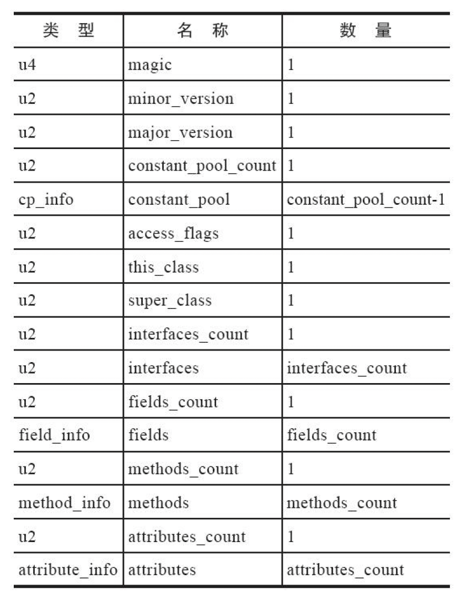
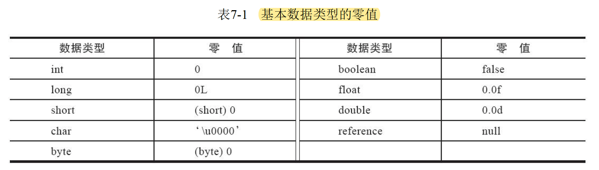
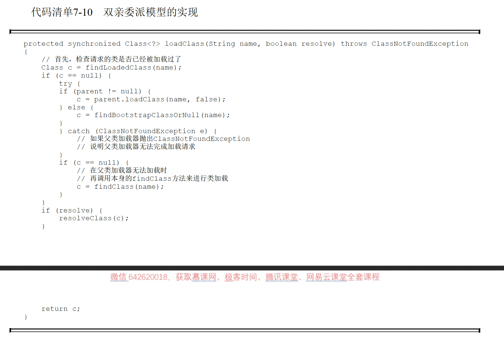
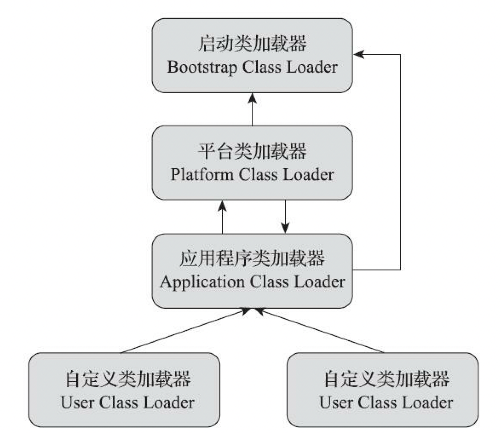
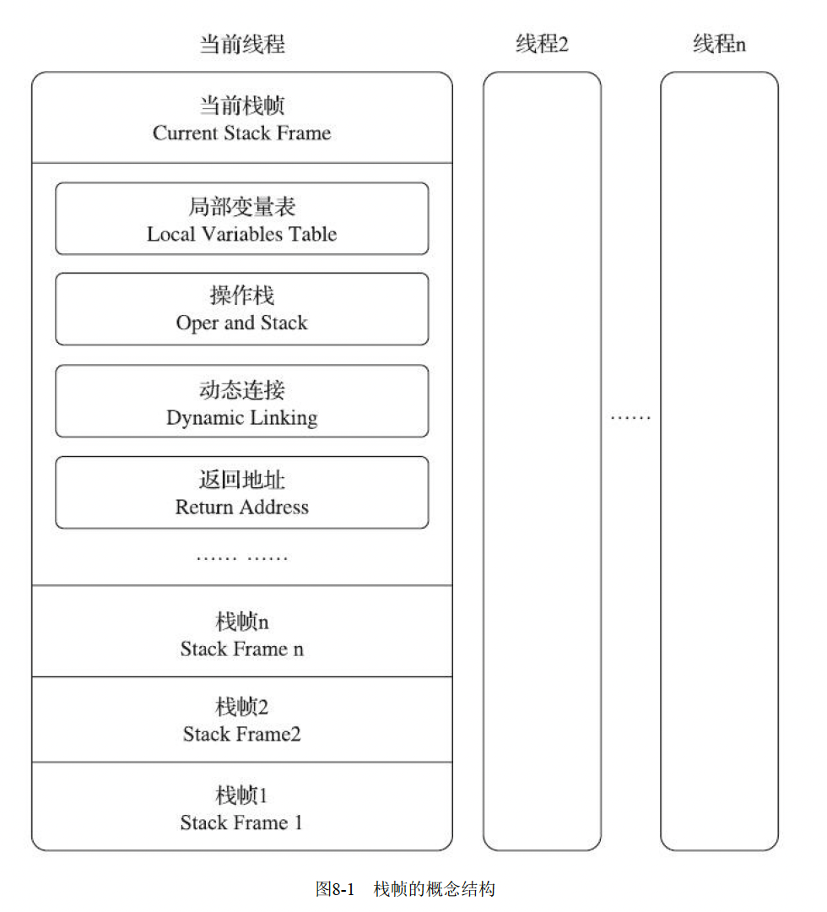
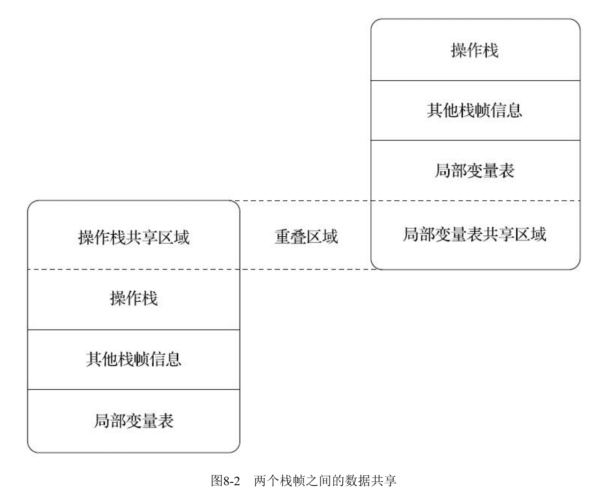
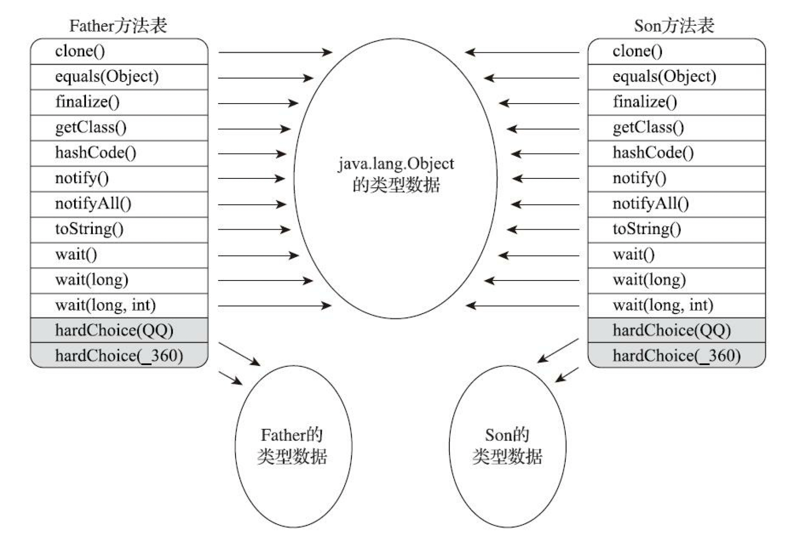

# JVM笔记 -- 《深入理解java虚拟机：JVM高级特性与最佳实践》

## 第二章 java内存区域与内存溢出异常

### 运行时数据区域

#### 内存数据区域结构

#### 程序计数器 Program Counter Register（PCR）

* **定义与特点**
  * 很小的内存区域
  * **当前线程所执行的字节码行号指示器** - 改变计数器数值选取下一行要执行的字节码指令
  * **线程私有** - 生命周期与线程相同
* **作用**
  * 线程切换的时候，通过计数器能准确回到需要执行的字节码的位置，因此每个线程需要一个独立的PCR
* **数值如何改变**
  * 执行java程序 - 计数器数值是正要执行的字节码指令的地址；执行本地方法 - 计数器数值是空（underfined）
* **异常状况**
  * 唯一一个在《java虚拟机规范》**没有规定任何OutOfMemoryError**情况的区域

#### 虚拟机栈（JAVA Virtual Machine Stack）

* **定义与特点**
  * **线程私有** - 生命周期与线程相同
  * java方法执行的线程内存模型
* **作用**
  * 每个方法执行的时候，虚拟机会**同步创建一个栈帧（stack frame）**，用来**存储局部变量表、操作数栈、动态连接、方法出口**等信息。每个方法调用都是一个栈帧在虚拟机栈中入栈和出栈的过程
  * **局部变量表**
    * 提到栈的时候经常特指局部变量表
    * 存放**java虚拟机基本数据类型、对象引用（句柄或者引用指针或其他跟对象位置有关的）、returnAddress类型**（下一条字节码指令的地址）
    * 这些数据类型的存储空间在局部变量表中**用局部变量槽（slot）来表示**。除了64位的double和long一般占两个槽，其他都是一个槽
    * 局部变量表的内存空间在编译期间完成分配，因此进入方法时栈帧要分配给局部变量表的内存空间是完全确定的，**运行期间也不会改变大小**
* **异常状况**
  * **StackOverFlowError** - 线程请求的栈深度超过虚拟机允许的栈深度时
  * **OutOfMemoryError** - 如果虚拟机栈可以动态扩展，栈扩展申请不到足够内存时
    * **HotSpot虚拟机不能动态扩展**，因此不存在动态扩展申请不到足够内存抛出OOM异常，只可能是线程一开始申请栈空间就没申请到足够内存空间时抛出OOM异常

#### 本地方法栈 (Native method stacks)

* **定义与特点**
  * **线程私有** - 生命周期与线程相同
* **作用**
  * 与虚拟机栈作用类似
  * 与虚拟机栈作用区别
    * 虚拟机栈为虚拟机执行java方法（字节码）服务
    * 本地方法栈**为虚拟机执行本地方法服务**
  * HotSpot虚拟机直接将本地方法栈与虚拟机栈合二为一，因为规范中没有强制规定
* **异常状况**
  * 同虚拟机栈 - **OutOfMemoryError & StackOverFlowError**

#### JAVA堆 （JAVA Heap）

* **定义与特点**
  * 虚拟机管理的内存中最大的一块
  * **线程共享** - 虚拟机启动时创建
  * **垃圾回收器管理的内存区域** - GC堆
  * 可以处于**物理上不连续**的内存空间中，但在**逻辑上**它应该被视为**连续**的
  * **可以被实现成固定大小，或者可扩展**，但当今**主流java虚拟机**都是按照**可扩展实现**的（设定参数-Xmx，-Xms）
* **作用**
  * **存放实例对象**
  * 回收内存角度 - 分成新生代、老年代、永久代、eden空间等等
  * 内存分配角度 - 分成若干个线程私有的分配缓冲区（Thread Local Allocation Buffer， TLAB）
  * 以上角度的堆细分只是为了更高效地回收和分配内存，java堆唯一目的就是存放实例对象
* **异常状况**
  * 没内存完成实例分配 & 无法扩展 - **OutOfMemoryError**

#### 方法区（Method Area）

* **定义与特点**
  * **线程共享**
  * 规范中描述为堆的一个逻辑部分，但有别名”非堆“（Non-Heap）
  * **不需要连续内存**
  * 实现可以选择**固定大小或者可扩展**，甚至可以**选择不实现垃圾收集**
  * 内存回收一**般针对常量池回收和对类型的卸载**，但**回收效果一般难令人满意**，但有时这个区域回收确实必要
* **作用**
  * 用于存储已被虚拟机加载的**类型信息、常量、静态变量、即时编译器编译后的代码缓存等**数据
* **异常状况**
  * 无法满足新的内存分配 - **OutOfMemoryError**

#### 运行时常量池（Runtime Constant Pool）

* **定义与特点**
  * 方法区的一部分
  * Class文件中存放除了类的版本、字段、方法、接口等描述信息外，还有一项信息是常量池表（Constant Pool Table），用于存放编译器生成的各种字面量和符号引用，类加载后这部分内容会存放到运行时常量池中
  * **动态性 - 运行期间也可以有新的常量放入池中** e.g. String类的intern()方法
* **作用**
  * 类加载后**存储Class文件中常量池内容（字面量、符号引用）**，一般来说**也存储由符号引用翻译的直接引用**，**运行期间也有新的常量存入**
* **异常状况**
  * 无法申请到内存 - **OutOfMemoryError**

#### 直接内存（Direct Memory）

* **定义与特点**
  * 不是虚拟机运行时数据区域一部分，也不是java虚拟机规范定义的内存区域
  * 但被**频繁使用**
  * **受到本机总内存大小**（包括**物理内存、SWAP分区或者分页文件**）以及**处理器选址空间的限制**
* **作用**
  * 可以被分配内存（属于对外内存）
* **异常状况**
  * 配置虚拟机参数时，会根据实际内存设置-Xmx等参数，但**经常忽略直接内存，导致各个内存区域综合大于物理内存限制**（包括物理和操作系统级的限制） - 动态扩展时 - **OutOfMemoryError**

### HotSpot虚拟机对象探秘

#### 对象创建

* **类加载检查**
  * 遇到一条字节码new指令时，首先检查该指令的参数是否能在常量池中定位到一个类的符号引用，检查这个符号引用代表的类是否已被加载、解析和初始化过，若没有，则需要类加载过程的执行
* **新生对象分配内存**
  * 对象所需内存大小在类加载完成后完全确定
  * **分配方法**
    * **堆内存规整 - 指针碰撞（Bump The Pointer）**- 只需要指针向空闲空间方向挪动一段与对象大小相等的距离
    * **堆内存不规整 - 空闲列表维护（Free List）** - 记录哪些内存块可用，划出去给实例了就更新列表
    * 使用哪种方法根据gc是否有空间压缩整理能力（Compact）
  * 并发如何保证**线程安全**
    * 方法一：对分配内存空间的动作进行同步处理 - CAS + 失败重试
    * 方法二：每个线程在堆上都有**本地线程分配缓冲（TLAB**），线程先在自己的本地缓冲区分配内存，不够了需要分配新的缓存区才需要同步锁定 - 参数： -XX: +/-UseTLAB
* **分配的内存空间（不包括对象头）都初始化为零值**
  * 如果使用了TLAB，可以提前到TLAB分配时顺便初始化
  * 保证了对象实例字段在java代码中可以**不赋初始值即可直接使用**，访问到字段的**数据类型对应的零值**
* **对对象必要的设置并存放在对象的对象头（Object Header）**
  * 例如：哪个对象的实例，如何找到类的元数据信息，对象的hashcode，对象的gc分代年龄等
* **（java程序视角）执行class文件中的< init >()方法来初始化**
  * 虚拟机角度 - 前四个步骤已经产生新的对象；java程序视角 - 构造函数刚开始建造对象
  * 一般来说，new指令之后执行< init >()方法，按照程序员的意愿对对象进行初始化，这样一个真正可用对象才完全被构造出来

#### 对象内存布局(Hotspot)

* 对象在内存中的存储布局分三个部分
  * **对象头（Header）**
  * **实例数据（Instantce data）**
  * **对齐填充（Padding）**
* **对象头 - 存储两类信息**
  * **Mark Word**
    * 用于存储对象自身的运行时数据，比如hashcode、gc分代年龄、锁状态信息、线程持有的锁、偏向线程id、偏向时间戳等
    * 动态定义的数据结构 - 在极小空间存储尽量多的数据，并且根据对象状态复用空间
  * **类型指针**
    * 对象指向它的类型元数据的指针
    * 用来确认对象为哪个类的实例
  * 如果对象是**java数组，还需一块记录数组长度的数据** - java对象元数据可以判断对象大小，但如果数组长度不确定就无法推断数组大小
* **实例数据**
  * 对象真正存储的有效数据 - 定义的各种类型的字段内容（父类继承以及子类定义的）
  * **存储顺序** - 受虚拟机分配策略参数和字段在源码定义顺序影响
    * **Hotspot默认分配顺序 - 相同宽度字段分配到一起存放，在该前提下，父类中定义的变量出现在子类之前**
* **对齐填充**
  * 非必然存在，仅仅是起占位符作用
  * HotSpot的自动内存管理系统要求**对象起始地址必须是8字节的整数倍，即任何对象大小都是8字节的整数倍**，所以**对象头**已经被精心设计成正好是**8字节的倍数（1-2倍）**，如果实例数据部分没有对齐就用对齐填充来补全

#### 对象访问定位

* **如何定位**
  * java程序通过**栈上的reference数据来操控堆的对象**
* **实现reference来访问的方法**
  * **句柄**
    * java堆上可能划分出一块内存作为句柄池，reference存储的就是对象的句柄地址 - 包括：**对象实例数据地址 + 对象类型数据地址**
    * **优势**
      * reference存储的是**稳定句柄池地址**，对象被移动时（比如垃圾回收时）不会改变reference中的值，只改变句柄里实例数据指针
    * 
  * **直接指针**
    * reference存储的**直接就是对象实例数据地址，对象内存布局里存有访问类型数据的相关信息**
    * HotSpot使用该方法访问对象
    * **优势**
      * **快捷，省去一次指针定位的时间开销**
    * 

## 第三章 垃圾收集器与内存分配策略

### 为什么需要了解垃圾收集和内存分配
* 垃圾收集GC需要完成三件事：**哪些内存需回收？啥时候回收？如何回收？**
* 当需要排查内存泄漏、溢出问题时，或者垃圾收集称为系统达到更高并发量的瓶颈中，我们就必须对其技术实施进行**必要的监控和调节**
* 不需要过多考虑回收的区域
  * 程序计数器、虚拟机栈、本地方法栈 - 生命周期与线程一样，栈帧大小一开始类结构确定时就已知，然后随方法入栈出栈，因此内存分配回收具有确定性，当方法结束或者线程结束，内存自然跟随回收
* **需要考虑垃圾回收的区域**
  * **java堆和方法区** - 处于运行期间，内存分配和回收是动态的 - **显著的不确定性**

### 如何判断对象死亡
* 死去 - 即不可能被任何途径使用的对象

#### 引用计数算法（Reference Counting）
* **原理**
  * 在对象中添加一个引用计数器，**每当有一个地方引用它，计数器++；引用失败，计数器--；任何时刻计数器==0的对象不可能再被使用**
* **优势**
  * 虽然占用额外内存空间计数，但原理简单，判定效率高，多数情况效果不错
* **劣势**
  * 需要考虑很多例外情况，必须配合大量额外处理才能保证正确地工作 - e.g.**单纯引用计数很难解决对象间相互循环引用问题**
* **应用**
  * 主流java虚拟机都不选择该算法

#### 可达性分析算法（Reachability Analysis）
* **原理**
  * 通过一系列**称为“GC Roots”的根对象**作为起始节点集，在这些节点开始，根据引用关系向下搜索，搜索过程所走过的路径**称为“引用链”（Reference Chain）**，如果一个对象到gc roots间没有任何引用链相连，或者用图论的话说就是**从gc roots到对象不可达**，则该对象不可能再被使用
  * e.g.
    * 
  * 可作为gc roots的对象
    * **虚拟机栈（栈帧中的本地变量表）中引用的对象** - e.g. 各个线程被调用的方法堆栈中使用到的参数、局部变量、临时变量等
    * **方法区中类静态属性引用的对象** - e.g.java类的引用类型静态变量
    * **方法区常量引用的对象** - e.g.字符串常量池（String Table）里的应用
    * 本地方法栈中JNI（**native方法）引用**的对象
    * **Java虚拟机内部的引用** - e.g.基本数据类型对应的Class对象，一些常驻异常对象（OutOfMemoryError、NullPointException等），系统类加载器
    * 所有**被同步锁（synchronized关键词）持有**的对象
    * 反映java虚拟机内部情况的JMXBean、JVMTI中注册的回调、本地代码缓存等
  * 根据所选垃圾收集器以及当前回收的内存区域不同，也有其他对象“临时性”加入gc roots集合，以保证可达性分析的正确性（比如分代收集和局部回收（partial gc），某个区域的对象可能被位于堆中其他区域对象所引用，所以需要加入gc roots集合中 - 跨代引用）
* **应用**
  * 当前主流使用程序语言（java、c#等）内存管理系统子系统都用该算法
  * 为避免gc roots包含过多对象导致过度膨胀，实现时做了各种优化处理

#### 引用
* JDK1.2之后，java将引用分为四种引用（**强度依次减弱**） - **强引用（Strong Reference），软引用（Soft Reference），弱引用（Weak Reference），和虚引用（Phantom Reference）**（后三种都是jdk1.2之后提供了对应类来实现 - SoftReference、WeakReference、PhantomReference）
* **强引用**
  * 最传统的引用定义 - `Object obj = new Object()`
  * 该引用存在，该被引用对象就**永远不会被回收**
* **软引用**
  * 还**有用，但非必须对象**
  * 系统将要发生内存溢出异常前，把这些对象列进垃圾回收范围之中进行第二次回收，若垃圾回收后还是没有足够内存，才会抛出内存溢出异常
* **弱引用**
  * **非必须对象**，强度比软引用更弱
  * 被引用对象**只能生存到下一次gc发生为止**，gc一旦开始就会被回收
* **虚引用（幽灵引用or幻影引用）**
  * 最弱
  * 对象添加虚引用**完全无法左右它的生存时间**，也**无法通过该引用获得实例**
  * 唯一目的只是该对象**回收时收到一个系统通知**

#### 判定不可达后是否真正死亡（回收）
* 真正死亡需要**至少经历两次标记过程**
  * **第一次标记**：对象进行可达性分析后发现没有与gc roots相连接的引用链
  * **第二次标记**：先进行一次筛选，条件是该对象是否有必要执行`finalize()`方法
    * **假如对象没有覆盖`finalize()` or `finalize()`已经被虚拟机调用过 - 虚拟机视为“没有必要执行`finalize()`”**
    * 反之，“有必要执行`finalize()`”，该对象放入一个名为**F-Queue队列**中，并在稍后由一条虚拟机自动建立、低调度优先级的Finalizer线程去执行它们的`finalize()`方法，该执行指的是虚拟机会触发这个方法开始运行，但不承诺一定等它运行结束
      * 原因：如果某对象`finalize()`执行缓慢，或者更极端发生了死循环，那F-Queue队列中其他对象永久处于等待，甚至导致整个内存回收子系统的崩溃。
    * 稍后收集器会对F-Queue的对象进行**第二次小规模标记**。若对象`finalize()`成功让自己和引用链上的任何对象建立关联即可拯救成功（e.g. 自己（this关键词）赋值给某个类变量或对象的成员变量），就会被第二次标记时被移出“即将回收”的集合。
    * `finalize()`是**对象逃脱死亡最后的机会**，一个对象自救的`finalize()`**最多只会被系统自动调用一次**。
* 两次标记后，在集合中的对象就基本上要真回收了
* 尽量避免使用`finalize()`
  * 运行代价高昂，不确定性大，无法保证各个对象的调用顺序，**官方声明不推荐使用** - try-finally或其他可以做的更好、更及时

#### 回收方法区
* 垃圾收集器可以选择不实现对方法区的回收或者部分回收，因为方法区回收“性价比”较低，在**回收判断条件苛刻的情况下，回收效果不佳**。
* 方法区回收有两个部分
  * **废弃常量**
    * 条件相对简单
    * 回收判断条件：类似堆对象回收，若**没有任何对象或者虚拟机其他地方引用该常量**（比如常量池的某个字面量或者符号引用），该常量可以被系统清理出常量池
  * **不再使用的类型**
    * 条件相对苛刻
    * **回收判断条件**（要同时满足三条，满足后仅仅是“被允许对类进行回收”，而不是像对象一样没有引用就必然回收）：
      * 该类型**所有实例都被回收**了，堆里**不存在该类以及任何派生子类的实例**
      * **加载该类的类加载器已经被回收**，除非是经过精心设计的可替换类加载器的场景，比如OSGi、JSP的重加载等，否则通常很难达成
      * **该类对应的`java.lang.Class`对象没有在任何地方被应用**，无法在任何地方通过反射访问该类的方法

### 垃圾收集算法
* 根据配合判断对象死亡角度，垃圾收集算法划分为
  * 引用计数式垃圾收集（ReferenceCountingGC） - 直接垃圾收集
  * 追踪式垃圾收集（TracingGC） - 间接垃圾收集 - 属于主流Java虚拟机使用的垃圾收集算法

#### 分代收集理论（Generational Collection）
* **理论**（实际是符合大多数程序运行实际情况的经验法则）
  * 当前商业虚拟机垃圾收集器大多都遵循该理论
  * **两个分代假说**
    * **弱分代假说（Weak Generational Hypothesis）：绝大多数对象都是朝生夕死**
    * **强分代假说（Strong Generational Hypothesis）：熬过越多次垃圾回收过程的对象越难以消化**
  * 基于上述假说的**设计原则**
    * 收集器将java堆划分为不同区域，将回收对象依据其年龄（熬过垃圾收集过程的次数）分配到不同区域存储
    * **好处**
      * 省时间，低代价回收大量空间，空间获得有效利用
      * 分为不同区域后，垃圾收集器就可以每次只回收其中一个或某些部分的区域，才能针对不同区域安排与里面存储对象存亡特点相匹配的垃圾收集算法
    * 现在商用java虚拟机，**一般至少把堆划分为新生代（Young Generation）和老年代（Old Generation）**
      * 每次有大批对象死在新生代，少部分存活下来的会逐步晋升到老年代存放
  * **第三条假说（经验法则）**
    * **出现原因**：**对象间可能会存在跨代引用**
    * 跨带引用可能引起的**后果**：假如只局限新生代的收集，但新生代对象可能被老年代对象引用，为了找出该区域存货对象，不得不在固定GC Roots之外，额外遍历整个老年代的对象老保证可达性分析的正确性 - 巨大性能负担。反之亦然。
    * **假说内容：跨代引用相对于同代引用仅占极少数**
    * 由上述两个假说得到的**隐含推论：存在互相引用关系的两个对象应该倾向于同时生存或者消亡** - 新生代对象有跨代引用 -> 老年代对象难消亡 -> 新生代对象因为该引用得以存活 -> 年龄增长，晋升老年代 -> 跨代引用消除
  * 根据第三条假说进行的针对跨代引用的**设计原则**
    * **只需在新生代上建立一个全局数据结构（记忆集Remembered Set）**，该结构把老年代划分为若干小块，标识**出老年代哪一内存会存在跨代引用**
    * 之后发生minor gc，只有包含跨代引用的小块内存的对象被放进gc roots里进行扫描
    * 好处
      * 虽然需要在对象改变引用关系（比如自己或者某个属性赋值）时维护记录数据的正确性而增加一点运行时开销（写屏障），但比收集时扫描整个老年代划算
  * **部分回收（Partial GC）**
    * 目标不是完整收集整个java堆的垃圾收集
    * **分类**
      * 新生代收集(Minor GC/Young GC)
      * 老年代收集（Major GC/Old GC）：目前只有CMS收集器有单独收集老年代的行为
      * 混合收集（Mixed GC）：收集整个新生代+部分老年代。目前只有G1收集器有这个行为
      * 整堆收集（Full GC）：收集整个java堆和方法区

#### 标记-清除算法（Mark-Sweep）
* **原理**
  * **两个阶段-标记+清除**：标记所有需要回收对象然后统一回收被标记对象/**标记所有存活对象然后统一回收未被标记对象**（标记过程-判定是否为垃圾/死亡的过程）
* **特点**
  * **最基础算法**，后续算法都是以此为基础，改进其缺点
  * **执行效率不稳定** - 如果有大量对象且大部分需要回收，必须进行大量标记和清除动作 - 对象越多，执行效率越低
  * **内存空间碎片化问题** - 产生大量不连续内存碎片，导致之后运行过程要分配大对象时找不到足够的连续内存，不得不提前触发另一次垃圾收集动作
* 

#### 标记-复制算法（复制算法）
* **半区复制算法（Semispace Copying）**
  * **原理**
    * 内存容量分为**大小相等两个部分**，**每次只用其中一块**，当一块内存用完了，**把存活对象对象复制到另一块上**，再把用完的这一块一次清除
  * **特点**
    * 多数对象存活 - 产生大量内存间复制开销
    * **多数对象可回收 - 只需复制极少数存活对象**
    * 优势 - 只针对半区回收，内存分配时**不用考虑空间碎片复杂情况**，只需要移动堆顶指针即可按顺序分配 - 简单，运行高效
    * 缺点 - 可用内存缩小为原来一半，**空间浪费多**
  * 
* **优化版半区复制分代策略 - Appel式回收**
  * **应用**
    * 现在商用虚拟机大多优先采用标记复制算法来回收新生代
    * "Appel式回收"根据新生代“朝生夕死”提出的优化版半区复制策略，该策略被HotSpot的Serial、ParNew等新生代收集器采用来设计新生代内存布局
  * **原理**
    * **新生代分为较大的Eden空间和两块较小的Survivor空间，每次分配内存只使用Eden和其中一块Survivor，发生gc后，将Eden和Survivor中存活对象一次性复制到另一块Survivor上，然后清除Eden和已用过的Survivor**
    * HotSpot虚拟机默认Eden：Survivor大小比例=8:1，即每次新生代可用内存空间位整个新生代容量的90%，只有10%的新生代空间被浪费
    * **分配担保（Handle Promotion）**
      * 原因：没人能保证每次回收都只有不多于10%的对象存活
      * 当另一块Survivor空间无法容纳存放上一次新生代收集下来的存活对象，这些对象将需要依赖其他内存区域（实际一般为老年代）来分配担保。**一般是将这些对象通过分配担保机制直接进入老年代，这对虚拟机是安全的**

#### 标记-整理算法（Mark-Compact）
* **出现原因**
  * **标记-复制算法在对象存活率高时效率低**，如果对象存活率过高，则需要额外空间进行分配担保。**老年代每次回收对象存活率都很高**，因此老年代一般**不能直接使用该算法**
* **原理**
  * 标记过程：与“标记-清除”算法一样
  * 清除过程：**让所有存活的对象都想内存空间一端移动，然后直接清理掉边界以外的内存**
* 
* **特点**
  * 移动式算法 - **是否移动回收后的存活对象都存在弊端**
  * **如果移动整理存活对象** - 老年代每次回收都有大量存活对象 - **移动存活对象并更新所有引用这些对象**的地方将会是极为负重的操作，并且移动对象必须全程暂停用户应用程序（标记清除也要STW，但时间可忽略） - “Stop the World”（STW） - **内存回收更复杂**
  * **如果不移动整理存活对象** - **空间碎片化问题** - 只能靠更为复杂的内存分配器和内存访问器解决（比如“分区空闲分配链表”来解决内存分配）。内存访问是用户程序最频繁的操作 - 这个环节如果有额外负担会直接影响应用程序吞吐量 - **内存分配更复杂**
  * **不移动对象停顿时间会更短，但从整个程序吞吐量来看，移动对象更划算** - 因为内存分配和访问比垃圾回收频率要高的多，即便内存回收速度提高了，内存分配和访问耗时也会让总吞吐量下降
* **应用（HotSpot）**
  * **关注吞吐量收集器** - ParallelScavenge收集器
  * **关注延迟收集器** - CMS收集器 - 基于标记清除算法
    * CMS用了一种“和稀泥式”解决方案 - 虚拟机平时多数用标记清除，直到内存空间碎片化程度影响到对象分配，再采用标记整理算法收集一次

### HotSpot算法细节实现

* 实现虚拟机时对算法执行效率严格考量才能保证虚拟机高效运行

#### 根节点枚举
* **消耗时间多**：固定可作为**GC Roots的节点**主要在**全局性的引用**（比如常量和类静态属性）与**执行上下文**（比如栈帧的本地变量表），查找过程要高效很难
* **必须暂停用户线程**：根节点枚举始终是**必须在一个能保证一致性的快照中得以进行** - 枚举过程中根节点集合的对象引用关系不能再变化，不然分析准确性无法保证
* **HotSpot高效进行对象引用查找的解决方法**
  * 使用一组称为**OopMap**的数据结构，一旦类加载动作完成的时候，HotSpot会把**对象内什么偏移量上是什么类型的数据计算**出来，在即时编译过程中，也**会在特定的位置记录下栈里和寄存器里哪些位置是引用**，这样收集器扫描时可直接得到这些信息，不需要一个不漏从方法区等gc roots开始查找

#### 安全点（Safe Point）
* **作用**
  * 有很多指令能导致OopMap内容（引用关系）发生变化，但为每一条指令生成对应OopMap很浪费空间
  * **需要解决如何停顿用户线程**
* **定义**
  * 在**特定的位置记录下信息（OopMap**），可以**强制要求必须执行到达安全点后才能够暂停**进行垃圾收集
* **选取原则**
  * “是否具有让程序长时间执行的特质”为标准进行选定
  * **“长时间执行“最明显特征 - 指令序列复用**（比如方法调用、循环跳转、异常跳转等）
* **如何让垃圾收集发生时所有线程（这里不包括执行JNI调用的线程）都跑到最近的安全点停顿**下来
  * 方案一：抢断式中断（Preemptive Suspension）：gc发生时，系统先把所有用户线程全部中断，若某线程不再安全点上，恢复它的执行直到跑到安全点再中断 - 现在几乎不用这个方案
  * **方案二：主动式中断（Voluntary Suspension）**：gc发生时，不直接对线程操作，**设置一个标志，各个线程执行过程中不停主动地轮询该标志，一旦发现中断标志为真就自己在最近的安全点上主动中断挂起** - 轮询标志地点和安全点重合 - 轮询操作频繁出现所以设计必须高效

#### 安全区域（Safe Region）
* **作用**
  * **如果程序”不执行“**，比如Sleep或者blocked状态，线程无法相应虚拟机中断请求，**无法走到安全点挂起自己**，虚拟机也不可能持续等待
* **定义**
  * 能够确保在某一段代码片段中，**引用关系不会发生变化**，因此在这个区域中**任意地方开始垃圾收集都是安全**的 - 被扩展拉伸的安全点
* **线程如何运行**
  * 用户线程执行到安全区域的代码 - 标识自己已经进入安全区域 - gc时不必管理这些进区域的线程 - 离开安全区域时要检查虚拟机是否发成根节点枚举或者gc时需要的其他STW - 如果完成就线程正常执行 - 没完成就必须等待，直到收到可以离开区域的信号

#### 记忆集与卡表
* **作用**
  * **解决对象跨代引用问题**，以及涉及Partial GC行为的垃圾收集器
* **记忆集**
  * **定义**
    * 用于记录**从非收集区域指向收集区域的指针集合**的抽象数据结构
  * **实现方法**
    * 最简单实现 - 用非收集区域中所有含跨代引用的对象数组来实现这个数据结构 - 存储和维护成本过高
    * 用更粗犷的记录粒度类节省存储和维护成本 - **记录精度**
      * 字长精度 - 机器字长
      * 对象精度
      * **卡精度 - 每个记录精确到一块内存区域，内有对象有跨代指针**
    * 利用卡精度 - **卡表（Card Table）实现记忆集**
      * 最常用
      * **最简单形式 - 一个字节数组** - HotSpot虚拟机也用该方法实现
      * 字节数组中**每一个元素对应着一块特定大小的内存块** - **卡页（Card Page）**
        * 大小：2的n次幂的字节数 - hotspot是2^9（512字节）
        * **只要卡页内有一个或者多个对象的字段有跨代指针，就把对应卡表的数组元素的值标志为1：元素变脏（dirty），没有就标0**，gc的时候筛**选出卡表中的变脏的元素** - 找到哪些卡页中有跨代指针 - **加入gc roots中扫描**
        * 
#### 写屏障（Write Barrier）
* **作用**
  * **HotSpot中来解决卡表元素如何维护问题** - 如何在对象赋值那一刻更新维护卡表来让卡页变脏
* **定义**
  * **在虚拟机层面对”引用类型字段赋值“这个动作的AOP切面，在引用对象赋值时会产生一个环形（Around）通知，供程序执行额外的动作，也就是说赋值的前后都在写屏障的覆盖范畴内**
  * 写前屏障（Pre-Write Barrier）：赋值前的部分的写屏障
  * 写后屏障（Post-Write Barrier）：赋值后的部分的写屏障
  * **应用写屏障后，所有赋值操作生成相应的指令 - 添加更新卡表的操作**
* **特点**
  * 有一定开销，但划算
  * 高并发下面临”伪共享“（False Sharing）问题 - 几个线程同时改变卡表元素
    * 解决：有条件的写屏障 - 先检查卡表标记，只有当该卡表元素未被标记过时才将起标记为脏

#### 并发的可达性分析
* **为了解决或者降低用户线程停顿，可以考虑用户线程和gc roots遍历并发进行，但必须解决并发的可达性分析准确性问题**
* 用**三色标记**来标记对象状态
* 
* 如果可达性分析和用户线程**并发工作**，可达性分析一边标记，一边有用户线程在改变引用关系，**导致有些对象会被标错**（比如原本存活却被标记为消亡，很致命）
* **存活对象误标为消亡条件**
  * 赋值器**插入一条或多条黑色到白色的引用**
  * 赋值器**删除全部从灰色到该白色的直接或间接引用**
* **解决对象消失问题：只要破坏这两个条件任意一个即可**
  * **增量更新（Incremental Update） - 破坏第一个条件**
    * 插入引用时把这个新**插入的引用记录下来**，并发扫描结束后再以这些记录过的引用关系中的**黑色为根重新扫描一次** - 相当于黑色变回灰色
  * **原始快照（Snapshot At The Beginning）- 破坏第二个条件**
    * 删除引用前把这个**该删除引用记录下来**，并发扫描结束后再以这些记录过的引用关系中的**灰色为根重新扫描一次** - 相当于最终一定是按照最原始的样子扫描的
  * **应用**
    * CMS - 基于增量更新的并发标记
    * G1、Shenandoah - 基于原始快照的并发标记
* **以上无论是对引用关系记录的插入还是删除，虚拟机记录操作通过写屏障实现**

### 经典垃圾收集器
* 
* 两个收集器之间如果存在连线，说明可以搭配使用
* 不存在”万能“或最好的收集器，**需要根据具体应用选择最合适的**

#### Serial收集器
* 
* **特点**
  * **最基础、历史最悠久**的收集器
  * **基于标记复制算法**
  * **单线程工作** - 不仅说明**只会使用一个处理器或一条收集线程**去完成垃圾收集工作，更强调它**进行gc时，必须STW**（由虚拟机后台自动发起和完成），直到gc结束
  * **简单高效**（与其他收集器单线程相比）
  * 资源受限环境下，**所有收集器中额外内存消耗（Memory Footprint）最小**的
  * 对于单核处理器或者处理器核心数较少的环境里，Serial由于没有线程交互，**专心做gc自然获得最高的单线程收集效率**
* **应用**
  * 迄今为止，依旧是**HotSpot虚拟机运行在客户端模式下的默认新生代收集器** - 是个很好的选择

#### ParNew收集器
* 
* **特点**
  * **Serial收集器的多线程并行版本**，除了同时使用多条线程进行gc之外，**其余行为都与Serial完全一致 - 基于标记复制算法**
  * 无过多创新
  * **单核处理比不过Serial**
  * **可以被使用的处理器核心数量增加，ParNew对于gc的系统资源的高效利用还是有好处的** - 默认开启收集线程数=处理器核心数量，可以使用-XX:ParrallelGCThreads参数来限制gc线程数
* **应用**
  * 不少运行在服务端模式下的HotSpot虚拟机，尤其是JDK7之前的遗留系统中首选的新生代收集器
  * **除了Serial收集器外，目前只有ParNew能与CMS收集器配合工作** - jdk5中CMS收集老年代时，新生代只能选择ParNew或者Serial
  * **ParNew是激活CMS后（使用-XX：+UserConcMarkSweepGC）的默认新生代收集器**，也可以使用-XX：+/-UseParNewGC来强制指定或者禁用它
  * G1出现后因为其不需要新生代收集器配合工作，jdk9开始ParNew+CMS组合不再是官方推荐的服务端模式下的收集器解决方案，希望完全被g1取代，甚至取消了ParNew+Serial Old以及Serial+CMS组合的支持（也没几个用），取消了-XX:+UseParNewGC参数，意味着**ParNew+CMS只能相互搭配，相当于ParNew合并入CM，成为专门处理新生代的组成部分** - HotSpot第一款退出历史舞台的垃圾收集器
* **并行（Parrallel）**
  * 多条垃圾收集器线程之间的关系，说明**同一时间有多条线程在协同工作**，通常默认此时**用户线程是处于等待状态**
* **并发（Concurrent）**
  * 垃圾收集器线程与用户线程之间的关系，说明**同一时间垃圾收集器线程与用户线程都在运行**；**用户线程未被冻结，但垃圾收集器线程占用了一部分系统资源，所以应用程序处理吞吐量受一定影响**

#### Parallel Scavenge收集器
* **特点**
  * **新生代收集器，基于标记复制算法，能够多线程并行收集** - 表面特性类似ParNew
  * **目标 - 达到一个可控制的吞吐量（Throughput）**= 运行用户代码时间/（运行用户代码时间+运行垃圾收集时间） - **吞吐量优先收集器**
    * 高吞吐量可以最高效率利用处理器资源，尽快完成程序的运算任务，主要适合在后台运算而不需要太多交互的分析任务
    * **提供了两个用于精确控制吞吐量的参数**
      * **控制最大垃圾收集停顿时间-XX:MaxGCPauseMillis参数**
        * 设置大于0的毫秒数，收集器将尽力保证gc时间不超过这个设定值
        * **gc停顿时间缩短是以牺牲吞吐量和新生代空间为代价换来的** - 停顿时间下降，吞吐量也下降
      * **直接设置吞吐量大小的-XX:GCTimeRatio参数**
        * 值是大于0小于100的整数，垃圾收集时间占总时间的比率（e.g. 19 -> 1/1+19 -> 最大垃圾收集时间栈总时间的5%。默认值99 -> 1%
  * **自适应调节策略（GC Ergonomics）**
    * 该收集器还有一个**参数-XX:+UseAdaptiveSizePolicy**。激活之后不需要人工设置新生代大小（-Xmn）、Eden与Survivor的比例（-XX：SurvivorRatio）、晋升老年对象大小（-XX:PretenureSizeThreshold）等参数，虚拟机会根据当前系统运行情况收集性能监控信息，**动态调整参数** - **提供最合适的停顿时间或最大吞吐量**
    * 只需要设置基本内存数据（如-Xmx最大堆），然后使用-XX:MaxGCPauseMillis或者-XX:GCTimeRatio设置一个优化目标，剩下由虚拟机自动优化

#### Serial Old收集器
* 
* **特点**
  * **Serial收集器老年代版本**
  * **单线程，基于标记整理算法**
* **应用**
  * 主要意义就是**供客户端模式下的HotSpot虚拟机使用**
  * **服务端模式下**
    * jdk5以及之前**与Parrallel Scavenge搭配使用**
    * **作为CMS发生失败的后备预案**，在并发收集发生Concurrent Mode Failure时使用

#### Parallel Old收集器
* 
* **特点**
  * **Parallel Scavenge收集器的老年代版本**
  * **多线程并行收集，基于标记整理算法**
* **应用**
  * 没有该收集器之前，之前Parallel Scavange只能选择和Serial Old（或者叫PS MarkSweep）搭配使用，Serial Old在服务端性能很拖累，因此Parallel Scavange很难发挥整体吞吐量最大化。**现在，当注重吞吐量或处理器资源稀缺时，都可以考虑Parallel Scavange+Parallel Old组合搭配**

#### CMS收集器
* 
* **运行过程（四个步骤）**
  * **初始标记(CMS initial mark)**
    * 需要STW
    * 仅仅标记一下GC Roots能直接关联到的对象
    * 速度很快
  * **并发标记(CMS concurrent mark)**
    * 从GC ROOTS的直接关联对象开始遍历，与用户线程并发进行
    * 耗时长
  * **重新标记(CMS remark)**
    * 需要STW
    * 修正并发标记期间因为用户程序导致的标记产生变动的那一部分对象标记记录 - 采用增量更新方案
    * 比初始标记略长，但远比并发标记短
  * **并发清除(CMS concurrent sweep)**
    * 清除所有标记为死亡的对象
    * 不需要移动对象，所以可以与用户线程并发进行
    * 耗时长
* **特点**
  * **目标 - 获取最短gc停顿时间**
  * **基于标记清除算法**
  * **并发收集** - 最耗时的是并发标记和并发清除但都和用户线程一起完成，总体看，内存回收与用户线程并发完成 - 并发低停顿收集器（Concurrent Low Pause Collector）
  * **缺点**
    * CMS对处理器资源非常敏感，并发阶段虽然不会暂停用户线程，但会**占用一部分线程（或者说处理器的计算能力）导致应用程序变慢，降低总吞吐量**，导致用户程序执行速度降低
    * **由于CMS无法处理”浮动垃圾“（Floating Garbage），导致可能出现”Concurrent Mode Failure“导致另一次STW的Full GC产生**
      * 浮动垃圾：并发的两个阶段运行程序运行还会有垃圾对象产生，但这部分出现在标记过程以后，只能下次清理
      * 需要预留足够内存空间在并行的时候供用户线程使用，所以**CMS不能等待老年代被填满了才gc，需要预留空间** - 可以设置参数-XX:CMSInitiatingOccupanyFraction**的值来提高CMS触发百分比，降低内存回收频率，但**太高会容易引发并发失败
      * 一旦预留的内存无法满足新的内存分配，就会出现并发失败Concurrent Mode Failure，就不得不启动**后备预案：冻结线程执行，临时启用Serial Old来收集老年代**，**停顿时间变长**。并发失败越多，性能大幅度下降
    * **基于标记清除算法导致大量空间碎片产生，因为无法分配大对象额导致不得不提前出发Full GC**
      * **解决方法**
        * **-XX:+UseCMSCompactAtFullCollection开关参数**（默认开启，jdk9之后废弃） - 不得不FullGC时开启碎片整理 - 要移动对象所以无法并发 - 停顿时间变长
        * **-XX:CMSFullGCsBeforeCompaction（jdk9之后废弃）** - 若干次（数量由参数决定）不整理空间的FullGC之后，下一次进入Full GC前先碎片整理（默认0）

#### Garbage First（G1）收集器
* **运行步骤（大致分为四个步骤）**
  * **初始标记(Initial Marking)**
    * 只标记一下GC Roots直接关联的对象
    * **修改TAMS指针的值，让并发标记时用户线程能够在可用的Region中分配新对象**
    * 短暂STW
    * **借用Minor GC的时候同步完成，所以实际该阶段无额外停顿**
  * **并发标记(Concurrent Marking)**
    * 从GC ROOTS开始进行可达性分析
    * 与用户线程并发进行，耗时长
  * **最终标记(Final Marking)**
    * 短暂STW
    * 处理并发阶段产生的**原始快照记录（SATB）**，进行修正
    * **多条收集器线程并行**
  * **筛选回收(Live Data Counting)**
    * **负责更新Region统计数据，对各个Region的回收价值和成本进行排序，根据用户期望停顿时间制定回收计划，自由选择任意多个Region构成回收集，把回收集的Region的存活对象复制到空的Region，清理掉旧的Region空间**
    * 涉及到对象移动，必须**STW**
    * **多条收集器线程并行**
  * 
* **特点**
  * 里程碑式成果 - **开创了收集器面向局部收集的设计思路+基于Region的内存布局形式**
  * ”全功能的垃圾收集器“（Fully-Featured Garbage Collector）
  * 面向**服务端应用**
  * **目标 - 希望能建立一个”停顿时间模型“（Pause Prediction Model）的收集器 - 能够支持指定长度为M毫秒的时间片段内，消耗在垃圾收集上的时间大概率不超过N毫秒 - 可以由用户指定期望的停顿时间，从而可以在不同场景下取得关注吞吐量+延迟之间的平衡**
  * **实现**
    * **实现目标关键1 - 基于Region的堆内存布局**
      * 
      * G1可以**面向堆内存任何部分来组成回收集（Collection Set - CSet）进行回收**，衡量标准不再是属于哪个分代，而是哪块内存存放的垃圾数量最多，回收收益最大 - Mixed GC
      * 虽然也遵循分代收集理论，但G1不再坚持固定大小以及固定数量的分代区域划分，而是**把连续的堆划分多个大小相等的独立区域（Region），每个区域根据需要可以使Eden、Survivor或者老年代空间，根据扮演的角色来采取不同策略处理** - 收集效果提高
      * -XX：G1HeapRegionSize设置Region大小（1-32MB），为2的n次幂
      * **Humongous区域**
        * Region中的特殊一类
        * **存储大对象，当一个对象占Region一半大小时判定为大对象，就存放到N个连续Humongous Region之中**
        * 大多数情况**视为老年代一部分**
      * **仍然保留新生代老年代概念，但这两个代都不再固定了，是一系列可以不连续的动态集合**
    * **实现目标关键2 - 具有优先级的区域回收方式**
      * 能够建立可预测停顿时间模型的原因 - **将Region作为单次回收的最小单位，即每次收集到的内存空间都是Region大小的整数倍**，就可以有计划地避免全区域垃圾收集
      * **根据各个Region里面的垃圾堆积的价值大小，即回收所获得的空间大小以及回收所需时间的经验值**，然后后台维护一个**优先级列表**，根据用户设置的允许停顿时间（-XX：MaxGCPauseMillis指定，默认值200ms），**优先回收价值最大的Region** - Garbage First名字由来
    * 以上两点保证了g1能在有限时间内取得尽可能高的收集效率
  * **实现细节**
    * **如何解决跨Region引用对象**
      * 使用**记忆集**避免全堆扫描
      * 每个region都要维护自己的记忆集，一般是**记录别的region指向自己的指针以及是哪些卡页范围**。在存储结构上本质是**哈希表**，**key：别的region的起始地址，Value：一个集合，里面存储的元素是卡表的索引号** -- 一种双向卡表结构（**卡表是“我指向谁”，这种结构还记录了”谁指向我“**）比原来的卡表实现**复杂**
      * Region数量非常多 - **G1有着更高的内存占用负担** - 至少要消耗大约相当于堆容量的10%-20%的额外内存来维持收集器工作
    * **并发标记阶段如何保证收集线程与用户线程互不干扰**
      * G1采用修正引用关系变化导致标记的错误的方案 - **原始快照（SATB）**
      * 并发时新对象的产生问题 - **G1为每一个Region设计了两个名为TAMS（Top at Mark Start）的指针，Region中的一部分空间划分为并发时新对象分配，对象地址必须要在这两个指针位置之上，默认该地址以上的对象被隐式标记过，默认为存活而不回收**
      * 如果并发时内存不够无法分配，也要STW来FullGC而延长回收
    * **如何建立可预测停顿时间模型**
      * 以**衰减均值（Decaying Average）为理论基础实现**的 - **记录每个Region回收耗时、脏卡数量等可测量成本，分析得出平均值、标准差、置信度等统计信息**。
      * 衰减均值比普通的平均值更受新数据影响，**更准确代表”最近“平均状态，Region统计状态越新越能决定其回收价值**
      * **通过以上信息预测，由哪些Region组成回收集，才可以不超过期望停顿时间的约束下获得最高收益**
  * **期望停顿时间必须符合实际（默认200ms**），否则垃圾回收跟不上分配速度，导致频繁地引发FullGC而STW，降低性能，所以一般设置为一两百或者两三百都很合理
  * 从G1开始，最先进的垃圾收集器设计导向都**趋向于追求能应付应用的内存分配速率（Allocation Rate），不追求一次清理完Java堆**
  * **与CMS相比较，从最传统算法理论来看，G1更有发展潜力**
    * G1整体看基于”标记-整理“算法，但从局部（两个Region之间）看又基于”标记复制“算法，这两种都意味着**无内存碎片，不容易触发下一次gc**
  * 不过g1也无法做到压倒性优势，它的**弱势也有不少**，**例如用户程序运行时，无论是为了垃圾收集产生的内存占用（Footprint）还是程序运行时额外执行负载（Overload）都比CMS高**
    * **G1每个Region都需要维护一份卡表，实现很复杂**，导致其记忆集（和其它内存消耗）可能会**占堆容量的20%甚至更多**；**CMS就一份卡表**，记录了老年代到新生代的引用，反过来则没有（新生代朝生夕死）
    * 执行负载角度上，虽然在维护卡表上都是用写屏障，**CMS用写后屏障**；**G1除了使用写后屏障来做同样的卡表维护（更繁琐），为了实现原始快照算法，使用写前屏障跟踪并发时的指针变化情况，因为其能减少并发标记与重新标记的消耗，避免最终标记像CMS那样过长，但给用户程序运行阶段带来额外负担**；**CMS的写屏障实现是直接的同步操作**，**而G1因为写屏障消耗更多运算资源，只能实现类似于消息队列的结构，写前写后要做的都放进队列里，再异步处理**
* **应用**
  * JDK9发布后，G1宣告取代Parallel Scavenge+ParallelOld的组合，称为**服务端模式下的默认垃圾收集器**，CMS被沦为不推荐（Deprecate）
  * G1和CMS从不同方面看各有利弊，需要具体场景来定量比较，**实践经验来看，小内存应用CMS表现大概率优于G1，大内存应用上G1大多能发挥其优势**，优劣势的java堆容量平衡点通常在6-8GB

### 低延迟垃圾收集器
#### Shenandoah收集器
* 
* **执行步骤**
  * 初始标记：与g1一样
  * **并发标记：与g1一样**
  * 最终标记（Final Marking）：与g1一样，统计回收价值最高region组成回收集
  * 并发清理（Concurrent Cleanup）：清理一个存活对象都没有的Region - Immediate Garbage Region）
  * **并发回收（Concurrent Evacuation）：（核心差异）并发，把回收集存活对象复制到空Region - 用读屏障和“Brooks Pointers”转发指针（对象最前面存的一个引用字段，一般引用自己，复制移动后改为新对象地址）解决移动后对象引用问题（可能引用还是旧地址无法瞬间改变）**
  * 初始引用更新（Initial Update Reference）：未有动作，仅建立线程集合点，短暂STW
  * **并发引用更新（Concurrent Update Reference）：并发，按内存物理地址顺序线性搜索改新值**
  * 最终引用更新（Final Update Reference）：修改GC roots的引用，最后的STW
  * 并发清理（Concurrent Cleanup）：回收集全部清理
* **特性**
  * 非Oracle公司制作，属于OpenJDK
  * 任何堆大小，**gc停顿时间限制在10ms以内**
  * 相比于g1
    * 回收阶段能够进行**并发标记整理算法**
    * 默认不使用分代收集，**无分代**
    * **无复杂记忆集，改用连接矩阵（Connection Matrix）**，降低维护消耗和伪共享概率
    * 

#### ZGC收集器（Z Garbage Collector）
* 
* **执行步骤**
  * 并发标记（Concurrent Mark）：与g1无区别，前后有初始、最终标记（都有短暂STW）
  * 并发预备重分配：全部的Region都要扫描，建立重分配集，省去记忆集
  * **并发重分配：重分配，核心阶段，重分配集对象复制到新Region，重分配集的Region都维护一个转发表（Forward Table），记录旧对象到新对象转向关系，如果并发时访问旧对象，被预置的内存屏障截获，根据转发表转到新对象，并修改指针的值（指针的自愈，只有第一次需要转发）。因此Region复制完可以立马释放并保留转发表**
  * 并发重映射（Concurrent Remap）：修正重分配集旧对象的所有引用，不迫切因为指针自愈，主要是加速并能释放转发表
* **特性**
  * 低延迟垃圾收集器，**与shenandoah目标一样**
  * **基于Region内存布局**，（暂时）不设分代，使用了读屏障、染色指针和内存多重映射等技术实现**并发的标记-整理算法**
  * Region大小可分为不同容量，具有动态创建和销毁
  * **染色指针（colored Pointer）：标记对象时，把标记信息记载引用对象的指针上**
    * **不用修改引用即可清理region**
    * **减少gc时内存屏障使用数量（尤其是写屏障维护引用）**
  * **无记忆集，也不用写屏障** - 限制了能承受的对象分配速率 - 浮动垃圾容易占领内存所以对象分配不能太高 - 只能将堆容量设大一点
  * 支持“NUMA-Aware”内存分配
### 如何选择合适的垃圾收集器
#### Epsilon收集器
* **不能够垃圾收集**，但能够**对堆进行管理、对象分配等**让虚拟机正常运行 - 最小化功能的实现
* **负载小，内存占用小**
* 在一些**短时间、小规模**的服务形式中很适合，只要虚拟机正确分配内存，堆耗尽前退出

#### 收集器权衡
* 衡量垃圾收集器的三个最重要的指标：**内存占用（Footprint）、吞吐量（Throughput）、延迟（Latency）** - **构成“不可能三角”**。三个整体随着技术进步会越来越好，但同时满足三个完美表现的收集器很难实现甚至不可能，优秀收集器最多同时满足两项
* **需要关注三个因素**
  * **应用程序的关注点**
    * 吞吐量 - 数据分析、科学计算，目标尽快算出结果
    * 延迟 - SLA应用，延迟导致直接影响服务质量
    * 内存占用 - 客户端或者嵌入式应用
  * **运行应用的基础设施** - 硬件规格，处理器数量，分配内存大小，操作系统等
  * **使用JDK发行商和版本号** -ZingJDK/Zulu, OracleJDK, OpenJDK, OpenJ9或者其他？JDK对应哪个虚拟机规范？

#### 虚拟机及垃圾收集器日志
* JDK9之后，HotSpot所有功能的日志都收归到了“-Xlog”参数上
* `-Xlog[:[selector][:[output][:[decorators][:output-options]]]]`
* **最关键参数 - 选择器Selector**，由标签（Tag）+日志级别（Level）组成
  * **标签**可以理解为**某个功能模块的名字**，比如垃圾收集器标签为“gc”
  * **其他标签模块**：`add，age，alloc，annotation，aot，arguments，attach，barrier，biasedlocking，blocks，bot，breakpoint，bytecode`
  * **日志级别**从低到高：**Trace，Debug，Info，Warning，Error，Off**六种级别，决定了**输出信息的详细程度**，默认Info
* **修改器（Decorator）**
  * 要求**每行日志输出都附加上额外内容**，可支持信息包括
    * time:当前日期和时间
    * **uptime:虚拟机启动到现在经过的时间，以秒为单位**
    * timemillis:当前时间的毫秒数，相当于System.currentTimeMillis()的输出
    * uptimemillis:虚拟机启动到现在经过的毫秒数
    * timenanos:当前时间的纳秒数，相当于System.nanoTime()的输出 
    * uptimenanos:虚拟机启动到现在经过的纳秒数
    * pid:进程ID
    * tid:线程ID
    * **level:日志级别**
    * **tags:日志输出的标签集**
  * 默认值uptime、level、tags
    * e.g. `[3.080s][info][gc,cpu] GC(5) User=0.03s Sys=0.00s Real=0.01s`

### 实战：内存分配与回收策略
#### 对象优先在Eden分配
* 大多数情况下，对象**先在新生代Eden区中分配**，**当Eden区没有足够空间分配时，虚拟机发起一次Minor GC**

#### 大对象直接进入老年代
* 大对象是指**需要大量连续内存空间的Java对象**，最典型的大对象就是很长的字符串或者元素数量庞大的数组
* 大对象**容易在内存还有很多的情况下提前触发gc**，复制对象时意味着高额内存复制开销
* HotSpot**提供了-XX: PretenureSizeThreshold参数**，制定**大于该设置值的对象直接在老年代分配**，目的是避免Eden区及两个Survivor区之间来回复制（该参数只能用在Serial和ParNew上）

#### 长期存活的对象将进入老年代
* 虚拟机给每个对象定义了一个**对象年龄（Age）计数器**，存储在**对象头中**
* 在Eden诞生对象，**经历一次Minor gc，如果存活并被Survivor容纳，就被移动到Survivor空间中，设定年龄为1岁**
* 每熬一次minor gc增加1岁，**当年龄增到一定程度（默认15），晋升到老年代**
* 晋升年龄阈值可以设置**参数-XX: MaxTenuringThreshold设置**

#### 动态对象年龄判定
* 如果**Survivor空间中相同年龄所有对象大小总和大于Survivor空间的一半**，**年龄大于或等于该年龄对象就可以直接进入老年代**，无需等到-XX: MaxTenuringThreshold要求的年龄

#### 空间分配担保
* 发生**Minor GC之前**，**虚拟机必须检查老年代最大可用连续空间是否大于新生代所有对象空间**
  * 大于，那这一次Minor GC确保安全
  * **不大于，虚拟机查看-XX: HandlePromotionFailure参数是否设置允许担保失败（Handle Promotion Failure）**
    * **允许**
      * 检查**老年代最大可用连续空间是否大于历次晋升到老年代对象的平均大小**
        * **大于，可以尝试一次Minor GC（冒险）**
        * **小于，只能进行一次Full GC**
    * **不允许**
      * **只能进行一次Full GC**
* 标记复制算法，有可能出现大量对象在Minor GC之后仍存活，Survivor空间无法容纳，需要**老年代进行分配担保**，这些对象直接进入老年代，但**前提是老年代有容纳这些对象的剩余空间**，但**每次回收时无法得知有多少对象存活**，所以只能取每次回收**晋升到老年代对象容量的平均大小作为经验值**来比较老年代剩余空间
* 冒险在于，**有可能出现存活对象远超历史平均值，导致担保失败**，只能重新发起一次**Full GC**，停顿时间变长
* 通常还是为了避免Full GC过于频繁而打开-XX: HandlePromotionFailure参数
* **JDK 6 Update 24之后的规则：只要老年代的连续空间大于新生代对象总大小或者历次晋升平均大小，就会进行Minor GC**，否则Full GC（-XX: HandlePromotionFailure参数不再使用）

## 第四章&第五章 虚拟机性能监控、故障处理工具及内存调优

### 基础故障处理工具
* jps（JVM Process Status Tool） - **查询进程状况信息** - 显示虚拟机执行主类名称以及这些进程的本地虚拟机唯一ID（LVMID） - 使用频率最高
* jstat（JVM Statistics Monitoring Tool） - **监视虚拟机各种运行状态信息**（进程中的类加载、内存、垃圾收集、即时编译等） - 可以持续观察虚拟机内存中各分区的使用率和gc统计数据
* jinfo（Configuration Info for Java） - **实时查看和调整虚拟机各项参数**
* jmap（Memory Map for java） - **查看内存使用情况** - **生成堆转储快照（heap dump或者dump文件**） - 还可以查询finalize执行队列、java堆和方法区的详细信息，如空间使用率、当前用的是哪种收集器等
* jhat（JVM Heap Analysis Tool） - **与jmap搭配使用，分析堆转储快照** - 内置一个微型HTTP/HTML服务器，**生成dump分析结果可以在浏览器查看** - 一般不直接用它
* jstack（Stack Trace for Java） - 用**于生成虚拟机当前时刻的线程快照（threaddump或者javacore文件） - 方法堆栈信息** - 可以用来**迅速定位问题线程** - 可结合应用日志使用

### 可视化故障处理工具
* **JHSDB** - 基于服务性代理的调试工具
* **JConsole** - 基于JMX（Java Mangement Extensions）的**可视化监视、管理工具**，通过JMX的MBean对系统进行信息收集和参数动态调整
* **VisualVM** - 功能最强大的**运行监视和故障处理**程序之一 - **多合故障处理工具** - 对应用程序性能影响小，可以直接应用到生产环境 - 具备插件扩展功能
* **JMC（Java Mission Control）& JFR（Java Flight Recorder）** - **可持续在线的监控工具 & 可持续收集数据（过程数据）** - JMC**可以分析本地应用以及连接远程ip使用，提供实时分析线程、内存、CPU、GC等信息的可视化界面** - 采取JMX协议与虚拟机通信，显示虚拟机MBean提供的数据，也是**JFR的分析工具，展示其数据**

### JVM内存调优
* **主要目的**
  * **减少GC频率和Full GC次数**，过多会占用很多系统资源（主要CPU），影响系统吞吐量
* **使用JDK提供的内存查看工具，比如JConsole或者VisualVM**
* **调优过程**
  * 监视GC状态，使用各种JVM工具，查看当前日志，并**分析当前堆内存快照和gc日志，根据实际情况来决定是否优化**
  * 通过JMX的MBean或者jmap**生成dump文件，使用VisualVM或者Eclipse自带的Mat分析dump文件**
  * 如果参数设置合理，没有超时日志，GC频率、耗时都不高则不用优化，**如果GC时间超过1秒或者频率过高，则必须优化**
  * **调整GC类型和内存分配**，使用一台或多台机器进行测试，进行性能比较，再做最后修改，**通过不断试验和试错，分析并找到最合适的参数**

#### 调优命令
* Sun JDK监控和故障处理命令 - 见基础故障处理工具

#### 调优工具
* **jdk自带监控工具**（下面这俩都是java5开始jdk自带的监控管理控制台，可以对jvm内存、线程、类等监控）
  * JConsole
  * JVisualVM
* **第三方工具**
  * Mat（Memory Analyzer Tool）
  * GChisto

## 第六章 类文件结构
### 概述
* 各种不同平台的java虚拟机，以及所有平台都统一支持的程序存储格式 - **字节码（Byte Code）是构成平台无关性的基石** - “一次编写，到处运行”
* 虚拟机另一种中立特性 - **语言无关性**越来越被重视
* **实现语言无关性的基础仍然是虚拟机和字节码存储格式**
* java虚拟机不予包括java语言在内的任何程序语言绑定，它**只与“Class文件”这种特定的二进制文件格式所关联**，Class文件包含了**java虚拟机指令集、符号表以及若干其他辅助信息**
* 基于安全方面考虑，Java虚拟机规范中要求在Class文件**必须应用许多强制性的语法和结构化约束、但图灵完备的字节码格式**，保障任意语言都可以表示为一个java虚拟机可以接受的有效Class文件，因此可以基于这些来创造其他生成Class文件的语言在虚拟机上运行
* 字节码指令所能提供的语言描述能力必须比那些语言足够强大，可以多条组合使用
* 

### Class类文件的结构
* **任何一个Class文件都对应着唯一的一个类或者接口的定义信息**，但反过来，类或者接口并不一定都得定义在文件里，可以不需要以磁盘文件形式存在（比如可以动态生成类or接口，直接进入类加载器中）
* **定义**
  * Class文件是**一组以8个字节为基础单位的二进制流**，**各个数据项目按照严格顺序紧凑排列在文件之中，中间没有任何分隔符** - 几乎全部都是必要数据，没有空隙 - 当需要占用8个字节以上空间的数据项时，则会按照高位在前的方式分割成若干个8字节进行存储
* **数据结构**
  * Class文件格式采用一种类似于C语言结构体的伪结构来存储数据，该结构只有**两种数据类型 - 无符号数 + 表**
    * **无符号数**
      * **基本数据类型**
      * **u1、u2、u4、u8**来表示1、2、4、8个字节的无符号数
      * 可以用来描述**数字、索引引用、数量值或者按照UTF-8编码构成字符串值**
    * **表**
      * **多个无符号数或者其他表作为数据项构成的复合数据类型**
      * 所有表命名习惯性**以’_info‘结尾**
      * 用于描述有层次关系的复合结构的数据
* **整个Class文件本质上可以视为一张表**,由以下所示数据项按照严顺序排列组成(16项)
* 
* **集合**
  * 无论是无符号数还是表，当需要描述同一类型但数量不定的多个数据时，经常会使用一个前置的容量计数器加若干个连续的数据项的形式，称这**一系列连续的某一类型的数据为某一类型的”集合“**
* 因为没有分隔符，所以这16个数据项**无论顺序还是数量**，甚至数据存储的字节序（Byte Ordering， CLass文件中字节序为Big-Endian），都是被**严格限定的，不许改变**

#### 魔数与Class文件版本
* **魔数（Magic Number）：头四个字节**被称为魔数
  * **唯一作用：确定这个文件是否为虚拟机可接受的Class文件**
  * 不用文件扩展名识别的原因：基于安全性考虑，扩展名容易随便改动
  * 文件格式制定者可以任选魔数值
  * **Class文件的魔数值为**`0xCAFEBABE`
* **Class文件版本**
  * 紧接着魔数的**四个字节**存储class文件的版本号
  * **次版本号（Minor Version）：占第5和第6字节**
  * **主版本号（Major Version）：占第7和第8字节**
  * **java的版本号从45开始**，**JDK1.1之后每个jdk大版本发布主版本号向上+1**（JDK1.0-1.1使用了45.0-45.3）
  * **高版本jdk能向下兼容以前版本的Class文件，但不能运行以后版本的Class文件**，虚拟机必须**拒绝执行超过其版本号的Class文件**
  * 次版本号从jdk1.2以后，直到**jdk12之前都未使用，全部为0** - **直到jdk12出现**，一些新特性需要以”公测“形式放出，所以重新启用副版本号 - **若Class文件使用了该版本jdk未列入正式特性清单的预览功能，必须把本次版本号标志为65535**

#### 常量池
* 紧接主次版本号为**常量池入口**
* Class文件里的**资源仓库** - 文件中**与其他数据项关联最多**的数据 - **占用Class文件空间最大的数据项目之一**
* **表类型**数据项目
* **常量池容量计数值（constant_pool_count）**：常量池入口先放置一个**u2类型的数据** - 常量池的常量数量不固定需要计数
  * **从1开始计数而不是0开始** e.g. 十六进制0x0016 - 十进制22 - 代表常量池有21项常量，索引值范围1-21
  * **第0项常量空出来的原因**：如果后面某些指向常量池的索引值的数据在**特定情况下需要表达”不引用任何一个常量池项目“，可以把索引值设为0**
  * 只有常量池容量计数从1开始，其他比如接口索引集合、字段表集合、方法表集合等的容量计数都是0开始
* 常量池主要存放两大类常量：**字面量（Literal）**和**符号引用（Symbolic References）**
  * **字面量**：比较接近java语言的常量概念，如**文本字符串、final的常量值**
  * **符号引用**：属于**编译原理方面**的概念，主要包括以下几类常量
    * 被模块导出或开放的**包（Package）**
    * **类和接口的全限定名**（Fully Qualified Name）
    * **字段的名称和描述符**（Descriptor）
    * **方法的名称和描述符**
    * **方法句柄和方法类型**（Method handle、Method Type、Invoke Dynamic）
    * **动态调用点和动态常量**（Dynamically-Computed Call Site、Dynamically-Computed Constant）
  * java代码在进行**javac编译时**，在**虚拟机加载Class文件的时候进行动态连接**（第七章）。Class文件中不会保存各个方法、字段最终在内存中的布局信息，这些字段、方法的符号引用不经过虚拟机在运行期转换的话无法得到真正的内存入口地址，也就无法直接被虚拟机使用。**类加载时，会从常量池获得对应的符号引用，然后在类创建时解析、翻译到具体的内存地址之中**
* 每个常量都是一个表，**一共有17种不同类型的常量（不同的表结构）**
  * **分类**
    * **11种最开始就有的**
    * **4种动态语言相关的**（为了支持动态语言调用）
    * **2种模块化相关的的**（为了支持java模块化系统Jigsaw）
  * **共同特点**
    * **表结构起始第一位 - u1类型的标志位（tag）**，代表**当前常量属于哪种常量类型**，如下表所示
    * 
  * **先查tag - 然后查找对应常量类型的表结构**
* jdk的bin目录下有专门**分析Class文件的字节码工具：javap**

#### 访问标志
* 紧接着两位就是**访问标志（Access_flags） - u2类型**
* 用于**识别类或者接口层次的访问信息**，包括Class**是类还是接口；是否定义为public；是否定义为abstract；如果是类，是否声明final等**。
* 一共有16个标志位可以使用，**目前只定义了其中九个**，**没有使用到的标志位一律为0**

## 第七章 虚拟机类加载机制

### 概述
* **定义**
  * **java虚拟机把描述类的数据从class文件加载到内存，并对数据进行校验、转换解析和初始化，最终形成可以被虚拟机直接使用的java类型**
* java语言里，**类型加载、连接和初始化过程都是在程序运行期间完成的**
  * **缺点：**该策略导致java语言进行**提前编译会面临额外困难**，会让**类加载增加性能开销**
  * **优点：**提供了**极高的扩展性和灵活性** - java天生可以**动态扩展的语言特性就是依赖运行期动态加载和动态连接**这个特点实现的
    * e.g. **动态组装应用** - 编写一个面向接口的应用程序，可以等运行时在指定其实际实现类，用户可以通过java预置的或自定义类加载器，让某个本地的应用程序在运行时从网络或其他地方加载一个二进制流作为其程序代码的一部分
    * 以上应用方式目前广泛应用：Applet、JSP、OSGi技术

### 类加载时机
* **一个类型的生命周期（七个阶段）**
  * 加载（Loading）
  * 验证（Verification）
  * 准备（Preparation）
  * 解析（Resolution）
  * 初始化（Initialization）
  * 使用（Using）
  * 卸载（Unloading）
* **验证、准备、解析三个部分统称为连接（Linking）**
* 
* **加载、验证、准备、初始化、卸载五个阶段顺序确定**，加载过程必须**按部就班地”开始“**
* 解析阶段不一定：在**某些情况下可以在初始化之后再开始**，为了支持JAVA语言的运行时绑定特性（**动态绑定**或晚期绑定）
* 不是按部就班地”完成“而是”开始“，**这些阶段通常互相交叉混合进行，会在一个阶段执行的过程中调用、激活下一个阶段**
* 加载阶段 - 虚拟机规范没有强制约束
* **初始化阶段** - 虚拟机规范严格规定**有且只有**六个情况**如果类没初始化过必须立即对类进行”初始化“**（前面阶段自然需要在此之前开始）
  * **遇到new、getstatic、putstatic或invokestatic这四条字节码指令时**
    * 典型场景使用这四条指令
      * 使用new关键词实例化对象
      * 读取或设置一个类型的静态字段（被final修饰、已在编译期把结果放入常量池的静态字段除外）
      * 调用一个类型的静态方法
  * **使用`java.lang.reflect`包的方法对类型进行反射调用的时候**
  * **初始化类时发现其父类还没有过初始化时，先初始化父类**
  * 虚拟机启动时，需要指定一个要执行的主类（包含main（）方法那个类），**先初始化该主类**
  * 当使用JDK7新加入的动态语言支持时，**如果一个`java.lang.invoke.MethodHandle`实例最后的解析结果为REF_getStatic、REF_putStatic、REF_invokeStatic、REF_newInvokeSpecial四种类型的方法句柄，并且这个方法句柄对应的类没有进行过初始化时，先触发初始化**
  * 当一个接口中定义了jdk8新加入的**默认方法（default修饰的的接口方法）时，如果这个接口的实现类发生了初始化，那该接口要在其之前被初始化**
* **主动引用**：以上六种场景的行为被称为对一个类型进行主动引用
* **被动引用**：除此之外所有引用类型的方式都不会触发初始化，被称为被动引用
  * **通过子类引用父类静态字段，不会导致子类初始化（父类直接定义了这个静态字段，所以会初始化）**
  * 通过**数组定义来引用类**，不会触发此类的初始化
  * **常量在编译阶段会存入调用类的常量池中**，本质上没有直接引用到定义常量的类，因此不**会触发定义常量的类的初始化**
* **接口初始化**
  * 接口也有初始化过程
  * 接口不**能使用静态语句块”static{}“**，但编译期仍然会为接口**生成`<clinit>()`类构造器**，用于初始化接口中所定义的成员变量
  * **与类真正有所区别的是六种中的第三类：接口初始化时，并不要求其父接口全部初始化完成，只有真正使用到父接口的时候（如引用接口中定义的常量）才会初始化**

### 类加载过程

#### 加载阶段
* **目的**：加载阶段，虚拟机需要完成**三件事**
  * **通过一个类的全限定名来获取定义此类的二进制字节流（获取）**
  * **将这个字节流所代表的静态存储结构转化为方法区的运行时数据结构（转化）**
  * **在堆内存中生成一个代表这个类的`java.lang.Class`对象，作为方法区这个类的各种数据的访问入口（生成）**
* 这三点定义不是特别具体，所以虚拟机实现和java应用灵活度很大
  * **”获取“这条规则，没有说一定要从某个Class文件或者指定位置中获取，所以来源可以非常灵活** - zip、网络、运行时计算生成、由其他文件生成、从数据库读取、从加密文件获取等
* 相对于类加载过程的其他阶段，**非数组类型的加载阶段（主要说”获取“）是可控性最强的阶段**
  * 加载阶段**可以使用虚拟机里内置的引导类加载器来完成**
  * 也**可以使用用户自定义的类加载器**去完成 - 可以用自定义的类加载器**去控制字节流获取方式**（**重写一个类加载器的findClass()或loadClass()方法**） - 实现自主获取运行代码的动态性
* **数组类型本身不通过类加载创建，由虚拟机直接在内存中动态构造出来**，但数组类的**元素类型（Element Type - 去掉所有维度的类型）最**终还是要靠类加载器来完成加载
* **数组类C创建过程的规则**
  * 如果数组的**组件类型**(Component Type，指的是**数组去掉一个维度的类型**，注意和前面的元素类型区分开来)是**引用类型**，那就**递归采用本节中定义的加载过程去加载这个组件类型**，**数组C将被标识在加载该组件类型的类加载器的类名称空间上**(这点很重要，在7.4节会介绍，**一个类型必须与类加载器一起确定唯一性**)
  * 如果数组的组件类型**不是引用类型**(例如int[]数组的组件类型为int)，Java虚拟机将会**把数组C标记为与引导类加载器关联**
  * **数组类的可访问性与它的组件类型的可访问性一致**，如果组件类型**不是引用类型**，**它的数组类的可访问性将默认为public**，可被所有的类和接口访问到

#### 验证阶段
* 连接阶段第一步
* **目的**
  * **确保Class文件的字节流中包含的信息符合《java虚拟机规范》的全部约束要求，保证运行后不会危害虚拟机自身安全**
* 为确保严谨性，验证阶段工作量在虚拟机类加载过程占了很大比重
* 大致会完成**四个阶段的检验动作**
  * 文件格式验证
    * **验证字节流是否符合Class文件格式规范，并能被当前版本的虚拟机处理**
    * 可能包括下面这些验证点
      * 规定**魔数是否在开头**
      * **主次版本号**是否在当前虚拟机接受范围内
      * **常量池的常量**是否有不被支持的常量类型（检查tag）
      * **指向常量的各种索引值**中是否有指向不存在的常量或不符合类型的常量
      * **CONSTANT_Utf8_info型**的常量中是否有不符合UTF-8编码的数据
      * Class文件中各个部分及文件本身是否有**被删除的或附加**的其他信息
      * ...
    * **主要目的**：保证**输入的字节流能正确地解析并存储于方法区之内，格式上符合描述一个java类型信息的要求**
    * 基于**二进制字节流**进行
    * 通过这个阶段后，该字节流才能被允许进入虚拟机内存的方法区中进行存储，**后面三个验证阶段全部基于方法区的存储结构上进行**
  * **元数据验证**
    * **对字节码描述的信息进行语义分析，以保证其描述的信息符合《java语言规范》的要求**
    * 可能包括的验证点
      * 这个类是否**有父类**(除了java.lang.Object之外，所有的类都应当有父类)
      * 这个类的**父类是否继承了不允许被继承的类**(被final修饰的类)
      * 如果这个类**不是抽象类，是否实现了其父类或接口之中要求实现的所有方法**
      * 类中的**字段、方法是否与父类产生矛盾**(例如覆盖了父类的final字段，或者出现不符合规则的方法重载，例如方法参数都一致，但返回值类型却不同等)
      * ...
    * **主要目的**：对累的元数据信息进行**语义校验，保证不存在与《java语言规范》定义相悖的元数据信息**
  * **字节码验证**
    * 验证**最复杂的阶段**
    * 主要目的：**通过数据流分析和控制流分析，确定程序语义是合法的、符合逻辑的**。该阶段对**类的方法体**（**Class文件中的Code属性**）进行校验分析，保证该类的方法在**运行时不会危害虚拟机安全**
    * 可能校验点
      * **保证任意时刻操作数栈的数据类型与指令代码序列都能配合工作**，例如不会出现类似于“在操作栈放置了一个int类型的数据，使用时却按long类型来加载入本地变量表中”这样的情况
      * **保证任何跳转指令都不会跳转到方法体以外的字节码指令上**
      * **保证方法体中的类型转换总是有效的**，例如子类赋给父类安全，父类赋给子类或者毫不相干类不安全
      * ...
    * 即便通过字节码验证这种非常严密的检查，**仍然无法保证方法体安全**
    * 为**避免执行时间过长**，jdk6之后尽量把校验辅助措施移到javac编译器里
      * 具体做法：**给方法体Code属性的属性表新增加一个项名为”StackMapTable“的新属性** - 描述了方法体所有的基本块开始时本地变量表和操作栈应有的状态
      * **java虚拟机只需要检查这个新属性的记录是否合法即可，类型推导转为类型检查**，从而省去大量校验时间
  * **符号引用验证**
    * **发生阶段**：**虚拟机将符号引用转化为直接引用时，该转化动作在解析阶段发生**
    * **对类自身以外（常量池中的各种符号引用）的各类信息进行匹配性校验** - 给类是否缺少或者禁止访问它依赖的某些外部类、方法、字段等资源
    * 可能得校验点
      * 符号引用中**通过字符串描述的全限定名是否能找到对应的类**
      * 在指定类中**是否存在符合方法的字段描述符及简单名称所描述的方法和字段**
      * 符号引用中的**类、字段、方法的可访问性**(private、protected、public、package)**是否可被当前类访问**
      * ...
    * **主要目的：确保解析行为能正常执行**
    * **如果无法通过该校验，Java虚拟机会抛出`java.lang.IncompatibleClassChangeError`的子类异常**，比如`java.lang.IllegalAccessError`、`java.lang.NoSuchFieldError`、`java.lang.NoSuchMethodError`等
* 校验阶段**重要、但非必须**执行，有些代码**可能已经被反复使用过和验证过**，生产环境实施阶段可以考虑**使用-Xverify：none参数来关闭大部分类校验措施**，**缩减类加载时间**

#### 准备阶段
* **目的**
  * **正式为类中定义的变量（静态变量）分配内存并设置类变量初始值**的阶段
* **概念上，这些变量所使用的内存都应当在方法区中进行分配**，但方法区本身是一个逻辑上的区域，jdk7之前HotSpot用永久代实现方法区，则符合这个逻辑概念；**jdk8之后，类变量会随着Class对象一起存放在java堆里，这时候”类变量在方法区“仅是逻辑概念**
* **两个注意点**
  * **内存分配只是包括类变量**，不包括实例变量
  * **准备阶段下初始化”通常情况“下是数据类型的零值，而不是代码里写的赋的值**。因为此时并没有开始执行任何java方法，赋值为指定值的**putstatic指令**是程序被编译后，**存放于类构造器`<clinit>`方法之中**，所以该赋值必须等到类的**初始化阶段**才会被执行
    * **特殊情况**：如果**类字段的字段属性表中存在ConstantValue属性，那在准备阶段变量值就会被初始化为ConstantValue属性所指定的初始值**（主要就是**final修饰的**静态变量，也就是常量，编译时javac会为它生成ConstantValue属性，在准备阶段虚拟机就会根据ConstantValue的设置将它赋值为指定的值）

#### 解析阶段
* **目的**
  * java虚拟机**将常量池内的符号引用替换为直接引用**的过程
* **符号引用（Symbolic Reference）**
  * **定义**
    * 以**一组符号来描述所引用的目标**，符号可以是**任何形式的字面量**，只要使用时能无歧义地定位到目标即可
  * **特点**
    * **与虚拟机实现的内存布局无关**
    * 引用**目标不一定是加载到虚拟机内存中的内容**
    * 虚拟机**内存布局可以不一样，但能接受的符号引用必须一样**
* **直接引用（Direct References）**
  * **定义**
    * 可以**直接指向目标的指针、相对偏移量或者是一个能间接定位到目标的句柄**
  * **特点**
    * 和虚拟机**实现的内存布局直接相关**
    * 同一个符号引用**在不同虚拟机实例上翻译出来的直接引用一般不会相同**
    * 如果有了直接引用，那**引用目标必定已经在虚拟机内存中存在**
* **解析时机**
  * 虚拟机实现可以根据需要**自行判断**，到底是**在类被加载器加载时就对常量池中的符号引用进行解析**，还是等到**一个符号引用将要被使用前才去解析它**
  * 对**方法或者字段的访问，也会在解析阶段中对他们的可访问性(public、protected、private 、< package > )进行检查**
* 对同一个符号引用进行**多次解析请求**
  * **除了invokedynamic指令以外，虚拟机实现可以对第一次解析的结果进行缓存**，比如运行时直接引用常量池中的记录，并把常量标识为已解析状态，从而避免重复解析
  * **同一实体，符号引用解析成功一次，后面应该次次成功；第一次失败了，后面的解析请求应该次次收到相同异常**，哪怕后面该符号成功加载
  * 对于**invokedynamic指令**，**当遇到一次该指令触发解析了一个符号引用时，后面的invokedynamic指令解析结果不一定相同**
  * 该指令目的就是用于**支持动态语言**，它**对应的引用称为动态调用点限定符**(Dynamically-Computed Call Site Specifier)，这里的”动态“含义是**必须等到程序实际运行到这条指令，解析动作才会开始**，而其他触发解析的指令都是静态的，可以实现为提前解析
* 解析动作主要针对**类或接口、字段、类方法、接口方法、方法类型、方法句柄和调用点限定符7类符号引用**进行，分别对应常量池的**8种常量类型**，**后4种都是和动态语言**支持相关

#### 初始化阶段
* 除了加载阶段应用程序可以通过自定义类加载器的方式局部参与外，其余动作都完全由java虚拟机来主导控制，**直到初始化阶段，虚拟机才真正开始执行类中编写的java程序代码，主导权移交给应用程序**
* **目的**
  * 根据程序员通过**程序编码制定的主观计划**去初始化类变量和其他资源
  * **执行类构造器< clinit >()方法的过程**
* **< clinit >()方法的产生**
  * < clinit >()方法不是java代码中直接编写的方法，是**javac编译器自动生成物**
  * 由**编译器自动收集类中的所有类变量的赋值动作和静态语句块（static{}）中的语句合并产生的**
  * **收集顺序**：由**语句在源文件中出现的顺序**决定，**静态语句块只能访问到定义在静态语句块之前的变量**，定义在它**之后的变量，在前面的静态语句块可以赋值，但是不能访问**
  * 该方法与类的构造函数（即在虚拟机视角中的实例构造器< init >()方法）不同，**他不需要显式地调用父类构造器**，因为**子类的该方法执行前，父类的 < clinit >()方法已经执行完毕**。因此在Java虚拟机中第一个被执行的<clinit>()方法的类型肯定是java.lang.Object
  * < clinit >()方法**对于类或接口来说并不是必需**的，如果一个**类中没有静态语句块，也没有对变量的赋值操作**，那么编译器可以不为这个类生成< clinit >()方法
  * **接口中不能使用静态语句块，但仍然有变量初始化的赋值操作**，因此接口与类**一样都会生成 < clinit >()方法**。但接口执行的< clinit >()方法**不需要先执行父接口的< clinit >()方法**， 因为只有**当父接口中定义的变量被使用时，父接口才会被初始化**
  * 接口的**实现类在初始化时也一样不会执行接口的< clinit >()方法**
* **同一个类加载器，一个类型只会被初始化一次**

### 类加载器
* 加载阶段，设计者故意**将”获取“部分这个动作放到java虚拟机外部实现**，以便应用程序自行决定如何去获取所需的类 - **该代码称为类加载器（Class Loader）**

#### 类与类加载器

* **类加载器的作用**
  * 对于任意一个类，必须由加载它的**类加载器和这个类本身一起共同确立**其在**Java虚拟机中的唯一性**，每一个类加载器，都拥有一个**独立的类名称空间**
  * 比较**两个类是否“相等”，只有在这两个类是由同一个类加载器加载的前提**下 才有意义
  * 即使这**两个类来源于同一个Class文件，被同一个Java虚拟机加载，只要加载它们的类加载器不同，那这两个类就必定不相等**

#### 双亲委派模型

* 按**java虚拟机角度分类**类加载器
  * 一种是**启动类加载器（Bootstrap ClassLoader），用c++实现**，是**虚拟机自身一部分**
  * 另一种就是**其他的类加载器**，**由java实现，独立于虚拟机之外**，全部**继承自抽象类`java.lang.ClassLoader`**
* 按java开发人员角度，类加载器分类则更细致
* **类加载构架**
  * 自JDK 1.2以来，Java一直保持着**三层类加载器、双亲委派**的类加载架构
* **三层类加载器**
  * **启动类加载器（Bootstrap Class Loader）**
    * 负责**加载存放在 < JAVA_HOME >\lib目录**，或者**被-Xbootclasspath参数所指定的路径**中存放的，而且是**Java虚拟机能够识别**的(按照文件名识别，如rt.jar、tools.jar，名字不符合的类库即使放在lib目录中也不会被加载)**类库**加载到虚拟机的内存中
    * 启动类加载器**无法被Java程序直接引用**，用户在编写自定义类加载器时，如果**需要把加载请求委派给引导类加载器**去处理，直接使用**null代替**
  * **扩展类加载器（Extension Class Loader）**
    * 在**类sun.misc.Launcher$ExtClassLoader**中以**Java代码**的形式实现
    * 负责**加载 <JAVA_HOME>\lib\ext目录中，或者被java.ext.dirs系统变量**所指定的路径中所有的类库
    * 一种java系统类库的扩展机制
    * 允许用户**将具有通用性的类库**放置在**ext目录**里以扩展Java SE的功能，在JDK9之后，这种扩展机制被模块化带来的天然的扩展能力所取代
    * 直接用java实现 - 可以**直接在程序中使用该加载器**加载class文件
  * **应用程序类加载器（Application Class Loader）**
    * 由**sun.misc.Launcher$AppClassLoader**来实现,用**java**代码
    * 是**ClassLoader类中的getSystemClassLoader()方法的返回值** - 被称为”系统类加载器“
    * 负责加载**用户类路径**(ClassPath)上所有的类库，可以**直接在代码中使用**这个类加载器
    * 若应用程序中没有自定义过自己的类加载器，一般情况下这个就是程序中**默认的类加载器**
* **双亲委派模型（Parent Delegation Model）**
  * 
  * **自定义类加载器**
    * 可以**扩展功能**，如增加除了磁盘位置之外的Class文件来源，或者通过类加载器实现类的隔离、重载功能等
  * **定义**
    * 图中展现的**类加载器之间”通常“的协作关系**
    * **除了启动类加载器外，其他类加载器都拥有自己的父类加载器** - 非继承关系，通常使用**组合（Compostion）关系来复用父加载器的代码**
  * **工作过程**
      * 如果一个类加载器收到了类加载的请求，它**首先不会自己去尝试加载这个类**，而是把这个**请求委派给父类加载器去完成**，每一个层次的类加载器都是如此，因此**所有的加载请求最终都应该传送到最顶层的启动类加载器**中，只有当**父加载器反馈自己无法完成这个加载请求**(它的搜索范围中没有找到所需的类)时，**子加载器才会尝试自己去完成加载**
  * **好处**
    * Java中的**类随着它的类加载器一起具备了一种带有优先级的层次关系**
    * e.g.类**java.lang.Object**，它存放在rt.jar之中，无论哪一个类加载器要加载这个类，**最终都是委派给处于模型最顶端的启动类加载器进行加载**，因此Object类在程序的**各种类加载器环境中都能够保证是同一个类**。反之，如果没有使用双亲委派模型，都由各个类加载器自行去加载的话，如果用户自己也编写了一个名为java.lang.Object的类，并放在程序的ClassPath中，那系统中就会出现多个不同的Object类，Java类型体系中最基础的行为也就无从保证，应用程序将会变得一片混乱
  * **模型的程序实现**
    * 
    * **过程**
      * **先检查请求加载的类型是否被加载过**
      * 若**没有**
        * 有父加载器
          * 调用**父加载器的loadClass（）方法**
        * 没有父加载器==null
          * 默认**使用启动类加载器作为父加载器**
        * 假如父类加载器加载失败，**抛出ClassNotFoundException异常，就调用自己的findClass（）尝试进行加载**

#### 破坏双亲委派模型

* **第一次破坏**
  * 发生在**双亲委派模型出现之前** - jdk1.2以前
  * 面对**已经存在的用户自定义类加载器的代码**，只能在引入该模型时做妥协，**为了兼容这些代码**，无法再以技术手段避免loadClass()被子类覆盖的可能性，只能在JDK1.2之后的**java.lang.ClassLoader中添加一个新的protected方法findClass()，并引导用户编写的类加载逻辑时尽可能去重写这个方法**，而不是在loadClass()中编写代码
  * 按照loadClass()方法的逻辑，**如果父类加载失败，会自动调用自己的findClass()方法来完成加载**，这样既不影响用户按照自己的意愿去加载类，又可以保证新写出来的类加载器是符合双亲委派规则
* **第二次破坏**
  * 由**模型自身的缺陷**导致：双亲委派很好地解决了各个类加载器协作时基础类型的一致性问题(越基础的类由越上层的加载器进行加载)，**”基础“总是被用户代码继承、调用，但问题是如果基础类型又要调用回用户代码就没辙了**
  * **解决方法**
    * **线程上下文类加载器 (Thread Context ClassLoader)** - 这个类加载器可以通过**java.lang.Thread类的setContextClassLoader()方法**进行设置，如果创建线程时还未设置，它将会从父线程中继承一个，如果在应用程序的全局范围内都没有设置过的话，那这个类加载器默认就是应用程序类加载器
    * 使用该加载器**可以让父类加载器去请求子类加载器完成类加载 - 逆向使用类加载器 - 违背双亲委派模型**
    * JNDI服务就是使用了这个加载器去加载所需的SPI服务代码
* **第三次破坏**
  * **OSGi为了实现模块热部署**（Hot Deployment）即能再不重启的情况下替换java应用程序，改变了类加载器的机制
  * 关键是它自定义的类加载器机制的实现，**每一个程序模块（OSGi中称为Bundle）都有一个自己的类加载器**，当需要更换一个Bundle时，就把**Bundle连同类加载器一起换掉以实现代码的热替换**
  * 在OSGi环境下，类加载器不再双亲委派模型推荐的树状结构，而是进一步发展为更加复杂的网状结构
  * 收到类加载请求时，OSGi按照七个步骤的顺序进行类搜索，只有前两个符合双亲委派，后面的类查找都是在平级的类加载器中进行的

### Java模块化系统（Java Platform Module System，JMPS）
* jdk9引进
* **关键目标：可配置的封装隔离机制**
* 对类加载架构做出了相应的变动
* 除了代码，**java模块定义包含内容**
  * 依赖其他模块的列表
  * 导出的包列表，即其他模块可以使用的列表
  * 开放的包列表，即其他模块可反射访问模块的列表
  * 使用的服务列表
  * 提供服务的实现列表
* 首先**解决jdk9之前的基于类路径（ClassPath）来查找依赖的可靠性问题**
  * 以前类加载缺少运行时依赖 - 只能等到该类加载、连接时才报运行异常
  * 现在模块声明了对其他的模块的显式依赖，因此虚拟机启动时验证依赖关系在运行期是否完备，缺失就直接启动失败
  * 更精细的可访问性控制
#### 模块兼容性
* **模块路径**
  * 为了能够**兼容传统的类路径查找机制**，jdk9提出了**与“类路径”相对应的模块路径（ModulePath）**
  * **某个类库到底是模块还是传统jar包，取决于放在哪个路径** - 放在类路径就当做传统jar包，放在模块路径就当做模块
* **访问规则**
  * **JAR文件在类路径的访问规则**：所有类路径下的JAR文件及其他资源文件，都被视为自动打包在一个**匿名模块**(Unnamed Module)里，这个匿名模块几乎是没有任何隔离的，它可以**看到和使用类路径上所有的包、JDK系统模块中所有的导出包，以及模块路径上所有模块中导出的包**
  * **模块在模块路径的访问规则**：模块路径下的**具名模块**(Named Module)**只能访问到它依赖定义中列明依赖的模块和包**，匿名模块里所有的内容对具名模块来说都是不可⻅的，即具名模块看不⻅传统JAR包的内容
  * **JAR文件在模块路径的访问规则**：如果把一个传统的、不包含模块定义的JAR文件放置到模块路径中，它就会变成一个**自动模块**(Automatic Module)。尽管不包含module-info.class，但自动模块将默认依赖于整个模块路径中的所有模块，因此**可以访问到所有模块导出的包，自动模块也默认导出自己所有的包**
* java模块化系统目前**不支持在模块定义中加入版本号来管理和约束依赖**，本身也不支持多版本号概念和版本选择功能

#### 模块化下的类加载器
* 为了保证兼容性并没有根本性改变类加载器的机制，但也做了如下变化
  * **扩展类加载器被平台类加载器（Platform Class Loader）取代**
    * 既然整个jdk都基于模块化进行构建(原来的rt.jar和tools.jar被拆分成数十个JMOD文件)，其中的Java类库就已天然地满足了可扩展的需求，那自然无须再保留< JAVA_HOME >\lib\ext目录
  * **平台类加载器和应用程序类加载器都不在派生自java.net.URLClassLoader**
    * 现在**启动类加载器、平台类加载器、应用程序类加载器全都继承于jdk.internal.loader.BuiltinClassLoader**，实现了新的模块化构架下如何从模块加载的逻辑，以及模块中资源可访问性的处理
    * 启动类加载器现在是在Java虚拟机内部和Java类库共同协作实现的类加载器，尽管有了BootClassLoader这样的Java类，**但保持兼容，所有在获取启动类加载器的场景（譬如Object.class.getClassLoader()）中仍然会返回null**
  * 虽然仍保持以前的类加载器构架，但**委派关系发生了变动**
    * 
    * 当平台及应用程序类加载器收到类加载请求，**在委派给父加载器加载前，要先判断该类是否能够归属到某一个系统模块中，如果可以找到这样的归属关系，就要优先委派给负责那个模块的加载器完成加载** - 第四次破坏
    * 模块化系统明确规定了三个类加载器负责各自加载的模块，即归属关系

## 第八章 虚拟机字节码执行引擎

### 概述
* 执行引擎是java虚拟机**核心的组成部分之一**
* 虚拟机的执行引擎**由软件自行实现**，可以不受物理条件制约地**定制指令集与执行引擎的结构体系**，可执行不被硬件直接支持的指令集格式
* java虚拟机规范规定了java虚拟机字节码执行引擎的**概念模型 - 统一外观（Facade）**
* 执行字节码时，通常有**解释执行**（解释器执行）和**编译执行**（即时编译器产生本地代码执行），也可能两者兼备，也可能同时包含几个不同级别的即时编译器一起工作
* 但输入、输出是一致的
  * **输入 - 字节码二进制流**
  * **处理过程 - 字节码解析执行的等效过程**
  * **输出 - 执行结果**

### 运行时栈帧结构
* java虚拟机以**方法**为最基本执行单元
* **“栈帧”（Stack Frame）**
  * **定义**
    * 用于支持虚拟机进行方法调用和方法执行背后的数据结构
    * **虚拟机栈的栈元素**
  * **存储内容**
    * **局部变量表、操作数栈、动态连接、方法返回地址、附加信息**等信息
  * **特点**
    * **一个方法从调用开始到执行结束的过程对应着一个栈帧在虚拟机栈里面入栈到出栈的过程**
    * 每一个栈帧**都包含上面提到的存储内容**
    * 栈帧中各部分需要多大已经**在编译时被分析计算出来并写入到方法表的Code属性之中** - 栈帧需要分配多少内存，仅仅取决于程序源码和具体虚拟机实现的栈内存布局形式，**不受运行期数据影响**
* **当前栈帧（Current Stack Frame）**：对于执行引擎来说，在活动线程中，只有**位于栈顶的方法是在运行和生效**的 - 当前栈帧。执行引擎所运行的所有字节码指令都只针对当前栈帧进行操作
* **当前方法（Current Method）**：与当前栈帧所关联的方法
* 

#### 局部变量表（Local Variables Table）
* **定义**
  * 一组变量值的存储空间，用于**存放方法参数和方法内部定义的局部变量**
  * 在Java程序被**编译**为Class文件时，就在**方法的Code属性的max_locals数据项中确定了该方法所需分配的局部变量表的最大容量**
* **存储形式**
  * 容量以**变量槽(Variable Slot)为最小单位**
  * 一个变量槽可以存放一个**32位以内的数据类型**，java中占用不超过32位存储空间的数据类型有**boolean、byte、char、short、int、float、reference和returnAddress**这8种
  * **第7种reference**
    * 表示**一个对象实例的引用**
    * 虚拟机通过它至少要做到**两件事**
      * 根据引用直接或间接地查找到**对象在Java堆中的数据存放的起始地址或索引**
      * 根据引用直接或间接地查找到**对象所属数据类型在方法区中的存储的类型信息**
  * **第8种returnAddress**：目前很少见，指向了一条字节码指令的地址
  * 对于**64位的数据类型（long & double）**，Java虚拟机会**以高位对⻬的方式为其分配两个连续的变量槽**空间
* **使用**
  * 通过**索引定位**来使用
  * **索引范围：从0开始至局部变量表最大的变量槽数量**
    * 32位数据类型的变量 - 索引N表示使用了第N个变量槽
    * 64位数据类型的变量 - 第N和第N+1个变量槽（不允许任何方式访问其中某一个）
  * **实参到形参的传递**：当一个方法被调用，会使用局部变量表来完成**参数值到参数变量列表的传递过程**
    * 如果是**实例方法**（无static），**第0位索引变量**槽默认是用于传递方法所属**对象实例的引用**，在方法中可以通过**关键字“this”**来访问到这个隐含的参数
    * 其余参数则**按照参数表顺序排列**，占用从1开始
    * 参数表分配完毕后，**再根据方法体内部定义的变量顺序和作用域分配其余的变量槽**
  * **变量槽可以重用**，如果当前字节码PC计数器的值已经超出了某个变量的作用域，那这个变量对应的变量槽就可以交给其他变量来重用
  * **如果一个局部变量定义了但没有赋初始值，它是完全不能使用的**

#### 操作数栈（Operand Stack）
* 操作栈，后入先出（LIFO）
* **最大深度在编译的时候被写入Code属性的max_stacks数据项之中**
* **存储形式**
  * 每一个元素都可以是long和double在内的**任意数据类型**
  * 32位 - 栈容量为1
  * 64位 - 栈容量为2
* **使用**
  * 方法开始执行的时候**操作数栈为空**
  * 执行过程中 - **出栈和入栈操作**
  * **操作数栈元素的数据类型必须与字节码指令的序列严格匹配**
* 概念模型中，两个不同栈帧作为不同方法的虚拟机栈的元素，完全相互独立；大多虚拟机实现时，进行了优化，**让下面栈帧的部分操作数栈与上面栈帧的部分局部变量表重叠在一起，这样可以省一些空间，也可以进行方法调用时直接共用一部分数据**，无需进行额外的参数赋值传递

#### 动态连接
* 每个栈帧都包含一个**指向运行时常量池中该栈帧所属方法的引用**，持有这个引用是为了**支持方法调用过程中的动态连接**(Dynamic Linking)
* Class文件的常量池中存有大量的符号引用，**字节码中的方法调用指令**就以常量池里指向方法的**符号引用作为参数**
* 这些符号引用一部分会**在类加载阶段或者第一次使用**的时候就被转化为直接引用，这种转化被称为**静态解析**;另外一部分将在**每一次运行期间**都转化为直接引用，这部分就称为**动态连接**

#### 方法返回地址
* **方法退出**
  * **“正常调用完成”(Normal Method Invocation Completion)**
    * 执行引擎遇到任意一个方法返回的字节码指令，这时候可能会有返回值传递给上层的方法调用者(调用当前方法的方法称为调用者或者主调方法)，方法是否有返回值以及返回值的类型将根据遇到何种方法返回指令来决定
  * **“异常调用完成(Abrupt Method Invocation Completion)”**
    * 在方法执行的过程中遇到了异常，并且这个异常没有在方法体内得到妥善处理。无论是Java虚拟机内部产生的异常，还是代码中使用athrow字节码指令产生的异常，只要在本方法的异常表中没有搜索到匹配的异常处理器，就会导致方法退出，不返回任何返回值
* **方法返回**
  * 无论采用何种退出方式，在方法退出之后都必须返回到最初方法被调用时的位置，程序才能继续执行，**方法返回时可能需要在栈帧中保存一些信息，用来帮助恢复它的上层主调方法的执行状态**
  * 一般来说，**方法正常退出时，主调方法的PC计数器的值就可以作为返回地址，栈帧中很可能会保存这个计数器值**
  * 而**方法异常退出时，返回地址是要通过异常处理器表来确定的，栈帧中就一般不会保存这部分信息**
  * 实际上等同于把**当前栈帧出栈**，因此退出时可能执行的操作有: **恢复上层方法的局部变量表和操作数栈，把返回值(如果有的话)压入调用者栈帧的操作数栈中，调整PC计数器的值以指向方法调用指令后面的一条指令等**

#### 附加信息
* 具体虚拟机实现时可增加**一些规范里没有描述的信息到栈里**，比如与调试、性能收集相关的信息
* 一般把**动态连接、方法返回地址、附加信息统称为栈帧信息**

### 方法调用
* **唯一任务**：**确认被调用方法的版本**（调哪一个）
* 一切方法调用的目标方法在Class文件里面存储的都只是**符号引用**，而不是方法在实际运行时内存布局中的入口地址(也就是之前说的直接引用)

#### 解析(Resolution)
* **定义**
  * 该方法调用指的是，**类加载的解析阶段，会把部分符号引用转化为直接引用**，这部分的**前提：方法在程序真正运行之前有一个可确定的调用版本，在运行期间不可变** - **编译器可知，运行期不可变**
* **分类**
  * 主要分为**静态方法**和**私有方法**两大类
  * 前者与类型直接关联
  * 后者外部不可访问
* **方法调用字节码指令**
  * **invokestatic - 用于调用静态方法**
  * **invokespecial - 用于调用实例构造器< init >()方法、私有方法和父类中的方法**
  * **invokevirtual - 用于调用所有的虚方法**
  * **invokeinterface - 用于调用接口方法，会在运行时再确定一个实现该接口的对象**
  * **invokedynamic - 先在运行时动态解析出调用点限定符所引用的方法，然后再执行该方法**
* 前4种指令 - 分派逻辑都固化在Java虚拟机内部
* invokedynamic指令 - 分派逻辑是由用户设定的引导方法来决定的
* **只要能被invokestatic和invokespecial指令调用的方法，都可以在解析阶段中确定唯一的调用版本**
  * Java语言里符合这个条件的方法共有**静态方法、私有方法、实例构造器、父 类方法**4种，再加上**被final修饰的方法(尽管它使用invokevirtual指令调用)**，
  * 这些方法统称为**“非虚方法”(Non-Virtual Method)**，与之相反，其他方法就被称为**“虚方法”(Virtual Method)**
* 解析调用一定是**静态过程**

#### 分派（Dispatch）
* **可能是静态也可以是动态**
* 按照分配依据的宗量数分**单分派和多分派**
* 这两类分派方式两两组合就构成了**静态单分派、静态多分派、动态单分派、动态多分派**4种分派组合情况
* **静态分派**
  * e.g. `Human man = new Man()`
  * “Human” - **“静态类型”（Static Type）**，或者叫“外观类
  型”（Apparent Type）
  * “Man” - **“实际类型”（Actual Type）**或者叫“运行时类
  型”（Runtime Type）
  * 静态类型的变化仅仅在使用时发生，变量本身的静态类型不会被改变，并且最终的**静态类型是在编译期可知的**
  * **实际类型变化的结果在运行期才可确定**
  * 虚拟机（或者准确地说是编译器）在**重载**时是通过**参数的静态类型**而不是实际类型作为判断依据，从而**决定哪个重载版本**，把这个方法的符号引用**写进invokevirtual指令的参数**中
  * **所有依赖静态类型来决定方法执行版本的分派动作，都属于静态分派**
  * 应用：方法重载，但有时候重载版本也不是唯一，只是选择相对合理的版本，因为字面量的模糊性

* **动态分派**
  * 与**重写**密切相关
  * **invokevirtual指令的运行时解析过程**
    * 找到操作数栈顶的第一个元素所指向的对象的实际类型，记作C
    * **如果在类型C中找到与常量中的描述符和简单名称都相符的方法，则进行访问权限校验，如果通过则返回这个方法的直接引用，查找过程结束**；不通过则返回java.lang.IllegalAccessError异常
    * 否则，按照继承关系**从下往上依次对C的各个父类**进行第二步的搜索和验证过程
    * 如果始终没有找到合适的方法，则抛出java.lang.AbstractMethodError异常
  * **运行期间根据实际类型确认方法执行版本的分派过程称为动态分派**
  * **实现**
    * 需要运行时**在接收者类型的方法元数据中搜索合适的目标方法** - 繁琐
    * **常见的优化手段**：为类型**在方法区中建立一个虚方法表（Virtual Method Table，vtable），用其索引来代替元数据查找**以提高性能
    * 对应的，invokeinterface执行时也用到接口方法表 - Interface Method Table（itable）
    * 虚方法表存放着**各个方法的实际入口地址**
      * 子类重写了方法，子类的地址会替换为子类实现版本的入口地址
      * 子类没有重写，地址入口和父类相同方法的入口一致
      * 为了程序实现方便，具有相同签名的方法，在父类、子类的虚方法表中都应当具有一样的索引序号，这样当类型变换时，仅需要变更查找的虚方法表，就可以从不同的虚方法表中按索引转换出所需的入口地址
    * 虚方法表**一般在类加载的连接阶段进行初始化**，准备了类的变量初始值后，虚拟机会把该类的虚方法表也一同初始化完毕
    * 
* **单分派和多分派**
  * **方法的宗量：方法的接收者+方法的参数**
  * **单分派**：根据一个宗量对目标方法进行选择
  * **多分派**：根据多于一个宗量对目标方法进行选择
  * 如今的java语言是**静态多分派、动态单分派**的语言